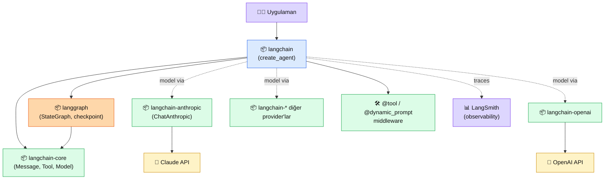

# 6.7 LangChain Agents

<div class="ma-meta" markdown>
<div class="ma-meta-row" markdown>
<strong>Kim için:</strong>
<span class="ma-persona ma-persona-baslangic">🟢 başlangıç</span>
<span class="ma-persona ma-persona-is">🔵 iş</span>
<span class="ma-persona ma-persona-kisisel">🟣 kişisel</span>
</div>
<div class="ma-meta-row"><strong>📋 Önkoşul:</strong> 6.1–6.6 bitmiş — ham `anthropic` SDK ile tool calling, multi-agent patternleri, `claude-agent-sdk` refleksleri oturmuş; Python 3.10+; `ANTHROPIC_API_KEY` aktif</div>
<div class="ma-meta-row"><strong>🎯 Çıktı:</strong> LangChain 1.x'te `create_agent` ile Anthropic-bağlı agent kurup çalıştırıyorsun; LangGraph `StateGraph` ile custom stateful agent mimarisi yazabiliyorsun; **üç SDK karar matrisini** (ham `anthropic` + `claude-agent-sdk` + LangChain/LangGraph) tek bakışta çözüyorsun — hangi senaryoya hangisini seçeceğin refleks.</div>
</div>

!!! tip "Yabancı kelime mi gördün?"
    Bu sayfadaki **italik-altı çizili** ifadelerin (durable execution, checkpoint, middleware gibi) üstüne mouse'unu getir — kısa tanım çıkar. Mobilde dokun.

## Neden bu sayfa?

2024–25 dönemi LangChain ekosisteminde **kaos** vardı — her ay breaking change, `langchain`/`langchain-core`/`langchain-community` paket bölünmesi, `AgentExecutor` deprecate, LCEL (Expression Language) gel-git'i, LangGraph ayrı paket olarak çıkıp merkeze alınması. Bu dönemde birçok takım "LangChain'den vazgeçin" kararı verdi; doğru karar mıydı? **2026 Nisan itibarıyla cevap değişti** — `langchain 1.2.x` + `langgraph 1.1.x` ailesi stabilize oldu, açık iki kimlik belirdi, ekosistem tekrar tutarlı.

İkincisi: LangChain 1.x **kimliği netleştirdi** — `langchain` = "en hızlı agent başlangıç", `langgraph` = "low-level orchestration framework for stateful agents". LangChain agent'ları **artık LangGraph üstünde** kurulu (durable execution, streaming, human-in-the-loop, persistence hepsi otomatik); basit kullanım için LangGraph bilmen gerekmiyor. Klarna, Replit, Elastic gibi ölçekli kullanıcılar bu mimarinin üstünde prod. Bu da "framework'e ne zaman evet" kararını güncel tutmayı zorunlu kılıyor.

Üçüncüsü: Bu sayfa **Bölüm 6'nın son sentezi** — ham `anthropic` SDK (6.2) + `claude-agent-sdk` (6.6) + LangChain/LangGraph (bu sayfa) üç seçenek. Her AI Engineer bu üç aracı **birbirinin rakibi değil, farklı iş için alternatif** olarak tanımalı. Sayfa sonundaki **üç SDK karar matrisi** iş ilanlarında en çok sorulan senaryoları kapsayacak.

## LangChain 1.x ekosistemi kısaca — üç paragraf, matematiksiz

**Paket bölünmesi netleşti — dört ana parça.** **(1) `langchain-core`** — soyut arayüzler (Message, Tool, Model), runtime tipleri; her şey buna bağımlı. **(2) `langgraph`** — low-level state machine framework; nodes + edges + state + checkpoint. Durable execution motoru. **(3) `langchain`** — high-level agent API (`create_agent`), LangGraph üstünde hazır kalıp. **(4) Provider paketleri** — `langchain-anthropic`, `langchain-openai`, `langchain-google-genai`… her biri ayrı PyPI paketi, `pip install "langchain[anthropic]"` ile gelir. **Tek komutla her şey gelmez** — ihtiyacın olanı açıkça seç.

**`create_agent` = "30 satırda agent" gerçek vaadi.** Sözdizimi basit: `agent = create_agent(model, tools, system_prompt=...)` + `agent.invoke({"messages": [HumanMessage("...")]})`. Model provider-agnostic — string format `"anthropic:claude-sonnet-4-6"` veya `ChatAnthropic` objesi; aynı agent kodunu GPT/Gemini/Mistral'e bir satırla geçirirsin. **Middleware** sistemi (2026 yeni) — `wrap_model_call`, `wrap_tool_call`, `@dynamic_prompt` ile agent davranışını kesmek-yeniden-yazmak mümkün (role-based prompting, dinamik tool enjeksiyonu, retry/fallback mantığı). LangChain'in "batarya dahil" yaklaşımı burası.

**LangGraph = ne zaman?** Agent **uzun süre çalışacaksa** (saatler/günler), **kaldığı yerden devam etmeli** (checkpoint), **insan onayı beklemeli** (HITL middleware), **birden fazla agent birbiriyle konuşmalı** (supervisor pattern), **state karmaşık** (multi-field TypedDict) — LangGraph'ın `StateGraph`'ına geçiyorsun. 6.5'teki asyncio.gather orchestrator-workers deseni **manuel**; LangGraph `StateGraph` aynı deseni **checkpoint + retry + observable** olarak veriyor. Bedeli: learning curve + soyutlama yükü + LangSmith tracer kurulum. Prod long-running agent için eder; basit chat için değmez.

## Bu sayfanın ekosistemi — LangChain 1.x kalıbı

<div class="ma-ekosistem" markdown>
<div class="ma-ekosistem-header">🗺️ Ekosistem — paket bağımlılıkları + agent katmanları</div>



<table class="ma-aktorler" markdown>

| Düğüm | Rol | Ne iş yapıyor |
|---|---|---|
| 👩‍💻 **Uygulaman** | `agent.invoke(...)` çağrısı | Agent'a görev yollar, sonuç bekler |
| 📦 **langchain** | High-level API | `create_agent`, pre-built agent kalıpları |
| 📦 **langgraph** | Low-level framework | `StateGraph`, checkpoint, durable exec |
| 📦 **langchain-core** | Soyut tipler | Message, Tool, Model, Runnable arayüzleri |
| 📦 **langchain-anthropic** | Provider bağı | `ChatAnthropic` wrapper — Claude API'ye |
| 📦 **langchain-openai / diğer** | Provider bağı | Model-agnostic olmanın temeli |
| 🛠 **@tool / middleware** | Agent özelleştirme | Tool tanımı + `wrap_model_call` hook'ları |
| 🤖 **Claude API** | LLM | Sonnet/Haiku/Opus — `langchain-anthropic` üstünden |
| 📊 **LangSmith** | Observability | Trace + eval + prompt registry — opsiyonel SaaS |

</table>
</div>

**Önemli:** LangChain 1.x'te basit agent için **LangGraph'ı açıkça import etmiyorsun** — `create_agent` altında çalışıyor. Gerekli olduğunda (durable, HITL, multi-agent supervisor) doğrudan `langgraph.graph.StateGraph`'a iniyorsun.

## Uygulama — iki yol

### Yol A — `create_agent` ile yüksek seviyeli agent (20 dk)

Senaryo: TCMB kurunu + hava durumunu çağıran Claude-destekli agent. Middleware yok, sade başlangıç.

```bash
pip install "langchain[anthropic]>=1.2" "langgraph>=1.1"
```

```python
"""LangChain 1.x — create_agent ile sade örnek."""

import httpx, xml.etree.ElementTree as ET
from langchain.agents import create_agent
from langchain.tools import tool
from langchain.messages import HumanMessage


# ── Tool'lar (@tool decorator + docstring) ─────────────────────
@tool
def tcmb_kuru(para: str) -> str:
    """TCMB güncel kurunu döner. para = USD|EUR|GBP|CHF|SAR."""
    r = httpx.get("https://www.tcmb.gov.tr/kurlar/today.xml", timeout=10)
    root = ET.fromstring(r.text)
    for c in root.findall("Currency"):
        if c.get("CurrencyCode") == para:
            return f"{para}/TRY alış {c.findtext('ForexBuying')} satış {c.findtext('ForexSelling')}"
    return f"{para} bulunamadı"


@tool
def hava_durumu(sehir: str) -> str:
    """Şehir adından güncel hava durumu döner."""
    r = httpx.get(f"https://wttr.in/{sehir}", params={"format": "j1"}, timeout=10)
    curr = r.json()["current_condition"][0]
    return f"{sehir}: {curr['temp_C']}°C, {curr['weatherDesc'][0]['value']}"


# ── Agent (tek satır) ──────────────────────────────────────────
agent = create_agent(
    model="anthropic:claude-sonnet-4-6",
    tools=[tcmb_kuru, hava_durumu],
    system_prompt=(
        "Sen finans + seyahat asistanısın. Türkçe, kısa, somut cevap ver. "
        "Tool sonuçlarını olduğu gibi kullanıcıya özetle."
    ),
)

# ── Çalıştır ───────────────────────────────────────────────────
result = agent.invoke({
    "messages": [HumanMessage("Antalya'da hava nasıl ve dolar kuru ne? Bugün Antalya'ya gitsem mi?")]
})

for m in result["messages"]:
    if m.type == "ai" and getattr(m, "content", None):
        print("[Claude]", m.content)
    elif m.type == "tool":
        print(f"[tool {m.name}]", m.content[:100])
```

**Beklenen çıktı (kısaltılmış):**

```
[tool hava_durumu] Antalya: 22°C, Partly cloudy
[tool tcmb_kuru] USD/TRY alış 34.52 satış 34.58
[Claude] Antalya 22°C, kısmen bulutlu — seyahat için uygun. Dolar 34.58'den alınıyor;
giderse döviz TL masrafları kontrol edilmeli.
```

**Tasarım kararları:**

- **Model string `"anthropic:claude-sonnet-4-6"`.** LangChain provider registry'si; aynı agent'ı `"openai:gpt-5"` yaparsan bütün kod değişmez (provider-agnostic değer).
- **`@tool` decorator minimum.** Python type hint + docstring yeter; JSON Schema otomatik (6.4 FastMCP deseni gibi).
- **`agent.invoke({"messages":[...]})` standart imza.** Mesaj listesi giriş; `result["messages"]` çıkış — tool call'lar da listede.

### Yol B — LangGraph `StateGraph` ile stateful agent (40 dk)

Senaryo: Çok turlu müşteri destek agent'ı — her turda **müşteri kimliği** ve **konuşma geçmişi** tutulmalı; ara adımda **insan onayı** gerekebilir. `create_agent` yüzeysel kalır; `StateGraph` ile açıkça state makinesi yazıyoruz.

```python
"""LangGraph StateGraph — stateful agent, checkpoint, human-in-the-loop."""

from typing import TypedDict, Annotated
from operator import add

from langgraph.graph import StateGraph, START, END
from langgraph.checkpoint.memory import InMemorySaver
from langchain_anthropic import ChatAnthropic
from langchain.messages import HumanMessage, AIMessage, ToolMessage, SystemMessage


# ── State tanımı (TypedDict) ───────────────────────────────────
class DestekState(TypedDict):
    messages: Annotated[list, add]    # mesaj geçmişi (birikir)
    musteri_id: str                   # hangi müşteri
    yetki_gerekli: bool                # insan onayı flag


# ── LLM ────────────────────────────────────────────────────────
llm = ChatAnthropic(model="claude-sonnet-4-6", max_tokens=1024)


# ── Nodes ──────────────────────────────────────────────────────
def niyet_analizi(state: DestekState) -> dict:
    """İlk adım — kullanıcı niyetini sınıflandır, yetki flag set et."""
    son = state["messages"][-1].content
    risk_kelime = ["iade", "iptal", "şikayet", "hukuki"]
    return {"yetki_gerekli": any(k in son.lower() for k in risk_kelime)}


def cevap_uret(state: DestekState) -> dict:
    """Claude'dan cevap al — state'teki tüm mesaj geçmişini gör."""
    sistem = SystemMessage(
        content=f"Müşteri desteği. Müşteri ID: {state['musteri_id']}. "
                f"Kısa, nazik Türkçe cevap. Yetki gerekli = {state['yetki_gerekli']}."
    )
    resp = llm.invoke([sistem, *state["messages"]])
    return {"messages": [resp]}


def insan_onayi(state: DestekState) -> dict:
    """HITL — yüksek riskli durumda durur, operatör onayı bekler."""
    return {"messages": [
        AIMessage(content="⚠️ Bu isteği bir operatöre aktarıyorum. Lütfen bekleyin.")
    ]}


# ── Routing (koşullu kenar) ────────────────────────────────────
def yonlendir(state: DestekState) -> str:
    return "insan" if state["yetki_gerekli"] else "cevap"


# ── Graph ──────────────────────────────────────────────────────
graph = StateGraph(DestekState)
graph.add_node("niyet", niyet_analizi)
graph.add_node("cevap", cevap_uret)
graph.add_node("insan", insan_onayi)

graph.add_edge(START, "niyet")
graph.add_conditional_edges("niyet", yonlendir, {"cevap": "cevap", "insan": "insan"})
graph.add_edge("cevap", END)
graph.add_edge("insan", END)

# Checkpoint: agent kaldığı yerden devam etsin (prod'da Postgres/Redis saver)
app = graph.compile(checkpointer=InMemorySaver())


# ── Çalıştır — aynı müşteri, çoklu tur ────────────────────────
config = {"configurable": {"thread_id": "musteri-123"}}

# 1. tur (normal soru)
r1 = app.invoke(
    {"messages": [HumanMessage("Kargom gelmedi, nasıl takip edebilirim?")],
     "musteri_id": "musteri-123", "yetki_gerekli": False},
    config=config,
)
print("[1.tur]", r1["messages"][-1].content[:200])

# 2. tur (aynı thread — geçmiş korunuyor; yüksek riskli)
r2 = app.invoke(
    {"messages": [HumanMessage("İadeli ödememi geri alabilir miyim?")],
     "musteri_id": "musteri-123", "yetki_gerekli": False},
    config=config,
)
print("[2.tur]", r2["messages"][-1].content)
```

**Kritik noktalar:**

- **`Annotated[list, add]`** — state `messages` alanı her node'un çıktısında **biriksin** (replace değil). LangGraph'ın state birleştirme mekanizması.
- **`checkpointer` + `thread_id`** — her thread_id bağımsız oturum; agent aynı ID ile tekrar çağrılırsa **kaldığı yerden devam eder**. Prod'da `langgraph-checkpoint-postgres` veya Redis saver.
- **Conditional edges** — `yonlendir` fonksiyonu state'e bakıp "insan" veya "cevap" node'una yönlendirir. HITL'in temeli.
- **`END` sentinel** — grafın bitiş noktası; birden fazla path tek END'e akabilir.

**Ne kazandık:** Bu örnek `create_agent` ile yazılamaz — state alanları + koşullu routing + checkpoint gerektiriyor. LangGraph burada değer katıyor.

## Üç SDK karar matrisi — bölüm 6'nın sentezi

Aşağıdaki tablo **Bölüm 6'nın final özeti**. Aynı agent görevini üç yoldan yazdın; matris hangisinin hangi senaryoda doğru olduğunu tek bakışta verir.

| Boyut | Ham `anthropic` (6.2) | `claude-agent-sdk` (6.6) | LangChain + LangGraph (6.7) |
|---|---|---|---|
| **Kontrol düzeyi** | **En yüksek** — her mesaj elinde | Orta — Claude Code loop yönetir | Orta — middleware ile müdahale |
| **Boilerplate** | Yüksek | Çok düşük (25 satır) | Düşük (`create_agent`), orta (`StateGraph`) |
| **Built-in tool** | Yok | Read/Write/Bash/WebFetch/… (Claude Code) | Tool hub + community paketleri |
| **Provider-agnostic** | ❌ Sadece Claude | ❌ Sadece Claude | ✅ OpenAI/Gemini/Claude/Mistral/… |
| **Durable execution** | ❌ Elle | ❌ Alt süreç crash → elle | ✅ Checkpoint native |
| **HITL (insan onayı)** | ❌ Elle | Kısmen (`permission_mode`) | ✅ `interrupt_before`, conditional edges |
| **Observability** | Elle (`usage`) | `ResultMessage.cost` built-in | ✅ LangSmith native (SaaS) |
| **Subagent** | Elle `asyncio.gather` | ✅ Task tool built-in | ✅ Supervisor pattern + subgraphs |
| **Maliyet/token kontrolü** | **Tam kontrol** | İyi | Orta (framework overhead) |
| **Öğrenme eğrisi** | Düşük-orta | Düşük | Orta-yüksek (ekosistem) |
| **Stabilite** | ✅ Çok stabil | 🟡 Yeni, hızlı sürüm | 🟡 1.x yeni stabilize oldu |
| **İş ilanı sıklığı** | ✅ Her ilanda | ✅ Artıyor (CI/CD) | ✅ Yaygın (büyük orgs) |

### Hangi senaryoda hangisi — pratik kural

| Senaryo | Seçim | Neden |
|---|---|---|
| **Müşteri destek chat** (WhatsApp, web widget) | Ham `anthropic` | Her mesaj kontrolü + HBV örneği (4.8) + düşük overhead |
| **CI/CD kod düzeltme** (GitHub Actions) | `claude-agent-sdk` | File + Bash + Git hazır; `allowed_tools` güvenlik |
| **Cron data analysis** (günlük rapor) | `claude-agent-sdk` | Scheduled, file write, bash gerekir |
| **Çok provider'lı RAG ürünü** (müşteri Claude/GPT arası seçer) | LangChain | Provider-agnostic; modelleri değiştirmek bir satır |
| **Uzun süreli kullanıcı oturumları** (kaldığı yerden devam) | LangGraph | Checkpoint native; Postgres/Redis saver |
| **Çoklu agent supervisor** (3+ agent birbirine mesaj atıyor) | LangGraph | Subgraph + state paylaşımı |
| **Prototipleme/MVP hızı** | Ham `anthropic` (küçük) veya `create_agent` (orta) | Önce çalıştır, sonra gerekirse LangGraph |
| **Maliyet kritik / her token sayılır** | Ham `anthropic` | Framework overhead yok |
| **Observability + eval suite** | LangChain + LangSmith | Built-in |
| **IDE eklenti / editor automation** | `claude-agent-sdk` | Claude Code ekosistemi + Skills + hooks |

**CTO pratik kuralı:** Önce **ham `anthropic`** ile prototip; iş dosya/bash gerektiriyorsa **`claude-agent-sdk`**; provider-agnostic + HITL + durable gerekiyorsa **LangChain/LangGraph**. İkinci kural: **framework'ten başlama**. Framework eklemek ucuz, çıkarmak pahalı.

## LangChain/LangGraph tuzakları — CTO uyarıları

| Tuzak | Sonucu | Çözüm |
|---|---|---|
| **Eski `AgentExecutor` referansları** | Deprecated — çalışır ama kırılır | LangChain 1.x = `create_agent` ya da `langgraph.prebuilt.create_react_agent`; tutorial tarihine bak |
| **`pip install langchain` yeter sanmak** | `ChatAnthropic` yok | Provider paketi ayrı: `pip install "langchain[anthropic]"` veya `langchain-anthropic` |
| **Sürüm pinleme yok** | Her `pip install` breaking change riski | `requirements.txt`'te **kesin sürüm** (`langchain==1.2.15 langgraph==1.1.9`) |
| **Framework learning curve'ünü hafife almak** | 2 haftada öğreneceğini sandığın State/edge/checkpoint 4-6 hafta | MVP için **önce ham SDK**; framework'e ihtiyaç doğarsa geç |
| **`StateGraph` state şeması kaba** | Her node tüm state'i yeniden yazıyor, çakışma | `Annotated[list, add]` gibi reducer'larla **birleştirme semantiği** açıkça tanımla |
| **Checkpoint prod'da InMemorySaver** | Restart sonrası tüm state kayıp | Postgres (`langgraph-checkpoint-postgres`) veya Redis saver — dev'de `InMemory`, prod'da persist |
| **LangSmith'i "zorunlu" sanmak** | SaaS fiyat + dış servise trace'ler | Self-host opsiyonu yok resmi; ücretsiz plan var ama limitli. Alternatif: OpenTelemetry + Helicone/LangFuse |
| **Tool bolluğu (community paketleri)** | 50 tool = Claude'un seçim motoru bozulur | Her görev için dar tool seti; 6.2'deki "çok fazla tool" tuzağı burada da |
| **Middleware'i overengineer etmek** | Basit agent 200 satır soyutlama içinde kayboluyor | `create_agent` default yeter; middleware sadece tekrarlı pattern için |
| **LangGraph'ı basit chat'e dayatmak** | Aşırı soyutlama, debug zor | Basit chat + tool = `create_agent`; `StateGraph` sadece state/HITL/durable varsa |

<div class="ma-anthropic-oz" markdown>
<div class="ma-anthropic-oz-header">📖 Anthropic bu konuyu nasıl anlatıyor — öz</div>

Anthropic LangChain ile **partner entegrasyonu** üstünden ilişki kuruyor; canonical dokümantasyon [python.langchain.com — Anthropic](https://python.langchain.com/docs/integrations/llms/anthropic/) ve `langchain-anthropic` PyPI paketi v1.4.1 (17 Nisan 2026). Anthropic kendi kaynaklarında LangChain/LangGraph'ı değerli ekosistem parçası olarak anıyor ama **önerisi "önce ham SDK + sonra gerekirse framework"** — 2024 Aralık [Building Effective Agents](https://www.anthropic.com/research/building-effective-agents) yazısında net söyleniyor.

**1. `ChatAnthropic` — feature parity üzerinden senkron.** Extended thinking, prompt caching, tool use, vision, PDF, streaming, batch — Claude API'nin tüm özellikleri `langchain-anthropic`'e yansıyor. Yeni feature'lar önce Anthropic API'ye, birkaç hafta içinde `langchain-anthropic` güncellemesine geliyor. Yani prod'da framework kullanmak "Anthropic'in son feature'ını geç alırsın" anlamına **artık gelmiyor**.

**2. LangGraph'ın Anthropic kullanım örüntüsü.** LangGraph documentationda Claude ile supervisor multi-agent, HITL onay adımları, long-running agent ile Anthropic'in önerdiği mimarilerle aynı örüntüler; tasarım çatışması yok. LangGraph **Anthropic 5-katman mimarisi**nin (MCP → Skills → Agent → Subagents → Agent Teams) **üçüncü katmanında** alternatif orchestrator olarak oturuyor.

**3. MCP + LangGraph beraber çalışıyor.** `langchain-mcp-adapters` paketi ile 6.4'te yazdığın MCP server'ları LangGraph tool'u olarak enjekte edebiliyorsun. Yani seçim **MCP ya da LangGraph değil**; MCP tool üretiyor, LangGraph orchestrate ediyor. Çift katman aynı zamanda.

??? info "Teknik detay — isteyene (checkpoint, subgraph, LangSmith, LangServe)"

    **Checkpoint saver seçenekleri.** `InMemorySaver` (dev), `SqliteSaver` (yerel persist), `PostgresSaver` (prod — `langgraph-checkpoint-postgres`), `RedisSaver` (yüksek throughput). `thread_id` çoklu kullanıcı için ayrı conversation.

    **`interrupt_before` / `interrupt_after`.** HITL mekanizması — `app.compile(checkpointer=..., interrupt_before=["insan_onayi"])` → agent o node'a gelince durur, kullanıcı "devam" sinyali verene kadar bekler. Onay akışları, risk operatör devri.

    **Subgraphs.** Bir `StateGraph` başka bir `StateGraph`'ı node olarak içerebilir. Recursive agent compose — "agent'ların agent'ı" mimarisi. Ancak debug zor; basit lineer graph tercih edilmeli.

    **`create_react_agent` (langgraph.prebuilt).** LangGraph içinde basit ReAct agent factory — `create_agent` olmadan doğrudan LangGraph'a girmek istersen. Aynı iş, farklı katmanda soyutlama.

    **Middleware sistemi (2026 yeni).** `AgentMiddleware` sınıfı — `wrap_model_call`, `wrap_tool_call`, `before_model_call`. Role-based prompting, dynamic tool injection, retry with different model, rate limit logic. `@dynamic_prompt` decorator ile state'e göre sistem prompt üret.

    **LangSmith — observability SaaS.** Her agent çağrısı trace + tokens + latency + input/output diff. Evaluation suite: dataset + grader + regression testing. Ücretsiz plan kişisel prototip, prod için ücretli. Alternatif: LangFuse (self-host), Helicone (proxy-bazlı), OpenTelemetry + Grafana Tempo.

    **LangServe** (FastAPI üstünde agent serve). `from langserve import add_routes; add_routes(app, agent, path="/agent")` — HTTP endpoint otomatik. Streaming, async, schema exposure. Prod deploy için kısa yol; ancak LangChain ekibi "LangGraph Platform"'a yönlendiriyor (managed hosting).

    **LangGraph Platform — managed hosting.** LangChain şirketinin deploy platformu; checkpoint persistence + cron + scaling. Alternatif: kendi altyapın (Docker + Postgres + Redis).

    **Cost — framework overhead gerçek mi?** Ham SDK ile karşılaştırıldığında LangChain ~%5-15 ek latency (model çağrısı dışı kod path). Token sayısında fark yok; para kaybı yok. Latency kritik uygulamada (real-time ses) yine de ham SDK tercih.

<div class="ma-anthropic-oz-kaynak" markdown>
**Kaynak:** [docs.langchain.com/oss/python/langchain/agents](https://docs.langchain.com/oss/python/langchain/agents) (EN, canonical `create_agent` + middleware rehberi). LangGraph: [docs.langchain.com/oss/python/langgraph/overview](https://docs.langchain.com/oss/python/langgraph/overview). Anthropic entegrasyonu: [python.langchain.com/docs/integrations/llms/anthropic](https://python.langchain.com/docs/integrations/llms/anthropic/) + `langchain-anthropic` v1.4.1 PyPI. Pekiştirme — "framework ne zaman": [Anthropic — Building Effective Agents](https://www.anthropic.com/research/building-effective-agents) (2024 Aralık, hâlâ referans metin). MCP köprüsü: `langchain-mcp-adapters` paketi — 6.4 server'larını LangGraph tool'u olarak kullan.
</div>
</div>

<div class="ma-cikti-kaniti" markdown>
### 📦 Bu sayfayı bitirdiğini nasıl kanıtlarsın

#### 1. 📝 Refleksiyon yazısı — 5 dakika

> "Seçtiğim görev: [...]. Kullandığım katman: [create_agent / StateGraph]. Provider string: [`anthropic:claude-sonnet-4-6`]. Tool sayısı: [X]. Checkpoint kullandım mı: [evet/hayır + saver tipi]. Aynı görevi ham `anthropic` SDK ile ve `claude-agent-sdk` ile de yazsaydım, üç satırla karşılaştırma: [...]. Benim iş senaryom için üç SDK'dan hangisi daha uygun ve neden: [...]."

Kaydet: `muhendisal-notlarim/bolum-6/07-langchain/refleksiyon.txt`

#### 2. 📸 Trace ekran görüntüsü — 5 dakika

**Neyin görüntüsü:** LangSmith'te (ücretsiz plan) çalıştırdığın agent'ın trace'i — node sırası, tool call'lar, süre, token. Ya da terminal çıktısı: `result["messages"]` listesi açıkça tool call'ları + Claude cevabı sıralı gösteriyor. Prod refleksinin temeli: **agent debug trace'siz yaşamaz.**

Kaydet: `muhendisal-notlarim/bolum-6/07-langchain/trace.png`

#### 3. 💻 Üç-yol karşılaştırma projesi — 45 dakika (çekirdek portföy)

**Bu sayfanın en değerli çıktısı.** Aynı küçük agent görevini **üç SDK ile** yaz:

1. `bolum-6/07-langchain/anthropic_ham.py` — ham `anthropic` SDK, 6.2 deseni
2. `bolum-6/07-langchain/claude_agent_sdk.py` — `claude-agent-sdk`, 6.6 deseni
3. `bolum-6/07-langchain/langchain_agent.py` — `create_agent`, bu sayfa Yol A

Aynı görev: "TCMB kurunu al ve bir TXT dosyaya özetle". README'de tablo: satır sayısı, bağımlılık sayısı, ilk çalıştırma süresi, subjektif "kaç saatte kurdum". CTO notu: **hangisi hangi iş için**.

Bu repo AI Engineer başvurunda "üç SDK'yı somut örnekle karşılaştırabiliyorum" cümlesinin kanıtı. Güçlü portföy parçası.

Repo linkini kaydet: `muhendisal-notlarim/bolum-6/07-langchain/uc-yol-repo.txt`

</div>

<div class="ma-neden-sonuc" markdown>
<div class="ma-neden-sonuc-header">🔗 Birlikte okuma — neden ne oldu</div>

- **A → B:** 2024–25 LangChain kaosundan sonra 2026'da **LangChain 1.x + LangGraph 1.x** ailesi stabilize oldu; ekosistem tekrar tutarlı.
- **B → C:** İki kimlik netleşti: `langchain` **high-level** (`create_agent`), `langgraph` **low-level** (`StateGraph`). Agents LangGraph üstünde kurulu; durable execution + HITL + streaming + persistence ücretsiz geliyor.
- **C → D:** Yol A — `create_agent` 30 satırda provider-agnostic agent (`anthropic:claude-sonnet-4-6` tek satır).
- **D → E:** Yol B — `StateGraph` stateful agent (`TypedDict` state + conditional edges + checkpoint + thread_id) — uzun süreli ve HITL agent'lar için zorunlu.
- **E → F:** Üç SDK karar matrisi: **ham anthropic** (kontrol/chat), **claude-agent-sdk** (otonom iş/CI), **LangChain+LangGraph** (provider-agnostic/HITL/durable). Üçü rakip değil, **farklı soru için alternatif**.
- **F → G:** Pratik kural: Prototipten başla → framework gereksinim kendini göstersin → sadece o zaman geç. "Framework eklemek ucuz, çıkarmak pahalı" CTO refleksi.

<div class="ma-neden-sonuc-sonuc" markdown>
**Sonuç:** Bölüm 6'nın teknik zirvesi. Üç ayrı mimari akım (ham SDK + Claude Code ekosistemi + LangChain/LangGraph ekosistemi) üzerinde refleks kazandın. Artık bir iş probleminde "hangi araç" sorusu karar matrisiyle cevaplanıyor. Son sayfa (6.8) KarıncaAI production vakası — Kemal'in **gerçek multi-agent orkestrasyon** projesi: karar matrisi "prod'da" nasıl görünür, bu üç SDK'nın hangisine dayandı, neden; 4.8 HBV imza sayfasıyla simetri. Bölüm 6'nın kapanış savunması.
</div>
</div>

<div class="ma-sonraki" markdown>
<div class="ma-sonraki-header">➡️ Sonraki adım</div>

**[6.8 Üretim Agent — KarıncaAI Vakası →](08-production.md)** — Bölüm 6'nın imza kapanışı. 5 agent'lı içerik orkestrasyonu (araştırmacı/yazar/editör/kritik/yayın), hangi SDK hangi agent'ta, prod'daki maliyet/kalite/gözlemlenebilirlik kararları.

← [6.6 Claude Agent SDK](06-claude-sdk.md) &nbsp;|&nbsp; [Bölüm 6 girişi](index.md) &nbsp;|&nbsp; [Ana sayfa](../index.md)

**Pekiştirme:** [Building Effective Agents](https://www.anthropic.com/research/building-effective-agents) (Anthropic, 2024 Aralık, hâlâ canonical) + [docs.langchain.com — LangChain Quickstart](https://docs.langchain.com/oss/python/langchain/quickstart) + [LangGraph Tutorials](https://langchain-ai.github.io/langgraph/tutorials/introduction//) üçünü birlikte oku. Framework-ihtiyaç kararı bu üç kaynağın kesişiminde netleşir.
</div>
