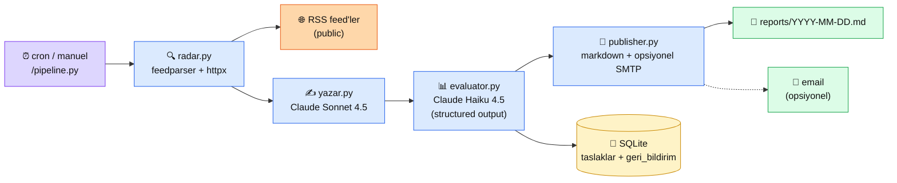

# 6.8 Üretim Multi-Agent — İçerik Pipeline'ı

<div class="ma-meta" markdown>
<div class="ma-meta-row" markdown>
<strong>Kim için:</strong>
<span class="ma-persona ma-persona-baslangic">🟢 başlangıç</span>
<span class="ma-persona ma-persona-is">🔵 iş</span>
<span class="ma-persona ma-persona-kisisel">🟣 kişisel</span>
</div>
<div class="ma-meta-row"><strong>📋 Önkoşul:</strong> Bölüm 6'nın 6.1–6.7'si bitmiş — agent + tool + MCP + multi-agent + üç SDK karar matrisi refleks; Python 3.10+; `uv` veya `pip`; `ANTHROPIC_API_KEY`</div>
<div class="ma-meta-row"><strong>🎯 Çıktı:</strong> Bölüm 6 boyunca öğrendiğin tüm konseptleri **tek çalışan projede** buluştur: **İçerik Özet Agent'ı** — Türkçe AI haberlerini günlük tarayan, paralel özetleyen, kalite puanlayan, eşik üstü olanları markdown rapor halinde yayınlayan multi-agent pipeline. Referans klasörü klonla, 10 dakikada canlıya al, kendi varyantına 4–6 haftada deploy et. Bölüm 6'nın teorisinin **prod'da nasıl göründüğü** net.</div>
</div>

!!! tip "Yabancı kelime mi gördün?"
    Bu sayfadaki **italik-altı çizili** ifadelerin (orchestrator, evaluator-optimizer, structured output gibi) üstüne mouse'unu getir — kısa tanım çıkar. Mobilde dokun.

## Neden bu sayfa?

Bölüm 6 boyunca 7 sayfada agent teorisi, tool calling, MCP, multi-agent pattern'leri, üç SDK karar matrisi kurduk. Bu kavramlar **ayrı ayrı** değerli ama **ayrı ayrı iş yapmazlar** — gerçek prod'da hepsi aynı projede bir araya gelir. Bu sayfa bölüm kapanışı olarak **tek bir çalışan referans proje** üzerinden o bütünleşimi gösterir: 13 dosya, 33 KB Python, `anthropic` SDK, SQLite, `asyncio.gather`, `tool_choice="tool"` ile structured output, heterojen model kullanımı — hepsi bir arada.

İkincisi: **Referans proje** pedagojik değer açısından kritik. AI Engineer mülakatlarında "agent kurdun mu" sorusuna cevap vermek için soyut bilgi yetmez; **repo linki + canlı demo + 4 saatte klonlayıp çalıştırabilecek yapı** gerekir. Bu sayfadaki proje öğrencinin portföyünün iskeleti: fork'la, kendi alan haberlerine çevir (finans / hukuk / spor / sağlık), deploy et — **4–6 hafta içinde AI Engineer adaylığının somut kanıtı**.

Üçüncüsü: 4.8 **HBV Chatbot** imza sayfasıyla **zıtlık** kurar. 4.8 **deterministic workflow** vakasıydı — 5/5 workflow sinyali, state machine 5 durum, Haiku yeter, HITL yok. Bu sayfanın projesi **kreatif multi-agent** — workflow değil, orchestrator-workers + evaluator-optimizer, Sonnet + Haiku heterojen, opsiyonel HITL. **İki imza sayfası birlikte okununca Bölüm 6'daki 5-sinyal karar matrisi (6.5) gerçek uygulama kazanır.**

## Proje kısaca — ne yapar, neden böyle

**İş:** Belirlenen Türkçe AI/teknoloji RSS kaynaklarını (WebRazzi, ShiftDelete, DonanimHaber vb.) günde bir tarar. Son 24 saatin AI-alakalı başlıklarını toplar. Her başlık için **2-3 cümlelik Türkçe özet** üretir. Her özeti **üç kritere göre puanlar** (teknik doğruluk / Türkçe kalitesi / özet netliği). Eşik üstü özetleri bir **markdown rapor dosyası** olarak `reports/YYYY-MM-DD.md`'ye yazar + opsiyonel email olarak yollar. Tüm taslaklar + puanlar SQLite'ta (`db/taslaklar.db`) — ilerde feedback loop için hazır.

**Pattern:** 6.5'teki **orchestrator-workers** (paralel özet üretimi) + **evaluator-optimizer** (ikinci model pass ile puanlama). Kalite filtresi = eşik tabanlı publisher. 4 bağımsız agent modülü, tek orchestrator (`pipeline.py`).

**SDK:** 6.7 karar matrisi — görev **chat/content üretimi** ağırlıklı, framework overhead istemiyoruz, her token maliyet görünür olsun → **ham `anthropic` SDK**. `claude-agent-sdk` bu işe aşırı (file/bash gerekmiyor); LangChain overkill (provider-agnostic ihtiyacı yok). Ham SDK net tercih.

**Modeller:** **Yazar agent** `claude-sonnet-4-5` (kreatif kalite), **Evaluator agent** `claude-haiku-4-5` (6× daha ucuz, puanlama yetebilir). 6.5'teki heterojen model optimizasyonu — maliyet %60-80 düşer, kalite bar'ı korunur.

## Bu sayfanın ekosistemi — agent akış

<div class="ma-ekosistem" markdown>
<div class="ma-ekosistem-header">🗺️ Ekosistem — girişten rapora pipeline</div>



<table class="ma-aktorler" markdown>

| Düğüm | Kod | Ne iş yapıyor |
|---|---|---|
| ⏰ **Tetikleyici** | `pipeline.py` CLI | Cron job veya manuel — tüm pipeline'ı başlatır |
| 🌐 **RSS feed'ler** | `DEFAULT_FEEDS` listesi | Public RSS — istediğin kaynağı ekle/çıkar |
| 🔍 **radar.py** | `agents/radar.py` | Son 24 saatin AI-alakalı başlıklarını filtrele + topla |
| ✍️ **yazar.py** | `agents/yazar.py` | Her başlık için 2-3 cümlelik Türkçe özet (Sonnet) |
| 📊 **evaluator.py** | `agents/evaluator.py` | Her özeti 3 kriter × 0-10 puanla (Haiku, structured output) |
| 📝 **publisher.py** | `agents/publisher.py` | Eşik üstü özetleri markdown + opsiyonel email |
| 💾 **SQLite DB** | `db/schema.sql` + `db/taslaklar.db` | Tüm kayıtlar + gelecek feedback loop zemini |
| 📄 **Markdown rapor** | `reports/YYYY-MM-DD.md` | Günlük yayın çıktısı (git-ignored) |
| 📧 **Email (ops.)** | SMTP env | Raporu abonelere yollar (env yoksa atlanır) |

</table>
</div>

## Klasör yapısı

```
icerik-ozet-agent/
├── README.md                    # proje girişi + kurulum
├── .env.example                 # zorunlu + opsiyonel env
├── .gitignore                   # .env + db + reports hariç
├── pyproject.toml               # uv uyumlu bağımlılıklar
├── pipeline.py                  # orchestrator — CLI giriş
├── agents/
│   ├── __init__.py
│   ├── radar.py                 # RSS + Firecrawl (ops.)
│   ├── yazar.py                 # Claude Sonnet 4.5 özetçi
│   ├── evaluator.py             # Claude Haiku 4.5 puanlayıcı
│   └── publisher.py             # markdown + SMTP yayıncı
├── db/
│   └── schema.sql               # taslaklar + geri_bildirim tabloları
├── reports/                     # günlük md (git-ignored)
└── tests/
    ├── __init__.py
    └── test_pipeline.py         # 8 birim test (mock tabanlı)
```

**Toplam:** 13 dosya, ~33 KB kod. Öğrenci 15 dakikada tüm kodu gözden geçirebilir.

## Mimari kararlar — CTO notları

Bu bölümde her kritik tasarım kararının **neden** kısmını veriyoruz. Kodu kopyalamak değil, **hangi soruyu sorup nasıl cevapladığımızı** anlamak önemli.

### Karar 1 — Pattern: orchestrator-workers + evaluator-optimizer hibrit

Bölüm 6.5'teki 5-sinyal kontrol listesi bu göreve uygulanırsa:

| Sinyal | Bu projede | Durum |
|---|---|---|
| Paralelleştirilebilir mi? | 20 haber → 20 bağımsız özet | ✅ |
| Context şişiyor mu? | Tek agent 20 × özet yazarsa 30k+ token | ✅ |
| Rol ayrımı anlamlı mı? | Yazar ≠ Eleştirmen (ikisi farklı uzmanlık) | ✅ |
| Kalite kritik mi? | Yayınlanacak içerik, ikinci göz şart | ✅ |
| Heterojen maliyet? | Yazar Sonnet, Evaluator Haiku | ✅ |

**5/5** — multi-agent doğru seçim. Pattern: 4 agent + orchestrator (`pipeline.py`); yazar + evaluator `asyncio.gather` ile paralel; publisher kalite filtresi uygular (evaluator-optimizer).

### Karar 2 — SDK: ham `anthropic` SDK

6.7 karar matrisi uygulaması:

- Görev **chat/content** ağırlıklı (file/bash yok) → `claude-agent-sdk` gereksiz
- Provider-agnostic ihtiyacı yok (sadece Claude) → LangChain overkill
- Maliyet kontrolü kritik (yüzlerce özet/ay) → framework overhead istemiyoruz
- **Ham `anthropic` SDK** → her token elinizde, her çağrı görünür

Kod örneği (`yazar.py` özet):

```python
import anthropic

client = anthropic.AsyncAnthropic()

async def ozetle_tek(haber):
    resp = await client.messages.create(
        model="claude-sonnet-4-5",
        max_tokens=256,
        system=SYSTEM_PROMPT,
        messages=[{"role": "user", "content": haber.baslik}],
    )
    return resp.content[0].text, resp.usage
```

### Karar 3 — Heterojen model: Sonnet yazar, Haiku evaluator

6.5 CTO notundan: "Basit özet Haiku, analiz Sonnet, derin akıl yürütme Opus — üçü karıştırılırsa maliyet %60-80 düşer."

Bu projede tam tersi logic geçerli:

- **Yazar** = kreatif çıktı, kalite kritik → **Sonnet 4.5** ($3/$15 per 1M)
- **Evaluator** = yapılandırılmış puanlama, basit değerlendirme → **Haiku 4.5** ($1/$5 per 1M)

Tahmini günlük maliyet (20 haber):

| Ajan | Model | In/Out token | Maliyet |
|---|---|---|---|
| Yazar | Sonnet 4.5 | 400/100 × 20 | $0.054 |
| Evaluator | Haiku 4.5 | 300/60 × 20 | $0.012 |
| **Toplam/gün** | | | **~$0.066** |
| **Toplam/ay** | | | **~$2.00** |

Her evaluator da Sonnet olsa günlük maliyet ~$0.12, ay ~$3.60 — yani **%45 tasarruf** sadece evaluator'ı Haiku'ya geçirerek. Bu sayı küçük gibi ama 10× ölçeklendiğinde ($200/ay vs $360/ay) fark belirgin.

### Karar 4 — Structured output: `tool_choice="tool"` pattern

Evaluator'ın çıktısı **yapılandırılmış JSON** olmalı — `{"teknik_dogruluk": 8, ...}`. Claude'dan bunu güvenilir şekilde almak için 6.2'deki desen:

```python
tool_choice={"type": "tool", "name": "ozeti_puanla"},
tools=[{
    "name": "ozeti_puanla",
    "description": "...",
    "input_schema": {
        "type": "object",
        "properties": {
            "teknik_dogruluk": {"type": "integer", "minimum": 0, "maximum": 10},
            # ...
        },
        "required": ["teknik_dogruluk", ...],
    },
}],
```

Claude bu tool'u **çağırmak zorunda** — biz tool'u çalıştırmayacağız; `tool_use.input` zaten istediğimiz JSON. "Structured output" deseni — API yanıt formatını şemaya kilitler, parse hatası minimize.

### Karar 5 — Paralel çağrı: `asyncio.gather`

`pipeline.py` içinde:

```python
ozetler = await asyncio.gather(*[
    ozetle_tek(client, haber) for haber in haberler
])
```

20 haber → 20 paralel HTTP çağrısı. Total süre ≈ en yavaş çağrının süresi (~3-5 saniye), **20× toplam değil**. Anthropic rate limit'i (tier'a göre değişir) aşılırsa `Semaphore(n)` ile bounded concurrency:

```python
sem = asyncio.Semaphore(5)
async def bounded(haber):
    async with sem:
        return await ozetle_tek(client, haber)
```

Üretimde **tier 2+ için 5-10 concurrent** güvenli.

### Karar 6 — Veri kalıcılığı: SQLite dosya

- **Neden SQLite:** Tek dosya, sunucu gerekmez, `sqlite3` Python built-in
- **Neden PostgreSQL değil:** Bu ölçekte (günlük 20 kayıt) over-engineering
- **Ölçeklenince:** `taslaklar` tablosu 10k+ satıra çıkarsa `geri_bildirim` join performansı gerilerse → Postgres'e geçiş basit (sqlite3 → psycopg; şema aynı)

## Kurulum + çalıştırma — 10 dakika

```bash
# 1. Klonla (referans proje MühendisAl repo'sunda examples/ altında)
git clone https://github.com/KemalG-u/muhendisal-platform.git
cd muhendisal-platform/examples/icerik-ozet-agent

# 2. Env hazırla
cp .env.example .env
# .env içine ANTHROPIC_API_KEY gir

# 3. Bağımlılıklar (uv önerilir — https://docs.astral.sh/uv)
uv sync
# veya pip: pip install -e ".[dev]"

# 4. Test — önce doğru mu çalışıyor
uv run pytest -v
# 8 test geçmeli (mock tabanlı, API çağrısı yapmaz)

# 5. Canlı çalıştır
uv run python pipeline.py
```

Örnek çıktı:

```
[radar] Son 24 saat taranıyor...
[radar] 12 başlık bulundu
[yazar] 12 özet paralel üretiliyor...
[yazar] tamam — 1287 output token, $0.0204
[evaluator] 12 özet puanlanıyor...
[evaluator] tamam — ortalama 7.3/10, $0.0041
[publisher] 9 özet rapora yazıldı: reports/2026-04-22.md
[db] 12 kayıt taslaklar tablosuna eklendi
[maliyet] toplam: $0.0245
```

**Deploy:** `crontab -e` → `0 8 * * * cd /path/to/icerik-ozet-agent && uv run python pipeline.py >> logs/cron.log 2>&1` — her sabah 08:00'da çalışır. Ya da GitHub Actions cron (6.6 `claude-agent-sdk` + Actions deseni).

## 4.8 HBV Chatbot vs 6.8 İçerik Pipeline — pattern karşılaştırma

Bu iki imza sayfası birlikte okunduğunda Bölüm 6'nın özü ortaya çıkar:

| Boyut | 4.8 HBV Chatbot | 6.8 İçerik Pipeline (bu sayfa) |
|---|---|---|
| **Görev tipi** | Deterministik (bağış süreci adımları) | Kreatif (içerik üretim + kalite) |
| **Pattern** | State machine 5 durum (workflow) | Orchestrator-workers + evaluator-optimizer |
| **6.5 5-sinyal** | 1/5 agent → workflow doğru | 5/5 agent → multi-agent doğru |
| **SDK** | Ham `anthropic` + webhook | Ham `anthropic` + asyncio |
| **Model** | Haiku (ucuz, dar) | Sonnet (yazar) + Haiku (evaluator) |
| **HITL** | Yok (otomatik) | Opsiyonel (`--dry-run` bayrağı) |
| **Veri** | PostgreSQL (bağışçılar) | SQLite (taslaklar) |
| **Maliyet/ay** | ~\$5 (2000 mesaj) | ~\$2 (günlük 20 haber × 30 gün) |
| **Deploy** | WhatsApp webhook + PM2 | Cron + Markdown |
| **Başarı kriteri** | Bağış tamamlansın | Rapor yayınlansın |

**Ortak ders:** Pattern seçimi görev doğasına göre — zorlayamazsın. HBV kreatif multi-agent olsaydı aşırı karmaşık + aşırı maliyetli olurdu. Bu proje deterministik workflow olsaydı kalite filtresi kaybolurdu. **Mimari = problem-çözüm eşleşmesi.**

## 3 gerçek prod sorusu — ve cevapları

### Soru 1 — Maliyet ölçeklenir mi?

**Durum:** Günlük 20 haber → $0.02. Ölçek 10×'a (200 haber) çıkarsa?

**Hesap:** Lineer artış değil — Sonnet input token'ı kaynak başına sabit (~400), output benzer. 200 haber ≈ 10× input + 10× output = ~$0.20/gün = $6/ay. **Hâlâ önemsiz.** Ölçek 100× (2000 haber/gün — kurumsal ölçek) olursa $60/ay — evaluator'ı Haiku'da tutmanın faydası belirginleşir.

**Optimizasyon sırası:**
1. Evaluator'ı Haiku'ya düşür ✅ (zaten yapıldı)
2. Prompt caching (Anthropic feature) — system prompt 90% cache hit ratio ile $3 → $0.30 input maliyet
3. Yazar'ı Haiku'ya düşür (kalite bar'ı tolere edersen)
4. Batch API (Anthropic %50 indirim — 24 saat gecikme tolere edilirse)

### Soru 2 — HITL (insan onayı) nasıl eklenir?

**Neden gerek:** Kalite eşiği + otomatik publisher garantili doğru değil. Bazen 7/10 puan alan özet teknik hatalı olabilir.

**Yol A — manuel onay bayrağı:**

```python
# publisher.py'ye ekle
def rapor_yaz(puanlar, esik=6.5, manuel_onay=False, ...):
    yayin = [p for p in puanlar if p.ortalama >= esik]
    if manuel_onay:
        onayli = []
        for p in yayin:
            print(f"\n{p.ozet.metin}\n[{p.ortalama}/10]")
            if input("Onayla? (e/h): ").lower() == "e":
                onayli.append(p)
        yayin = onayli
```

**Yol B — Telegram / Slack bot:** Her özet için "Onayla / Reddet" butonu; web webhook; onay sonrası publisher tetikle. 2-3 saatlik ek iş.

**Yol C — `claude-agent-sdk` ile:** 6.6'daki `permission_mode="default"` — her yayından önce Claude Desktop kullanıcıya sorar.

### Soru 3 — Multi-provider'a nasıl geçerim?

**Neden gerek:** Maliyet düşürmek için OpenAI / Gemini karşılaştırma, ya da Anthropic outage durumunda fallback.

**Yol:** Bu noktada **LangChain `create_agent`** gerçekten değer katıyor (6.7):

```python
from langchain.agents import create_agent

# Aynı kod — model string değişir
agent_sonnet = create_agent("anthropic:claude-sonnet-4-5", tools=[])
agent_gpt = create_agent("openai:gpt-5", tools=[])
agent_gemini = create_agent("google:gemini-2.5-pro", tools=[])
```

Ham SDK'dan LangChain'e geçiş yazar + evaluator için ~3-4 saat iş. Değer: A/B testing + fallback + provider-agnostic kimlik.

## CTO tuzakları — bu projede gördüklerim

| Tuzak | Sonucu | Çözüm |
|---|---|---|
| **`asyncio.gather` rate limit'i unutmak** | HTTP 429 hatası cascade | `Semaphore(n)` ile bounded concurrency (n=5-10) |
| **Evaluator'a Sonnet koymak** | Maliyet 3× artar, kalite farkı az | Haiku yeterli; A/B test yap sonra karar |
| **Structured output'a `tool_choice="auto"` bırakmak** | Claude bazen tool çağırmıyor, parse hatası | `tool_choice={"type":"tool","name":"..."}` ZORUNLU |
| **`max_tokens` yüksek bırakmak** | 2-3 cümle istiyoruz, 800 token boşa | Yazar 256, evaluator 512 yeter |
| **Rapora 30+ madde yazmak** | Okuyucu kaybeder | Top 10 + "devamı için DB'ye bak" link |
| **SQLite'ı prod'da multi-process yazmak** | Database locked hatası | Tek process cron; ölçek artarsa Postgres |
| **`.env`'i git'e commit etmek** | API key sızıntısı | `.gitignore` ilk kural; GitHub secret scan uyarı verir ama geç |
| **Rapor dosyasını append mode yazmak** | Aynı gün iki kez çalışırsa duplicate | Her gün dosya overwrite; histori DB'de |
| **Testleri gerçek API ile yazmak** | CI flaky, maliyetli | Mock birinci, entegrasyon testi ayrı dosya (opsiyonel) |
| **Feedback loop'u ilk turda kurmak** | Over-engineering | Önce pipeline çalışsın, sonra `geri_bildirim` tablosu doldur |

<div class="ma-anthropic-oz" markdown>
<div class="ma-anthropic-oz-header">📖 Anthropic bu konuyu nasıl anlatıyor — öz</div>

Anthropic üretim agent mimarisi için canonical metni [Building Effective Agents](https://www.anthropic.com/research/building-effective-agents) (Aralık 2024). Bu projedeki 3 desen — orchestrator-workers, evaluator-optimizer, paralel workers — makalede birebir tanımlı.

**1. "Başla basit, karmaşıklaşana kadar basit kal."** Anthropic'in Ana direktifi — bu projenin iskelet tam karşılık. `pipeline.py` 180 satır, 4 agent modülü her biri 100-200 satır. Fırsat doğarsa katman ekle (feedback loop, HITL, multi-provider) — önceden değil.

**2. Structured output için tool use.** `tool_choice={"type":"tool","name":"..."}` + `disable_parallel_tool_use=True` → Claude "JSON garantili" dönmek için zorunlu. Anthropic Cookbook'ta bu desen "Extract structured data" başlığı altında canonical. Evaluator'ımız aynen bunu uyguluyor.

**3. Heterojen model — maliyet değil, uygunluk.** Anthropic blog yazıları evaluator/judge rollerini Haiku'ya vermeyi **performans açısından önerdiği için** yazar — basit değerlendirme için küçük model tutarlı çalışıyor; büyük model fazla "yorumluyor". Yani Haiku seçimi sadece maliyet değil, kalite kararı.

??? info "Teknik detay — isteyene (prompt caching, batch API, observability, deploy)"

    **Prompt caching.** Anthropic `cache_control: {"type": "ephemeral"}` ile system prompt'u cache'ler — 5 dakikada bir write, 5 dakika içinde read 90% indirimli. Bu projede `SYSTEM_PROMPT` sabit → caching ile maliyet ~%30 düşer. `pipeline.py`'de ilgili parametreyi ekle:

    ```python
    system=[{
        "type": "text",
        "text": SYSTEM_PROMPT,
        "cache_control": {"type": "ephemeral"},
    }]
    ```

    **Message Batches API.** 24 saat toleransla %50 indirim. Real-time gerekmiyorsa — günlük rapor için akşam topla, gece batch at, sabah rapora dönüştür. Günlük maliyet yarıya iner.

    **Observability.** `response.usage` her çağrıda loglanmalı. OpenTelemetry desteği `anthropic` paketi içinde yok — manual log + grep ya da Helicone proxy (tüm çağrıları wrap eder).

    **Deploy alternatifleri.**
    - **Cron (yerel/VPS)**: `crontab -e`; basit, bedava, nöbet tutmaz
    - **GitHub Actions cron**: Repo'da `.github/workflows/daily.yml`; ücretsiz, git'e entegre
    - **Cloudflare Workers Cron**: Serverless, küçük mesh için uygun
    - **Kubernetes CronJob**: Kurumsal ortam, fazla bu proje için

    **Rate limit yönetimi.** Anthropic tier 1: 50 RPM / 40k input TPM; tier 2: 1000 RPM. 20 haber paralel = 20 RPM, güvenli. 200 haber için `asyncio.Semaphore(20)` koy; daha yüksek için tier artır.

    **Alternatif Türkçe modeller.** Claude yanı sıra: `openai:gpt-5-mini` (ucuz, Türkçe iyi), `google:gemini-2.5-flash` (en ucuz). LangChain ile A/B testing + maliyet-kalite Pareto'su — portföy için güçlü genişletme.

<div class="ma-anthropic-oz-kaynak" markdown>
**Kaynak:** [Building Effective Agents](https://www.anthropic.com/research/building-effective-agents) (Anthropic, 2024 Aralık — hâlâ canonical). Pekiştirme: [Anthropic Cookbook](https://github.com/anthropics/anthropic-cookbook) — `tool_use/extracting_structured_json.ipynb` evaluator desenimizin referansı; `misc/prompt_caching.ipynb` karakteri azaltma için. Ölçümleme: [Anthropic Docs — Usage & Billing](https://docs.claude.com/en/api/usage).
</div>
</div>

<div class="ma-cikti-kaniti" markdown>
### 📦 Bu sayfayı bitirdiğini nasıl kanıtlarsın

#### 1. 📝 Refleksiyon yazısı — 5 dakika

> "Referans projeyi klonladım ve [X] dakikada çalıştırdım. Rapor çıktısında [X] haber bulundu, ortalama puan [X]/10, [X] tanesi eşik üstü yayınlandı. Toplam maliyet \$[X]. **Değiştirdiğim 1 parça:** [ör. RSS feed listesi, eşik, Sonnet → Haiku]. Aynı projeyi 4.8 HBV ile pattern açısından karşılaştırınca gördüğüm fark: [...]. Kendi varyantım için düşündüğüm alan: [finans/hukuk/spor/sağlık haberleri]; ilk değişiklik: [...]."

Kaydet: `muhendisal-notlarim/bolum-6/08-production/refleksiyon.txt`

#### 2. 📸 Canlı çalıştırma logu — 5 dakika

**Neyin görüntüsü:** Terminal `uv run python pipeline.py` çıktısı — `[radar]` / `[yazar]` / `[evaluator]` / `[publisher]` / `[maliyet]` satırları tam görünür. Rapor dosyası (`reports/YYYY-MM-DD.md`) ekran görüntüsü. SQLite kayıt sayısı (`sqlite3 db/taslaklar.db "SELECT COUNT(*) FROM taslaklar"`).

Kaydet: `muhendisal-notlarim/bolum-6/08-production/canli-log.png`

#### 3. 💻 Kendi varyant projen + GitHub — 1-2 hafta (Bölüm 6 portföy kilitleyici)

**Bu sayfanın en değerli çıktısı.** Referans projeyi fork et; **kendi alanına uyarla**. Değişiklik minimum 3:

1. **Kaynak listesini değiştir** — kendi alanındaki RSS / blog / newsletter
2. **`KEYWORDS` filtresini güncelle** — alana özgü terimler
3. **Yazar system prompt'unu özelleştir** — hedef kitlen için ton + kısalık + teknik seviye

Opsiyonel güçlendirme:
4. Telegram / Slack bot ile HITL
5. Multi-provider A/B (LangChain)
6. Prompt caching + batch API (maliyet yarı)

README'de **somut metrikler** — günlük ortalama özet sayısı, ortalama puan, aylık maliyet, örnek rapor linkleri. **Bu repo AI Engineer başvurunun en güçlü portföy parçası**: gerçek bir multi-agent prod sistemini **kendi alanına taşıdığın** kanıt.

Repo linkini kaydet: `muhendisal-notlarim/bolum-6/08-production/kendi-variant-repo.txt`

</div>

<div class="ma-neden-sonuc" markdown>
<div class="ma-neden-sonuc-header">🔗 Birlikte okuma — neden ne oldu</div>

- **A → B:** Bölüm 6 boyunca öğrenilen ayrı kavramlar (agent, tool calling, multi-agent, üç SDK, maliyet optimizasyonu) **tek projede** buluşmadıkça soyut kalır.
- **B → C:** Referans proje 13 dosya + 33 KB; öğrenci 15 dakikada gözden geçirir, 10 dakikada çalıştırır, 4-6 haftada kendi varyantını deploy eder.
- **C → D:** Pattern: orchestrator-workers (yazar paralel) + evaluator-optimizer (ikinci model pass + kalite filtresi) — 6.5'in doğrudan uygulaması.
- **D → E:** SDK: ham `anthropic` — 6.7 karar matrisi chat/content + maliyet kritik senaryoda bu tercihi dikte eder.
- **E → F:** Heterojen model (Sonnet + Haiku) maliyet %45 düşürür, kalite korunur — 6.5 CTO notunun somut hesabı.
- **F → G:** Structured output için `tool_choice="tool"` — 6.2'nin en değerli deseni; evaluator'ın JSON çıktısını garantiler.
- **G → H:** 4.8 HBV (workflow 5/5) ile kıyaslandığında 6.5'in 5-sinyal karar matrisi somut kazanır — pattern seçimi görev doğasına bağlı.

<div class="ma-neden-sonuc-sonuc" markdown>
**Sonuç:** Bölüm 6 kapanışı. Agent teorisi + tool calling + multi-agent pattern'leri + üç SDK + maliyet optimizasyonu — hepsi tek çalışan referans projede bir araya geldi. Öğrenci kendi varyantına 4-6 haftada deploy ettiğinde AI Engineer adaylığının en güçlü portföy parçasına sahip olur. Bölüm 6 bitti; **Bölüm 9 Deploy** ile bu projeleri prod'a nasıl alacağımız, gözlemlenebilirlik altyapısı, maliyet alarmları, güvenlik katmanı ve portföy ürünlerinin public sunumu kalıyor.
</div>
</div>

## Bölüm 6 kapanış özeti

9 sayfa, ~195 KB içerik, 4 hafta düzenli çalışmayla bitebilir:

| # | Sayfa | Ana tez |
|---|---|---|
| 6 | [Giriş](index.md) | Bölüm haritası + Anthropic Academy 4 kurs köprüsü |
| 6.1 | [Agent + ReAct](01-agent-nedir.md) | Workflow ≠ agent; Think-Act-Observe; 5-kriter karar |
| 6.2 | [Tool Calling](02-tool-calling.md) | Description = Claude'un tool seçim motoru |
| 6.3 | [MCP Protokolü](03-mcp.md) | "AI için USB-C"; 3 primitive; host/client/server |
| 6.4 | [MCP Server Yazma](04-mcp-server.md) | FastMCP decorator devrimi; imza sayfa |
| 6.5 | [Multi-Agent Sistemler](05-multi-agent.md) | Orchestrator-workers + context isolation; 5-sinyal |
| 6.6 | [Claude Agent SDK](06-claude-sdk.md) | Claude Code programatik arayüzü; otonom iş |
| 6.7 | [LangChain Agents](07-langchain.md) | Sentez: üç SDK karar matrisi |
| 6.8 | **Bu sayfa** | **Teori → üretim: referans proje** |

**Anthropic Academy 4 kurs tamamı artık erişilebilir:** Introduction to MCP · Advanced MCP · Introduction to Subagents · Introduction to Agent Skills. Her kurs ~30-60 dk + sertifikalı + ücretsiz. Bölüm 6'nın yazılı içeriğini pekiştirmek için en az 2-3'ünü tamamla.

<div class="ma-sonraki" markdown>
<div class="ma-sonraki-header">➡️ Sonraki bölüm</div>

**[Bölüm 9 — Deployment ve Portföy →](../bolum-9/index.md)** — Bu bölümde kurduğun agent + 4.8 HBV chatbot + 9.x 3 portföy projesi: prod'a nasıl alınır, nasıl görünür tutulur, maliyet alarmı nasıl kurulur, public GitHub + README nasıl yazılır. AI Engineer başvurusu için portföy ürününün **son hali**.

← [6.7 LangChain Agents](07-langchain.md) &nbsp;|&nbsp; [Bölüm 6 girişi](index.md) &nbsp;|&nbsp; [Ana sayfa](../index.md)

**Pekiştirme:** Bölüm 6'nın en değerli tek metni [Building Effective Agents](https://www.anthropic.com/research/building-effective-agents) (~25 dk). Bölüm 6'yı bitirdikten sonra tekrar oku — her paragrafı bu 9 sayfanın hangi bölümünde karşıladığımızı fark edeceksin. Anthropic'in yazdığı, sen uyguladın.
</div>
