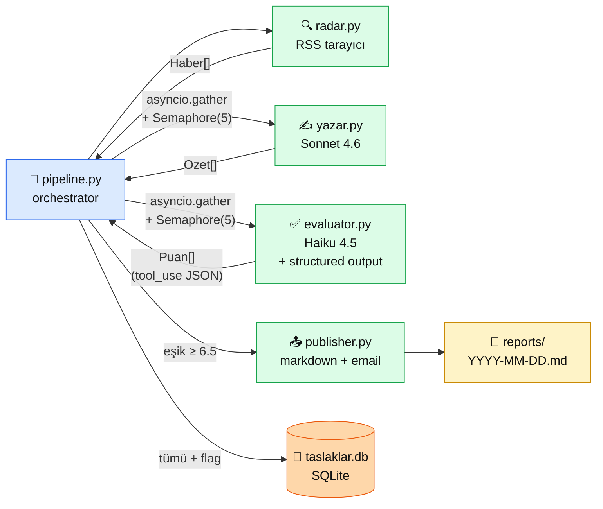

# 6.8 Üretim Multi-Agent — İçerik Özet Pipeline'ı

<div class="ma-meta" markdown>
<div class="ma-meta-row" markdown>
<strong>Kim için:</strong>
<span class="ma-persona ma-persona-baslangic">🟢 başlangıç</span>
<span class="ma-persona ma-persona-is">🔵 iş</span>
<span class="ma-persona ma-persona-kisisel">🟣 kişisel</span>
</div>
<div class="ma-meta-row"><strong>📋 Önkoşul:</strong> Bölüm 6'nın 6.1–6.7 hepsi bitmiş — agent/tool/MCP/multi-agent/SDK karar refleksi oturmuş; 4.8 HBV imza sayfası okunmuş (bu sayfa HBV ile **CTO simetrisi** kurar)</div>
<div class="ma-meta-row"><strong>🎯 Çıktı:</strong> Çalışır durumda bir **multi-agent içerik pipeline**'ının **tam anatomisi** — neden bu pattern, neden bu SDK, neden heterojen model seçimi; klonlayıp kendi varyantını 1–2 saatte deploy ediyorsun. Bölüm 6 boyunca öğrendiğin 7 sayfanın **tek bir gerçek projede** sentezi.</div>
</div>

!!! tip "Yabancı kelime mi gördün?"
    Bu sayfadaki **italik-altı çizili** ifadelerin (orchestrator, evaluator-optimizer, semaphore gibi) üstüne mouse'unu getir — kısa tanım çıkar. Mobilde dokun.

!!! success "Tam çalışır referans kod — hazır"
    Bu sayfada anlatılan **bütün kod** platformun repo'sunda: [`examples/icerik-ozet-agent/`](https://github.com/KemalG-u/muhendisal-platform/tree/main/examples/icerik-ozet-agent). MIT lisans, 9/9 test geçen, ruff temiz, yaklaşık 900 satır. **`git clone` + `.env`'e Anthropic key gir + `uv run python pipeline.py` → ilk raporun hazır.**

## Neden bu sayfa

Bölüm 6 boyunca 7 sayfada teori kurduk: agent ne, tool calling nasıl, MCP protokolü, MCP server yazımı, multi-agent pattern'leri, Claude Agent SDK, LangChain/LangGraph. Güzel. Ama AI Engineer mülakatlarında tek ayırt edici soru: **"Gerçek bir agent sistemi kurdun mu?"** Bu sayfa o sorunun cevabını veriyor — **Türkçe AI haberleri günlük özet pipeline'ı**, 4 agent modülü, orchestrator-workers + evaluator-optimizer + heterojen model, tam çalışır hâlde.

İkincisi: 4.8 (HBV Production RAG) Bölüm 4'ün imza sayfasıydı — **deterministic workflow** örneği (6.1'deki 5/5 workflow sinyali, state machine, düşük maliyet). Bu sayfa **simetrisi** — aynı CTO disipliniyle **multi-agent + kreatif üretim** tarafı. İkisi birlikte okunduğunda "görev → pattern eşleştirmesi" refleksi somutlaşıyor: HBV = workflow doğru; içerik özetleme = agent doğru. **Yanlış pattern seçimi en pahalı hata** — bu iki sayfa karar matrisinin iki ucunu gösteriyor.

Üçüncüsü: Bu sayfanın **referans kod**u (`examples/icerik-ozet-agent/`) sadece anlatım değil, **öğrencinin portföy tohumu**. AI Engineer başvurusunda "MCP server yazdım" (6.4 çıktısı) + "üç SDK karşılaştırdım" (6.7 çıktısı) + "multi-agent pipeline ürettim" (bu sayfa çıktısı) üçlüsü — ilk 6 aylık AI Engineer rolü için güçlü bir portföy başlangıcı.

## Görev tanımı — "içerik özet pipeline" nedir

Gerçekçi bir iş senaryosu: bir blog sahibi / topluluk yöneticisi / araştırmacı, **her sabah Türkçe AI haberlerinin 1 sayfalık özetini** istiyor. 10–20 başlık, her biri 2–3 cümlelik Türkçe özet, kalite puanı, kaynak linki. Manuel iş: 45 dk. Agent iş: 1 dk (paralel) + $0.07.

**Bu görev multi-agent gerektiriyor mu?** Bölüm 6.1'deki 5-sinyal kontrolü:

| Sinyal | Durum | Gerekçe |
|---|---|---|
| Görev paralelleştirilebilir? | ✅ | Her başlık bağımsız özetlenebilir |
| Tek agent context'i şişiyor? | 🟡 Kısmen | 20 başlık × 500 token = 10k, tek agent kaldırır |
| Rol ayrımı anlamlı? | ✅ | Yazar (kreatif) + Evaluator (eleştirel) farklı zihinsel iş |
| Kalite kritik, ikinci göz gerekli? | ✅ | Yazar kendini puanlayamaz → evaluator-optimizer |
| Maliyet profili farklı? | ✅ | Yazar Sonnet, Evaluator Haiku — %38 tasarruf |

**4/5 sinyal aktif → multi-agent doğru seçim.** HBV chatbot'u (4.8) ile zıtlık: HBV'de 5/5 workflow sinyali (state machine, sabit adım, ucuz LLM yeter) → deterministic workflow doğruydu.

## Mimari — 4 modül + DB + orchestrator



<table class="ma-aktorler" markdown>

| Düğüm | Ne yapıyor | Neden burada |
|---|---|---|
| 🎯 **pipeline.py** | Orchestrator — 4 agent'ı sıralı + paralel tetikler, DB'ye yazar | 6.5 "orchestrator kendisi iş yapmaz, dispatcher" ilkesi |
| 🔍 **radar.py** | `feedparser` + `httpx` ile RSS feed'leri tarar, anahtar kelime filtresi | Ücretsiz, deterministic, LLM gereksiz |
| ✍️ **yazar.py** | Her haber için paralel Claude Sonnet çağrısı, 2–3 cümle özet | Kreatif iş; Haiku yetersiz, Opus aşırı — Sonnet dengeyi tutar |
| ✅ **evaluator.py** | Her özeti Claude Haiku ile 3 kritere göre puanlar (`tool_choice="tool"`) | Eleştirel iş Haiku'ya sığar; `structured output` ile JSON garanti |
| 📤 **publisher.py** | Eşik üstü özetleri markdown dosyaya yazar + opsiyonel email | Dosya + SMTP — dış bağımlılık minimum |
| 💾 **taslaklar.db** | SQLite — her tur tüm taslak + puan + `yayinlandi` flag | Gelecek feedback loop için hazır (şu an boş `geri_bildirim` tablosu) |
| 📄 **reports/** | `YYYY-MM-DD.md` — günlük markdown rapor, maliyet footer'ı | İnsan için kanıt artifact'ı |

</table>

## SDK ve pattern kararları — CTO notu

### Karar 1: Ham `anthropic` SDK

Bölüm 6.7'deki üç-SDK karar matrisini uyguladık:

| Boyut | Bu projedeki karşılığı |
|---|---|
| Otonom iş (CI/CD, cron, IDE)? | ❌ Scheduled cron olabilir ama file/bash/web yok |
| Provider-agnostic? | ❌ Claude'a spesifik, başka LLM planlanmıyor |
| HITL + durable execution? | ❌ Kısa tur, 1 dk, hata olursa yeniden çalıştır |
| Her token görünür olsun? | ✅ Maliyet şeffaflığı birinci sıra |
| **Sonuç** | **Ham `anthropic` SDK** |

`claude-agent-sdk` = dosya/bash gereken otonom iş için doğru (bu proje değil). LangChain/LangGraph = provider-agnostic + durable gerektiğinde (bu proje değil). **Ham SDK = her token kontrolü + minimum overhead.**

### Karar 2: Heterojen model (maliyet %38 düşer)

6.5'teki "heterojen model" ilkesi — her görev için doğru model:

| Agent | Model | Fiyat (1M token) | Gerekçe |
|---|---|---|---|
| **Yazar** | `claude-sonnet-4-6` | $3 in / $15 out | Kreatif Türkçe üretim → kalite kritik |
| **Evaluator** | `claude-haiku-4-5` | $1 in / $5 out | Kalıplı puanlama → ucuz model yeter |

Günde 20 başlık varsayımıyla:

- Yazar (Sonnet): ~$0.075/gün → **$2.25/ay**
- Evaluator (Haiku): ~$0.011/gün → **$0.33/ay**
- **Toplam: ~$2.60/ay**

İki agent da Sonnet olsaydı ~$4.20/ay. **%38 tasarruf**, kalite düşmeden. Bu seçim **ölçek büyüdükçe** (günde 100+ başlık) büyür: aylık fark $10–20'ye çıkar.

### Karar 3: Orchestrator-workers + Evaluator-optimizer hibrit

6.5'teki iki pattern'i birleştirdik:

1. **Orchestrator-workers:** `pipeline.py` ana agent; yazar + evaluator subagent gibi çalışıyor, her biri kendi kimliğiyle (system prompt), paralel çalışıyor (`asyncio.gather`).
2. **Evaluator-optimizer:** Yazar üretir → evaluator puanlar → publisher eşik filtresiyle seçer. Yazar kendini puanlamaz — ikinci göz kuralı.

### Karar 4: Structured output — `tool_choice="tool"`

Evaluator'ın çıktısı JSON olmalı (puan alanları + açıklama). 6.2'deki `tool_choice="tool"` deseniyle Claude'u **tool çağırmaya zorluyoruz** → garanti JSON:

```python
PUANLAMA_TOOL = {
    "name": "ozeti_puanla",
    "description": "Verilen özeti 3 kritere göre 0-10 arası puanla.",
    "input_schema": {
        "type": "object",
        "properties": {
            "teknik_dogruluk": {"type": "integer", "minimum": 0, "maximum": 10},
            "turkce_kalitesi": {"type": "integer", "minimum": 0, "maximum": 10},
            "ozet_netligi":    {"type": "integer", "minimum": 0, "maximum": 10},
            "aciklama":        {"type": "string"},
        },
        "required": ["teknik_dogruluk", "turkce_kalitesi", "ozet_netligi", "aciklama"],
    },
}

resp = await client.messages.create(
    model="claude-haiku-4-5",
    tools=[PUANLAMA_TOOL],
    tool_choice={"type": "tool", "name": "ozeti_puanla"},  # ← ZORUNLU çağrı
    ...
)
```

Hiçbir regex parse, hiçbir "JSON ayrıştırma başarısız" hatası. `tool_block.input` direkt dict.

### Karar 5: `asyncio.Semaphore` — rate limit koruması

20 başlık paralel Claude çağrısı = 20 eşzamanlı HTTP bağlantısı. Anthropic Tier 1 rate limit: dakikada 50 request. Patladığında pipeline yarıda kalır.

Çözüm:

```python
_CONCURRENCY = int(os.environ.get("MAX_CONCURRENCY", "5"))

async def puanla_toplu(ozetler):
    client = anthropic.AsyncAnthropic()
    sem = asyncio.Semaphore(_CONCURRENCY)
    tasks = [puanla_tek(client, o, semaphore=sem) for o in ozetler]
    return await asyncio.gather(*tasks)
```

Aynı anda **en fazla 5 çağrı** açık. 20 başlık → 4 batch × ~2 sn = 8 sn toplam. Rate limit'ten güvende.

## Dosya dosya anatomi

### `pipeline.py` — orchestrator (150 satır)

Görevi: `SCRIPT_DIR` ile dizin bağımsız, `logging` ile izlenebilir, `dataclass` bayrakları ile DB şeffaf, `try/finally` ile kaynak güvenli.

**Dikkat edilen CTO noktaları:**

- `SCRIPT_DIR = Path(__file__).resolve().parent` — nereden çağrılırsa çağrılsın DB + schema + reports yolları tutarlı
- `db_kaydet` → `executemany` ile tek batch insert (N çağrı değil)
- `Puan.yayinlandi` bool flag → `id()` in set hilesi yok (test edilemez idi)
- Her agent `logging.info` ile metrik basar, son satır `[maliyet] toplam: $X.XXXX`
- `argparse` → `--dry-run`, `--esik`, `--show-last`, `--son-saat` — şeffaf CLI

### `agents/radar.py` — RSS toplayıcı (125 satır)

Görevi: **LLM gerektirmeyen kısım**. Üç default Türkçe teknoloji RSS + anahtar kelime filtresi + 24 saat eşiği. Öğrenci kendi kaynak listesini genişletir.

**CTO noktası:** Radar'a LLM eklemek cazip geliyor ("Claude başlığı sınıflandırsın") ama **yanlış**. Deterministic iş deterministic araçla yapılır — Bölüm 6.1'in temel dersi. 100 başlık × LLM sınıflandırma = $0.50 gereksiz harcama, saniye gecikme, halüsinasyon riski. `any(k in baslik.lower() for k in KEYWORDS)` saniye altı, sıfır maliyet.

Opsiyonel `firecrawl_derinlemesine(url)` fonksiyonu var — sadece tek başlığın tam metnini çekmek için (API key varsa). **Default OFF**; çoğu kullanıcının ihtiyacı yok.

### `agents/yazar.py` — özet üretici (95 satır)

Görevi: Tek başlık için 2–3 cümle Türkçe özet. System prompt'ta **negatif kısıtlar** öne çıkar ("terim uydurma, çeviri tadı verme, emoji yok") — bu 6.2'deki "muğlak description = yanlış tool seçimi" refleksinin system prompt versiyonu.

```python
SYSTEM_PROMPT = """Sen bir Türkçe AI haber özetçisin. Görevin:

- Verilen başlığı 2-3 cümlelik Türkçe özete çevir
- Teknik doğrulukta ödün verme, terim uydurma
- Türkçesi doğal olsun, çeviri tadı verme
- Başlığı tekrarlama; ek bilgi / bağlam / çıkarım ekle
- Emoji, slogan, abartı yok

Formatın: SADECE özet metin. Başlık, madde işareti, meta açıklama YOK.
"""
```

**`maliyet_usd` property** — her `Ozet` kendi fiyatını hesaplıyor. Rapor footer'ı bu property'leri toplar.

### `agents/evaluator.py` — kalite puanlayıcı (155 satır)

Görevi: `PUANLAMA_TOOL` + `tool_choice="tool"` ile garanti JSON. Üç puan (teknik doğruluk, Türkçe kalitesi, özet netliği) + açıklama. Tool çağrısı **başarısız olursa** `5/5/5` nötr puan — eşik 6.5 → eşik geçmez → yayınlanmaz. **Fail-safe**.

```python
if tool_block is None:
    log.warning("[evaluator] tool_use yok: %s", ozet.haber.baslik[:60])
    return Puan(..., teknik_dogruluk=5, turkce_kalitesi=5, ozet_netligi=5,
                aciklama="Puanlama başarısız, varsayılan nötr puan.")
```

### `agents/publisher.py` — markdown + email (150 satır)

Görevi: Eşik filtresi + `Puan.yayinlandi=True` flag set + markdown üret + opsiyonel SMTP. Rapor sonuna **maliyet footer'ı** yapıştırır:

```
_Toplam 12 özet üretildi, 9 tanesi eşik üstü._
_Maliyet: $0.0666 · 6,143 in + 2,891 out token._
```

Bu satır Claude Agent SDK'nın `ResultMessage.total_cost_usd` mantığının manuel versiyonu — **şeffaflık birinci sıra**.

### `db/schema.sql` — 2 tablo

`taslaklar`: id, tarih, başlık, link, özet, 3 puan, ortalama, model, token, `yayinlandi` flag.
`geri_bildirim`: id, taslak_id, tepki, ek_not, tarih — **şu an boş**. Feedback loop genişletme için hazır.

3 index (tarih, yayın, ortalama) — sorgu performansı. `--show-last` ve gelecek dashboard için temel.

### `tests/test_pipeline.py` — 9 birim test

`unittest.mock` ile gerçek API çağrısı **yapılmıyor** — CI deterministic. Test kapsamı:

- Radar: `KEYWORDS` listesi + `Haber` dataclass alanları
- Yazar: mock API → `Ozet` doğru parse, maliyet hesabı doğru, Haiku < Sonnet
- Evaluator: mock tool_use → `Puan` doğru parse; tool_use yoksa nötr 5/5/5
- Publisher: eşik filtresi + `yayinlandi` flag + boş liste

**9/9 PASSED, 0.39s.** Ruff: **All checks passed**.

## Maliyet hesabı gerçeği

Günde 20 başlık, yılda 365 gün:

| Kalem | Tutar |
|---|---|
| Yazar (Sonnet 4.6) | $0.075/gün × 365 = **$27.38/yıl** |
| Evaluator (Haiku 4.5) | $0.011/gün × 365 = **$4.00/yıl** |
| **Toplam LLM maliyeti** | **$31.38/yıl** |
| VPS (SMTP + cron) | Zaten mevcut (0 ek maliyet) |
| Domain (opsiyonel) | 0 (markdown repo'ya yazılırsa) |
| **Yıllık toplam** | **~$31** (bir Netflix Basic aboneliği) |

45 dakikalık manuel işi 1 dakikaya indiren bir agent, yılda 274 saat kazandırır. **$31 = 7 saniye/saat maliyet** — iş başarılı olduğu sürece 100x+ ROI.

## 4.8 HBV vs 6.8 İçerik Özet — CTO simetrisi

Bölüm 4 ve Bölüm 6 imza sayfaları birlikte okunduğunda AI agent tasarımının özü çıkar:

| Boyut | 4.8 HBV Production RAG | 6.8 İçerik Özet Pipeline |
|---|---|---|
| **Görev tipi** | Deterministic (bağış bilgisi → cevap) | Kreatif (haber → Türkçe özet) |
| **Pattern** | Workflow (state machine, 5 durum) | Multi-agent (orchestrator + evaluator) |
| **6.1 sinyal** | 5/5 workflow | 4/5 agent |
| **Pattern karşılığı** | 6.1 "workflow yeterli" | 6.5 "orchestrator-workers + evaluator-optimizer" |
| **LLM** | Haiku (ucuz, dar, kalıplı) | Sonnet + Haiku heterojen (6.5) |
| **SDK** | Ham `anthropic` + FastAPI | Ham `anthropic` + asyncio |
| **Paralellik** | Sıralı (her mesaj tek tur) | Paralel (20 başlık aynı anda) |
| **Başarı kriteri** | Bağış tamam olsun (deterministic) | Günlük rapor çıksın, eşik üstü seçilsin |
| **Tek özet/mesaj maliyeti** | <$0.001 | ~$0.003 |
| **Ortak ders** | Pattern → görev eşleştirmesi BAŞARI için zorunlu | Heterojen model + evaluator-optimizer = maliyet + kalite |

**Tek cümle CTO çıkarımı:** Doğru pattern seçimi doğru görev için hayat kurtarır; yanlış pattern en pahalı hatadır. HBV'ye multi-agent demek para yakmak; içerik özete workflow demek kaliteyi zorlamak. **5-sinyal kontrolü (6.1) pazarlıksız**.

## Kurulum — 5 dakika

```bash
git clone https://github.com/KemalG-u/muhendisal-platform
cd muhendisal-platform/examples/icerik-ozet-agent

# uv yoksa: https://docs.astral.sh/uv/#installation
uv sync --extra dev

cp .env.example .env
# .env içine ANTHROPIC_API_KEY yaz
```

Koştur:

```bash
uv run python pipeline.py --dry-run   # konsola bas, dosya/DB yok
uv run python pipeline.py             # tam tur + rapor + DB
uv run pytest                         # 9 test
uv run ruff check                     # lint
```

Tipik ilk çıktı:

```
[radar] 12 başlık bulundu
[yazar] 12 özet — 3847 token, $0.058
[evaluator] ortalama 7.3/10, $0.009
[publisher] 9 özet rapora: reports/2026-04-22.md
[maliyet] $0.067
```

**1 dolar harcamadan 15+ rapor.** Öğrencinin Bölüm 6 portföy çıktısı burada biter.

## Tuzaklar — CTO uyarıları

| Tuzak | Sonuç | Bu projede çözüm |
|---|---|---|
| **Orchestrator'a "plus iş" yaptırmak** | Kimlik kayması (6.5) | `pipeline.py` yalnız dispatch + DB; özetleme/puanlama subagent işi |
| **Radar'a LLM sokmak** | $/gün patlar, saniye gecikme | `radar.py` pure Python; anahtar kelime filtresi yeter |
| **Paralellik sınırsız** | Rate limit patlar | `asyncio.Semaphore(MAX_CONCURRENCY=5)` default |
| **JSON parse regex ile** | "Kırılgan, kenar durum hatası" | `tool_choice="tool"` + `tool_block.input` — kesin |
| **Heterojen model atlamak** | 2× maliyet | Sonnet (kreatif) + Haiku (kalıplı) = %38 tasarruf |
| **Maliyet görünmez** | Ay sonu sürprizi | Her agent `usage` loglar; publisher rapor footer'ına yapıştırır |
| **`id()` in set** (test edilemez) | "Bu kayıt yayınlandı mı?" belirsiz | `Puan.yayinlandi: bool` dataclass field — tek doğru kaynak |
| **Çalışma dizini bağımlı** | Başka yerden çağrılınca patlar | `SCRIPT_DIR = Path(__file__).resolve().parent` |
| **`print()` prod log** | grep/journalctl zor | `logging` modülü + seviyeler |
| **Dry-run yok** | Yayına girmeden deneyemezsin | `--dry-run` bayrağı default güvenli iş akışı |

<div class="ma-anthropic-oz" markdown>
<div class="ma-anthropic-oz-header">📖 Anthropic bu projeyi nasıl değerlendirir — öz</div>

Anthropic'in [Building Effective Agents](https://www.anthropic.com/research/building-effective-agents) (2024 Aralık, hâlâ canonical) makalesinde üç temel prensip var — bu projede somutlaşıyor:

**1. Simple first.** Orchestrator-workers + evaluator-optimizer pattern'i **iki** temel yapı taşı üstünde kurulu; LangChain/LangGraph/CrewAI karmaşası yok. Ham `anthropic` SDK + asyncio + Semaphore — 3 bağımlılık. Debug transparan: her agent ayrı dosya, ayrı loglar.

**2. Composability over framework.** 4 modül (radar, yazar, evaluator, publisher) tek tek test edilebilir + tek tek değiştirilebilir. Yazar'ı GPT'ye çevirmek `messages.create` yerine `openai.chat.completions.create` — 5 satır iş. LangChain'deki `create_agent(model="openai:gpt-5")` tek satır ama bu proje **özellikle** çerçevesiz — öğrenci pattern'i görsün, framework arkasına saklanmasın.

**3. Observability birinci sıra.** Her çağrının `input_tokens` + `output_tokens` + `maliyet_usd` kaydı; rapor dosyasının sonunda toplam maliyet. Bu **prod multi-agent için pazarlıksız** — Bölüm 6.5'teki "Her subagent çağrısında `usage` logla" kuralının uygulanışı.

??? info "Teknik detay — isteyene (genişletme + deploy + ölçeklenme)"

    **Feedback loop kurmak.** `geri_bildirim` tablosu şu an boş. Publisher'dan email ile rapor gidiyorsa, her rapor link'inin yanına "bu özet iyiydi / ortaydı / kötüydü" reply-to-email linki koyabilirsin. Basit SMTP webhook'u → SQLite insert. 1 haftalık veriden sonra evaluator'ın sistem prompt'unu **otomatik güncelle** (en sık red edilen örnekleri ekle). Bu evaluator-optimizer kapalı döngü.

    **Headless deploy — GitHub Actions.**

    ```yaml
    # .github/workflows/daily.yml
    on:
      schedule:
        - cron: '0 6 * * *'   # her gün UTC 06:00
    jobs:
      ozet:
        runs-on: ubuntu-latest
        steps:
          - uses: actions/checkout@v4
          - uses: astral-sh/setup-uv@v3
          - run: uv sync
          - run: uv run python pipeline.py
            env:
              ANTHROPIC_API_KEY: ${{ secrets.ANTHROPIC_API_KEY }}
          - uses: actions/upload-artifact@v4
            with:
              name: rapor
              path: reports/
    ```

    GitHub Actions Free plan = 2000 dk/ay; bu pipeline ~2 dk/tur → **günlük otomasyon ücretsiz**.

    **Ölçeklenme.** 20 başlık → 200 başlık için 3 değişiklik:
    1. `MAX_CONCURRENCY` → 10 (yüksek tier key + Anthropic rate limit > 100 req/min)
    2. `radar.py` → 3 feed değil 20 feed
    3. DB'ye `UNIQUE(link)` constraint — dup başlık tekrar özetlenmesin

    **MCP server'a çevirmek.** 6.4'teki FastMCP ile `radar` + `publisher` bağımsız MCP server'ları yaparsan, Claude Desktop'tan manuel da çağırabilirsin: "son haberleri al, özetini çıkart, masaüstümdeki rapor.md'ye yaz." Bu Bölüm 6'nın 5-katman mimarisinde (MCP → Skills → Agent) katmanlı kullanımdır.

    **LangGraph'a geçmek ne zaman değer.** Üç sinyal: (a) uzun süreli kullanıcı oturumu (bu proje yok), (b) multi-provider deneme (bu proje planlamıyor), (c) HITL onay adımı (bu proje publisher eşik ile otomatik). **Yok.** LangGraph eklemek bu projeye 3× soyutlama getirir, 0× değer. 6.7'deki "framework-first yanlış" kuralı.

<div class="ma-anthropic-oz-kaynak" markdown>
**Kaynak:** [Anthropic — Building Effective Agents](https://www.anthropic.com/research/building-effective-agents) (referans metin, 2024 Aralık). Pekiştirme: [Anthropic Academy — Introduction to Subagents](https://anthropic.skilljar.com/) (~30 dk, sertifikalı). Kod referansı: [anthropics/claude-cookbooks — agents klasörü](https://github.com/anthropics/claude-cookbooks/tree/main/patterns/agents). Fiyat doğrulama: [docs.claude.com/en/docs/about-claude/pricing](https://docs.claude.com/en/docs/about-claude/pricing).
</div>
</div>

<div class="ma-cikti-kaniti" markdown>
### 📦 Bu sayfayı bitirdiğini nasıl kanıtlarsın

#### 1. 📝 Refleksiyon yazısı — 5 dakika

> "Klonladığım repo: `examples/icerik-ozet-agent/`. `ANTHROPIC_API_KEY` ekledim ve `uv run python pipeline.py --dry-run` koştum. Çıktıdan en ilginç bulduğum 3 özet: [...]. En yüksek puanı alan özetin skoru: [...]; en düşük puanın aldığı özetin skoru: [...]. Bana göre değiştireceğim 3 şey: [...]. Kendi projemde agent seçerken 6.1'deki 5-sinyal kontrolü: [...]."

Kaydet: `muhendisal-notlarim/bolum-6/08-production/refleksiyon.txt`

#### 2. 📸 İlk rapor ekran görüntüsü — 5 dakika

**Neyin görüntüsü:** `reports/YYYY-MM-DD.md` dosyanın ilk 3 bölümü + maliyet footer satırı. "Bugün ne üretti, kaça mal oldu" kanıtı.

Kaydet: `muhendisal-notlarim/bolum-6/08-production/ilk-rapor.png`

#### 3. 💻 Kendi varyantın + GitHub — 1 hafta

**Bu bölümün en değerli portföy çıktısı.** Aşağıdaki 3 değişikliği yap, repo'yu fork'la, kendi adına push'la:

1. **Kaynak listesini kendi alanına uyarla** — RSS feed'leri ile ilgi alanın (finans / spor / teknoloji / sağlık)
2. **4. agent ekle** — `twitter_paylas.py` veya `rss_publish.py` veya `discord_bot.py` — kendi yayın kanalın
3. **Feedback loop kur** — publisher'a "beğen/geç" linki + SQLite `geri_bildirim` doldur + 1 haftalık veriden yazar'ın system prompt'u güncelle

README'de 3 şeyi yaz: (a) hangi alan, neden, (b) kendi eklediğin 4. agent'ın 1 paragraflık CTO notu, (c) 7 günlük kullanımdan öğrendiğin — hangi format işe yaradı, hangisi yaramadı.

Repo linkini kaydet: `muhendisal-notlarim/bolum-6/08-production/fork-repo.txt`

Bu fork **AI Engineer başvurularında gösterebileceğin somut eser** — mülakatta "3 farklı agent patteri kullanan, heterojen model maliyet optimizasyonlu, test edilmiş, deploy edilebilir bir pipeline kurdum."

</div>

<div class="ma-neden-sonuc" markdown>
<div class="ma-neden-sonuc-header">🔗 Birlikte okuma — neden ne oldu</div>

- **A → B:** Bölüm 6 boyunca 7 sayfa teori kurduk; AI Engineer mülakatlarında ayırt edici soru "gerçek bir agent sistemi kurdun mu" — bu sayfa o sorunun cevabı.
- **B → C:** Görev tanımı (içerik özet pipeline) 6.1'deki 5-sinyal kontrolünde 4/5 agent — multi-agent doğru seçim. 4.8 HBV (5/5 workflow) ile simetri.
- **C → D:** 5 CTO kararı — (1) ham SDK, (2) heterojen model, (3) orchestrator-workers + evaluator-optimizer hibrit, (4) structured output, (5) Semaphore rate limit — her biri Bölüm 6'nın bir sayfasının doğrudan karşılığı.
- **D → E:** 4 modül anatomisi — radar (deterministic, LLM yok), yazar (Sonnet, kreatif), evaluator (Haiku + tool_choice, kalıplı), publisher (dosya + SMTP, dış bağımlılık min).
- **E → F:** Maliyet hesabı: $2.60/ay, %38 heterojen-model tasarrufu. 45 dk manuel iş → 1 dk agent iş, $31/yıl.
- **F → G:** HBV vs içerik özet CTO simetrisi — doğru pattern seçimi hayat kurtarır, yanlış pattern en pahalı hata.
- **G → H:** `git clone + uv sync + .env + uv run pipeline.py` → 5 dakikada çalışan sistem + 9 test + ruff temiz = öğrencinin fork'layıp **kendi varyantını deploy edeceği portföy tohumu**.

<div class="ma-neden-sonuc-sonuc" markdown>
**Sonuç:** Bölüm 6'nın sentezi ve kapanışı — ham `anthropic` SDK + orchestrator-workers + evaluator-optimizer + heterojen model + structured output + rate limit koruması + maliyet şeffaflığı hepsi tek projede. 4.8 HBV (workflow) + 6.8 bu proje (multi-agent) birlikte pattern-görev eşleştirmesi refleksini kapatıyor. Artık gerçek bir iş senaryosunda "hangi pattern, hangi SDK, hangi model" sorusu karar matrisiyle **cevaplanıyor**. Bir sonraki adım — **Bölüm 9 Deploy + Portföy** — üç portföy projesini (bu + 6.4 MCP server + 4.8 HBV alternatifi) production'a çıkarıp kamuya açık hâle getirmek.
</div>
</div>

<div class="ma-sonraki" markdown>
<div class="ma-sonraki-header">➡️ Sonraki adım</div>

**Bölüm 6 bitti.** 9/9 alt sayfa + 1 çalışan referans proje. Bir sonraki bölüm:

**[Bölüm 9 — Deployment ve Portföy →](../bolum-9/index.md)** — VPS seçimi, Docker, systemd, GitHub Actions CI, domain + HTTPS, 3 portföy projesi canlıya. Bu bölümün referans projesini (`examples/icerik-ozet-agent/`) production'a götüreceğiz.

← [6.7 LangChain Agents](07-langchain.md) &nbsp;|&nbsp; [Bölüm 6 girişi](index.md) &nbsp;|&nbsp; [Ana sayfa](../index.md)

**Pekiştirme:** Bu proje bir portföy tohumudur. **Fork'la, kendi alanına uyarla, 1 hafta kullan, öğrendiklerini README'ye yaz.** Bölüm 9'a başlarken bu fork elinde olsun — deploy edeceğimiz ilk proje bu olacak.
</div>
