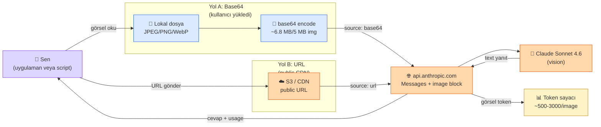

# 7.1 Görüntü Modelleri — Claude Vision ile Görsel Analiz

<div class="ma-meta" markdown>
<div class="ma-meta-row" markdown>
<strong>Kim için:</strong>
<span class="ma-persona ma-persona-baslangic">🟢 başlangıç</span>
<span class="ma-persona ma-persona-is">🔵 iş</span>
<span class="ma-persona ma-persona-kisisel">🟣 kişisel</span>
</div>
<div class="ma-meta-row"><strong>⏱️ Süre:</strong> ~35 dakika</div>
<div class="ma-meta-row"><strong>📋 Önkoşul:</strong> Bölüm 2 (Claude API). Test için 1-2 örnek görsel (JPG/PNG) — ekran görüntüsü, belge, grafik, fotoğraf.</div>
<div class="ma-meta-row"><strong>🎯 Çıktı:</strong> Claude Sonnet 4.x vision ile **5 pratik kullanım** elinde: (1) belge OCR + yapılandırma, (2) UI mockup → kod, (3) ürün görsel → açıklama, (4) grafik veri çıkarma, (5) PII tespit. Image token maliyeti hesaplama refleksi. Base64 vs URL tercih kriterleri. **Multimodal refleksi** açıldı — metin dışına çıktın.</div>
</div>

!!! tip "Yabancı kelime mi gördün?"
    **Vision (görüntü) modeli** = görsel girdiyi kabul eden LLM; Claude Sonnet 4.6 / Opus 4.7 / Haiku 4.5, GPT-5.5, Gemini 2.5 görüntü yeteneği. **Modalite (modality)** = veri türü; metin, görüntü, ses, video her biri bir kip. **Base64** = ikili (binary) dosyayı metin olarak kodlama; görsel API gönderimi için yaygın; %33 boyut artışına yol açar. **OCR** (Optical Character Recognition — görsel karakter tanıma) = görseldeki metni okuma. **Visual RAG (görsel destekli RAG)** = görsel + metin hibrit getirme; ilgili görseli bul + Claude'a ver. **Citations API** (Alıntı API'si) = Claude'un kullandığı kaynak parçacığı (görsel ya da PDF sayfası) ile birlikte cevap üretmesi; halüsinasyonu azaltır. **MMMU** (Massive Multi-discipline Multimodal Understanding) = 11.5K çoklu kip soru, üniversite seviyesi; Sonnet 4.6 Mart 2025 puanı %75.7. **DocVQA** = belge sorgulama kıyaslaması; Claude Opus 4.7 %95.4 puanla 2026 başında lider.

## Neden bu sayfa?

Platform'un önceki 28 sayfası **metin** odaklıydı — prompt, RAG, agent, FT. Ama 2026'da canlı projeler giderek **görsel** de alıyor:

- Müşteri ürün fotoğrafı yüklüyor → otomatik açıklama
- Avukat PDF taraması veriyor → sözleşme maddelerini çıkar
- Öğrenci tahta fotoğrafı atıyor → matematik sorusu çöz
- DevOps ekran görüntüsü paylaşıyor → hatayı yorumla

Bu sayfanın mesajı: **Claude vision, "görsel → metin" kullanım senaryolarının büyük çoğunluğunu kolay çözer.** Kurulum tek bir API parametre değişikliği; zorluk **doğru prompt + maliyet kontrolü**.

İkincisi: **Multimodal 2026 trendi** (10.4 Trend 2). AI Engineer CV'sinde "vision entegrasyonu" satırı **ek değer**. 9.6 Multimodal imza sayfasında canlı bir projeyle göstereceksin.

Üçüncüsü: **Anthropic vision olgun durumda** — Claude Sonnet 4.6 / Opus 4.7 vision kalitesi GPT-5.5 ile yarışır seviyede. Bu sayfada Anthropic öncelikli yaklaşımımızla tutarlı kalıyoruz.

## Bu sayfanın ekosistemi

<div class="ma-ekosistem" markdown>
<div class="ma-ekosistem-header">🗺️ Ekosistem — görsel Claude'a nasıl ulaşır</div>



</div>

<table class="ma-aktorler" markdown>

| Aktör | Rol | Nerede |
|---|---|---|
| 👤 Sen / App | Görseli hazırla, Claude'a gönder, yanıtı kullan | Lokal/backend |
| 📄 Lokal dosya | Kullanıcının yeni yüklediği görsel (JPEG/PNG/GIF/WebP) | Disk/memory |
| 🔧 base64 encode | Binary → ASCII string (+%33 boyut), tek HTTP request | Backend |
| ☁️ S3/CDN | Zaten public host edilmiş görsel, Claude fetch'ler | Uzak |
| 🌐 api.anthropic.com | Messages endpoint, image block + text block kabul | Anthropic |
| 🧠 Claude Sonnet 4.6 | Vision: layout + text + scene + chart + diagram | Anthropic cluster |
| 📊 Token sayacı | Her image ~500-3000 token (çözünürlüğe göre), fatura + rate limit | Anthropic |

</table>

**Burada olan nedir:** Görselin base64 olarak gidiyorsa "tek paket", URL olarak gidiyorsa "Claude sen uzaktan çek" diyorsun. Anthropic hiçbir şekilde görselini saklamaz (provider policy), token sayacı usage'ı kaydeder. **5 MB üstünde otomatik downscale.**

## Claude vision — temel kullanım

### API çağrısı — base64 ile

```python
import anthropic
import base64
from pathlib import Path

client = anthropic.Anthropic()

# Görseli base64'e encode
image_path = "urun.jpg"
image_data = base64.b64encode(Path(image_path).read_bytes()).decode("utf-8")
image_media_type = "image/jpeg"  # veya png, webp, gif

response = client.messages.create(
    model="claude-sonnet-4-6",
    max_tokens=1024,
    messages=[
        {
            "role": "user",
            "content": [
                {
                    "type": "image",
                    "source": {
                        "type": "base64",
                        "media_type": image_media_type,
                        "data": image_data,
                    },
                },
                {
                    "type": "text",
                    "text": "Bu ürünün fotoğrafını Türkçe olarak detaylı anlat.",
                },
            ],
        }
    ],
)

print(response.content[0].text)
```

**Kritik:** `content` artık **array** — image + text ayrı block'lar. Sıralama önemli: önce image, sonra text (prompt) yaygın.

### API çağrısı — URL ile

Görsel halihazırda internet üzerinde ise URL geç:

```python
response = client.messages.create(
    model="claude-sonnet-4-6",
    max_tokens=1024,
    messages=[
        {
            "role": "user",
            "content": [
                {
                    "type": "image",
                    "source": {
                        "type": "url",
                        "url": "https://example.com/urun.jpg",
                    },
                },
                {"type": "text", "text": "Bu ürünü analiz et."},
            ],
        }
    ],
)
```

URL Claude sunucularından erişilebilir olmalı (public). Internal URL'ler çalışmaz.

### Base64 vs URL — ne zaman hangisi

<table class="ma-aktorler" markdown>

| Kriter | Base64 | URL |
|---|---|---|
| Görsel nerede | Kullanıcı yeni yükledi, disk'te | Zaten CDN / S3'te public |
| Request boyutu | Büyük (5MB → ~6.8MB base64) | Küçük |
| Latency | Yükleme vakti + işlem | Sadece Claude fetch süresi |
| Güvenlik | Görsel Claude'a gider, dönmez | Claude her çağrıda URL'yi fetch |
| Caching | Yok | CDN cache avantajı |
| Gizlilik | Daha kontrollü | URL public = görsel public |

</table>

**Pratik kural:** Kullanıcı yüklüyorsa base64; zaten public'se URL.

## Kısıtlar — 2026 Claude görüntü

- **Biçim:** JPEG, PNG, GIF, WebP (animated GIF için sadece ilk kare okunur)
- **Üst boyut:** **5 MB / görsel** (base64 ya da URL)
- **Üst çözünürlük:** uzun kenar 8000 piksel; içeride 1568 piksele kadar yeniden boyutlandırılır
- **İstek başına:** **20 görsel** (Messages API'de tek istek üst sınırı; daha fazla için ardışık çağrı)
- **PDF doğal girdi:** ayrı `document` bloğu — Messages API'de 32 MB / 100 sayfa, Files API'de 500 MB / yaklaşık 1000 sayfa
- **Video:** Doğrudan değil — karelere ayır, her kare ayrı görsel (7.3'te ayrıntı). Gemini 2.5 Pro doğal video alıyor.
- **Citations API:** Görsel veya PDF'lerde alıntı dönüşü için `citations: {"enabled": true}` parametresi 2025'te eklendi.
- **Bölgesel kısıt:** 2026 başında AB AI Act yüksek riskli sistemlerde (sağlık, biyometrik) görüntü çıkarımı için ek belge zorunluluğu.

**Token maliyeti tahmini:**

- Küçük görsel (~500 × 500): ~500 token
- Orta görsel (~1000 × 1000): ~1500 token
- Büyük görsel (~2000 × 2000): ~3000 token

**Resmi formül:**

```
Görsel token ≈ (genişlik × yükseklik) / 750
```

(Anthropic 2026 belgesi; her görsel önce 1568 px uzun kenara yeniden boyutlandırıldığı için 8000 × 8000 girdi pratikte ~1568 × 1568 işlenir, yaklaşık 3300 token.)

Örnek: 1200×800 = 960.000 / 750 = **~1280 token**.

**Karşılaştırma:** Metin olarak 1280 token ~960 Türkçe kelime; bir sayfa metinle aynı maliyet. **Görsel pahalı değil** ama **çok görsel** toplam 50K+ token kolay geçer — 8.3'teki üst sınır (hard cap) kritik. **Yönerge önbelleği (prompt caching)** görsellerde de çalışır: aynı görsel art arda çağrılarda %90 indirimli okunur.

## 5 pratik kullanım

### 1. Belge OCR + yapılandırma

**Senaryo:** Türkçe PDF tarandı, yapılandırılmış JSON istiyorsun.

```python
PROMPT = """Bu belgeyi oku ve aşağıdaki JSON şemasına uygun çıkar:

{
  "belge_turu": "fatura / sozlesme / rapor / diger",
  "tarih": "YYYY-MM-DD veya null",
  "taraflar": [{"isim": "...", "rol": "..."}],
  "anahtar_noktalar": ["madde 1", "madde 2"],
  "rakamsal_degerler": [{"aciklama": "...", "deger": 0}]
}

Sadece JSON döndür, başka metin yok. Emin olmadığın değer için null kullan."""

response = client.messages.create(
    model="claude-sonnet-4-6",
    max_tokens=2048,
    messages=[{"role": "user", "content": [
        {"type": "image", "source": {...}},
        {"type": "text", "text": PROMPT},
    ]}],
)

import json
veri = json.loads(response.content[0].text)
print(veri)
```

**Karşılaştırma:** Klasik OCR (Tesseract) + regex = 200 satır kod + Türkçe karakter hata. Claude vision = 20 satır + daha temiz + yapılandırılmış.

**Üretim ipucu:** `tool_choice={"type": "tool", "name": "parse_belge"}` ile JSON şeması **garanti** (Bölüm 8.1'deki pattern). Regex parse riski sıfır.

### 2. UI mockup → HTML/React kod

**Senaryo:** Tasarımcı Figma ekran görüntüsü verdi, sen frontend kod istiyorsun.

```python
PROMPT = """Bu tasarım mockup'ını incele ve React + Tailwind CSS ile 
bileşen kodu üret. Kurallar:
- Component adı: LoginForm
- Sadece JSX + Tailwind, başka library yok
- State yönetimi: useState
- Accessibility: aria-label'lar ekle
- Responsive: mobile-first"""

response = client.messages.create(
    model="claude-sonnet-4-6",
    max_tokens=4096,
    messages=[{"role": "user", "content": [
        {"type": "image", "source": {...}},
        {"type": "text", "text": PROMPT},
    ]}],
)

print(response.content[0].text)
```

**Anthropic'in kendi kullanımı:** Claude in Chrome ve Claude Code ürünlerinde bu örüntü yerleşik. Tasarım → kod dönüşümü **2024-2026 AI Engineer iş ilanlarında sıkça** istenen yetkinlik. Vercel'in `v0.dev` ürünü tam olarak bu örüntü üzerine kurulu, milyon dolarlık ARR'a 2025'te ulaştı.

**Gerçekçi kalite:** Basit form + liste UI %90 doğru. Karmaşık animasyon + özel bileşen %60-80. İlk taslak olarak çok güçlü, elle rötuş gerekir. **2025 ipucu:** Çok adımlı UI'da Claude `extended thinking` (uzun düşünme) modunu açarsan tasarım analizi belirgin gelişiyor — `thinking: {"type": "enabled", "budget_tokens": 5000}` parametresiyle.

### 3. Ürün fotoğrafı → otomatik açıklama

**Senaryo:** E-ticaret müşteri ürün fotoğrafı yüklüyor, sen başlık + açıklama + kategori istiyorsun.

```python
PROMPT = """Bu ürünün fotoğrafını incele. Çıkar:

1. baslık: 60 karakter altı, SEO uyumlu
2. aciklama: 150 kelime, özellikler + kullanım
3. kategori: elektronik / giyim / ev / kitap / oyuncak / diger
4. renk: ana renk
5. malzeme: görünen malzeme (deri, plastik, cam, vs)
6. dikkat_cekici_ozellikler: 3-5 madde

JSON formatında döndür."""
```

**E-ticaret kullanımı:** Toplu ürün yükleme — satıcı 100 fotoğraf yüklüyor, Claude 100 otomatik kart üretiyor. Saatlerce işi dakikalara indirir. Ticaret Bakanlığı verilerine göre Türkiye'de 2025'te 500K+ e-ticaret satıcı; bu tip otomasyon pazarı büyük.

### 4. Grafik / chart analizi — sayısal veri çıkarma

**Senaryo:** Finansal rapor PDF'ten grafik resmi ayıklandı, sayısal veri istiyorsun.

```python
PROMPT = """Bu grafik bir çizgi grafiği. Her veri noktasını çıkar:

Format: {"x_label": "...", "y_label": "...", "birim": "...", "data": [
  {"x": "2020", "y": 100},
  {"x": "2021", "y": 150},
  ...
]}

Yaklaşım:
- Tam rakamı okuyamıyorsan yakın yuvarla + null yerine tahmini ver
- Grafik başlığını ve eksen etiketlerini ekle
- Sadece JSON döndür"""
```

**Sınır:** Çok yoğun, çok renkli, yeraldaki çok veri noktalı grafikler → Claude bazı noktaları kaçırır. %80-90 doğruluk realistic. Kritik analizler için insan kontrolü gerek.

**Çözüm:** 2 farklı prompt ile 2 kez çalıştır, tutarsız olanları manuel doğrula.

### 5. Güvenlik — ekran görüntüsünde PII tespit

**Senaryo:** Müşteri screenshot yükledi (destek talebi), içinde kredi kartı / TC numarası olabilir. Log'a kaydetmeden önce **otomatik maskele**.

```python
PROMPT = """Bu ekran görüntüsünde kişisel bilgi var mı kontrol et:

- Email
- Telefon
- TC kimlik
- Kredi kartı numarası
- Adres

Varsa, yaklaşık koordinatı (x, y, width, height piksel) döndür. JSON:
{"bulgular": [{"tip": "telefon", "deger_kismi": "+90 5**", "koordinat": [...]}]}"""
```

Sonra `pillow` (PIL) ile koordinatları **blur** veya **siyah dikdörtgen** yap:

```python
from PIL import Image, ImageDraw

img = Image.open("screenshot.png")
draw = ImageDraw.Draw(img)

for bulgu in veri["bulgular"]:
    x, y, w, h = bulgu["koordinat"]
    draw.rectangle([(x, y), (x+w, y+h)], fill="black")

img.save("screenshot-maskeli.png")
```

**KVKK uyum:** Bölüm 8.1'deki PII maskeleme metin-tarafı; bu görsel-tarafı. İkisi birlikte.

## Prompt engineering görsel için

Metin prompt ile görsel prompt farkı:

### 1. Görsel referans net olsun

```
KÖTÜ:  "Bu nedir?"
İYİ:   "Bu görseldeki ürünü tanımla ve 3 özelliğini sırala."
```

Claude "ne arıyorum" netliği ile daha doğru cevap verir.

### 2. Çoklu görsel için ayrı etiket

```python
messages=[{"role": "user", "content": [
    {"type": "text", "text": "Görsel 1:"},
    {"type": "image", "source": {...}},
    {"type": "text", "text": "Görsel 2:"},
    {"type": "image", "source": {...}},
    {"type": "text", "text": "Bu iki ürünü kalite, tasarım ve fiyat potansiyeli açısından karşılaştır."},
]}]
```

Etiketler olmadan Claude "hangi ürün hangi görsel" karıştırabilir.

### 3. Chain-of-thought vision için de çalışır

```
PROMPT: "Bu görseli inceleyerek adım adım düşün:
1. Önce genel sahne nedir?
2. Ana nesne(ler) ne?
3. Dikkat çekici detay var mı?
4. Hangi açıdan çekilmiş?

Sonra özet cevabını ver."
```

Claude görseli iki kere "okur" — ayrıntılı + özet. Doğruluk %10-20 artar.

### 4. Olumsuz talimat

```
"Ürünü tanımla. ÖNEMLI:
- Arka plan detaylarına takılma
- Markaya yorum yapma (görünüyorsa bile söyleme)
- Hayal et eklemek yasak — sadece görünen"
```

Claude bu disiplinlere uyar. "Söyleme" komutu yerine yerleşir.

## Maliyet hesabı — gerçek örnek

**Senaryo:** E-ticaret 1000 ürün/gün, her ürün 1 fotoğraf (~1000×1000).

- Image tokens: 1000 × 1500 = **1.5M input token/gün**
- Output tokens: 1000 × 300 = 300K/gün (kart içeriği)
- Günlük Claude Sonnet maliyet:
  - Input: 1.5M × $3/M = $4.50
  - Output: 0.3M × $15/M = $4.50
  - **Günlük toplam: $9**
- **Aylık: ~$270**

Karşılaştırma:

- **Tesseract + OpenCV** kendisi: $0 yazılım + 200 saat geliştirme = ~$6000 ilk iş + %60 kalite
- **OpenAI GPT-4o vision**: benzer fiyat + Türkçe kalite %5-10 düşük
- **Google Cloud Vision**: sayfa başı $1.5 + label detection = aylık $$$$

**Karar:** Claude vision ekonomik; 200 saat geliştirme yerine 2 gün API integration.

**Prompt caching avantajı (Anthropic 2024-11):** System prompt sabit ise %90 indirim. 1000 ürün aynı prompt ile → input maliyet **$0.45/gün** (10× ucuz). Cache kritik.

## Visual RAG — ileri desen

Metin RAG'den farklı: kullanıcı görsel soruyor, veritabanında benzer görselleri ara.

**Mimari:**

1. Her görseli embedding'e çevir (CLIP, SigLIP açık kaynak modeller)
2. Qdrant'a vector olarak yaz
3. Kullanıcı görsel gönderdiğinde → embedding → Qdrant search → benzer N görsel
4. N görseli + kullanıcı sorusunu Claude'a ver

```python
from sentence_transformers import SentenceTransformer
from PIL import Image

# CLIP model — görsel + metin aynı uzayda
model = SentenceTransformer("sentence-transformers/clip-ViT-B-32")

# Görsel embedding
img = Image.open("urun.jpg")
embedding = model.encode(img, convert_to_numpy=True)
# shape: (512,) — 512-boyutlu vector

# Qdrant'a kaydet (Bölüm 3.4 pattern aynı)
```

**Kullanım:**

- "Bu fotoğraftaki ayakkabıya benzer modelleri göster"
- "Şu ürün kataloğunda bu renk tonuna yakınlar"
- "Bu mimari tarzda diğer binalar"

**Not:** Multimodal Voyage, OpenAI text+image embedding modeller de var — daha yüksek kalite, paralı. CLIP ücretsiz, orta kalite.

## Türkçe multimodal — realite

Claude Türkçe içerik için iyi çalışır:

✅ **İyi:** Türkçe PDF OCR, Türkçe ürün açıklama, Türkçe el yazısı okuma (temiz).
⚠️ **Orta:** Türkçe reçete (el yazısı + kısaltma + ilaç adı), Türkçe grafikteki ender kelimeler.
❌ **Zayıf:** Türkçe özel terminoloji ağır sahneler (tıbbi, hukuki jargon birlikte) — RAG + context gerekir.

**Test et:** Kendi projende Türkçe görseller ver, kalite ölç. Gerçek veri üzerinde test asla atlanmamalı.

## CTO tuzakları — 8 vision hatası

| # | Tuzak | Sonuç | Doğru |
|---|---|---|---|
| 1 | Her görseli base64 göndermek | İstek boyutu büyük, yükleme yavaş | Halka açık URL varsa URL kullan |
| 2 | Prompt caching yok | ~10 kat fazla token maliyeti | Sistem promptuna `cache_control` ekle |
| 3 | 8000×8000'den büyük görsel | API reddeder veya yeniden boyutlandırır | PIL ile önceden 2048 üst sınır |
| 4 | Çoklu görselde etiket yok | Claude karıştırır | "Görsel 1:", "Görsel 2:" ekle |
| 5 | 20'den fazla görseli tek istekte göndermek | API hatası | İsteği parçalara böl; max 20/istek |
| 6 | Vision'da maliyet üst sınırı yok | 10K görsel = ~$100 fatura | Kullanıcı başına görsel limiti |
| 7 | PII taraması yok | Ekran görüntüsünde TC sızar | Madde 5 deseni (PII maskeleme) |
| 8 | JSON için araç çağırma yok | Ayrıştırma hataları | `tool_choice={"type":"tool","name":"..."}` zorla |

??? warning "Tipik Claude Vision hataları — şu durum şu çözüm"

    | Hata | Sebep | Çözüm |
    |---|---|---|
    | `400 Bad Request: image too large` | 5 MB üzeri | PIL ile JPEG kalite 80'e düşür veya 2048 px sınırla |
    | `Image type not supported` | TIFF, BMP, RAW formatı | JPEG/PNG/GIF/WebP'ye çevir (PIL `convert("RGB").save("x.jpg")`) |
    | URL fetch hatası | Yerel/özel ağ URL'si | Halka açık CDN'e yükle; veya base64 kullan |
    | "Image quality too low" | <100 piksel görsel | En az 256 px tarafı olsun |
    | OCR Türkçe karakterler bozuk | Yüksek sıkıştırma | Daha az sıkıştırma + min 1024 px uzun kenar |
    | 20+ görsel hatası | Tek istekte limit aşıldı | İstekleri böl; her birinde max 20 |

## Anthropic ekosistemi — Claude vision yol haritası

<details class="ma-anthropic-oz" markdown>
<summary><strong>🤖 Anthropic-öz: vision + yakın gelecek</strong></summary>

Claude vision evrimini hızlı takip etmek gerek:

### 2024-2026 ilerleme

- **Claude 3 (Mart 2024):** İlk vision desteği
- **Claude 3.5 Sonnet (Haziran 2024):** Vision kalitesinde sıçrama
- **Claude 3.5 Sonnet New (Ekim 2024):** Computer Use duyurusu — ekran görüntüsü → tıklama/yazma
- **Claude 4.x serisi (2025):** Sonnet 4.5 / 4.6 + Opus 4.6 / 4.7 + Haiku 4.5 — vision + tool use + uzun bağlam birleşimi tam olgunluğa ulaştı
- **Claude Opus 4.7 + Sonnet 4.6 (2026):** 1M token bağlam + extended thinking + vision birlikte; PDF native input (32 MB / 100 sayfa Messages, 500 MB Files)

### Computer use — vision'ın ileri uzantısı

[Claude computer use](https://platform.claude.com/docs/en/build-with-claude/computer-use) — Claude bilgisayar ekranını **görür** + fare + klavye simüle eder. Ajan otomasyonu için radikal değişim.

**Use case'ler:**

- Browser otomasyon (Selenium alternatifi)
- UI testing (görsel regression detect)
- Admin paneli otomasyon
- Data entry görevleri

**Sınırlar:** Beta (2026 Nisan), maliyet yüksek (her ekran görüntüsü ~2K token), latency (2-5 saniye / aksiyon). Küçük projede overkill; enterprise'da değerli.

**Senin için:** Bilgi olarak aklında; 2027-2028'de yaygınlaşır.

### Anthropic ürünlerinde vision

- **Claude Desktop app** — görsel drag-drop native
- **Claude in Chrome** (beta) — sayfa görseli paylaş + yorum
- **Claude in Excel** (beta) — grafik görsel analiz
- **Claude Code** — ekran görüntüsünden kod üretim

Hepsi Claude vision API'yi arka planda kullanır. Senin projen de aynı API'ye bağlanır.

### Multimodal trend + 1 yıl öngörü

10.4 sayfasında verdiğim 1 yıl öngörüsü: "Voice agent %30+ büyüyecek (%80 olur bahis)." Vision için eşdeğer: **2027'de vision her LLM API'sinin default özelliği** — "chat + vision" ayırımı kaybolacak. Multimodal = text mi vision mi önemli değil.

Senin için aksiyon: 9.6 Multimodal imza (31. tur) projen bu trend'in somut göstergesi. LinkedIn'de "multimodal AI builder" pozisyonunda görünürlük sağlar.

</details>

## Çıktı kanıtları — 3 kanıt

<div class="ma-cikti-kaniti" markdown>
<div class="ma-cikti-kaniti-header">📏 Çıktı — 3 kanıt</div>

**1. 5 use case'ten 2 denemiş:**

`muhendisal-notlarim/bolum-7/01-goruntu/denemeler.md` — en az 2 pratik dene: örnek görsel + prompt + sonuç. Çıktı kalitesi hakkında yorumun.

**2. Maliyet hesabı:**

Kendi projene (veya hayali) — aylık X görsel senaryosu üzerinden maliyet tahmini. Prompt caching ile/siz kıyas.

**3. PII maskeleme pratik:**

Bir test ekran görüntüsü üzerinde Madde 5 pattern: PII tespit + koordinat + PIL ile maskeleme. Before/after screenshot.

</div>

## Görev — 30 dk 2 pratik

<div class="ma-gorev" markdown>
<div class="ma-gorev-header">🎯 Görev — kendi vision projende ilk dene</div>

1. Örnek görsel seç — ürün fotoğrafı, ekran görüntüsü, grafik, tarama.
2. Yukarıdaki 5 use case'ten **2**'sini çalıştır.
3. Sonuçları notla — kalite %X, Claude ne kaçırdı?
4. Maliyet hesabı yap — görselin tokens × aylık tahmini.
5. `muhendisal-notlarim/bolum-7/01-goruntu/deneme.md` commit.

**Başarı kriteri:** 30 dakika sonunda Claude vision kullandın, çıktı kalitesi hakkında bilgin var, maliyet tahminin gerçek.

</div>

<div class="ma-neden-sonuc" markdown>
<div class="ma-neden-sonuc-header">🔗 Birlikte okuma — neden ne oldu</div>

<ol class="ma-neden-sonuc-zincir" markdown>
<li>**A → B:** Multimodal 2026 trend (10.4 Trend 2); AI Engineer araç kutusu metin dışına çıkıyor. Bu yüzden **görsel desteği bilmek zorunlu oldu.**</li>
<li>**B → C:** Claude vision base64 ve URL iki yol; kullanıcı yüklediyse base64, CDN'deyse URL. Bu yüzden **veri kaynağı yöntemi belirler.**</li>
<li>**C → D:** Kısıtlar: 5 MB, 8000×8000 piksel, per request 100 image; image tokens = (w×h)/750. Bu yüzden **kısıtları bilmek hata önler.**</li>
<li>**D → E:** 5 pratik use case: OCR, UI→kod, ürün açıklama, grafik analiz, PII tespit. Bu yüzden **senaryo çeşitliliği değer gösterir.**</li>
<li>**E → F:** Prompt engineering vision: net referans + çoklu etiket + chain-of-thought + olumsuz talimat. Bu yüzden **metin promptu gibi ama farklı incelik.**</li>
<li>**F → G:** Maliyet: 1000 görsel/gün ~$9 (prompt caching ile 10× ucuz). Bu yüzden **caching görsel işlemde kritik.**</li>
<li>**G → H:** Visual RAG: CLIP/SigLIP embedding + Qdrant; ürün arama + benzer görsel. Bu yüzden **Bölüm 3 bilgisi görsel alana taşınır.**</li>
<li>**H → I:** Türkçe multimodal realite: iyi PDF/ürün; orta reçete; zayıf karmaşık jargon. Bu yüzden **Türkçe sınırları önceden bilinmeli.**</li>
<li>**I → J:** 8 CTO tuzak: prompt caching yok, PII taraması yok, çoklu görsel etiket eksikliği. Bu yüzden **üretimde tuzaklar kaçınılmaz değil.**</li>
</ol>

<div class="ma-neden-sonuc-sonuc" markdown>
**Sonuç:** Claude vision pratik refleksi var. Base64 vs URL, 5 use case, prompt pattern, maliyet tahmini, Türkçe sınırı — hepsi somut. Sonraki (7.2): ses — Whisper STT + ElevenLabs TTS + Türkçe durum.
</div>
</div>

<div class="ma-sonraki" markdown>
<div class="ma-sonraki-header">➡️ Sonraki adım</div>

**[7.2 Ses TTS STT →](02-ses.md)** — Whisper transcription + ElevenLabs/Fish TTS + Türkçe ses sistemi.

← [Bölüm 7 girişi](index.md) &nbsp;|&nbsp; [Ana sayfa](../index.md) &nbsp;|&nbsp; [Bölüm 6 — Agent + MCP](../bolum-6/index.md)

**Pekiştirme:** [Claude vision docs](https://platform.claude.com/docs/en/build-with-claude/vision) + [Anthropic Cookbook vision notebook'ları](https://github.com/anthropics/claude-cookbooks/tree/main/multimodal) + [Computer use guide](https://platform.claude.com/docs/en/build-with-claude/computer-use). Üçü 2 saatte okunur; vision API refleksi oturur.
</div>
