# 7.2 Ses ve TTS/STT — Whisper, ElevenLabs, Fish Audio

<div class="ma-meta" markdown>
<div class="ma-meta-row" markdown>
<strong>Kim için:</strong>
<span class="ma-persona ma-persona-baslangic">🟢 başlangıç</span>
<span class="ma-persona ma-persona-is">🔵 iş</span>
<span class="ma-persona ma-persona-kisisel">🟣 kişisel</span>
</div>
<div class="ma-meta-row"><strong>⏱️ Süre:</strong> ~30 dakika</div>
<div class="ma-meta-row"><strong>📋 Önkoşul:</strong> Bölüm 2 (Claude API) + 7.1 (vision). Test için 30 sn-2 dk Türkçe ses kaydı (kendi telefonunla record et).</div>
<div class="ma-meta-row"><strong>🎯 Çıktı:</strong> **Ses pipeline'ı üç aşama** kuruldu — (1) STT: Whisper ile Türkçe ses → metin, (2) LLM: Claude ile anlam/aksiyon, (3) TTS: ElevenLabs/Fish ile metin → ses. Maliyet tahmini her aşama için net. Self-host (faster-whisper) vs managed (OpenAI Whisper API) karar refleksi. Türkçe ses kalite gerçekliği: orta-iyi, bazı istisnalar. **Voice agent** (10.4 Trend 3) için temel.</div>
</div>

!!! tip "Yabancı kelime mi gördün?"
    **STT** (Speech-to-Text) = ses → metin; Whisper, Deepgram en yaygın. **TTS** (Text-to-Speech) = metin → ses; ElevenLabs, Fish Audio, OpenAI. **Voice agent** = kullanıcı konuşur → sistem dinler + LLM düşünür + cevap seslendirir. **Streaming** (ses) = ses parça parça akarken işle; toplam kayıt bekleme. **Voice cloning** = bir kişinin sesini 30-60 saniye örnekle kopyalama. **Latency** = kullanıcı konuşmayı bitirdikten sistem cevaba başlayana kadarki süre; voice agent'ta 500ms-2sn kritik.

## Neden bu sayfa?

7.1'de Claude vision ile görsel pipeline'ı kurdun. Bu sayfa **ses tarafı** — Claude **doğrudan ses dinlemiyor** (2026 Nisan itibarıyla), 3. parti STT ile metne çevir, sonra Claude'a ver. Çıktı metni TTS ile tekrar sese çevir — voice agent mimari.

**Voice agent 10.4'te Trend 3'tü:** "%80 olur 1 yıl öngörü — voice agent %30+ büyüyecek." 2026 e-ticaret + müşteri destek + telefon görüşme otomasyonu hızla büyüyor. Sen bu pazara teknik zemini bu sayfada kuruyorsun.

İkincisi: **Türkçe ses pazarı özel** — İngilizce'den sonra en iyi modellerin destek verdiği ikinci-üçüncü dil. ElevenLabs Türkçe TTS doğal; Fish Audio Türkçe özellikle iyi; Whisper large v3 Türkçe STT doğruluğu %90+. Pratik projeler yapılır.

Üçüncüsü: Bu sayfa **Anthropic-dışı** — Claude ses için kullanmıyor. Tarafsız vendor analizi. Platform'un Anthropic-first disiplininin sınırı: araç seçiminde **doğru aracı seç**, dogmatik kalma.

## Ses pipeline mimari

```mermaid
flowchart LR
    USER[🎤 Kullanıcı konuşur]
    MIC[Ses kaydı\nWAV/MP3]

    subgraph STAGE1["1️⃣ STT (Speech-to-Text)"]
        WHISPER[Whisper large v3\nveya Deepgram\nveya OpenAI Whisper API]
    end

    TEXT_IN[Transkript metni]

    subgraph STAGE2["2️⃣ LLM (anlam + aksiyon)"]
        CLAUDE[Claude Sonnet 4.6]
    end

    TEXT_OUT[Cevap metni]

    subgraph STAGE3["3️⃣ TTS (Text-to-Speech)"]
        TTS[ElevenLabs veya\nFish Audio veya\nOpenAI TTS]
    end

    AUDIO_OUT[Ses dosyası\nMP3]
    SPEAKER[🔊 Kullanıcı dinler]

    USER --> MIC --> WHISPER
    WHISPER --> TEXT_IN --> CLAUDE
    CLAUDE --> TEXT_OUT --> TTS
    TTS --> AUDIO_OUT --> SPEAKER

    classDef user fill:#ddd6fe,stroke:#7c3aed,color:#111
    classDef stt fill:#fef3c7,stroke:#ca8a04,color:#111
    classDef llm fill:#dbeafe,stroke:#2563eb,color:#111
    classDef tts fill:#fef3c7,stroke:#ca8a04,color:#111
    class USER,MIC,SPEAKER user
    class WHISPER,TEXT_IN stt
    class CLAUDE,TEXT_OUT llm
    class TTS,AUDIO_OUT tts
```

<div class="ma-ekosistem" markdown>
<div class="ma-ekosistem-header">🗺️ Voice agent: 3 aşama, 3 vendor</div>



**3 kritik metrik:**

- **STT latency:** Whisper API ~500ms-2sn
- **LLM latency:** Claude ~1-3sn (streaming ilk token 500ms)
- **TTS latency:** ElevenLabs ~500ms-1sn (streaming)
- **Toplam:** 2-6 saniye (voice agent için sınırda, 500ms-2sn ideal)

Optimize etmek için **streaming + parallelism** gerek: Claude cevap verirken TTS paralel başla.

</div>

## STT — Whisper ve alternatifleri

### 1. OpenAI Whisper API (managed, en basit)

```python
from openai import OpenAI

client = OpenAI()

with open("ses.mp3", "rb") as f:
    transcript = client.audio.transcriptions.create(
        model="whisper-1",
        file=f,
        language="tr",                    # Türkçe açıkça belirt
        response_format="text",           # veya "json", "verbose_json"
    )

print(transcript)
```

- **Fiyat:** $0.006/dakika ses
- **Kalite:** Whisper large v2 sürümü (2026 Nisan)
- **Limit:** 25 MB dosya (~10-20 dk ses)
- **Artı:** Kurulum yok, API çağrısı, hepsi bu
- **Eksi:** 25 MB sınır uzun kayıtlar için yetersiz (parçala gerek)

### 2. Self-host Whisper (faster-whisper kütüphanesi)

```python
# pip install faster-whisper
from faster_whisper import WhisperModel

# Model boyutu: tiny / base / small / medium / large-v3
# Türkçe için minimum "medium" öneri, ideal "large-v3"
model = WhisperModel("large-v3", device="cuda", compute_type="float16")

segments, info = model.transcribe(
    "ses.mp3",
    language="tr",
    beam_size=5,
    vad_filter=True,                      # Sessiz yerleri atla
)

for segment in segments:
    print(f"[{segment.start:.2f}s - {segment.end:.2f}s] {segment.text}")
```

- **Fiyat:** GPU (RTX 3060+ ideal) + elektrik = $0-0.001/dakika
- **Kalite:** faster-whisper large-v3 OpenAI API ile eş, bazen daha iyi (beam_size 5)
- **Limit:** Yok; 10 saatlik kayıt da yapar
- **Artı:** Hacimli kullanım için 10-100× ucuz; gizlilik (veri yerel)
- **Eksi:** Donanım + setup; GPU yoksa CPU yavaş (10 dk ses = 30-60 dk CPU işlem)

### 3. Deepgram (managed, gerçek zamanlı WebSocket)

```python
# pip install deepgram-sdk
from deepgram import DeepgramClient, PrerecordedOptions

client = DeepgramClient()

with open("ses.mp3", "rb") as f:
    audio = {"buffer": f.read(), "mimetype": "audio/mp3"}

options = PrerecordedOptions(
    model="nova-3",
    language="tr",
    punctuate=True,
    diarize=True,                        # Konuşmacı ayırt et
)

response = client.listen.rest.v("1").transcribe_file(audio, options)
print(response.results.channels[0].alternatives[0].transcript)
```

- **Fiyat:** $0.0043/dakika (nova-3); $0.0058 real-time streaming
- **Kalite:** Türkçe nova-3 Whisper large-v3'e yakın
- **Limit:** Büyük hacim native destek
- **Artı:** Real-time streaming WebSocket ile canlı transkripsiyon; diarization (konuşmacı ayırt etme) native
- **Eksi:** 4 dil dışı (TR, EN, ES, DE, FR, vb) destek sınırlı; küçük dil varsa Whisper'a düş

### Seçim matrisi

<table class="ma-aktorler" markdown>

| Senaryo | Tercih | Neden |
|---|---|---|
| **Basit kayıt dosya transkripsiyon** | OpenAI Whisper API | Kurulum yok, $0.006/dk makul |
| **Hacimli batch (1000+ kayıt)** | faster-whisper self-host | 100× ucuz, $5-10/gün GPU |
| **Gerçek zamanlı voice agent** | Deepgram nova-3 streaming | WebSocket + low latency |
| **Gizlilik kritik (sağlık, hukuk)** | faster-whisper on-prem | Veri dışarı çıkmaz |
| **Hobi proje** | OpenAI Whisper API | $0.18/saat, basit |

</table>

### Türkçe STT kalite gerçeği

- **Temiz Türkçe kayıt** (stüdyo, net konuşma): %95-98 doğruluk
- **Telefon kaydı** (8kHz ses kalitesi): %85-92 doğruluk
- **Gürültülü ortam** (café, araba): %75-85 doğruluk
- **Aksan/dialekt** (Karadeniz, Doğu Anadolu): %70-80 doğruluk
- **Teknik jargon** (tıbbi, hukuki): %80-90 — post-processing (LLM düzeltmesi) gerekli

**Post-processing pattern:**

```python
# Whisper transkript → Claude ile düzelt
prompt = f"""Aşağıdaki Türkçe ses transkriptini kontrol et.
Tıbbi terminoloji varsa düzelt, yazım hatalarını gider, 
noktalama ekle. Sadece düzeltilmiş metni döndür.

Transkript:
{whisper_output}"""

response = client.messages.create(
    model="claude-haiku-4-5",
    max_tokens=len(whisper_output) * 2,
    messages=[{"role": "user", "content": prompt}],
)

temiz_metin = response.content[0].text
```

Whisper + Claude kombine pattern Türkçe için %5-10 kalite sıçraması.

## TTS — ElevenLabs, Fish Audio, OpenAI

### 1. ElevenLabs (premium kalite)

```python
# pip install elevenlabs
from elevenlabs.client import ElevenLabs
from elevenlabs import play

client = ElevenLabs(api_key="...")

audio = client.text_to_speech.convert(
    voice_id="XB0fDUnXU5powFXDhCwa",   # Türkçe uyumlu ses (Charlotte, Adam, vb)
    model_id="eleven_multilingual_v2",
    text="Merhaba, bugün size nasıl yardımcı olabilirim?",
)

# Ses dosyasını kaydet
with open("cevap.mp3", "wb") as f:
    for chunk in audio:
        f.write(chunk)
```

- **Fiyat:** $0.18-0.30 / 1000 karakter (~$1 / dk ses)
- **Kalite:** Endüstri zirvesi — natural, insan kulağı ayırt edemez
- **Türkçe:** `eleven_multilingual_v2` iyi; bazı voice ID'ler daha doğal
- **Voice cloning:** 1 dakikalık örnek ile özel ses (premium plan)
- **Artı:** Natural dinleme kalitesi, streaming destek
- **Eksi:** Pahalı hacimde, kaynak dışı

### 2. Fish Audio (Türkçe specialist)

```python
# pip install ormsgpack httpx
import httpx

response = httpx.post(
    "https://api.fish.audio/v1/tts",
    headers={"Authorization": f"Bearer {os.environ['FISH_API_KEY']}"},
    json={
        "text": "Merhaba, bugün size nasıl yardımcı olabilirim?",
        "reference_id": "tr-voice-id",     # Türkçe ses
        "format": "mp3",
    },
)

with open("cevap.mp3", "wb") as f:
    f.write(response.content)
```

- **Fiyat:** $0.015 / 1000 karakter (~$0.08 / dk ses) — ElevenLabs'tan 10× ucuz
- **Kalite:** %90 ElevenLabs (doğal, Türkçe iyi)
- **Voice cloning:** 30 sn örnek, $15 plan "Plus"
- **Artı:** Türkçe için en iyi fiyat-kalite; KarincaAI için test edildi
- **Eksi:** Az bilinen; Anthropic / resmi Anthropic liste yok

### 3. OpenAI TTS (orta seçim)

```python
from openai import OpenAI

client = OpenAI()
response = client.audio.speech.create(
    model="tts-1-hd",                    # veya "tts-1" standard
    voice="nova",                         # alloy, echo, fable, onyx, nova, shimmer
    input="Merhaba, bugün size nasıl yardımcı olabilirim?",
)

response.stream_to_file("cevap.mp3")
```

- **Fiyat:** $15 / 1M karakter ($0.015 / 1000 char, Fish ile eş)
- **Kalite:** İyi, doğal; Türkçe OK ama aksanlı (İngilizce ağırlıklı eğitim)
- **Voice cloning:** Yok
- **Artı:** OpenAI ekosistem entegrasyon (zaten kullanıyorsan)
- **Eksi:** Türkçe aksansız değil; cloning destek yok

### Seçim matrisi

<table class="ma-aktorler" markdown>

| Senaryo | Tercih | Aylık maliyet tahmin |
|---|---|---|
| **Prototip / demo** | Fish Audio | $5-20 |
| **Türkçe kaliteli voice agent** | Fish Audio | $10-50 (1K dk/ay) |
| **Premium müşteri deneyimi** | ElevenLabs | $50-500 |
| **Ses klonu gerek (kendi markan)** | Fish Plus veya ElevenLabs | $15-200 |
| **İngilizce odaklı** | OpenAI TTS | Eş fiyat |

</table>

### Türkçe TTS kalite gerçeği

- **ElevenLabs `eleven_multilingual_v2`:** Türk anadili "insan mı AI mı?" ayırt etmek zor
- **Fish Audio Türkçe:** %95 kadar iyi; bazı uzun kelimelerde (mesela "gülümsüyorum") ufak tökezleme
- **OpenAI nova/shimmer:** %70-80; İngilizce aksan sezilir
- **Google Cloud TTS Türkçe:** %80; robotik tonlama
- **Azure Speech Türkçe:** %85; doğal ama sınırlı duygu

**Test refleksi:** Her sistem için aynı 3-5 cümle oluştur, kendin dinle. A/B kuryeti arkadaşlara sor.

## Voice agent — minimal örnek

3 aşamayı birleştir:

```python
import anthropic
from openai import OpenAI
from elevenlabs.client import ElevenLabs

claude = anthropic.Anthropic()
openai = OpenAI()
eleven = ElevenLabs()

SYSTEM = """Sen Türkçe müşteri destek asistanısın. Cevap 3 cümleyi geçmesin."""


def voice_agent(ses_dosyasi: str) -> str:
    """Ses dosyası → cevap ses dosyası."""

    # 1. STT
    with open(ses_dosyasi, "rb") as f:
        transcript = openai.audio.transcriptions.create(
            model="whisper-1", file=f, language="tr", response_format="text"
        )
    print(f"Kullanıcı: {transcript}")

    # 2. LLM
    response = claude.messages.create(
        model="claude-sonnet-4-6",
        max_tokens=256,
        system=SYSTEM,
        messages=[{"role": "user", "content": transcript}],
    )
    cevap = response.content[0].text
    print(f"Asistan: {cevap}")

    # 3. TTS
    audio = eleven.text_to_speech.convert(
        voice_id="XB0fDUnXU5powFXDhCwa",
        model_id="eleven_multilingual_v2",
        text=cevap,
    )
    cikti_yolu = "cevap.mp3"
    with open(cikti_yolu, "wb") as f:
        for chunk in audio:
            f.write(chunk)
    return cikti_yolu


voice_agent("soru.mp3")
```

**Latency:** ~4-6 saniye toplam (test kullanıcısında kabul edilebilir; üretim için streaming + paralelizasyon şart).

### Streaming + paralelleme (ileri)

Gerçek voice agent'ta **3 aşama paralel** çalışır:

1. Whisper streaming (ses aktığı anda transcribe)
2. Claude streaming (ilk token'da TTS başlat)
3. TTS streaming (chunk chunk oynat)

LiveKit + Pipecat framework'leri bu orkestrasyoni yönetir. Karmaşık, 9.6 İMZA sayfasında ele alınabilir.

## Maliyet — gerçek örnekler

### Senaryo 1: Günlük 100 kayıt transkribe (1 dk ortalama)

- Whisper API: 100 × $0.006 = **$0.60/gün**, ~$18/ay
- faster-whisper self-host (T4 Colab $10/ay Pro): **$10/ay** flat
- Aylık hacim <3000 kayıt → API; >3000 → self-host

### Senaryo 2: Voice agent (1000 konuşma/gün, ort 2 dk)

- STT (Whisper API): 1000 × 2 dk × $0.006 = $12/gün
- LLM (Claude Sonnet): 1000 × ~500 token × $3/M + ~200 × $15/M = $4.5/gün
- TTS (Fish Audio): 1000 × 300 kelime × $0.015/1K char = $4.5/gün (Türkçe 1 kelime ~5 char)
- **Günlük toplam: $21** → aylık **$630**
- ElevenLabs ile TTS 10× → aylık **$1,100+**

**Optimize:**
- STT self-host (faster-whisper) → -$300/ay
- TTS Fish > ElevenLabs → -$500/ay
- Prompt caching Claude → -$40/ay

Optimize toplam: **~$200/ay** (sadece LLM + infra).

### Senaryo 3: Meeting recorder (günlük 2 saat)

- STT: 2 saat × 60 dk × 20 iş günü × $0.006 = **$14.40/ay** API
- Alternatif faster-whisper: ~$10/ay flat
- Claude summary: az; $5-10/ay

**Toplam $25-30/ay** — makul.

## Türkçe özelgeler

**İpucu 1:** Whisper transcribe'da `language="tr"` **açıkça** belirt. Model Türkçeyi İngilizceye çevirebilir (nadir ama olur); `language` zorunlu.

**İpucu 2:** Fish Audio Türkçe ses örneği için reference_id tescilli tutulur. Kendi custom voice oluşturmak için 30 sn ses kaydı yükle (Plus plan).

**İpucu 3:** ElevenLabs voice ID seçimi kritik; "Charlotte", "Sarah" Türkçe multilingual v2'de doğal. English-only voice'lar (Rachel, Adam v1) Türkçe kötü sonuç verir.

**İpucu 4:** Telefon sesi (8kHz mono) önce 16kHz'e upsample + gürültü filtresi (ffmpeg'de `highpass`, `lowpass`) — STT kalitesi %5-10 artar.

```bash
# Telefon ses temizleme
ffmpeg -i telefon.mp3 -ar 16000 -ac 1 -af "highpass=f=200,lowpass=f=3000" temiz.wav
```

## CTO tuzakları — 8 ses sistemi hatası

| # | Tuzak | Sonuç | Doğru |
|---|---|---|---|
| 1 | language belirtilmemiş Whisper | Türkçe → İngilizce çeviri | `language="tr"` açık |
| 2 | 25 MB üstü dosya API'ye | Hata | ffmpeg ile parçala |
| 3 | Voice agent streaming'siz | 5-6 sn latency | Paralel streaming; Pipecat framework |
| 4 | ElevenLabs voice ID "Adam" Türkçe | Robotik | Multilingual v2 Türkçe voice |
| 5 | TTS uzun metin (1000+ char) | Cümle ortasında kesme | 200-300 char chunk'lar |
| 6 | STT sonucu Claude'a ham | Transkript gürültü | Post-process Claude ile düzelt |
| 7 | Fatura alarm yok | 2 saatlik demo $50 | Hard cap + monitoring |
| 8 | Gizlilik (KVKK) düşünülmemiş | Kullanıcı ses kayıt onaysız | Açık rıza + ses silme policy |

<div class="ma-anthropic-oz" markdown>
<div class="ma-anthropic-oz-header">📖 Anthropic bu konuyu nasıl anlatıyor — öz</div>

Anthropic Claude API referans dokümanı ve Model Overview sayfası Claude'un ses modalitesini şöyle konumlandırır:

**1. Native ses desteği yok, niyetli sıralama.** Claude Messages API sadece **text + image** kabul eder. Ses için STT (speech-to-text) ile metne dönüştürüp Claude'a göndermek, Claude'un cevabını TTS (text-to-speech) ile seslendirmek **resmi desen**. Anthropic bu sıralamayı kolay entegre edilsin diye açık bırakmış; her müşteri kendi STT/TTS sağlayıcısını seçer.

**2. OpenAI Whisper birinci tercih kullanımda.** Anthropic cookbook'undaki multimodal örneklerde pipeline genellikle Whisper + Claude + ElevenLabs/OpenAI TTS birleşimi. Açık kaynak Whisper (local çalıştırılabilir, Türkçe %95+ WER) + Claude (düşünme) + herhangi bir TTS (ses üretimi) — 3 parçalı modüler.

**3. Voice agent için Pipecat + LiveKit ekosistem önerisi.** Anthropic developer advocacy ekibi Pipecat (Python voice framework) ve LiveKit (WebRTC altyapı) gibi **3. parti orkestrasyon** araçlarını öneriyor. Kendi voice agent framework'leri yok; olgun ekosistemin üstünde Claude "beyin" olarak kullanılıyor.

**4. Sessizliğin stratejik anlamı.** Ses modalitesinin yokluğu **eksiklik değil tercih** — Claude'un diferansiyel değeri *reasoning* + *tool use* + *vision* üçgeninde. Ses olgun bir problem (Whisper + ElevenLabs çözdü), Anthropic bunu tekrar çözmek yerine *audio reasoning* (duygu, niyet, konuşmacı) gibi farklılaşmaya doğru gidebilir.

<div class="ma-anthropic-oz-kaynak" markdown>
**Kaynak:** [platform.claude.com/docs — Messages API](https://platform.claude.com/docs/en/api/messages) (EN, ~10 dk) + [platform.claude.com/docs — Models Overview](https://platform.claude.com/docs/en/docs/about-claude/models/overview) (EN, ~8 dk). Claude'un kabul ettiği content block'ların tam listesi + multimodal yol haritası.
</div>
</div>

## Anthropic ekosistemi — Claude + ses geleceği

Anthropic Claude **2026 Nisan itibarıyla** native voice desteği sunmuyor. 3. parti STT/TTS gerekli. Bu bilinçli sıralama:

### Mevcut durum

- Claude API: sadece metin (ve görsel 7.1'de gördük)
- Voice için 3. parti pipeline (Whisper + Claude + TTS)

### Gelecek 1-2 yıl

Anthropic News ve Research kanallarında voice modelleri araştırma yayınlandı 2025'te (multimodal audio). Ticari ürüne geçme takvimi resmen açıklanmadı ama 2026-2027 arası **Claude vision → Claude audio** geçişi bekleniyor.

**Öngörüm (kendi bahsim):** 2027'de Claude voice endpoint'i ticari kullanıma açılacak; %60 olur tahminim. Açık kaynak Whisper + ElevenLabs zaten çok güçlü; Anthropic değer üretmek için **audio reasoning** (duygusal ton, konuşmacı niyeti) gibi farklılaşmaya gidecek — sadece STT değil.

### Computer use + voice birleşimi

10.4'te değindik: Claude computer use (ekran görür, fare/klavye simüle) 2024-2025'te çıktı. Voice eklenirse tam multimodal agent: görür + duyar + konuşur + işler.

**Senaryonuz:** "Telefonla bir operatöre bağlan, ürün iadesi için sipariş numarasını söyle, durumu bildir." Claude voice + computer use bunu tek agent'ta yapabilir — voice agent'ın ötesi.

**Pratik:** Şu an 3. parti pipeline ile voice agent kurdun. Anthropic native voice çıkınca adaptasyon kolay: STT/TTS kaldırıp Claude voice endpoint'ine bağla, kod 10-20 satır değişir.

### Pipecat + LiveKit ekosistem

Voice agent orchestration için açık kaynak framework'ler:

- **[Pipecat](https://github.com/pipecat-ai/pipecat)** — Python, modular, STT+LLM+TTS birleştirir
- **[LiveKit Agents](https://docs.livekit.io/agents/)** — Go + Python, WebRTC tabanlı, enterprise
- **[Vapi](https://vapi.ai/)** — managed voice agent, dakikalar içinde canlı (daha önce test edildi)

Bu framework'ler Anthropic Claude'u LLM olarak native destekler. Senin stack'in hazır entegre.

### Anthropic ses ekosistem takip

- [Anthropic News](https://www.anthropic.com/news) — ayda 1-2 kez bakış
- [Anthropic Research audio papers](https://www.anthropic.com/research) — varsa
- Pipecat / LiveKit changelog — Claude entegrasyon yeni sürümü

6 ay sonra voice durum: kontrol et. Büyük değişim olabilir.

## Çıktı kanıtları — 3 kanıt

<div class="ma-cikti-kaniti" markdown>
<div class="ma-cikti-kaniti-header">📏 Çıktı — 3 kanıt</div>

**1. Kendi sesin transkribe:**

Telefonla 30-60 sn Türkçe kayıt yap (proje fikrini anlat). Whisper API veya faster-whisper ile transcribe. `muhendisal-notlarim/bolum-7/02-ses/transcript.txt` kaydet + kalite notu.

**2. TTS kıyas:**

Aynı 3 cümlelik Türkçe metni 3 servis ile seslendir (ElevenLabs, Fish, OpenAI). MP3 dosyalarını sakla + hangisini tercih ettiğini yaz (hangisi "en doğal"?).

**3. Voice agent prototip:**

Yukarıdaki minimal kod örneğini çalıştır — telefon kaydını input olarak ver, MP3 cevabı al. İlk voice agent'ın!

</div>

## Görev — 45 dk pipeline pratik

<div class="ma-gorev" markdown>
<div class="ma-gorev-header">🎯 Görev — 3 aşama ses pipeline</div>

1. Telefonla 30-60 sn Türkçe ses kaydı (kendi fikrini anlatmak).
2. OpenAI Whisper API veya faster-whisper (Colab) → transcribe.
3. Transcript'i Claude'a ver, 3 cümle cevap al.
4. Cevabı Fish Audio veya ElevenLabs ile seslendir.
5. `voice-pipeline.py` script commit — script uçtan uca çalışır.
6. Latency ölç: toplam süre kaç saniye? (streaming yok, sınır durum).

**Başarı kriteri:** 45 dk sonunda kendi sesin → Claude cevabı (Türkçe) → ses çıktısı. Ses pipeline refleksi kuruldu.

</div>

<div class="ma-neden-sonuc" markdown>
<div class="ma-neden-sonuc-header">🔗 Birlikte okuma — neden ne oldu</div>

<ol class="ma-neden-sonuc-zincir" markdown>
<li>**A → B:** Voice agent 3 aşama: STT + LLM + TTS; her biri farklı vendor. Bu yüzden **parça parça optimize edilir.**</li>
<li>**B → C:** STT seçenekleri: OpenAI Whisper API (basit), faster-whisper self-host (ucuz), Deepgram (gerçek zamanlı). Bu yüzden **ihtiyaç vendor seçimini belirler.**</li>
<li>**C → D:** TTS seçenekleri: ElevenLabs (premium), Fish Audio (Türkçe fiyat-kalite), OpenAI TTS (orta). Bu yüzden **Türkçe için Fish değerlendir.**</li>
<li>**D → E:** Türkçe STT kalite: temiz %95, gürültülü %75-85; post-process Claude ile düzelt. Bu yüzden **post-processing kalite artırır.**</li>
<li>**E → F:** Türkçe TTS: ElevenLabs ile Fish eş, ElevenLabs premium maliyet. Bu yüzden **bütçe kısıtı Fish'e işaret eder.**</li>
<li>**F → G:** Voice agent latency: basit 4-6 sn, streaming ile 1-2 sn. Bu yüzden **streaming kullanıcı deneyimini kurtarır.**</li>
<li>**G → H:** Maliyet örnekleri: 1000 konuşma/gün self-host pipeline ~$200/ay. Bu yüzden **ölçek maliyet planlaması gerektirir.**</li>
<li>**H → I:** Claude ses: 2026'da 3. parti; 2027'de Anthropic native bekleniyor. Bu yüzden **mevcut provider kilidi uzun vadeli değil.**</li>
<li>**I → J:** Pipecat + LiveKit framework'leri voice orchestration için hazır. Bu yüzden **tekerlek yeniden icat etme.**</li>
</ol>

<div class="ma-neden-sonuc-sonuc" markdown>
**Sonuç:** Ses pipeline refleksi elinde — STT + LLM + TTS vendor seçimi, Türkçe realite, maliyet tahmini, minimal voice agent kod. Sonraki (7.3): video — frame extraction + Claude vision + batch analiz. Platform'un son teknik bölümü kapanışa yakın.
</div>
</div>

<div class="ma-sonraki" markdown>
<div class="ma-sonraki-header">➡️ Sonraki adım</div>

**[7.3 Video İşleme →](03-video.md)** — ffmpeg frame extraction + Claude vision batch + video özet pipeline.

← [7.1 Görüntü Modelleri](01-goruntu.md) &nbsp;|&nbsp; [Bölüm 7 girişi](index.md) &nbsp;|&nbsp; [Ana sayfa](../index.md)

**Pekiştirme:** [faster-whisper GitHub](https://github.com/SYSTRAN/faster-whisper) + [ElevenLabs docs](https://elevenlabs.io/docs) + [Fish Audio docs](https://docs.fish.audio/). Üçünü 2 saatte tara; voice agent projesi için hazır olursun.
</div>
