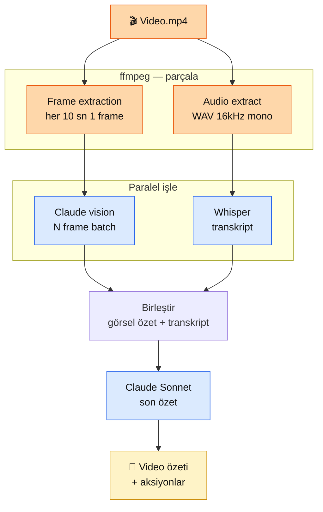

# 7.3 Video İşleme — Kare Çıkarma (Frame Extraction) + Claude Vision

<div class="ma-meta" markdown>
<div class="ma-meta-row" markdown>
<strong>Kim için:</strong>
<span class="ma-persona ma-persona-baslangic">🟢 başlangıç</span>
<span class="ma-persona ma-persona-is">🔵 iş</span>
<span class="ma-persona ma-persona-kisisel">🟣 kişisel</span>
</div>
<div class="ma-meta-row"><strong>⏱️ Süre:</strong> ~35 dakika</div>
<div class="ma-meta-row"><strong>📋 Önkoşul:</strong> 7.1 (Claude vision) + 7.2 (ses pipeline) okundu. Bir test video (30 sn - 5 dk MP4, Türkçe konuşma içerirse bonus).</div>
<div class="ma-meta-row"><strong>🎯 Çıktı:</strong> Video → frame extraction (ffmpeg) → Claude vision batch → özet pipeline kuruldu. Ses varsa paralel Whisper transcribe. "10 dk video → 30 sn okuma özeti" bir dakikanın altında. Maliyet tahmini net. Anthropic henüz native video API sunmuyor; frame-based yaklaşım 2026-2027 standart.</div>
</div>

!!! tip "Yabancı kelime mi gördün?"
    **Kare (frame)** = videonun tek bir görüntüsü; 1 saniye video ~30 kare. **Kare hızı (frame rate / FPS)** = saniyede kare sayısı; 24/30/60 yaygın. **Anahtar kare (keyframe / I-frame)** = video sıkıştırmasında temel referans kare; önemli görsel değişim noktaları. **Sahne tespiti (scene detection)** = sahne değişimlerini otomatik bulma. **ffmpeg** = video/ses işlemenin ölçünlü komut satırı aracı, açık kaynak; 2025'te v7.1 yayımlandı. **Örnekleme (sampling)** = videodan belli aralıkla kare çıkarma (her saniye, her sahne değişimi). **PySceneDetect** = sahne sınırlarını otomatik bulan Python paketi; histogram veya içerik tabanlı. **Twelve Labs** = video için özel temel model; anlamsal arama (semantic search) + sahne sınıflandırma; Marengo + Pegasus modelleri. **Video token'ı** = Gemini 2.5 Pro saniye başına ~258 token sayar; 1 saatlik video ~930K token, 1M bağlamına sığar.

## Neden bu sayfa?

Video, multimodal'ın 3. boyutu. 7.1 görsel + 7.2 ses + 7.3 video = tam multimodal yığını. Somut kullanımlar:

- Toplantı kaydı → katılımcı listesi + konu başlıkları + aksiyon maddeleri
- Eğitim videosu → otomatik ders özeti + sınav (quiz) üretimi
- Güvenlik kamera kaydı → olay özetleme, tehdit tespiti
- YouTube içeriği → altyazı + öne çıkan anlar + sosyal medya taslakları

**Anthropic'in yerleşik (native) video API'si henüz yok** (2026 Nisan). Claude Sonnet 4.6 / Opus 4.7 **bir istekte 20 görsele kadar** alır; videoyu **karelere böl**, kareleri Claude'a ver, özet al. Bu örüntü Claude tarafında 2026-2027 standart. Karşılaştırma: **Gemini 2.5 Pro doğal video girdisi** kabul ediyor — 1M bağlamla 1 saatlik videoyu tek seferde işleyebilir (saniye başına ~258 token; 1 saat ≈ 930K token). Twelve Labs ise video için özel temel model sunuyor — Marengo (anlamsal arama) + Pegasus (sahne çözümleme); **Claude ile karşılaştırılabilir doğruluk**, ancak yığın işleme tarafında daha eniyilenmiş.

İkincisi: **Ses kısmı paralel.** Videoda konuşma varsa ffmpeg ile ses ayır → 7.2'deki Whisper boru hattı. Görsel + ses transkripti birlikte Claude'a → zengin özet.

Üçüncüsü: Bu sayfa **Bölüm 7'nin 3. sayfası**; sonraki 7.4 imza (model karşılaştırma). Platformun video tarafı kompakt — 1 sayfada temel + pratik.

## Video mimari — 3 paralel yol

<div class="ma-ekosistem" markdown>
<div class="ma-ekosistem-header">🗺️ Video → özet: görsel + ses paralel</div>



**2 paralel yol, 1 birleşim.** ffmpeg ile video fiziksel parçala, sonra görsel + ses ayrı AI servis, en son Claude tümünü birleştirip özet.

</div>

## Adım 1 — Frame extraction (ffmpeg)

### Kurulum

```bash
# Ubuntu/Debian
apt install ffmpeg

# macOS
brew install ffmpeg

# Python binding
pip install ffmpeg-python
```

### Her N saniyede 1 frame

```bash
# Her 10 saniyede 1 frame, 1280px wide (downscale)
ffmpeg -i video.mp4 \
  -vf "fps=1/10,scale=1280:-2" \
  -q:v 3 \
  frames/frame_%04d.jpg
```

- `-vf "fps=1/10"` = her 10 saniyede 1 frame
- `scale=1280:-2` = 1280 piksel wide, yükseklik oransal
- `-q:v 3` = JPG kalite (1-31, düşük=yüksek kalite)
- 5 dk video → ~30 frame

### Keyframe extraction (akıllı — sahne değişimi)

Her N saniye **sabit** sampling bazen alakasız frame verir (sabit sahne 100 frame aynı). Daha akıllı: **sahne değişimi** yakala:

```bash
ffmpeg -i video.mp4 \
  -vf "select='gt(scene,0.3)',scale=1280:-2" \
  -vsync vfr \
  frames/keyframe_%04d.jpg
```

`scene,0.3` eşiği — 0.3'ten büyük sahne değişimi olduğunda frame kaydet. 5 dk video → 10-30 keyframe (içeriğe göre).

**Pratik karma:**

```bash
# Hem zamanli hem scene bazlı
ffmpeg -i video.mp4 \
  -vf "select='gt(scene,0.25)+eq(pict_type,I)',scale=1280:-2" \
  -vsync vfr \
  frames/key_%04d.jpg
```

I-frame (keyframe) + scene change birleşim. Daha az ama dolu frame'ler.

### Python wrapper

```python
# pip install ffmpeg-python
import ffmpeg
from pathlib import Path

def extract_frames(video_path: str, output_dir: str = "frames",
                    fps: float = 0.1) -> list[Path]:
    """Her 1/fps saniyede 1 frame çıkar. fps=0.1 = her 10 sn."""
    Path(output_dir).mkdir(exist_ok=True)
    (
        ffmpeg
        .input(video_path)
        .filter("fps", fps=fps)
        .filter("scale", 1280, -2)
        .output(f"{output_dir}/frame_%04d.jpg", **{"q:v": 3})
        .overwrite_output()
        .run(quiet=True)
    )
    return sorted(Path(output_dir).glob("frame_*.jpg"))

frames = extract_frames("meeting.mp4", fps=0.1)
print(f"{len(frames)} frame çıkarıldı")
```

## Adım 2 — Audio extract + Whisper

Video'da konuşma varsa:

```bash
# Video'dan WAV ses ayır (16kHz mono, Whisper ideal)
ffmpeg -i video.mp4 \
  -ar 16000 -ac 1 -vn \
  audio.wav
```

Sonra 7.2'deki Whisper pipeline:

```python
from openai import OpenAI
openai = OpenAI()

with open("audio.wav", "rb") as f:
    transcript = openai.audio.transcriptions.create(
        model="whisper-1",
        file=f,
        language="tr",
        response_format="verbose_json",   # segment + timestamp
        timestamp_granularities=["segment"],
    )

# transcript.segments = [{start, end, text}, ...]
for s in transcript.segments[:5]:
    print(f"[{s['start']:.0f}-{s['end']:.0f}s] {s['text']}")
```

**`verbose_json`** — timestamp'lı segmentler. Frame'lerin görüntü zamanıyla **hizalama** yapabilirsin.

## Adım 3 — Claude vision batch

Tüm frame'leri tek Claude çağrısında ver:

```python
import anthropic
import base64
from pathlib import Path

client = anthropic.Anthropic()

def frame_to_content(frame: Path) -> dict:
    data = base64.b64encode(frame.read_bytes()).decode()
    return {
        "type": "image",
        "source": {
            "type": "base64",
            "media_type": "image/jpeg",
            "data": data,
        },
    }

def video_ozet(frames: list[Path], transcript_text: str) -> str:
    # Frame'leri text etiketleriyle interleave et
    content = []
    for i, frame in enumerate(frames[:30]):  # max 30 frame
        content.append({"type": "text", "text": f"Frame {i+1} ({i*10}s):"})
        content.append(frame_to_content(frame))

    # Sonuna transkript + prompt
    content.append({
        "type": "text",
        "text": f"""
SES TRANSKRIPT (tam):
{transcript_text[:8000]}

YAPILACAK:
1. Video konusu 1 cümle
2. Ana konuşmacılar (görsel + transkript uyumlu)
3. 5 aksiyon maddesi (kim yapacak?)
4. 3 önemli karar noktası
5. Genel ton (teknik / stratejik / sosyal)

Türkçe, JSON formatı:
{{"konu": "...", "konusmacilar": [...], "aksiyonlar": [...], "kararlar": [...], "ton": "..."}}"""
    })

    response = client.messages.create(
        model="claude-sonnet-4-6",
        max_tokens=2048,
        messages=[{"role": "user", "content": content}],
    )
    return response.content[0].text
```

**Kısıtlar:**

- Claude per request **100 image** desteği (2026 Nisan)
- Her image ~1500 token (7.1'de hesap) → 30 image = ~45K token input
- Toplam context 200K; 30-60 frame güvenli sınır
- 60+ frame için: batch'lere böl, her batch ayrı özet, sonunda meta-özet

## Tam pipeline — script

```python
# video_ozet.py
import sys
from pathlib import Path
import anthropic
from openai import OpenAI
import ffmpeg
import base64
import json

claude = anthropic.Anthropic()
openai = OpenAI()


def extract_frames(video: str, out: str, fps: float) -> list[Path]:
    Path(out).mkdir(exist_ok=True)
    (
        ffmpeg.input(video)
        .filter("fps", fps=fps).filter("scale", 1280, -2)
        .output(f"{out}/frame_%04d.jpg", **{"q:v": 3})
        .overwrite_output().run(quiet=True)
    )
    return sorted(Path(out).glob("frame_*.jpg"))


def extract_audio(video: str, out: str) -> Path:
    path = Path(out)
    (
        ffmpeg.input(video)
        .output(str(path), ar=16000, ac=1, vn=None)
        .overwrite_output().run(quiet=True)
    )
    return path


def transcribe(audio: Path) -> str:
    with open(audio, "rb") as f:
        r = openai.audio.transcriptions.create(
            model="whisper-1", file=f, language="tr",
            response_format="text",
        )
    return r


def summarize(frames: list[Path], transcript: str) -> dict:
    content = []
    for i, f in enumerate(frames[:30]):
        content.append({"type": "text", "text": f"Frame {i+1} ({i*10}s):"})
        data = base64.b64encode(f.read_bytes()).decode()
        content.append({
            "type": "image",
            "source": {"type": "base64", "media_type": "image/jpeg", "data": data},
        })
    content.append({
        "type": "text",
        "text": f"""SES TRANSKRIPT:\n{transcript[:8000]}\n\n
Türkçe JSON: {{"konu", "konusmacilar", "aksiyonlar", "kararlar", "ton"}}""",
    })
    r = claude.messages.create(
        model="claude-sonnet-4-6", max_tokens=2048,
        messages=[{"role": "user", "content": content}],
    )
    return json.loads(r.content[0].text)


def main(video_path: str) -> dict:
    frames = extract_frames(video_path, "frames", fps=0.1)
    audio = extract_audio(video_path, "audio.wav")
    transcript = transcribe(audio)
    return summarize(frames, transcript)


if __name__ == "__main__":
    sonuc = main(sys.argv[1])
    print(json.dumps(sonuc, ensure_ascii=False, indent=2))
```

**Kullanım:**

```bash
python video_ozet.py meeting.mp4
```

5 dakikalık video için: 30-45 saniye işlem, ~$0.15 maliyet.

## Maliyet — 3 senaryo

### Senaryo 1: 5 dk meeting kaydı

- Frame extraction: $0 (local ffmpeg)
- Audio transcription: 5 dk × $0.006 = **$0.03**
- Claude vision: 30 frame × 1500 token input = 45K token + 500 output
  - Input: 45K × $3/M = $0.135
  - Output: 0.5K × $15/M = $0.0075
  - **Vision toplam: $0.14**
- **Toplam: ~$0.17** per meeting

### Senaryo 2: 100 eğitim video/ay (ort 30 dk)

- Frame extraction: $0
- Transcription: 100 × 30 dk × $0.006 = **$18/ay**
- Vision: 100 × 150 frame × 1500 token = 22.5M input token
  - Input: 22.5M × $3/M = **$67.5/ay**
  - Prompt caching %90 indirim → **$6.75/ay**
- **Toplam: ~$25-85/ay** (caching dahil)

### Senaryo 3: 24/7 güvenlik kamerası (her 10 sn frame, ses yok)

- 1 gün = 86400 sn / 10 = 8640 frame
- Aylık 30 × 8640 = **259K frame**
- Vision: 259K × 1500 token = 388M token
  - Input: 388M × $3/M = **$1,166/ay** (gerçekçi)
  - Prompt caching → **~$120/ay**
- **Çok pahalı için optimize:**
  - Sahne değişimi sampling (her 10 sn yerine değişim olduğunda) → 10× azalt
  - Haiku kullan (Sonnet yerine) → 4× ucuz
  - **Optimize: $30-50/ay** — makul

## Video kullanım — 5 use case

### 1. Meeting özet + aksiyon üretimi

Yukarıdaki pipeline. Zoom/Meet kaydı → 1 sayfa özet + aksiyonlar. Slack'e post.

### 2. YouTube içerik özeti

Uzun video (1-2 saat) için:

- İlk 30 dk frame + transcript → 1. özet
- İkinci 30 dk → 2. özet
- Meta Claude ile **özet özeti** — 5 dakikada okunur

**Türkçe YouTube kreatörleri için değer:** "3 saatlik podcast'i 5 dakikada oku" — zaman tasarrufu.

### 3. Güvenlik kamera anormalik tespiti

```python
PROMPT = """Bu güvenlik kamera frame'lerini incele. Anormallik ara:
- Normal olmayan hareket (koşma, düşme)
- Tanıdık olmayan kişi
- Yangın / duman belirtisi
- Şüpheli paket

Her anormalikte timestamp + açıklama. Yoksa 'normal'."""
```

**Uyarı:** Yasal + etik sınır — KVKK kayıt izni, kişi yüz tanıma (ek yasa), kimin video'sunu analiz ediyorsun. Sadece yasal çerçevede.

### 4. Eğitim video quiz üretimi

Ders video → Claude özeti → 5 çoktan seçmeli soru. Öğrenciye video sonu otomatik kontrol.

```python
PROMPT = """Bu ders frame'lerini ve transkripti incele. 
Öğrenciler için 5 çoktan seçmeli soru üret:
- Her soru anahtar kavramı test etsin
- 4 seçenek (1 doğru, 3 gerçekçi yanlış)
- Doğru cevabı + neden açıkla

JSON format: [{"soru", "secenekler", "dogru", "aciklama"}]"""
```

### 5. Video özetinden sosyal post

YouTube / TikTok içerik kreatörleri için otomasyon:

- Video yüklendi → 3 farklı platform için post taslağı
- Twitter (280 char + hashtag)
- LinkedIn (uzun, profesyonel)
- Instagram (görsel öneri + caption)

## Whisper timestamp hizalama (ileri)

Frame timestamp + transcript segment timestamp **eşleştir**. Claude'a "12. frame'de söylenen şey" diye ayrıntılı sor:

```python
def align(frames: list[Path], segments: list[dict]) -> list[tuple]:
    """Her frame için o anda söylenen metni eşle."""
    aligned = []
    for i, f in enumerate(frames):
        frame_time = i * 10  # her 10 sn 1 frame
        # O zamanlı segment bul
        for seg in segments:
            if seg["start"] <= frame_time <= seg["end"]:
                aligned.append((f, seg["text"]))
                break
        else:
            aligned.append((f, ""))
    return aligned
```

Claude'a `content` olarak gönderirken:

```python
for frame, sozlu in aligned:
    content.append({"type": "text", "text": f"Söz: '{sozlu}'"})
    content.append({"type": "image", "source": {...}})
```

**Kalite sıçraması:** Claude "bu adam ekran paylaşımında kod yazıyordu, o sırada 'error handling' dedi" gibi görsel + ses senkron bağlantılar kurar.

## Türkçe video özel — fırsat ve sınır

**Fırsat:**

- Türkçe YouTube podcast + eğitim içeriği **büyük pazar** (2026'da 500K+ kreatör Türkiye'de, Stats.ai raporu)
- Otomatik altyazı + özet servisi boş — Anglo-Saxon startup'lar (Descript, Rev) Türkçe zayıf
- 9.6 İMZA projende "Türkçe video özet SaaS" iyi pozisyon

**Sınır:**

- Türkçe Whisper %85-95 (7.2'de detay) — ara düzeltme şart
- Claude vision Türkçe text-in-image (altyazılı video) OK ama kalite %80-90
- Lehçe/aksan (Karadeniz, Doğu) transkripsiyon sert düşüş

## CTO tuzakları — 8 video işleme hatası

| # | Tuzak | Sonuç | Doğru |
|---|---|---|---|
| 1 | Çok yüksek kare hızı | 1 dk video 1000+ kare → maliyet patlar | Varsayılan 1/10 sn; uzun için 1/30 |
| 2 | Anahtar kare filtresi yok | %90 aynı kare | Sahne değişimi filtresi |
| 3 | 4K kareleri ham göndermek | 15 MB / kare, API reddeder | `scale=1280` ile küçült |
| 4 | Sesi çıkarmayı unutmak | Eksik transkript | `ffmpeg -vn` ile ses ayır |
| 5 | Whisper + Claude hizalama yok | Bağlam kopuk | `verbose_json` + segmentler |
| 6 | Tek istekte 20+ kare | API hatası — limit aşımı | Batch (max 20) + ara meta özet |
| 7 | Güvenlik kamera KVKK | Hukuki yaptırım | Kayıt izni + yüz maskeleme |
| 8 | Prompt caching yok | 10 kat fatura | Sistem promptuna `cache_control` |

??? warning "Tipik video boru hattı hataları — şu durum şu çözüm"

    | Hata | Sebep | Çözüm |
    |---|---|---|
    | "Image limit exceeded" (>20 kare) | Tek istek 20 görsel sınırı | Batch'lere böl; her batch için ayrı çağrı + meta özet |
    | ffmpeg sahne tespiti çalışmıyor | Eski sürüm / filtergraph hatası | `ffmpeg -version` 6.x+ kontrol et; `select='gt(scene,0.3)'` doğru sözdizimi |
    | Claude Türkçe altyazıyı atlıyor | Görsel kalite düşük | `scale=1280:-2 -q:v 2` daha yüksek kalite |
    | Audio dosya çok büyük (>25 MB) | Whisper API sınırı | `ffmpeg -ac 1 -ar 16000 -b:a 64k` ile küçült veya parçala |
    | Bellek hatası 100+ kare çıkarınca | RAM doluyor | Disk'e yaz (`-y` overwrite); batch işleme |
    | "I-frame yok" hatası | Bazı dönüştürülmüş videolar I-frame içermez | `select='gt(scene,0.25)'` kullan, `eq(pict_type,I)` çıkar |

<div class="ma-anthropic-oz" markdown>
<div class="ma-anthropic-oz-header">📖 Anthropic bu konuyu nasıl anlatıyor — öz</div>

Anthropic Vision dokümantasyonu ve multimodal kullanım kılavuzu video'yu şöyle ele alır:

**1. Native video yok, frame-based yaklaşım resmi öneri.** Claude Messages API doğrudan video kabul etmez. Anthropic resmi öneri: **frame'lere ayır (ffmpeg), her frame'i ayrı image block olarak gönder**. Bir video içeriğini "N adet image + metadata" olarak Claude'a sunuyorsun. Anthropic cookbook'ta bu desen örneklendi.

**2. Frame frekansı kullanım senaryosuna bağlı.** Hareket ağırlıklı içerik için 1-2 FPS yeter (spor, trafik). Slayt/belge içerikli video için 0.2-0.5 FPS (her 2-5 saniyede bir frame) — çünkü aynı görsel çoğu frame'de tekrarlı, token israfı. Claude token sayacı her frame'i ayrı fatura der; frame stratejisi maliyetin %80'ini belirler.

**3. Audio ayrı bir pipeline — Whisper + Claude + resenkron.** Video'nun ses kısmı 7.2'deki pipeline (Whisper transcript). Claude hem frame'leri hem transcript'i aynı mesajda alabilir; Anthropic bu multimodal birleşimi "video understanding" senaryosu olarak cookbook multimodal klasöründe gösteriyor.

**4. Yerleşik (native) video desteği yol haritası belirsiz.** Anthropic News'te 2025-2026 boyunca yerleşik video uç noktası için somut açıklama yok. **Gemini 2.5 Pro doğal video girdisi kabul ediyor** — saatlerce videoyu tek seferde işleyebilir; bu konuda Claude'a karşı mevcut avantaj. Anthropic akıl yürütme odaklı kalmayı seçti. Bu yüzden Claude tarafında kare bazlı (frame-based) desen **kısa-orta vadede kalıcı**.

<div class="ma-anthropic-oz-kaynak" markdown>
**Kaynak:** [platform.claude.com — Vision](https://platform.claude.com/docs/en/build-with-claude/vision) (EN, ~12 dk) + [Anthropic Cookbook — multimodal](https://github.com/anthropics/claude-cookbooks/tree/main/multimodal) (Jupyter, EN). Image block yapısı + batch frame deseni örnekleri.
</div>
</div>

## Anthropic video geleceği

**2026 Nisan durum:** Claude native video API yok. Frame-based pattern standart.

**Öngörüm (kendi bahsim):** 2027'de Anthropic native video input ekler (%55 olur). Temporal reasoning (video'da ne oldu, sırasıyla) için frame-based yetmiyor — gerçek video model ihtiyacı büyüyor.

**Alternatifler:**

- **Google Gemini** 2026'da uzun video (1 saat+) native destekleyen tek model
- **OpenAI** 2025'te video modeli araştırma yayınladı, public erişim yok
- **Açık kaynak:** LLaVA-Video, Video-LLaMA, Qwen2-VL (Çin kökenli, video native)

**Pratik karar:** 2026'da Claude frame-based + Whisper ses hibrit **güvenli seçim**. Gemini video native avantaj ama Türkçe + ekosistem + fiyat üçlüsü Claude'u önde tutar.

## Çıktı kanıtları — 3 kanıt

<div class="ma-cikti-kaniti" markdown>
<div class="ma-cikti-kaniti-header">📏 Çıktı — 3 kanıt</div>

**1. 5 dk test video özeti:**

Kendi bir meeting/vlog/eğitim video (5 dk) → yukarıdaki pipeline → JSON özet. `muhendisal-notlarim/bolum-7/03-video/ilk-test.md` kaydet.

**2. Maliyet hesabı:**

Kendi senaryoyu (meeting / YouTube / güvenlik) için aylık maliyet tahmini. Prompt caching ile/siz kıyas.

**3. Timestamp hizalama deneyi:**

`align()` fonksiyonu ile frame-transcript eşleme. Claude'a "frame 5'te söylenen: X, görselde görünen: Y" formatında sor — zengin yorum al.

</div>

## Görev — 45 dk ilk video pipeline

<div class="ma-gorev" markdown>
<div class="ma-gorev-header">🎯 Görev — 5 dk video → 30 sn özet</div>

1. Test video bul — kendi kayıt veya YouTube'dan 5 dk Türkçe içerik (`yt-dlp` ile indir).
2. ffmpeg kur + frame extraction test (her 10 sn 1 frame).
3. Audio extract + Whisper transcribe.
4. Claude vision batch ile özet.
5. `video_ozet.py` script çalışır.
6. `muhendisal-notlarim/bolum-7/03-video/sonuc.json` commit.

**Başarı kriteri:** 45 dk sonunda 5 dk video için JSON özet elinde. 9.6 İMZA projeye zemin kurulmuş.

</div>

<div class="ma-neden-sonuc" markdown>
<div class="ma-neden-sonuc-header">🔗 Birlikte okuma — neden ne oldu</div>

<ol class="ma-neden-sonuc-zincir" markdown>
<li>**A → B:** Video multimodal 3. boyut; Anthropic native API yok → frame-based pattern. Bu yüzden **çözüm yolu kendine özgü.**</li>
<li>**B → C:** 2 paralel yol: ffmpeg frame + audio; Claude vision + Whisper; sonunda meta birleşim. Bu yüzden **paralel işleme süreyi kısaltır.**</li>
<li>**C → D:** Frame extraction: fps sampling + keyframe (scene change) + karma yaklaşım. Bu yüzden **strateji içerik türüne göre seçilir.**</li>
<li>**D → E:** Audio extract WAV 16kHz mono → Whisper; verbose_json ile timestamp'lı segment. Bu yüzden **timestamp hizalama bağlamı zenginleştirir.**</li>
<li>**E → F:** Claude vision batch 30-60 frame safe; 100+ için batch + meta. Bu yüzden **büyük video bölünerek işlenir.**</li>
<li>**F → G:** 5 use case: meeting / YouTube / güvenlik / eğitim quiz / sosyal post. Bu yüzden **senaryo yelpazesi geniş.**</li>
<li>**G → H:** Maliyet: 5 dk video $0.17; 100 video/ay ~$25-85. Bu yüzden **maliyet yönetilebilir.**</li>
<li>**H → I:** Timestamp hizalama — frame ile transcript segment eşle; Claude'a zengin bağlam. Bu yüzden **hizalama kaliteyi artırır.**</li>
<li>**I → J:** Türkçe fırsat (YouTube pazar); sınır (Whisper %85+ aksan sert). Bu yüzden **Türkçe gerçekçi beklenti şart.**</li>
<li>**J → K:** Anthropic 2027'de native video (%55 bahis); Gemini şu an uzun video önde. Bu yüzden **ekosistem takip edilmeli.**</li>
</ol>

<div class="ma-neden-sonuc-sonuc" markdown>
**Sonuç:** Video pipeline kuruldu — frame + audio + Claude + transcript + özet. Sonraki (7.4 İMZA): Claude vs GPT-4V vs Gemini vision karşılaştırma — model seçim refleksi.
</div>
</div>

<div class="ma-sonraki" markdown>
<div class="ma-sonraki-header">➡️ Sonraki adım</div>

**[7.4 Vision-Language Karşılaştırma →](04-vision-language.md)** — Bölüm 7 İMZA. Claude + GPT-4V + Gemini + açık kaynak Qwen2-VL, 5 benchmark, model seçim matrisi.

← [7.2 Ses TTS/STT](02-ses.md) &nbsp;|&nbsp; [Bölüm 7 girişi](index.md) &nbsp;|&nbsp; [Ana sayfa](../index.md)

**Pekiştirme:** [ffmpeg official docs](https://ffmpeg.org/documentation.html) + [yt-dlp GitHub](https://github.com/yt-dlp/yt-dlp) + [Anthropic Cookbook video notebook](https://github.com/anthropics/claude-cookbooks/tree/main/multimodal). Üçü 2 saatte; video pipeline refleksi yerleşir.
</div>
