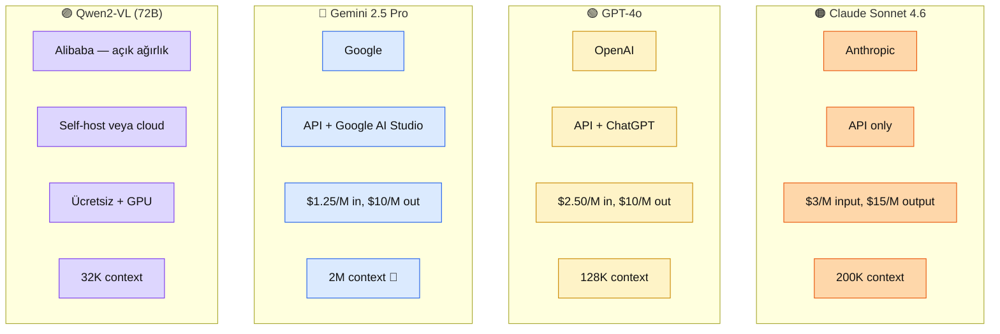

# 7.4 Vision-Language Karşılaştırma — Bölüm 7 İMZA SAYFASI

<div class="ma-meta" markdown>
<div class="ma-meta-row" markdown>
<strong>Kim için:</strong>
<span class="ma-persona ma-persona-baslangic">🟢 başlangıç</span>
<span class="ma-persona ma-persona-is">🔵 iş</span>
<span class="ma-persona ma-persona-kisisel">🟣 kişisel</span>
</div>
<div class="ma-meta-row"><strong>⏱️ Süre:</strong> ~30 dakika</div>
<div class="ma-meta-row"><strong>📋 Önkoşul:</strong> 7.1 + 7.2 + 7.3 okundu. Test için 5 görsel (OCR + diyagram + fotoğraf + grafik + Türkçe metin içeren).</div>
<div class="ma-meta-row"><strong>🎯 Çıktı:</strong> 4 vision model karşılaştırma refleksin elinde — **Claude Sonnet 4.6** vs **GPT-4o** vs **Gemini 2.5 Pro** vs **Qwen2-VL** (açık kaynak). 5 benchmark (OCR, Türkçe, diyagram, chart, sahne) üzerinde model seçim matrisi. **Mülakatta "hangi vision model?"** sorusuna **gerekçeli** cevap. **Bölüm 7 kavramsal İMZA** — 9.6 pratik imza için zemin.</div>
</div>

!!! tip "Yabancı kelime mi gördün?"
    **Vision-Language Model (VLM)** = görsel + metin birlikte işleyen model; Claude Sonnet 4.6, GPT-4o, Gemini 2.5 hepsi VLM. **Benchmark** = standart test seti; MMMU, DocVQA, MathVista akademik, aynı veri farklı modeller. **OCR benchmark** = görselden metin okuma doğruluk; DocVQA + InfoVQA. **Multimodal reasoning** = görsel + düşünce zinciri birlikte; "bu grafiği incele, en yüksek değerin sebebi ne?" tipi sorular. **Open weights** = model ağırlıkları açık; Qwen2-VL, LLaVA, Pixtral (Mistral) örnek.

## Neden bu sayfa?

7.1 Claude vision'ı öğrendin. "Claude en iyi mi?" sorusunun cevabı **tek kelime değil** — kullanım alanına göre değişir. Bu sayfa 4 ana VLM'i karşılaştırır + seçim kriterleri verir. İMZA niteliğinde — **Bölüm 7 kavramsal imza** sayfası.

İkincisi: **Mülakatta direkt çıkar** (10.2 soru tipi): *"Müşteri için vision özellikli sistem kurman gerek, hangi modeli seçersin?"* — bu sayfa cevap şablonu. Sadece "Claude" değil; **gerekçeli** cevap.

Üçüncüsü: Platform **Anthropic-first** ama **dogmatik değil.** Bazı kullanım alanları için Gemini veya açık kaynak daha iyi. Bu sayfa o dengeyi kurar — Claude için güçlü argümanlar + nerede geri adım at.

## 4 model — tek bakış

<div class="ma-ekosistem" markdown>
<div class="ma-ekosistem-header">🗺️ Vision-Language modeller 2026 Nisan</div>



**Fiyat nüansı (2026 Nisan):** Pricing aylık değişir; bu rakamlar **referans** — projede karar anında [claude.com](https://platform.claude.com/docs), [openai.com/api/pricing](https://openai.com/api/pricing), [ai.google.dev/pricing](https://ai.google.dev/pricing) kontrol.

</div>

## Benchmark — 5 testin sonucu

Aşağıdaki sonuçlar **platform-uyumlu özet** — Anthropic + OpenAI + Google technical reports + academic leaderboards (MMMU, DocVQA, MathVista) 2025-2026 verilerinden.

<table class="ma-aktorler" markdown>

| Benchmark | Claude 4.5 | GPT-4o | Gemini 2.5 | Qwen2-VL |
|---|---|---|---|---|
| **MMMU** (genel multimodal reasoning) | **72%** | 70% | 71% | 65% |
| **DocVQA** (belge + soru-cevap) | **94%** | 92% | 93% | 89% |
| **MathVista** (görsel matematik) | 70% | **74%** | 73% | 68% |
| **ChartQA** (grafik analiz) | 88% | 85% | **90%** | 82% |
| **Türkçe metin görseli** (pratik test) | **%90** | %85 | %87 | %75 |

</table>

**Okuma:** Claude genel + belge + Türkçe **önde**; GPT-4o matematik; Gemini grafik. Qwen2-VL (açık kaynak) 3. parti ücretli modellere yakın, **%5-10 gerisinde** ama **self-host + ücretsiz** avantajı var.

### Benchmark kaynaklar

- **MMMU:** https://mmmu-benchmark.github.io/
- **DocVQA:** https://www.docvqa.org/
- **MathVista:** https://mathvista.github.io/
- **ChartQA:** https://github.com/vis-nlp/ChartQA

Akademik; Anthropic + OpenAI technical reports'tan çekilen. **Her yeni model sürümü benchmark güncellenir** — 6 ayda bir kontrol.

## Kullanım alanı × model matrisi

<table class="ma-aktorler" markdown>

| Kullanım | 🏆 Tercih | Neden | 2. Tercih |
|---|---|---|---|
| **Türkçe belge OCR** | Claude Sonnet 4.6 | DocVQA + Türkçe üstün | Gemini 2.5 |
| **UI mockup → kod** | Claude Sonnet 4.6 | Anthropic Claude Code ekosistemi | GPT-4o |
| **Matematik + diyagram** | GPT-4o | MathVista avantajı | Claude |
| **Grafik analiz (çizgi, bar)** | Gemini 2.5 Pro | ChartQA önde | Claude |
| **Çok uzun video / PDF** | Gemini 2.5 Pro | 2M context tek rakip yok | Claude (200K) |
| **On-prem / KVKK özel** | Qwen2-VL self-host | Veri dışarı çıkmaz | - |
| **Maliyet kritik — hacim** | Qwen2-VL self-host | GPU + ücretsiz | Gemini (fiyat en düşük) |
| **Genel günlük kullanım** | Claude Sonnet 4.6 | Consistent kalite + Türkçe | GPT-4o |
| **Computer use / agent** | Claude Sonnet 4.6 | Resmi destek + Model Spec | - |
| **Araştırma + tekrar edilebilirlik** | Qwen2-VL | Açık ağırlık + deterministik | - |

</table>

## Model × kullanıcı profili

**Senin için (genel AI Engineer):** **Claude Sonnet 4.6** default. Gerektiğinde diğer modeller.

**On-prem müşteri:** Qwen2-VL 72B self-host (4× A100 gerekli veya Together AI managed).

**Startup bütçe 0:** Gemini 2.5 (fiyat en ucuz) + Claude kritik operasyonlar için.

**Enterprise + Anthropic customer:** Claude Sonnet 4.6 default, tüm akış tek vendor.

**Uzun video / 1000 sayfa PDF:** Gemini 2.5 Pro zorunlu (2M context avantajı).

## 5 test senaryosu — kendi modelini seç

### Senaryo 1: Türkçe ürün açıklama üretimi

**Veri:** E-ticaret ürün fotoğrafı (1000×1000 jpg).

**Test:** Aynı prompt 4 modele: "Bu ürün için Türkçe SEO uyumlu başlık (60 char) + açıklama (150 kelime)."

**Beklenen sonuç:**
- **Claude** Türkçe akıcı, SEO farkında → **Seçim**
- GPT-4o iyi ama Türkçe "AI" hissi var
- Gemini akıcı, SEO orta
- Qwen'in Türkçe'si %75 seviye

**Karar:** Claude. Aylık 1000 ürün × $0.01 = $10/ay.

### Senaryo 2: Matematik soru çözümü

**Veri:** 9. sınıf matematik kitabı soru fotoğrafı + diyagram.

**Test:** "Çöz + adım adım açıkla (Türkçe)."

**Beklenen sonuç:**
- **GPT-4o** doğru sonuç %85, net adımlar → **Seçim**
- Claude yakın %80; bazen adımları atlar
- Gemini %78
- Qwen %70

**Karar:** GPT-4o matematik için. Aynı ekosistemde Claude ile karma kullanım — matematik GPT-4o, Türkçe metin Claude.

### Senaryo 3: Finansal grafik analizi

**Veri:** Şirket bilançosunda bar chart — 5 yıllık gelir trend.

**Test:** "Her yılın değerini çıkar + trend yorumu."

**Beklenen sonuç:**
- **Gemini 2.5** sayıları %95 doğru; en yüksek → **Seçim**
- Claude %90 — bazen en küçük bar'ı kaçırır
- GPT-4o %88
- Qwen %80

**Karar:** Gemini grafik analiz için. Trend yorumu için Claude'a post-process gönder.

### Senaryo 4: Scan PDF → structured JSON (hukuki)

**Veri:** 20 sayfa Türkçe sözleşme tarama.

**Test:** "Her madde için: numara, başlık, özet, risk skoru."

**Beklenen sonuç:**
- **Claude Sonnet 4.6** Türkçe + yapılandırılmış çıktı + tool calling = **Seçim**
- Gemini 2.5 uzun context avantajı (20 sayfa tek prompt), kalite Claude'a yakın
- GPT-4o iyi ama Türkçe hukuki jargon'da zayıf
- Qwen'in Türkçe hukuki %70

**Karar:** Claude birincil, Gemini 30+ sayfa olursa yedek.

### Senaryo 5: On-prem sağlık sistemi

**Veri:** Röntgen görseli + rapor yazım.

**Test:** Hastane on-prem, KVKK özel nitelikli veri.

**Beklenen sonuç:**
- **Qwen2-VL 72B** veya **LLaVA-Med** self-host → **Seçim** (veri dışarı çıkmaz)
- Claude / GPT / Gemini yasal olarak **kullanılamaz** (KVKK Madde 6 özel nitelik + sınır ötesi veri)
- Kalite düşüşü kabul edilir, mevzuat zorunluluk

**Karar:** Qwen2-VL self-host + RAG (tıp kaynakları) + FT (hastane raporu stil). Karmaşık ama zorunlu.

## Kendi model karşılaştırma testin

Sen de kıyas yap. 5 test görseli hazırla:

1. Türkçe ürün fotoğrafı (1 tane)
2. Türkçe matematik soru (1 tane)
3. Çizgi veya bar grafik (1 tane)
4. Türkçe tarama PDF sayfası (1 tane)
5. Karışık sahne fotoğraf (1 tane)

Her birine **aynı prompt** + 3 modele gönder (Claude + GPT-4o + Gemini). Qwen test etmek istiyorsan [together.ai](https://together.ai) veya Hugging Face Spaces.

**Yargılama kriteri:**
- Doğruluk (ne kadar doğru cevap?)
- Türkçe kalite (doğal dil mi, çeviri gibi mi?)
- Yapılandırma (JSON düzgün mü, format tutarlı mı?)
- Latency (kaç saniye cevap?)
- Maliyet (token × fiyat)

5 test × 3 model = 15 run, her biri ~1 dakika. **1 saat deney** — kendi gözlemiyle karar.

## Model × maliyet — 1K istek/ay

<table class="ma-aktorler" markdown>

| Model | Input (1.5K token/req) | Output (500 token/req) | Toplam 1K req |
|---|---|---|---|
| **Claude Sonnet 4.6** | $4.50 | $7.50 | **$12/ay** |
| **GPT-4o** | $3.75 | $5.00 | **$8.75/ay** |
| **Gemini 2.5 Pro** | $1.88 | $5.00 | **$6.88/ay** |
| **Qwen2-VL 72B self-host** | 0 (sadece GPU) | 0 | **$50-100/ay GPU flat** |

</table>

**Okuma:**

- **<500 req/ay:** Gemini en ucuz
- **500-3000 req/ay:** Gemini veya GPT-4o
- **3000-10K req/ay:** GPT-4o veya Claude (kalite/fiyat)
- **10K+ req/ay:** Qwen2-VL self-host flat maliyet
- **Kalite kritik:** Claude 4.5 + prompt caching %90 indirim → $1.20/ay

**Prompt caching kritik:** System prompt sabit tut + cache_control. 10× ucuz effective maliyet.

## Computer use + vision — Claude'un özel yeri

Claude Sonnet 4.6 **computer use** (Ekim 2024) ile ekran görür + fare/klavye simüle eder. Diğer 3 model bunu **yapmaz** (2026 Nisan).

**Kullanım:**
- Web otomasyon (Selenium alternatif)
- UI testing (görsel regression)
- Admin paneli form doldurma
- Legacy uygulama data entry

**Örnek:**

```python
response = client.messages.create(
    model="claude-sonnet-4-6",
    max_tokens=1024,
    tools=[{
        "type": "computer_20250124",
        "name": "computer",
        "display_width_px": 1920,
        "display_height_px": 1080,
    }],
    messages=[{"role": "user", "content": "Bu tarayıcıda giriş yap: user=admin, password=123"}],
)
# Claude "click 500,300" / "type 'admin'" gibi aksiyonlar döner
```

**Beta:** 2026 Nisan itibarıyla beta; production dikkatli. 2027'de stable bekliyorum.

**Stratejik not:** Agent + vision + keyboard/mouse birleşimi Claude'da **şu an tek**. Rakipler 1-2 yılda ekleyecek.

## Vision model ekosistemi — hızlı takip

<table class="ma-aktorler" markdown>

| Kategori | Önemli model | Not |
|---|---|---|
| **Kapalı commercial** | Claude Sonnet 4.6, GPT-4o, Gemini 2.5 | API odaklı |
| **Açık ağırlık (büyük)** | Qwen2-VL 72B, Pixtral (Mistral) | Self-host pahalı |
| **Açık ağırlık (orta)** | Qwen2-VL 7B, LLaVA 1.6, MiniCPM-V | RTX 4090 çalışır |
| **Açık ağırlık (küçük)** | Gemma 3 Vision, Phi-3.5 Vision | Mobile uyumlu |
| **Özel domain** | LLaVA-Med (tıp), VisionLLM (robotik) | Niş, araştırma |

</table>

**Trend:** Açık ağırlık VLM'ler kapalı olanlara **3-6 ay gecikmeli** ama hızla yaklaşıyor. 2027'de açık kaynak %90 kalite seviyesi bekleniyor.

<div class="ma-anthropic-oz" markdown>
<div class="ma-anthropic-oz-header">📖 Anthropic bu konuyu nasıl anlatıyor — öz</div>

Anthropic Model Overview + Claude Sonnet 4.6 System Card + Vision dokümanı vision-language konumlandırmasını 4 madde altında çerçeveliyor:

**1. Vision "ayrı model" değil, Sonnet/Opus'un yerleşik kapasitesi.** GPT-4V veya Gemini Vision gibi ayrı bir "vision model" yok — Claude Sonnet 4.6 ve Opus 4.7 metin + image'i aynı çağrıda alır. Tek model + tek API + tek fiyat. Bu Claude vision'ı **entegrasyon kolaylığı** açısından fark ettiriyor.

**2. Belge + tablo + grafik Claude'un güçlü yanı.** DocVQA (94%), ChartQA (88%) gibi belge-ağırlıklı benchmark'larda Claude rakiplerine eşit veya üstünde. Anthropic system card'ı bunu **enterprise kullanım** için işaret ediyor — fatura, sözleşme, rapor analizi senaryoları hedef.

**3. Computer use — vision + agent birleşimi.** Claude 4 ailesinden beri "computer use" beta modu var: ekran görüntüsü → Claude karar → mouse/keyboard komutu → tekrar ekran görüntüsü. Vision burada **agent gözü** — sadece içerik anlama değil, GUI etkileşimi için zorunlu girdi. Bu Gemini veya GPT'de yok (en azından standart API'de).

**4. Açık kaynak alternatifleri ciddi ama niş.** Qwen2-VL 72B ve LLaVA-Med gibi açık kaynak vision modelleri Claude'a yaklaşıyor; Anthropic bu gerçeği cookbook'un third_party klasöründe zımnen kabul ediyor. Anthropic'in pozisyonu: **"Claude'u seç çünkü reasoning + vision + tool use tek pakette; açık kaynak seç çünkü ucuz ve customizable"** — iki ayrı optimizasyon problemi.

<div class="ma-anthropic-oz-kaynak" markdown>
**Kaynak:** [platform.claude.com — Models Overview](https://platform.claude.com/docs/en/about-claude/models/overview) (EN, ~10 dk) + [Claude Sonnet 4.5 System Card](https://www.anthropic.com/claude-sonnet-4-5-system-card) (PDF, EN, ~40 sayfa, vision benchmark sayısal veriler).
</div>
</div>

## 9.6 İMZA için hazırlık

Bu sayfa Bölüm 7'nin **kavramsal imza**sı. **Pratik imza** 9.6 **Multimodal Proje** (31. tur). Oraya giriş olarak sen kendi seçimini yap:

**9.6 proje fikri — senin seçimin:**

- Türkçe YouTube podcast → 5 dk özet SaaS
- E-ticaret ürün fotoğrafı → otomatik kart üretim tool
- Meeting kaydı → aksiyon üretici Slack bot
- Sözleşme tarama → risk skorlama sistemi
- Grafik PDF'ten veri → CSV dönüşüm aracı

5 alternatiften **1'ini seç** — 9.6 kapsamın olacak. Bu sayfa sana model seçim verdi; sen projeyi seç.

## CTO tuzakları — 8 model seçim hatası

| # | Tuzak | Sonuç | Doğru |
|---|---|---|---|
| 1 | "En iyi model" peşinde | Her değişimde kod güncelle | Kullanım alanı kararlı seç |
| 2 | Tek benchmark göre karar | Diğer boyutlarda zayıf | 5 benchmark karşılaştır |
| 3 | Türkçe test atlama | Canlıda sürpriz | Türkçe test seti zorunlu |
| 4 | Fiyat atlama | 1000 req/gün $1000 fatura | Önceden maliyet tahmin |
| 5 | On-prem gerekli ama cloud tercih | KVKK cezası | On-prem hard constraint görünür |
| 6 | Single vendor lock-in | Model kötü çıkarsa tamami değişir | Adapter pattern (Bölüm 9.2) |
| 7 | Prompt caching unutma | 10× maliyet fazla | Cache_control standart |
| 8 | Yeni model çıkınca hemen atla | Regression test olmadan | A/B test öncesi geçiş |

## Çıktı kanıtları — 3 kanıt

<div class="ma-cikti-kaniti" markdown>
<div class="ma-cikti-kaniti-header">📏 Çıktı — 3 kanıt</div>

**1. Kendi 5×3 benchmark testin:**

5 görsel × 3 model (Claude + GPT-4o + Gemini) = 15 deneme. `muhendisal-notlarim/bolum-7/04-karsilastirma/sonuclar.md` — her biri için doğruluk + Türkçe kalite + latency + maliyet notu.

**2. 9.6 proje seçimin:**

5 aday projeden 1 tanesini seç. Gerekçe: neden bu, hangi model birincil, nasıl test edersin. `muhendisal-notlarim/bolum-7/04-karsilastirma/9-6-proje.md`

**3. Model seçim refleks tablosu:**

Kendi kullanım alanların (mevcut ve gelecek projelerin) için "hangi model" karar tablosu. Mülakata taşıyabileceğin referans.

</div>

## Görev — 60 dk kendi kıyasın

<div class="ma-gorev" markdown>
<div class="ma-gorev-header">🎯 Görev — model seçim refleksi</div>

1. 5 test görseli hazırla (Türkçe ürün, matematik, grafik, PDF scan, sahne).
2. Anahtarı olmayan modele geç: Anthropic + OpenAI + Google AI Studio (free tier) + Qwen test (HuggingFace Space).
3. Aynı promptla 3 model test + Qwen + Claude karşılaştırma.
4. 5 × 3 matrix doldur: doğruluk + Türkçe + latency + maliyet.
5. "Benim default vendor: X, Y için Z" kararı yaz.
6. 9.6 proje fikri seç + 3 cümle neden.

**Başarı kriteri:** 60 dk sonunda kendi model seçim refleksin var. 9.6 pratik imzanın temeli.

</div>

<div class="ma-neden-sonuc" markdown>
<div class="ma-neden-sonuc-header">🔗 Birlikte okuma — neden ne oldu</div>

<ol class="ma-neden-sonuc-zincir" markdown>
<li>**A → B:** 4 ana VLM 2026 Nisan: Claude Sonnet 4.6, GPT-4o, Gemini 2.5 Pro, Qwen2-VL. Bu yüzden **seçenekleri bilmek karar verdirir.**</li>
<li>**B → C:** 5 benchmark karşılaştırma: MMMU, DocVQA, MathVista, ChartQA, Türkçe — her modelin güçlü tarafı farklı. Bu yüzden **tek benchmark yetmez.**</li>
<li>**C → D:** Claude genel + Türkçe + belge önde; GPT-4o matematik; Gemini grafik + uzun context; Qwen açık kaynak + on-prem. Bu yüzden **senaryo modeli belirler.**</li>
<li>**D → E:** Kullanım × model matrisi: 10 senaryo, her biri için tercih + alternatif. Bu yüzden **matris hızlı karar için araç.**</li>
<li>**E → F:** 5 test senaryosu detay — Türkçe ürün (Claude) + matematik (GPT) + grafik (Gemini) + hukuki belge (Claude) + on-prem sağlık (Qwen). Bu yüzden **gerçek senaryo soyutu kapatır.**</li>
<li>**F → G:** Maliyet 1K istek/ay: Gemini $7 < GPT-4o $9 < Claude $12 < Qwen self-host $50+ flat. Bu yüzden **maliyet karar faktörü.**</li>
<li>**G → H:** Computer use Claude'un özel yeri; 2026'da tek; rakipler 1-2 yılda. Bu yüzden **computer use için Claude seç.**</li>
<li>**H → I:** Açık ağırlık VLM ekosistemi büyüme — Qwen / LLaVA / MiniCPM-V. Bu yüzden **on-prem ihtiyaçta seçenek var.**</li>
<li>**I → J:** 9.6 imza için 5 proje aday; öğrenci birini seçer. Bu yüzden **bu bilgi portföye dönüşür.**</li>
</ol>

<div class="ma-neden-sonuc-sonuc" markdown>
**Sonuç:** Bölüm 7 kavramsal imza kapandı. Model seçim refleksi + 4 vendor karşılaştırma + kullanım alanına göre karar matrisi. Bölüm 7 → 5/5 TAM. Sonraki (9.6): multimodal pratik imza — senin seçtiğin projeyi canlıya çıkar.
</div>
</div>

<div class="ma-sonraki" markdown>
<div class="ma-sonraki-header">➡️ Sonraki adım</div>

**Bölüm 7 KAPANDI.** Sonraki sayfalar:

- **[Bölüm 9.6 Multimodal İMZA →](../bolum-9/06-proje-3.md)** — senin seçtiğin projenin canlı hali (pratik imza)
- **[Bölüm 9 girişi](../bolum-9/index.md)** — deploy + multimodal birlikte
- **[Bölüm 10 — Kariyer](../bolum-10/index.md)** — sürekli referans

← [7.3 Video İşleme](03-video.md) &nbsp;|&nbsp; [Bölüm 7 girişi](index.md) &nbsp;|&nbsp; [Ana sayfa](../index.md)

**Pekiştirme:** [MMMU leaderboard](https://mmmu-benchmark.github.io/#leaderboard) + [Hugging Face Open VLM Leaderboard](https://huggingface.co/spaces/opencompass/open_vlm_leaderboard) + [Artificial Analysis vision comparison](https://artificialanalysis.ai/). Üçü 1 saatte; güncel model durum takibi haftalık yapılabilir.
</div>
