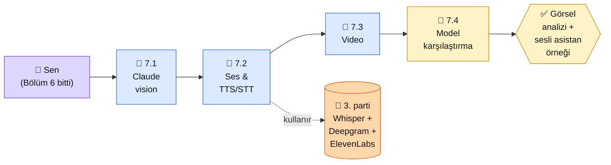

# Bölüm 7 — Multimodal

**Persona:** Bölüm 6'da ajan ve MCP'yi oturttun; metin dünyasından çıkıp görüntü/ses dünyasına bakmak istiyorsun · **Süre:** ~3 saat (4 sayfa) · **Önkoşul:** Bölüm 2 (Claude API), bir örnek görsel ve bir ses dosyası · **Çıktı:** Claude vision ile görsel analiz yapan örnek + sesli transkripsiyon iskeleti

## Neden bu bölüm?

**Multimodal 2025-2026'da yerleşti.** Claude artık sadece metin okumuyor — PDF'teki grafikleri yorumluyor (PDF native input desteği 2025'te eklendi: Messages API'sinde 32 MB / 100 sayfa, Files API'sinde 500 MB), fotoğrafları anlatıyor, diyagram çiziminden kod üretiyor. Projen "e-ticaret ürün resmi otomatik başlık" veya "öğrenci tahta fotoğrafından ders özeti" gibi somut yerlerde bu kabiliyeti kullanacak.

Niye 4 sayfa, daha az? Çünkü multimodal **API seviyesinde kolaydır** — `image` ya da `document` bloğunu JSON'a eklersin biter. Derinlik modelin sınırlarını anlamakta: ne görür, ne kaçırır, hangi çözünürlükte iyi çalışır, ses için hangi servise yönelmeli.

Üçüncüsü: Ses tarafında **Anthropic doğrudan dinlemiyor; üçüncü parti çözüm gerek.** Claude (2026 Nisan itibarıyla) ses input'u kabul etmiyor — STT (Whisper, Deepgram) ile yazıya dök, sonra Claude'a ver. Bu bölüm o akışı kurar.

## Bölüm 7 kısaca

**7.1 — Görüntü Modelleri.** Claude Sonnet 4.6 / Opus 4.7 / Haiku 4.5 vision. JPG/PNG/GIF/WEBP desteği, **5 MB / görsel + max 20 görsel / istek**, 8000 piksel uzun kenar üst sınır (içeride 1568 piksele yeniden boyutlanır). Base64 ile URL referansı. PDF native input (32 MB / 100 sayfa).

**7.2 — Ses ve TTS/STT.** Whisper (açık kaynak, kendi sunucunda veya OpenAI API), Deepgram (yönetilen), ElevenLabs (TTS kalite zirvesi), Fish Audio veya Replicate XTTS-v2 (Türkçe TTS). Seçim matrisi.

**7.3 — Video İşleme.** "Video → kare (frame) serisi → Claude analizi" deseni. Ücretsiz kare çıkarma (ffmpeg). Videonun 5-10 anahtar karesi üstünde çalışmak. Alternatif: **Gemini 2.5 Pro doğal video girdisi** kabul ediyor — Claude için ise frame-based desen kalıcı.

**7.4 — Vision-Language Modeller.** Claude vs GPT-5.5 (vision) vs Gemini 2.5 Pro karşılaştırma. OCR, diyagram okuma, sahne anlama kıyaslamaları (güncel veriler).

## Bu bölümün yol haritası

### Aktör tablosu

| Düğüm | Nerede | Ne iş yapıyor |
|---|---|---|
| 👤 **Sen** | Python + bir örnek görsel + bir ses dosyası | Vision çağrısı at, Whisper ile yazıya dök, Claude'a ver |
| 📄 **7.1 Vision** | Platform + Python | 3-4 görsel örnek: faturaya bak, diyagram oku, grafik yorumla |
| 📄 **7.2 Ses** | Platform + 3. parti API | Whisper ile STT, ElevenLabs ile TTS — karar matrisi |
| 📄 **7.3 Video** | Python + ffmpeg | 30 saniyelik video → 5 kare → Claude analiz |
| 🏁 **7.4 Karşılaştırma** | Platform (karar) | Claude vs GPT-5.5 vision vs Gemini 2.5 Pro — benchmark tablosu |
| 🎤 **3. parti servisler** | OpenAI API / Deepgram / ElevenLabs | Ses tarafı — Anthropic kapsamında değil |
| ✅ **Çıktı** | Repo `7-multimodal/` | 2 mini örnek: görsel analizi + sesli asistan |

## Bu bölüm bittiğinde elinde ne olacak

- **Claude vision refleksi:** Bir görsel veya PDF geldiğinde Claude'a verip analiz ettirme, sınırlarını bilme
- **STT + Claude boru hattı:** Ses dosyası → Whisper → metin → Claude cevabı. Sesli asistan iskeleti elinde
- **Video analiz deseni:** Kare çıkarma + Claude tek adımlı analiz mantığı — yeterince "video anlayan" sistem için
- **Model karşılaştırma:** Proje vision gerektirdiğinde Claude vs Gemini 2.5 vs GPT-5.5 seçimi gerekçeli yapılıyor
- **3. parti ses ekosistemi:** Whisper / Deepgram / ElevenLabs seçim ölçütü (maliyet + Türkçe kalitesi + gecikme)

📖 Anthropic bu bölümde ne der — öz

Multimodal'da Anthropic **kısmi güçlü:** vision'da iyi (Claude 4.x Sonnet), ses doğrudan yok. Dürüst pozisyon:

**1. Vision — [platform.claude.com/docs/en/build-with-claude/vision](https://platform.claude.com/docs/en/build-with-claude/vision).** Claude'un desteklediği formatlar, boyut limitleri, pratik en iyi uygulamalar. 7.1'deki kodlar bu sayfaya birebir uyar. JPG/PNG/GIF/WEBP, en çok 5 MB / görsel + max 20 görsel / istek, base64 veya URL. Türkçe metin içeren görsellerde OCR kalitesi belirgin (kıyaslamalar 7.4'te).

**2. PDF native input — [platform.claude.com/docs/en/build-with-claude/pdf-support](https://platform.claude.com/docs/en/build-with-claude/pdf-support).** 2025'te Claude tüm 4.x modelleri için PDF desteği eklendi: Messages API'sinde dosya başına 32 MB / 100 sayfa, Files API'sinde 500 MB. Metin + grafik + tabloyu tek seferde işler.

**3. Ses — Anthropic'in duruşu.** Claude ses dinlemiyor (2026 itibarıyla). "Ses için Whisper + metin olarak Claude'a ver" Anthropic'in önerdiği desen. Bu bölümün 7.2 yaklaşımı resmi öneriyle birebir uyumlu.

**4. Cookbook — vision örnekleri.** [claude-cookbooks/multimodal](https://github.com/anthropics/claude-cookbooks/tree/main/multimodal) notebook'ları — fatura okuma, grafik yorumlama, sahne tanıma. 7.1'de işlediğimiz örneklerin kaynağı.

**5. Video hakkında Anthropic'in şu andaki sınırı.** Claude doğrudan video input almıyor. "Kare çıkarma (frame extraction) + çoklu görsel" tek yol. Google Gemini 2.5 Pro **video native** kabul ediyor; Claude ile yapacaksan bu bölümün 7.3 desenine ihtiyacın var.

**Kaynak:** [platform.claude.com — Vision](https://platform.claude.com/docs/en/build-with-claude/vision) (İngilizce, ~10 dk). 7.1'den önce aç — görsel kabiliyetinin sınırları ve kalıpları buradan net oturur.

---

**Bir sonraki adım →** [7.1 Görüntü Modelleri](01-goruntu.md) (30 dk, Claude vision + ilk görsel analiz)

← [Bölüm 6 — Agents ve MCP](../bolum-6/index.md) &nbsp;|&nbsp; [Ana Sayfa](../index.md)

