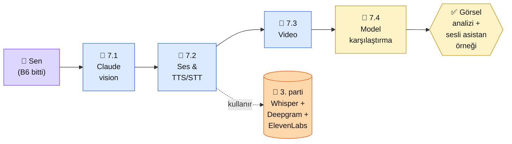

# Bölüm 7 — Multimodal

**Persona:** Bölüm 6'da agent ve MCP'yi oturttu, metin dünyasından çıkıp görüntü/ses dünyasına bakmak istiyor · **Süre:** ~3 saat (4 sayfa) · **Önkoşul:** Bölüm 2 (Claude API), bir örnek görsel ve ses dosyası · **Çıktı:** Claude vision ile görsel analiz yapan örnek + sesli transkripsiyon eşlikçisi

## Neden bu bölüm?

**Multimodal 2025-2026'da yerleşti.** Claude artık sadece metin okumuyor — PDF'teki grafikleri yorumluyor, fotoğrafları anlatıyor, diyagram çiziminden kod üretiyor. Projeniz "e-ticaret ürün resmi otomatik başlık" veya "öğrenci tahta fotoğrafından ders özeti" gibi somut yerlerde bu kabiliyeti kullanacak.

Niye 4 sayfa, daha az? Çünkü multimodal **API seviyesinde kolaydır** — image field'ı JSON'a eklersin biter. Derinlik modelin sınırlarını anlamakta: ne görür, ne kaçırır, hangi çözünürlükte iyi çalışır, ses için hangi servise yönlenmeli.

Üçüncüsü: Ses tarafında **Anthropic değil, üçüncü parti.** Claude doğrudan ses dinlemiyor — STT (Whisper, Deepgram) ile transkribe et, sonra Claude'a ver. Bu bölüm o akışı kurar.

## Bölüm 7 kısaca

**7.1 — Görüntü Modelleri.** Claude Sonnet 4.x vision. JPG/PNG/WEBP desteği, maksimum boyut, çözünürlük ayarı. 5MB limiti + 8000x8000 piksel. Base64 vs URL referansı.

**7.2 — Ses ve TTS/STT.** Whisper (açık kaynak, self-host veya OpenAI API), Deepgram (managed), ElevenLabs (TTS, kalite zirvesi), Fish Audio (TTS, Türkçe iyi). Seçim matrisi.

**7.3 — Video İşleme.** "Video → frame serisi → Claude analiz" deseni. Ücretsiz frame extraction (ffmpeg). Video'nun 5-10 anahtar frame'i üstünde çalışmak.

**7.4 — Vision-Language Modeller.** Claude vs GPT-4V vs Gemini vision karşılaştırma. OCR, diyagram okuma, sahne anlama benchmarkları (güncel veriler).

## Bu bölümün yol haritası

### Aktör tablosu

| Düğüm | Nerede | Ne iş yapıyor |
|---|---|---|
| 👤 **Sen** | Python + bir örnek görsel + ses dosyası | Vision çağrısı at, Whisper ile transkribe, Claude'a ver |
| 📄 **7.1 Vision** | Platform + Python | 3-4 görsel örnek: faturaya bak, diyagram oku, grafik yorumla |
| 📄 **7.2 Ses** | Platform + 3. parti API | Whisper ile STT, ElevenLabs ile TTS — karar matrisi |
| 📄 **7.3 Video** | Python + ffmpeg | 30 sn video → 5 frame → Claude analiz |
| 🏁 **7.4 Karşılaştırma** | Platform (karar) | Claude vs GPT-4V vs Gemini — benchmark tablosu |
| 🎤 **3. parti servisler** | OpenAI API / Deepgram / ElevenLabs | Ses tarafı — Anthropic kapsamında değil |
| ✅ **Çıktı** | Repo `7-multimodal/` | 2 mini örnek: görsel analiz + sesli asistan |

## Bu bölüm bittiğinde elinde ne olacak

- **Claude vision refleksi:** Bir görsel geldiğinde Claude'a verip analiz ettirme, sınırlarını bilme
- **STT + Claude pipeline:** Ses dosyası → Whisper → metin → Claude cevabı. Sesli asistan iskeleti elinde
- **Video analiz deseni:** Frame extraction + Claude tek-adımlı analiz mantığı — yeterince "video anlayan" sistem için
- **Model karşılaştırma:** Proje vision gerektirdiğinde Claude vs Gemini vs GPT seçimi gerekçeli yapılıyor
- **3. parti ses ekosistemi:** Whisper/Deepgram/ElevenLabs seçim kriteri (maliyet + Türkçe kalitesi + gecikme)

📖 Anthropic bu bölümde ne der — öz

Multimodal'da Anthropic **kısmi güçlü:** vision'da iyi (Claude 4.x Sonnet), ses doğrudan yok. Dürüst pozisyon:

**1. Vision — platform.claude.com/docs/en/docs/build-with-claude/vision.** Claude'un desteklediği formatlar, boyut limitleri, pratik best practices. 7.1'deki kodlar bu sayfaya birebir uyar. JPG/PNG/WEBP, max 5MB, base64 veya URL. Türkçe metin içeren görseller OCR'de iyi.

**2. Ses — Anthropic'in duruşu.** Claude ses dinlemiyor (2026 itibarıyla). "Ses için Whisper + metin olarak Claude'a ver" Anthropic'in önerdiği desen. Bu bölümün 7.2 yaklaşımı resmi öneriye uyar.

**3. Cookbook — vision örnekleri.** [claude-cookbooks/multimodal](https://github.com/anthropics/claude-cookbooks/tree/main/multimodal) notebook'ları — fatura okuma, grafik yorumlama, scene description. 7.1'de işlediğimiz örneklerin kaynağı.

**4. Video hakkında Anthropic'in şu andaki sınırı.** Claude doğrudan video input almıyor. "Frame extraction + çoklu görsel" tek yol. Google Gemini video'da daha ileride (doğal destek); Claude'la yapacaksan bu bölümün 7.3 desenine ihtiyacın var.

**Kaynak:** [platform.claude.com/docs — Vision](https://platform.claude.com/docs/en/docs/build-with-claude/vision) (İngilizce, ~10 dk). 7.1'den önce aç — görsel kabiliyetinin sınırları ve kalıpları buradan net oturur.

---

**Bir sonraki adım →** [7.1 Görüntü Modelleri](01-goruntu.md) (30 dk, Claude vision + ilk görsel analiz)

← [Bölüm 6 — Agents ve MCP](../bolum-6/index.md) &nbsp;|&nbsp; [Ana Sayfa](../index.md)

