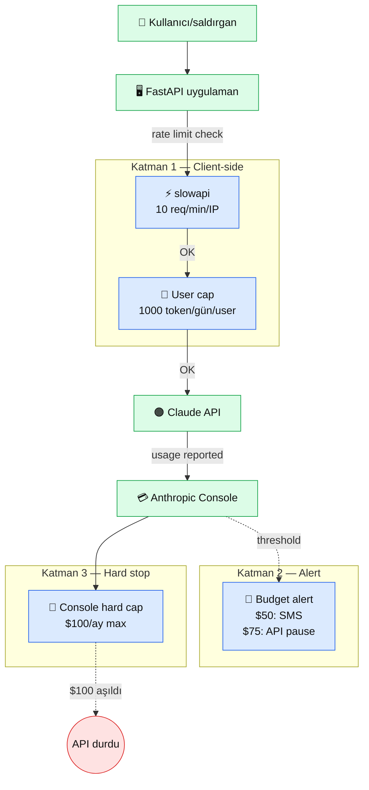

# 8.3 Rate Limit + Maliyet + Secret Management

<div class="ma-meta" markdown>
<div class="ma-meta-row" markdown>
<strong>Kim için:</strong>
<span class="ma-persona ma-persona-baslangic">🟢 başlangıç</span>
<span class="ma-persona ma-persona-is">🔵 iş</span>
<span class="ma-persona ma-persona-kisisel">🟣 kişisel</span>
</div>
<div class="ma-meta-row"><strong>📋 Önkoşul:</strong> 8.1 + 8.2 okundu (teknik + etik güvenlik). 9.4 veya 9.5 canlıda. Anthropic Console erişimi.</div>
<div class="ma-meta-row"><strong>🎯 Çıktı:</strong> **3 katmanlı maliyet savunma** kuruldu — Anthropic Console hard cap ($100/ay) + client-side rate limit (slowapi) + user başı token cap. **4 katman secret management** uygulandı: `.env` + GitHub Secrets + systemd env + secret manager. git history'den key silme refleksi (BFG) ve detect-secrets pre-commit hook aktif. Canlı projende bir gecede $4000 fatura imkansız.</div>
</div>

!!! tip "Yabancı kelime mi gördün?"
    **Rate limit** = zaman başına çağrı sayısı sınırı (ör. dakikada 10 çağrı). **Hard cap** = aşılamaz üst tavan; limiti geçmek fiziksel mümkün değil. **Sliding window** = kayan pencere rate limit algoritması (son 60 sn içinde X istek). **Secret** = hassas bilgi (API key, şifre, token). **Rotation** = secret'i periyodik değiştirme. **Envelope encryption** = secret'in de şifrelenmiş olarak saklanması.

## Neden bu sayfa?

8.1'de Twitter bot $4200 fatura vakasını gördün. Bu sayfanın tamamı **o vakayı önlemek** için. 3 katmanlı savunma:

1. **Anthropic Console hard cap** — servis tarafı. $100 tavanı koydun, geçmez. Fatura şoku fiziksel imkansız.
2. **Client-side rate limit** — senin uygulaman tarafı. Kötü niyetli kullanıcı 10.000 istek gönderse ikinci istekte 429 döner.
3. **Budget alert** — erken uyarı. $50'de SMS, $75'te API kapanır.

İkincisi: **Secret management** ayrı bir disiplin. API key GitHub'da sızınca kimse çalmaz (fazla iyimser); **saniyeler içinde** scan bot'ları yakalar, kullanmaya başlar. 1 gecede $1000+ fatura. Bu sayfa 4 katmanlı secret pratiği kurar + sızıntı durumunda rotation + git history temizleme.

Üçüncüsü: Bu sayfa hem 9.4 RAG Chatbot (sync web servisi) hem 9.5 Agent Otomasyon (async cron) için uygulama veriyor. Farklı desen, farklı savunma.

## Maliyet savunması — 3 katman mimari

<div class="ma-ekosistem" markdown>
<div class="ma-ekosistem-header">🗺️ Fatura savunma mimarisi</div>



**Her katman bağımsız çalışır:**

- Katman 1 yoksa → kötü niyetli saldırgan 10K istek gönderir, hepsi Claude'a gider.
- Katman 2 yoksa → fatura sessizce büyür, ay sonunda şok.
- Katman 3 yoksa → limit aştığında API durmaz, büyümeye devam.

3'ü birden şart.

</div>

## Katman 1 — Anthropic Console hard cap

**Her canlı proje için ilk iş.** Anthropic Console → Settings → **Limits** sekmesi:

1. **Spending limit (monthly):** $100 gibi mantıklı bir rakam.
2. **Alert thresholds:** $25 (uyarı), $50 (ciddi uyarı), $75 (kritik — API kes).
3. **Email notification:** senin@mail.com (zorunlu!).

**Ne oluyor:**

- Aylık kullanım $25'e ulaştığında → email uyarı.
- $50'ye ulaştığında → ikinci email + (opsiyonel) SMS.
- $75'te → Console'da API key'in durumu "paused" olur, sonraki istekler 429 döner.
- $100'de → **hiçbir API çağrısı geçmez**, aylık reset'e kadar kilitli.

**Kritik detay:** Bu limit **hard** ("sessiz"). Kullanıcıya fatura gelmez, **servisin durur**. Bu yüzden threshold'lar önemli — $75'te fark ederek müdahale edersin, $100'e kadar gelmemeye özen gösterirsin.

### Ayrı key, ayrı limit

Tek API key kullanıyorsan tek limit. Ama projede 2 servis (9.4 + 9.5) varsa:

- `ANTHROPIC_API_KEY_RAG` — $60/ay hard cap, 9.4 kullanır
- `ANTHROPIC_API_KEY_AGENT` — $40/ay hard cap, 9.5 kullanır

9.5 agent bug'ı sonsuz döngüye girse 9.5'in key'i $40'ta donar, 9.4 çalışmaya devam eder. **Fire blast radius'ünü sınırla.**

## Katman 2 — Client-side rate limit (slowapi)

Anthropic Console'a istek **varmadan** önce senin uygulamanda dur. `slowapi` FastAPI için rate limit middleware'i.

### Kurulum + kullanım

```python
# pip install slowapi==0.1.9 redis==7.4.0
from fastapi import FastAPI, Request
from slowapi import Limiter, _rate_limit_exceeded_handler
from slowapi.errors import RateLimitExceeded
from slowapi.util import get_remote_address

# Redis backend (production için zorunlu, memory single-worker dışı çalışmaz)
limiter = Limiter(
    key_func=get_remote_address,
    storage_uri="redis://localhost:6379/0",
    default_limits=["100/hour", "10/minute"],  # genel limit
)

app = FastAPI()
app.state.limiter = limiter
app.add_exception_handler(RateLimitExceeded, _rate_limit_exceeded_handler)


@app.post("/ara")
@limiter.limit("5/minute")  # bu endpoint için daha sıkı
async def ara(request: Request, ...):
    ...
```

**Ne oluyor:**

- Her IP için son 1 dakikada 5'ten fazla `/ara` isteği geldiyse → 429 Too Many Requests.
- Son 1 saatte 100'den fazla istek → 429.
- Redis backend sayesinde **multi-worker** (uvicorn 4 worker) çalışırsa bile sayım doğru.

### User başı limit (IP yetmez)

IP tabanlı limit VPN veya NAT arkasındaki kullanıcıları **haksız** olarak kısıtlayabilir. Kullanıcı auth'lıysa user ID kullan:

```python
def get_user_id(request: Request) -> str:
    """Auth'lı kullanıcının ID'si. Yoksa IP."""
    auth = request.headers.get("Authorization")
    if auth and auth.startswith("Bearer "):
        token = auth[7:]
        user = decode_jwt(token)  # senin auth logic'in
        return user.id
    return get_remote_address(request)

limiter = Limiter(key_func=get_user_id, storage_uri="redis://localhost:6379/0")
```

### Token-başı budget

Rate limit **istek sayısı**, **token miktarı** değil. Bir kullanıcı dakikada 5 istek gönderiyor ama her istek 50K token tüketiyorsa → yine pahalı. Ek sınır:

```python
import redis

r = redis.Redis.from_url("redis://localhost:6379/0")

async def check_token_budget(user_id: str, tahmini_token: int) -> bool:
    """Kullanıcının günlük token quota'sı bitmişse False."""
    key = f"tokens:{user_id}:{date.today().isoformat()}"
    daily = r.incrby(key, tahmini_token)
    r.expire(key, 86400)  # 24 saat TTL

    DAILY_LIMIT = 50_000  # kullanıcı başı günlük token
    if daily > DAILY_LIMIT:
        return False
    return True


@app.post("/ara")
async def ara(request: Request, user_id: str = Depends(get_user)):
    if not await check_token_budget(user_id, tahmini_token=2000):
        raise HTTPException(429, "Günlük token quota doldu")
    ...
```

**Pratik:** Günlük 50K token = ~150 istek Claude Sonnet ile. Normal kullanıcı bu sınıra değmez; saldırgan çok hızlı ulaşır → durur.

## Katman 3 — Budget alert (erken uyarı)

Console alert'leri email ama **gerçek zamanlı değil** — 30-60 dk gecikme. Kritik durumda geç. Kendi sisteminde metrik topla:

```python
import logging
from anthropic import Anthropic

log = logging.getLogger("budget")
client = Anthropic()

# Model başı maliyet (2026 yaklaşımları)
FIYAT = {
    "claude-sonnet-4-5": {"in": 3.0, "out": 15.0},  # $/M token
    "claude-haiku-4-5": {"in": 1.0, "out": 5.0},
    "claude-opus-4-7": {"in": 15.0, "out": 75.0},
}


def hesapla_maliyet(response, model: str) -> float:
    """Bir Claude çağrısının USD maliyeti."""
    usage = response.usage
    fiyat = FIYAT[model]
    maliyet = (
        usage.input_tokens * fiyat["in"] / 1_000_000
        + usage.output_tokens * fiyat["out"] / 1_000_000
    )
    return maliyet


# Kullanım
response = client.messages.create(model="claude-sonnet-4-5", ...)
mal = hesapla_maliyet(response, "claude-sonnet-4-5")
log.info(f"maliyet: ${mal:.4f}", extra={"user": user_id, "model": "sonnet-4-5"})

# Redis'te aylık toplam
r.incrbyfloat(f"cost:{date.today().strftime('%Y-%m')}", mal)
```

Günlük cron scripti:

```python
# check_budget.py — cron: 0 9 * * * python check_budget.py
import os, redis, smtplib
from email.mime.text import MIMEText
from datetime import date

r = redis.Redis.from_url("redis://localhost:6379/0")
month = date.today().strftime("%Y-%m")
toplam = float(r.get(f"cost:{month}") or 0)

ESIK = 50.0  # $50 threshold
if toplam > ESIK:
    msg = MIMEText(f"DİKKAT: Bu ay Claude maliyeti ${toplam:.2f}. Limit $100.")
    msg["Subject"] = f"[Claude Budget] {toplam:.2f} USD"
    msg["From"] = os.environ["SMTP_FROM"]
    msg["To"] = os.environ["SMTP_TO"]
    with smtplib.SMTP(os.environ["SMTP_HOST"], 587) as s:
        s.starttls()
        s.login(os.environ["SMTP_USER"], os.environ["SMTP_PASS"])
        s.send_message(msg)
```

Her sabah 09:00'da kontrol, eşiği geçtiyse email. 9.5 agent'ında aynı pattern var.

## Fatura şoku vakası — Replit çocuk AI

**2024 gerçek vaka:** Bir 14 yaşındaki çocuk Replit'te AI chatbot yaptı, arkadaşlarına gönderdi. 3 gün sonra **$15.000 OpenAI faturası** geldi — arkadaşlar toplu 10.000+ istek gönderdi. Replit + OpenAI müdahale etti, çocuk fatura ödemedi (yaş küçük + iyi niyet). Ama ders: **hiçbir rate limit yoktu**.

Senin projen "küçük" olsa bile saldırı yüzeyi var. 9.4 RAG Chatbot'u public yayınladığında ilk gün bu sayfayı okumuş olmalısın.

## Secret management — 4 katman

API key'lerin dağılımı + rotasyon + sızıntı sonrası protokol.

### Katman 1 — Lokal geliştirme: `.env` + `python-dotenv`

```bash
# .env (asla commit etme)
ANTHROPIC_API_KEY=sk-ant-api03-XXXXX
VOYAGE_API_KEY=pa-XXXXX
SMTP_PASS=XXXXX

# .gitignore (ZORUNLU)
.env
.env.local
*.env

# .env.example (commit edilir, dokümantasyon)
ANTHROPIC_API_KEY=sk-ant-api03-...
VOYAGE_API_KEY=pa-...
SMTP_PASS=your-app-password
```

**`chmod 600 .env`** — sadece sen okuyabilirsin (Linux).

### Katman 2 — CI/CD: GitHub Secrets

GitHub repo → Settings → Secrets and variables → Actions → **New repository secret**:

- `ANTHROPIC_API_KEY_STAGING` (test için ayrı key)
- `ANTHROPIC_API_KEY_PROD` (canlı key, hard cap'li)
- `SSH_DEPLOY_KEY` (9.3 CI/CD)

Workflow:

```yaml
# .github/workflows/deploy.yml
- name: Deploy
  env:
    ANTHROPIC_API_KEY: ${{ secrets.ANTHROPIC_API_KEY_PROD }}
    VOYAGE_API_KEY: ${{ secrets.VOYAGE_API_KEY }}
  run: |
    ssh deploy@vps "cd /opt/app && ./deploy.sh"
```

GitHub Secrets şifrelenmiş storage'dır; log'lara yazılmaz (GitHub maskeler).

### Katman 3 — VPS runtime: systemd EnvironmentFile

```ini
# /etc/systemd/system/rag-chatbot.service
[Service]
EnvironmentFile=/home/deploy/rag-chatbot/.env
User=deploy
ExecStart=/home/deploy/rag-chatbot/.venv/bin/uvicorn app.main:app ...
```

```bash
# VPS'te
chmod 600 /home/deploy/rag-chatbot/.env
chown deploy:deploy /home/deploy/rag-chatbot/.env
```

**`.env` VPS'te yaşar, git'te ASLA.** SSH ile kopyalanır, deploy script'iyle yazılır.

### Katman 4 — Production: secret manager (enterprise)

Küçük projede 1-3. katman yeter. Büyük projede:

- **HashiCorp Vault** — açık kaynak, self-host
- **AWS Secrets Manager** — AWS ekosistemi
- **Doppler** — SaaS, $0-$25/ay
- **1Password Teams** — küçük ekip için iyi

Secret manager:
- Otomatik rotation (API key haftalık değişir)
- Audit log (kim hangi secret'i ne zaman çekti)
- Encryption at rest + in transit
- Role-based access (developer → sadece staging, devops → prod)

**Eşik:** 5+ kişi ekip + 3+ servis + enterprise müşteri → secret manager zorunlu. 1 kişi solo projede overkill.

## API key rotation

Secret'ler **eskir**. Rotation = yeniyi üretip eskisini iptal etme.

### Ne zaman rotate edersin?

- **Sızıntı şüphesi** — anında
- **Çalışan ayrıldı** — anında (o kişinin erişimi vardıysa)
- **Periyodik** — 90 günde bir (yüksek güvenlik) veya 6 ayda bir (normal)

### Nasıl rotate edilir?

```bash
# 1. Anthropic Console'da yeni key üret
# 2. Yeni key'i secret store'lara yaz (GitHub Secrets + VPS .env)
# 3. Uygulamayı yeniden başlat (pick up new env)
systemctl restart rag-chatbot
# 4. Eski key'in log'larını kontrol et (24 saat bekle, gerçekten eski mi?)
# 5. Eski key'i Console'dan iptal et
```

Zero-downtime rotation için **iki key birden geçerli** durumu sağla:

```python
# app.py
keys = [
    os.environ["ANTHROPIC_API_KEY_CURRENT"],  # yeni
    os.environ.get("ANTHROPIC_API_KEY_PREVIOUS"),  # geçiş süreci
]
client = Anthropic(api_key=keys[0])  # yeni ile dene
# eskisini 7 gün geçişte tut, sonra iptal
```

## Sızıntı durumu — acil protokol

API key GitHub'a commit'lendi (scan bot'lar 1-5 dakika içinde yakalar):

```bash
# 1. ANINDA Anthropic Console'dan key iptal (revoke)
# https://console.anthropic.com/settings/keys → "Revoke"

# 2. Yeni key üret + secret store'lara yaz

# 3. Git history'den key'i sil — BFG Repo Cleaner
# Mac: brew install bfg
# Linux: wget https://repo1.maven.org/maven2/com/madgag/bfg/1.14.0/bfg-1.14.0.jar

git clone --mirror https://github.com/USER/repo.git
java -jar bfg-1.14.0.jar --replace-text secrets.txt repo.git
# secrets.txt içinde: sk-ant-api03-XXXXXX

cd repo.git
git reflog expire --expire=now --all
git gc --prune=now --aggressive
git push --force

# 4. Console'da usage taraması — sızıntı döneminde şüpheli istek var mı?
# $500 beklenmedik → destek ticket aç
```

**BFG Repo Cleaner** git history'den bir string'i (API key) siler. `git filter-branch`'ten **30× hızlı**.

**Uyarı:** `git push --force` tehlikeli — yalnız sen (sahibi) yaparsan. Ekipte aynı anda çalışan varsa önce uyar.

## Pre-commit hook — sızıntıyı önceden yakala

API key commit **olmamalıdır**. `detect-secrets` pre-commit hook her commit öncesi tarar:

```yaml
# .pre-commit-config.yaml
repos:
  - repo: https://github.com/Yelp/detect-secrets
    rev: v1.5.0
    hooks:
      - id: detect-secrets
        args: ["--baseline", ".secrets.baseline"]
```

Kurulum:

```bash
pip install pre-commit detect-secrets
detect-secrets scan > .secrets.baseline
pre-commit install
# Artık her commit öncesi tarar
git commit -m "..."
# Detect secrets... (output)
# Potential secret detected at file.py:42: ABORTED
```

Yanlış pozitif için `.secrets.baseline` düzenle.

**Complementer:** GitHub tarafında **Push Protection** (Settings → Security → Secret scanning → Push protection). Secret içeren push GitHub tarafından **reddedilir**. Ücretsiz public repo'da açık, private için Advanced Security.

## CTO tuzakları — 10 yaygın hata

| # | Tuzak | Sonuç | Doğru |
|---|---|---|---|
| 1 | Console hard cap koymama | $4000 gece faturası | İlk gün $100 limit |
| 2 | Single-process rate limit (memory) | 4-worker uvicorn'da 4× limit | Redis backend |
| 3 | Rate limit sadece IP | VPN/NAT kullanıcı haksız bloklanır | IP + user ID iki katman |
| 4 | Token budget yok | 5 istek × 50K token = pahalı | Redis'te günlük token sayacı |
| 5 | `.env` GitHub'a commit'lendi | Bot 5 dakikada yakalar | `.gitignore` + pre-commit detect-secrets |
| 6 | VPS `.env` chmod 644 | Diğer kullanıcılar okur | `chmod 600` zorunlu |
| 7 | API key hiç rotate edilmez | Çalışan ayrılsa bile erişim var | 6 ayda bir rotation rutin |
| 8 | Sızıntı sonrası git reset yeter | History'de kalır, scan bot yakalar | BFG Repo Cleaner + key revoke |
| 9 | Tek key, tek limit | 9.5 bug'ı 9.4'ü de öldürür | Ayrı key, ayrı cap (blast radius) |
| 10 | Budget alert email only | 30-60 dk gecikme | Kendi cron + SMS/Telegram anlık |

## Anthropic ekosistemi — Console özellikleri

<details class="ma-anthropic-oz" markdown>
<summary><strong>🤖 Anthropic-öz: Console'u tam kullan</strong></summary>

[Anthropic Console](https://console.anthropic.com) sadece key üretmek için değil. Kullanman gereken 5 alan:

1. **Usage** (Dashboard) — gerçek zamanlı token + maliyet grafiği. Günde bir kez bak.
2. **Limits** — hard cap + threshold alert'leri. İlk gün kur.
3. **API Keys** — her servis için ayrı key. Rotation sırasında yeni üretim + iptal buradan.
4. **Logs** — son 7 günün tüm istek log'u (aylık plan dahil). Saldırı sonrası forensic.
5. **Billing** — fatura detay + PDF invoice. Muhasebe için.

**Workspace feature** (2026'da genel kullanım): Enterprise planında workspace izolasyonu — aynı organizasyonda farklı takımlar ayrı key + limit + log. $100/ay+ plan.

**Claude in Slack / Chrome / Excel** geçiş: Anthropic'in kullanıcı ürünlerine erişimin varsa, **ayrı API usage** — projeyle karışmaz. Kariyer ürünlerini kullanırken fatura endişesi yok, developer key'ini etkilemez.

### Pricing son doğrulama (6-ay kuralı)

!!! tip "6-ay revizyon kuralı"
    Fiyatlar **2026 Nisan** yaklaşımlarıdır. [anthropic.com/pricing](https://www.anthropic.com/pricing) her zaman güncel. Bu sayfayı **2026 Ekim** sonrası okuyorsan doğrula.

| Model | Input $/M | Output $/M |
|---|---|---|
| Claude Opus 4.7 | ~15 | ~75 |
| Claude Sonnet 4.6 / 4.5 | ~3 | ~15 |
| Claude Haiku 4.5 | ~1 | ~5 |

**Prompt caching indirimi** (2024 Kasım): Aynı system prompt'u defalarca kullanırsan input %90 daha ucuz. RAG'de context yeniden kullanımı için kritik — Bölüm 4.7'de detay.

</details>

## Çıktı kanıtları — 3 kanıt

<div class="ma-cikti-kaniti" markdown>
<div class="ma-cikti-kaniti-header">📏 Çıktı — 3 kanıt</div>

**1. Anthropic Console hard cap:**

Console → Limits → Monthly spending limit $100 set. Alert thresholds $25/$50/$75. Email notification aktif. Ekran görüntüsü kanıt.

**2. slowapi + Redis rate limit:**

`app/main.py`'da `Limiter` tanımlı, `/ara` endpoint 5/minute limit. Test: 6. istek 429 döner. `curl -X POST .../ara` 6 kez, son cevap `{"detail": "Rate limit exceeded"}`. Log kanıt.

**3. Pre-commit detect-secrets:**

`.pre-commit-config.yaml` + `.secrets.baseline` commit'lenmiş. Test: `ANTHROPIC_API_KEY=sk-ant-api03-TEST` içeren dosya commit et → hook reddeder. Log kanıt.

**Kanıt klasörü:** `muhendisal-notlarim/bolum-8/03-maliyet/`

</div>

## Görev — 2 saat maliyet + secret savunma

<div class="ma-gorev" markdown>
<div class="ma-gorev-header">🎯 Görev — 3 katman + 4 katman kuruluyor</div>

### Saat 1 — Maliyet savunması

1. Anthropic Console → Limits → $100 hard cap + $25/$50/$75 thresholds.
2. Email notification aktif + test et (10 istek at, email gelir mi).
3. `app/main.py`'a `slowapi` ekle: `/ara` 5/minute, global 100/hour.
4. Redis container ekle compose.yml'e (storage_uri="redis://redis:6379/0").
5. Maliyet log + budget cron ekle (her sabah 09:00 → $50 eşikte email).

### Saat 2 — Secret savunması

1. `.env` kontrolü: `.gitignore` içinde, `chmod 600`.
2. `pre-commit install` + `detect-secrets scan > .secrets.baseline` commit'le.
3. GitHub Secrets → ANTHROPIC_API_KEY_PROD + VOYAGE_API_KEY + SSH_DEPLOY_KEY.
4. VPS'te systemd EnvironmentFile ayarı.
5. Test sızıntı: fake key commit et → hook yakalar mı? Canlı key **ASLA** test etme!

**Başarı kriteri:** 2 saat sonunda 3 katman maliyet savunması + 4 katman secret yönetimi aktif. Canlı proje "$4000 şoku" fiziksel imkansız.

</div>

<div class="ma-neden-sonuc" markdown>
<div class="ma-neden-sonuc-header">🔗 Birlikte okuma — neden ne oldu</div>

- **A → B:** Twitter bot $4200 (8.1) + Replit $15K (bu sayfa) fatura şoku gerçek risk.
- **B → C:** 3 katmanlı savunma: Console hard cap + client rate limit + budget alert.
- **C → D:** slowapi + Redis backend multi-worker rate limit; IP + user ID iki katman.
- **D → E:** Token budget Redis sayacı: günde N token/user sınır.
- **E → F:** 4 katman secret: `.env` + GitHub Secrets + systemd + vault (enterprise).
- **F → G:** API key rotation 90-180 gün; zero-downtime iki key geçişi.
- **G → H:** Sızıntı sonrası: revoke + BFG + force push + usage audit; pre-commit detect-secrets önceden yakalar.
- **H → I:** 10 CTO tuzak + Anthropic Console 5 aktif alan.

<div class="ma-neden-sonuc-sonuc" markdown>
**Sonuç:** Canlı proje fatura + secret tarafı güvenli. Bir gecede $4000 fatura mümkün değil; API key sızıntısı scan bot'lardan önce yakalanır. Sonraki (8.4): loglama + izleme — bu korumaların **gerçekten çalıştığını** görmek.
</div>
</div>

<div class="ma-sonraki" markdown>
<div class="ma-sonraki-header">➡️ Sonraki adım</div>

**[8.4 Loglama ve İzleme →](04-loglama.md)** — Structured logging, metrikler, Grafana + Loki, PII maskeleme.

← [8.2 Etik ve Önyargı](02-etik.md) &nbsp;|&nbsp; [Bölüm 8 girişi](index.md) &nbsp;|&nbsp; [Ana sayfa](../index.md)

**Pekiştirme:** [slowapi docs](https://slowapi.readthedocs.io/) + [detect-secrets README](https://github.com/Yelp/detect-secrets) + [BFG Repo Cleaner](https://rtyley.github.io/bfg-repo-cleaner/). Üçünü hafta sonu tara, canlı projende refleks olur.
</div>
