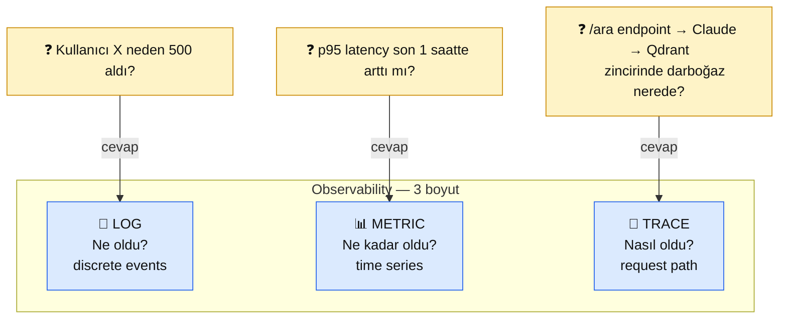

# 8.4 Loglama ve İzleme — Structured Logs + Metrikler + Grafana

<div class="ma-meta" markdown>
<div class="ma-meta-row" markdown>
<strong>Kim için:</strong>
<span class="ma-persona ma-persona-baslangic">🟢 başlangıç</span>
<span class="ma-persona ma-persona-is">🔵 iş</span>
<span class="ma-persona ma-persona-kisisel">🟣 kişisel</span>
</div>
<div class="ma-meta-row"><strong>📋 Önkoşul:</strong> 8.1 + 8.2 + 8.3 okundu. Canlı projen (9.4 veya 9.5) çalışıyor.</div>
<div class="ma-meta-row"><strong>🎯 Çıktı:</strong> **JSON structured log** format uyguluyorsun (python-json-logger veya structlog); her istek için trace_id + user_id + token_usage + latency kaydı var; PII log'ta maskelenmiş; **3 kritik metrik** (error rate, p95 latency, token/saat) sürekli görünür. Küçük proje için basit dosya log + `jq`, orta-büyük için Grafana + Loki mimarisi biliyorsun. 24/7 agent (9.5) için journalctl refleksin var.</div>
</div>

!!! tip "Yabancı kelime mi gördün?"
    **Structured log** = satır başına JSON; `grep` yerine `jq` ile filtrelenir. **Trace ID** = bir kullanıcı isteğinin tüm log satırlarını birleştiren benzersiz ID. **Observability** (gözlemlenebilirlik) = sistem iç durumunu dışarıdan görme yeteneği; log + metric + trace üçlüsü. **p95 latency** = isteklerin %95'i bu süreden kısa tamamlanıyor. **Cardinality** = bir metriğin alabileceği benzersiz değer sayısı; yüksek cardinality Prometheus'u patlatır.

## Neden bu sayfa?

8.3'te 3 katmanlı fatura savunması + 4 katmanlı secret kurdun. Ama savunmaların **gerçekten çalıştığını** nasıl bileceksin? Çalışmadığında nasıl göreceksin? İyi log ve metrik olmazsa:

- Saat 03:00'da canlı sistem durur, sabah 09:00'da farkedersin → 6 saat kayıp
- Saldırgan rate limit'i aştı mı? Log yoksa bilinmez
- Bu ay fatura $100 mü $30 mu? Metrik yoksa tahmin
- Bir kullanıcı "çalışmıyor" dedi → hangi isteği? Trace ID yoksa günlerce arayış

**Loglama debug için değil, operasyon için.** Her canlı AI projesinin üstüne inşa edilen observability katmanı bu sayfa.

İkincisi: **PII log'ta maskelenmeli.** 8.1'de presidio ile input maskeleme yaptın — log'a yazarken aynı disiplin. Kullanıcı "sipariş X" dedi, log'a "sipariş [MASKED]" yazılır. KVKK + GDPR uyum.

Üçüncüsü: **9.5 agent otomasyonu** 24/7 çalışıyor. Hatalar sessiz olursa 3 gün boyunca rapor üretmediğin farkında olmazsın. Bu sayfa "sessiz başarısızlık" tuzağına karşı savunma.

## Log + metric + trace — observability 3'lü

<div class="ma-ekosistem" markdown>
<div class="ma-ekosistem-header">🗺️ 3 observability boyutu, 3 farklı sorun çözer</div>



**3 boyut örtüşür ama farklı sorulara cevap:**

- **Log** — spesifik olaylar (request, error, signup).
- **Metric** — zaman içinde sayısal trend (request/sec, token/hour).
- **Trace** — bir request'in tüm sistemdeki yolu (microservice'ler arası).

Küçük proje (solo + 1-2 servis) için **log + basit metric** yeter. Büyük sistem için üçü birden Grafana stack.

</div>

## Structured logging — JSON satır satır

Geleneksel `print()` veya düz text log:

```
2026-04-23 14:30:22 INFO User search completed in 1.2s
```

**Problem:** "hangi kullanıcı?" "hangi endpoint?" "kaç token?" — regex yazmak gerek. Büyük log'ta **arama felaket**.

### Structured log (JSON):

```json
{"ts": "2026-04-23T14:30:22Z", "level": "INFO", "event": "search_done", "user_id": "u_42", "endpoint": "/ara", "latency_ms": 1210, "tokens_in": 450, "tokens_out": 180, "cost_usd": 0.0033, "trace_id": "req_abc123"}
```

**Avantajlar:**
- `jq '.user_id=="u_42"'` — tek komutla filtrele
- Loki/Elasticsearch'e direkt import
- Metrik üretimi kolay (sum tokens_in → günlük toplam)
- PII'yi tek key'e koyarsan maskeleme kolay

### Python'da — `python-json-logger`

```python
# pip install python-json-logger==4.1.0
import logging
from pythonjsonlogger import jsonlogger

logger = logging.getLogger("app")
handler = logging.FileHandler("app.log")
formatter = jsonlogger.JsonFormatter(
    "%(asctime)s %(name)s %(levelname)s %(message)s",
    rename_fields={"asctime": "ts", "name": "logger", "levelname": "level"},
    datefmt="%Y-%m-%dT%H:%M:%SZ",
)
handler.setFormatter(formatter)
logger.addHandler(handler)
logger.setLevel(logging.INFO)


# Kullanım — extra key-value'ları JSON'a çıkar
logger.info("search_done", extra={
    "user_id": "u_42",
    "endpoint": "/ara",
    "latency_ms": 1210,
    "tokens_in": 450,
    "tokens_out": 180,
    "cost_usd": 0.0033,
    "trace_id": "req_abc123",
})
```

Dosyadaki her satır JSON. `tail -f app.log | jq .` ile renkli izle.

### Alternatif — `structlog` (modern tercih)

```python
# pip install structlog==25.5.0
import structlog

structlog.configure(
    processors=[
        structlog.processors.TimeStamper(fmt="iso"),
        structlog.processors.add_log_level,
        structlog.processors.JSONRenderer(),
    ],
)

log = structlog.get_logger()
log.info("search_done",
    user_id="u_42",
    endpoint="/ara",
    latency_ms=1210,
    tokens_in=450,
)
```

**structlog avantajları:**
- Daha ergonomik API (`log.bind()` ile context taşı)
- Context manager ile request içinde otomatik user_id
- Daha iyi async desteği

**Karar:** structlog **modern tercih**. Yeni proje kuruyorsan bundan başla; eski proje `python-json-logger`'da ise değiştirme zorunda değilsin.

## Trace ID — bir isteğin yolu

Aynı request'e ait tüm log satırları aynı `trace_id` taşır. FastAPI middleware:

```python
import uuid
from fastapi import Request
from starlette.middleware.base import BaseHTTPMiddleware
import structlog

log = structlog.get_logger()


class TraceIDMiddleware(BaseHTTPMiddleware):
    async def dispatch(self, request: Request, call_next):
        trace_id = request.headers.get("X-Trace-ID") or f"req_{uuid.uuid4().hex[:12]}"
        structlog.contextvars.bind_contextvars(trace_id=trace_id)
        request.state.trace_id = trace_id

        log.info("request_start", method=request.method, path=request.url.path)
        response = await call_next(request)
        log.info("request_done", status=response.status_code)

        response.headers["X-Trace-ID"] = trace_id
        structlog.contextvars.clear_contextvars()
        return response


app.add_middleware(TraceIDMiddleware)
```

**Ne oluyor:**

- Her istek benzersiz `trace_id` alır (veya client'tan gelir — distributed tracing için).
- Bu request içindeki tüm log satırları **otomatik** `trace_id` içerir (contextvars).
- Log'u `jq 'select(.trace_id=="req_abc123")'` ile filtrele → bu request'in tüm hikâyesi.
- Response header'da `X-Trace-ID` → kullanıcı hata bildirirken bu ID'yi paylaşır, sen direkt bulursun.

Her Claude çağrısına, her Qdrant sorgusuna trace_id ekle. Tek istekte 5-10 log satırı normal, hepsi bağlantılı.

## PII maskeleme — log'ta gizlilik

8.1'de presidio ile input maskeleme yapmıştın. Log'a yazarken aynı disiplin gerek:

```python
from presidio_analyzer import AnalyzerEngine
from presidio_anonymizer import AnonymizerEngine

analyzer = AnalyzerEngine()
anonymizer = AnonymizerEngine()


def log_safe(metin: str) -> str:
    """PII'yi loglamadan önce maskele."""
    results = analyzer.analyze(
        text=metin, language="tr",
        entities=["EMAIL_ADDRESS", "PHONE_NUMBER", "CREDIT_CARD", "PERSON", "TC_KIMLIK"],
    )
    if not results:
        return metin
    return anonymizer.anonymize(text=metin, analyzer_results=results).text


# Kullanım
log.info("user_query",
    query=log_safe(kullanici_sorusu),  # "Benim numaram [PHONE]"
    user_id=user_id,  # bu zaten internal ID, PII değil
)
```

**Default rule:** Kullanıcı-sağladığı metni **asla** ham log'a yazma. Maskele veya **hiç yazma**. Yazman gereken zorunlu ise (debug için) o log satırını DEBUG seviyeye koy, INFO'ya değil.

## RotatingFileHandler + logrotate

Log dosyası **sürekli büyür**. 30 gün sonra 50 GB → disk dolar. İki savunma:

### Python tarafı — `RotatingFileHandler`

```python
from logging.handlers import RotatingFileHandler

handler = RotatingFileHandler(
    "app.log",
    maxBytes=100 * 1024 * 1024,  # 100 MB
    backupCount=5,  # 5 eski dosya sakla (app.log.1, .2, ...)
)
```

Dosya 100 MB olunca yeni dosya açılır, eskisi `.1` olur. 6. backup silinir.

### Linux tarafı — `logrotate`

```bash
# /etc/logrotate.d/rag-chatbot
/home/deploy/rag-chatbot/app.log {
    daily
    rotate 14              # 14 gün sakla
    compress               # .gz yap
    delaycompress
    missingok
    notifempty
    create 0640 deploy deploy
    postrotate
        systemctl reload rag-chatbot > /dev/null 2>&1 || true
    endscript
}
```

- Her gece 03:00 civarı log rotate edilir
- Eski dosyalar `gzip` ile sıkıştırılır (10-20× küçülür)
- 14 gün sonra silinir
- Service reload (yeni log dosyasına geçsin)

Test:

```bash
sudo logrotate -d /etc/logrotate.d/rag-chatbot  # dry-run
sudo logrotate -f /etc/logrotate.d/rag-chatbot  # force run
```

## Metrikler — 3 kritik + 3 opsiyonel

**Canlı AI sistemin için HER ZAMAN takip:**

### Kritik 3

1. **Error rate** — 5xx + 4xx'ler. Normalde %0-2. Birden %10'a çıkarsa **alarm**.
2. **p95 latency** — isteklerin 95%'inin tamamlanma süresi. Normalde 1-3 sn; 10 sn'ye çıkarsa Claude/Qdrant yavaşlıyor.
3. **Token / saat** — Claude tüketim. Budget projection için. 8.3'teki budget alert'in dayanağı.

### Opsiyonel 3 (büyük proje)

4. **Active users** — son 5 dk'da istek yapan unique user sayısı.
5. **Cache hit rate** — prompt caching kullanıyorsan (Bölüm 4.7) ne kadar isabet?
6. **Queue depth** — agent sistemde (9.5) bekleyen iş sayısı.

### Basit proje — log + jq

Küçük projede ayrı metric sistem overkill. Sadece log analiz:

```bash
# Son 1 saatteki error rate
jq -r '[.ts, .status] | @csv' app.log | awk -F',' '
$2 >= 500 { err++ }
{ total++ }
END { printf "%.2f%%\n", 100 * err / total }
'

# Son 1 saatteki p95 latency
jq -r '.latency_ms' app.log | sort -n | awk '
{ arr[NR] = $1 }
END { print arr[int(NR * 0.95)] }
'

# Saatlik token toplam
jq -r '[.ts[:13], .tokens_in + .tokens_out] | @csv' app.log | awk -F',' '
{ sum[$1] += $2 }
END { for (h in sum) print h, sum[h] }
'
```

Her sabah crontab'da çalıştır, output email. 30 dakika iş; Grafana kurmaktan 10× hızlı.

### Orta-büyük — Grafana + Loki

**Stack:**

- **Loki** — log aggregation (Prometheus mantığı, log için)
- **Promtail** — log toplayıcı (Prometheus exporter benzeri)
- **Grafana** — dashboard UI (aynı Grafana, hem metric hem log)
- **Prometheus** — metrik (opsiyonel)

Docker compose:

```yaml
services:
  loki:
    image: grafana/loki:3.3.0
    ports: ["3100:3100"]
    volumes: ["./loki-config.yml:/etc/loki/config.yml"]

  promtail:
    image: grafana/promtail:3.3.0
    volumes:
      - /home/deploy/rag-chatbot:/logs:ro
      - ./promtail-config.yml:/etc/promtail/config.yml
    command: -config.file=/etc/promtail/config.yml

  grafana:
    image: grafana/grafana:11.4.0
    ports: ["127.0.0.1:3000:3000"]  # localhost-only, reverse proxy ile
    environment:
      GF_SECURITY_ADMIN_PASSWORD: ${GRAFANA_PASS}
```

**Grafana Explore → LogQL sorgu:**

```
{app="rag-chatbot"} |= "error" | json | user_id="u_42"
```

```
sum by (endpoint) (rate({app="rag-chatbot"} |= "request_done" | json [5m]))
```

**Maliyet:**

- **Self-host** (Hetzner CX22 + Loki): ~4 €/ay (aynı VPS'te)
- **Grafana Cloud free tier**: 50 GB log / 14 gün — solo projeye yeter
- **Datadog, New Relic**: $15-50/ay, managed, kurulumu 0 dk

**Eşik:** 2+ servis veya 10+ kişi kullanıcı → Loki/Grafana değerli. Tek kullanıcı solo proje → `jq` yeter.

## 24/7 agent loglaması — 9.5 özel durum

9.5 İçerik Özet Agent saat başı çalışır, sen yokken. Sessiz başarısızlık riski:

- Cron çalıştı ama Python hatası, rapor üretmedi — fark etmezsin
- Anthropic API rate limit'e takıldı — sessizce skip
- SMTP kapandı — email gitmedi

### Çözüm 1 — Heartbeat

Her başarılı run sonunda timestamp yaz:

```python
# pipeline.py sonunda
with open("/home/deploy/agent/last_success.txt", "w") as f:
    f.write(datetime.utcnow().isoformat())
```

Monitor cron (her 2 saatte bir):

```bash
# /etc/cron.d/agent-heartbeat
0 */2 * * * deploy bash -c '
  last=$(cat /home/deploy/agent/last_success.txt)
  last_ts=$(date -d "$last" +%s)
  now=$(date +%s)
  diff=$((now - last_ts))
  if [ $diff -gt 7200 ]; then
    mail -s "[ALERT] Agent 2+ saat çalışmadı" admin@domain.com < /home/deploy/agent/app.log
  fi
'
```

Agent 2 saatten fazla başarı log'u yazmadıysa email.

### Çözüm 2 — Uptime Kuma

[Uptime Kuma](https://github.com/louislam/uptime-kuma) açık kaynak monitoring UI (self-host). Agent her başarıda HTTP GET atar:

```python
import httpx
# pipeline.py sonunda
try:
    httpx.get("https://kuma.domain.com/api/push/XXXX?status=up", timeout=5)
except:
    pass  # heartbeat ping, hata tolerable
```

Kuma tarafı heartbeat gelmezse 5 dakika sonra email/Telegram alert.

### Çözüm 3 — Sentry error tracking

```python
# pip install sentry-sdk==2.58.0
import sentry_sdk

sentry_sdk.init(
    dsn=os.environ["SENTRY_DSN"],
    traces_sample_rate=0.1,  # 10% istek trace'le
    environment="production",
)

# Otomatik: unhandled exception Sentry'ye gider
# Manuel: sentry_sdk.capture_message("Rate limit hit", level="warning")
```

Sentry free tier 5000 event/ay — solo proje için bolca yeter. Slack/email alert entegrasyonu dakikalarda kurulur.

## systemd journalctl — headless agent için

systemd timer ile çalışan 9.5 agent log'u `journalctl`'da:

```bash
# Son 1 saat
journalctl -u icerik-agent.service --since "1 hour ago"

# Sadece hata
journalctl -u icerik-agent.service -p err

# Canlı izle (tail -f benzeri)
journalctl -u icerik-agent.service -f

# JSON format (structured log almak için)
journalctl -u icerik-agent.service -o json-pretty

# Son 100 satır, syslog facility + timestamp
journalctl -u icerik-agent.service -n 100 --output short-iso
```

**Service dosyasında JSON log:**

```ini
[Service]
ExecStart=/home/deploy/agent/.venv/bin/python pipeline.py
StandardOutput=journal
StandardError=journal
SyslogIdentifier=icerik-agent
```

Python tarafında print yerine logger, output journald'a gider, JSON yapısı korunur.

**Kalıcılık:** `/etc/systemd/journald.conf` → `Storage=persistent` (default bazı dağıtımlarda volatile). Reboot'ta log kaybolmaz.

## Alert — email vs Telegram vs Slack

### Email SMTP (8.3'te verdim)

**Pro:** Herkesin var, özel infra gerekmez, audit trail.
**Con:** 5-10 dk gecikme, bildirim sesi yok, mobilde kaçırma kolay.

### Telegram Bot (3 dakikada kurulur)

```python
# Telegram Bot kurulumu: @BotFather -> /newbot -> token al
# Chat ID: @userinfobot'a mesaj at

import os
import httpx

def telegram_alert(mesaj: str) -> None:
    token = os.environ["TELEGRAM_BOT_TOKEN"]
    chat_id = os.environ["TELEGRAM_CHAT_ID"]
    url = f"https://api.telegram.org/bot{token}/sendMessage"
    httpx.post(url, json={"chat_id": chat_id, "text": mesaj}, timeout=5)


# Kritik hata
try:
    ...
except Exception as e:
    telegram_alert(f"🔥 CRITICAL: {e}")
    raise
```

**Pro:** Anlık bildirim, mobil telefonunda çalıyor, emoji/formatting.
**Con:** Sadece Telegram kullananlar.

### Slack Webhook

Ekiple çalışıyorsan Slack kanal daha uygun. Incoming webhook URL → POST JSON. 5 dk kurulum.

**Kural:** Solo proje → Telegram (mobilden kaçırmazsın). Ekip → Slack. Resmi iletişim → email.

## CTO tuzakları — 10 log/monitoring hatası

| # | Tuzak | Sonuç | Doğru |
|---|---|---|---|
| 1 | `print()` ile log | Stdout buffer'da kaybolur | `logging` module + handler |
| 2 | Düz text log | Analiz felaket | JSON structured |
| 3 | Trace ID yok | Bir hatayı tüm log'u okuyorsun | Middleware + contextvars |
| 4 | Kullanıcı sorusunu ham log | PII ihlali | Presidio maskeleme |
| 5 | Log rotation yok | Disk 50 GB dolar | RotatingFileHandler + logrotate |
| 6 | Tek dosyaya her şey (DEBUG + INFO + ERROR) | Filter zor | Seviye ayrı dosya: app.log + error.log |
| 7 | Metric hiç yok | Trend görmezsin | jq cron veya Loki |
| 8 | 24/7 agent heartbeat yok | Sessiz durma 3 gün | Heartbeat cron + Uptime Kuma |
| 9 | Sentry DSN GitHub'da commit | Rahatsız edici trafik, spam | .env + secret (8.3) |
| 10 | Grafana admin şifresi `admin` | Herkes erişir | `GF_SECURITY_ADMIN_PASSWORD` zorunlu |

## Anthropic ekosistemi — usage metrikleri

<details class="ma-anthropic-oz" markdown>
<summary><strong>🤖 Anthropic-öz: Console Usage + custom metric</strong></summary>

Anthropic Console her API çağrısının metriklerini tutar — senin log'una gerek olmadan da görebilirsin:

1. **Console → Usage (Dashboard)** — günlük/haftalık/aylık token + maliyet grafiği.
2. **Filter**: model, API key, tarih aralığı.
3. **Export**: CSV indirebilir, kendi analizin için.

**Console verisi senin log'una eşdeğer mi?**

- ✅ **Token + cost** — Console bu konuda mükemmel, senin log'una gerek yok.
- ❌ **Latency** — Console sana çağrı süresini vermez; senin tarafında ölçmelisin.
- ❌ **Error cause** — Console "429 rate limit" der ama **hangi kullanıcı** hangi endpoint'ten — bilmez. Senin log'un.
- ❌ **User context** — Console user_id bilmez, sen tutmalısın.

**Sonuç:** Console **eklenti** log sistem; senin ana log'un bağımsız gerekli.

**Claude usage reporting** response'ta gelir (8.3'te gösterdim):

```python
response = client.messages.create(...)
print(response.usage.input_tokens, response.usage.output_tokens)
```

Bunları log'a yaz. 1 ay sonra "hangi endpoint en pahalı?" sorusunu kendi log'undan cevaplar.

**Prompt Caching** (2024 Kasım):

```python
response = client.messages.create(
    model="claude-sonnet-4-6",
    system=[{"type": "text", "text": "...", "cache_control": {"type": "ephemeral"}}],
    ...
)
# response.usage.cache_creation_input_tokens
# response.usage.cache_read_input_tokens
```

`cache_read_input_tokens` normal input'tan **%90 ucuz**. Metrik olarak bunları da logla — cache hit rate önemli KPI (Bölüm 4.7 detay).

</details>

## Çıktı kanıtları — 3 kanıt

<div class="ma-cikti-kaniti" markdown>
<div class="ma-cikti-kaniti-header">📏 Çıktı — 3 kanıt</div>

**1. Structured JSON log:**

`app.log` açıldı, satır başına valid JSON. `tail -f app.log | jq .` renkli akıyor. trace_id her istek farklı. PII maskelenmiş.

**2. Metric cron çalışıyor:**

Her sabah 09:00'da `jq` cron log analizi → email. Son 3 gün email kutunda "error rate %0.4", "p95 1200ms", "token 45K/gün" raporları var.

**3. 24/7 agent alert (9.5 için):**

Heartbeat cron 2 saat uyarı kurulu VEYA Uptime Kuma VEYA Sentry DSN aktif. Test: agent'ı manuel kapat → 2 saat içinde alert geldi.

**Kanıt klasörü:** `muhendisal-notlarim/bolum-8/04-loglama/`

</div>

## Görev — 90 dk observability

<div class="ma-gorev" markdown>
<div class="ma-gorev-header">🎯 Görev — log + metric + alert kur</div>

### Adım 1 — Structured log (30 dk)

1. `pip install structlog` (yeni proje) veya `python-json-logger` (mevcut).
2. `app/logging_setup.py` oluştur: JSON formatter + RotatingFileHandler.
3. TraceIDMiddleware ekle FastAPI app'ına.
4. 5 key log noktası: request_start + request_done + claude_call + qdrant_search + error.
5. `tail -f app.log | jq .` renkli akış test et.

### Adım 2 — PII maskeleme + logrotate (20 dk)

1. presidio `log_safe()` fonksiyonu 8.1'den al, log satırlarında kullan.
2. `/etc/logrotate.d/X` config yaz (yukarıdaki örnek).
3. `sudo logrotate -d` dry-run kontrol.

### Adım 3 — Metric cron (20 dk)

1. `scripts/daily_report.sh` yaz (jq + awk yukarıdaki örnek).
2. Cron entry: `0 9 * * * /home/deploy/app/scripts/daily_report.sh | mail -s "Daily" you@mail.com`.
3. Bir gece bekle, ilk raporu al.

### Adım 4 — Agent heartbeat (9.5 için, 20 dk)

1. pipeline.py sonuna `last_success.txt` yazımı ekle.
2. Monitor cron 2 saat eşik kur.
3. Test: agent'ı manuel durdur, 2 saat bekle, email gelsin.

**Başarı kriteri:** 90 dk sonra observability katmanı canlıda: yapısal log + günlük rapor + agent heartbeat.

</div>

<div class="ma-neden-sonuc" markdown>
<div class="ma-neden-sonuc-header">🔗 Birlikte okuma — neden ne oldu</div>

- **A → B:** Log/metric/trace 3 boyutu farklı sorulara cevap; canlı proje için üçü de gerekli.
- **B → C:** Structured JSON log — grep yerine jq, filtre kolay, metric üretimi doğrudan.
- **C → D:** python-json-logger basit + yaygın; structlog modern, bind context + async.
- **D → E:** Trace ID middleware — bir isteğin tüm log hikayesi `jq 'select(.trace_id==X)'`.
- **E → F:** PII maskeleme presidio 8.1'den devam; log KVKK/GDPR uyumu.
- **F → G:** RotatingFileHandler + logrotate disk taşmayı önler; 14 gün backup.
- **G → H:** 3 kritik metrik (error rate, p95 latency, token/saat) — küçük proje jq cron, orta-büyük Grafana+Loki.
- **H → I:** 24/7 agent (9.5) heartbeat + Uptime Kuma + Sentry sessiz başarısızlığı yakalar.
- **I → J:** Alert: email resmi, Telegram anlık, Slack ekip; solo → Telegram.

<div class="ma-neden-sonuc-sonuc" markdown>
**Sonuç:** Canlı proje artık **gözlemlenebilir**. Hata olsa öğrenirsin, trend değişse görürsün, agent sessiz kalsa alarm çalar. Sonraki (8.5): hata yönetimi — log'da görülen hataları nasıl **önlemeye** çevireceğin.
</div>
</div>

<div class="ma-sonraki" markdown>
<div class="ma-sonraki-header">➡️ Sonraki adım</div>

**[8.5 Hata Yönetimi →](05-hata-yonetimi.md)** — Retry + exponential backoff + circuit breaker + fallback model stratejileri.

← [8.3 Rate Limit + Maliyet](03-maliyet.md) &nbsp;|&nbsp; [Bölüm 8 girişi](index.md) &nbsp;|&nbsp; [Ana sayfa](../index.md)

**Pekiştirme:** [structlog docs](https://www.structlog.org/) + [Grafana Loki](https://grafana.com/docs/loki/latest/) + [Sentry Python SDK](https://docs.sentry.io/platforms/python/). Bir hafta sonu 2 saat observability derinleşmesi yap.
</div>
