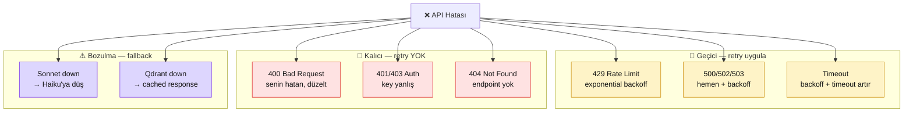

# 8.5 Hata Yönetimi — Retry, Circuit Breaker, Fallback

<div class="ma-meta" markdown>
<div class="ma-meta-row" markdown>
<strong>Kim için:</strong>
<span class="ma-persona ma-persona-baslangic">🟢 başlangıç</span>
<span class="ma-persona ma-persona-is">🔵 iş</span>
<span class="ma-persona ma-persona-kisisel">🟣 kişisel</span>
</div>
<div class="ma-meta-row"><strong>📋 Önkoşul:</strong> 8.1-8.4 okundu. Canlı projen (9.4 veya 9.5) log üretiyor, Anthropic Console hard cap açık.</div>
<div class="ma-meta-row"><strong>🎯 Çıktı:</strong> 3 seviye hata savunma kuruldu — **retry** (geçici hataları otomatik tekrarla), **circuit breaker** (tekrar başarısızlıkta servisi geçici kapat), **fallback** (Sonnet çalışmazsa Haiku'ya düş). Tenacity library refleksi. Timeout disiplin. 9.4 + 9.5 için ayrı hata desenleri. **Sessiz başarısızlık** (9.5 cron) riski sıfırlandı.</div>
</div>

!!! tip "Yabancı kelime mi gördün?"
    **Retry** = başarısız çağrıyı tekrar dene. **Exponential backoff** = tekrarlar arası süreyi kat be kat artır (1s, 2s, 4s, 8s). **Jitter** = backoff süresine rastgele katkı; birçok client aynı anda tekrar etmesin diye. **Circuit breaker** = sigorta; peş peşe başarısızlıkta servisi geçici kapat. **Fallback** = ana servis çalışmazsa yedek servise düş. **Dead letter queue** = işlenemeyen mesajların saklandığı yer; sonradan incelenir.

## Neden bu sayfa?

8.4'te log + metric kurdun. Log'da **hatalar görünür olacak**. Bu sayfada o hataları nasıl **yakalıyıp** çözeceğini öğreniyorsun:

- **Anthropic API 429 (rate limit)** — saniyede çok istek → bekle + tekrar dene (retry)
- **Anthropic API 500 (server error)** — Anthropic tarafı geçici → hemen tekrar dene
- **Anthropic API timeout** — ağ gecikmesi → backoff ile tekrar
- **Peş peşe 5 hata** → servisi geçici kapat (circuit breaker)
- **Claude Sonnet down** → Haiku'ya düş (fallback)

Bu davranışlar **otomatik** olmalı — her hatada elle müdahale imkansız. 9.5 agent saat başı çalışır, gece 03:00'da rate limit'e takılırsa ne olacak? Bu sayfanın cevabı.

İkincisi: **Yanlış retry cehennem yaratır.** Sonsuz retry + her retry $0.03 çağrı → 10.000 retry = $300 fatura, hiçbir cevap. 8.3'teki hard cap bunu sınırlar ama doğru retry disiplini ilk başta gerekli.

Üçüncüsü: Bu sayfa **Bölüm 8'in 5. sayfası** — sonraki sayfa **8.6 Production Checklist (imza sayfası)**. 8.6 bu sayfanın uygulama kontrol listesi; burada kavramı öğren, 8.6'da her canlı projene çalıştırırsın.

## Hata taksonomisi — 4 tip

<div class="ma-ekosistem" markdown>
<div class="ma-ekosistem-header">🗺️ AI servis hata tipleri + savunma tercihi</div>



**Kritik ayrım:**

- **Geçici (4xx=429, 5xx)**: retry uygula. Çoğu zaman 2. veya 3. denemede başarılı.
- **Kalıcı (4xx ≠ 429)**: retry İŞE YARAMAZ. Request zaten yanlış; tekrarlamak aynı hata.
- **Bozulma**: ana servis ölü, yedeğe düş.

Yanlış retry (kalıcı hataları retry etmek) fatura patlatır + log'ı spam'ler.

</div>

## Retry — Tenacity ile

[Tenacity](https://tenacity.readthedocs.io/) Python'da retry standartı.

### Temel kullanım

```python
# pip install tenacity==9.1.4
from tenacity import retry, stop_after_attempt, wait_exponential, retry_if_exception_type
import anthropic

client = anthropic.Anthropic()


@retry(
    stop=stop_after_attempt(3),           # Max 3 deneme
    wait=wait_exponential(multiplier=1, min=1, max=10),  # 1s, 2s, 4s...
    retry=retry_if_exception_type((
        anthropic.RateLimitError,          # 429
        anthropic.APIConnectionError,       # Network
        anthropic.APIStatusError,           # 5xx
    )),
    reraise=True,                          # 3. denemede de başarısız → exception fırlat
)
def claude_cagir(prompt: str) -> str:
    response = client.messages.create(
        model="claude-sonnet-4-6",
        max_tokens=512,
        messages=[{"role": "user", "content": prompt}],
    )
    return response.content[0].text
```

**Ne oluyor:**

- İlk çağrı 429 alırsa → 1 saniye bekle, tekrar dene
- 2. deneme yine 429 → 2 saniye bekle
- 3. deneme → 4 saniye bekle (exponential)
- 3. deneme de başarısız → exception fırlat

**Kalıcı hatalar** (400, 401): `retry_if_exception_type` listede yok → hemen fırlatılır, retry yok.

### Jitter — çakışma önle

Çok client aynı anda 429 aldıysa hepsi aynı 1/2/4 saniyede tekrar denemeye gelir → **herd effect** (sürü etkisi). Çözüm: jitter:

```python
from tenacity import wait_exponential_jitter

@retry(
    stop=stop_after_attempt(3),
    wait=wait_exponential_jitter(initial=1, max=10),  # 1s ± rand, 2s ± rand...
    retry=retry_if_exception_type((anthropic.RateLimitError, anthropic.APIConnectionError)),
)
def claude_cagir(prompt: str) -> str:
    ...
```

Her retry **farklı** zamanda gelir, aynı saniyede 100 istek olmaz.

### Async version

```python
from tenacity import retry, stop_after_attempt, wait_exponential_jitter

@retry(
    stop=stop_after_attempt(3),
    wait=wait_exponential_jitter(initial=1, max=10),
)
async def claude_cagir_async(prompt: str) -> str:
    async with anthropic.AsyncAnthropic() as client:
        response = await client.messages.create(...)
        return response.content[0].text
```

Aynı decorator async fonksiyonda da çalışır.

### Callback — her deneme log

```python
from tenacity import retry, before_sleep_log
import logging

log = logging.getLogger("retry")

@retry(
    stop=stop_after_attempt(3),
    wait=wait_exponential_jitter(initial=1, max=10),
    before_sleep=before_sleep_log(log, logging.WARNING),
)
def claude_cagir(prompt: str) -> str:
    ...
```

Her retry öncesi log'a WARNING yazar:
```
WARNING retry: Retrying claude_cagir in 2.3 seconds due to RateLimitError
```

8.4'teki structured log'a trace_id ile entegre → hangi istek tekrar etti görünür.

## Timeout disiplin

Retry ile beraber **timeout** olmalı. Timeout yoksa tek istek 60 saniye takılır, retry 3× → 3 dakika bekleme → kullanıcı çıkar.

```python
client = anthropic.Anthropic(timeout=30.0)  # 30 saniye max
```

Claude için sağlıklı timeout değerleri:

- **Haiku**: 10-15 saniye (hızlı model)
- **Sonnet**: 20-30 saniye (orta)
- **Opus**: 45-60 saniye (yavaş ama derin)

**Streaming** kullanıyorsan timeout ilk token için, toplam için **infinite** olabilir:

```python
# Streaming
with client.messages.stream(
    model="claude-sonnet-4-6",
    messages=[...],
    max_tokens=1024,
) as stream:
    for text in stream.text_stream:
        yield text
# İlk token için client timeout (30s) geçerli
# Toplam yanıt 90 saniye sürebilir — streaming'in avantajı
```

## Circuit breaker — sigorta atışı

Peş peşe başarısızlıkta retry **bile işlemiyor**. Anthropic outage'ı ise 30 dakika sürebilir. Her istek 30 saniye bekleyip 429 alırsa çok vakit + token harcar. Circuit breaker: peş peşe X hata sonrası servisi **kapatır**, direkt exception döner:

```python
# pip install pybreaker==1.4.1
import pybreaker
import anthropic

# Circuit breaker: 5 peş peşe başarısızlık → 60 saniye kapalı (OPEN)
claude_breaker = pybreaker.CircuitBreaker(
    fail_max=5,
    reset_timeout=60,
    exclude=[ValueError, KeyError],  # bu exception'lar fail saymaz
)

@claude_breaker
def claude_cagir(prompt: str) -> str:
    response = client.messages.create(...)
    return response.content[0].text


# Test — 5 hata sonrası
for i in range(10):
    try:
        sonuc = claude_cagir("test")
    except pybreaker.CircuitBreakerError:
        # Circuit açık, istek Anthropic'e bile gitmedi
        print("Circuit açık, 60 saniye bekle")
        break
    except anthropic.RateLimitError:
        print(f"{i}: RateLimit")
```

**3 durum:**

- **CLOSED** (normal): İstekler geçer, başarılı/başarısız sayılır.
- **OPEN** (sigorta atmış): 5 başarısızlık sonrası. 60 saniye boyunca **hiçbir istek gitmez**, anında `CircuitBreakerError`.
- **HALF_OPEN** (test): 60 saniye sonra 1 istek dener. Başarılı → CLOSED. Başarısız → tekrar OPEN.

**Retry vs circuit breaker ilişkisi:**

- Retry + circuit breaker **birlikte** kullanılır.
- Retry: geçici hataları tek çağrıda tekrarlar (3 deneme).
- Circuit breaker: **birden çok çağrı** boyunca hata say. 5 çağrıda 5 başarısızlık = servis gerçekten düştü → kapat.

## Fallback — yedek model zinciri

Anthropic Sonnet down (nadir ama olur). Servisin çalışsın:

```python
from anthropic import Anthropic, APIError

client = Anthropic()

MODEL_ZINCIRI = [
    "claude-sonnet-4-6",    # İlk tercih (kalite)
    "claude-haiku-4-5",     # Yedek (daha ucuz + hızlı)
]


def claude_cevapla_fallback(prompt: str) -> str:
    """Ana model down ise Haiku'ya düş."""
    son_hata = None
    for model in MODEL_ZINCIRI:
        try:
            response = client.messages.create(
                model=model,
                max_tokens=512,
                messages=[{"role": "user", "content": prompt}],
            )
            if model != MODEL_ZINCIRI[0]:
                log.warning(f"Fallback: {MODEL_ZINCIRI[0]} yerine {model} kullanıldı")
            return response.content[0].text
        except APIError as e:
            log.error(f"{model} başarısız: {e}")
            son_hata = e
            continue

    # Tüm modeller başarısız
    raise RuntimeError("Tüm modeller başarısız") from son_hata
```

**Varyasyonlar:**

- **Tam fallback:** Claude down → OpenAI GPT'ye düş. Proje OpenAI-uyumlu arayüz (LangChain veya manuel) kullanıyorsa.
- **Cache fallback:** Son bilinen iyi cevap Redis'te. LLM çağırmayı bile denemeden o cevap.
- **Static fallback:** "Sistem şu an yoğun, 5 dakika sonra dener misiniz?" — kullanıcıya dürüst cevap.

## Graceful degradation — parça parça bozulma

RAG Chatbot'ta iki dış bağımlılık: Qdrant + Claude. Qdrant down ise:

```python
async def rag_cevapla(soru: str) -> str:
    """RAG retrieval başarısız olursa LLM'e sadece soruyu gönder."""
    try:
        chunks = await qdrant_ara(soru)
        context = "\n\n".join(chunks)
        prompt = f"Kaynaklar:\n{context}\n\nSoru: {soru}"
    except (qdrant_client.ApiException, ConnectionError) as e:
        log.error(f"Qdrant başarısız, RAG'siz cevap: {e}")
        # Graceful: Qdrant yok, sadece LLM ile devam
        prompt = f"Soru: {soru}\n\n(Not: şu an kaynakları okuyamıyorum, genel bilgi.)"

    return await claude_cevapla_fallback(prompt)
```

Kullanıcı "sistem çöktü" yerine **daha az iyi ama çalışan** cevap alır. "Working Okay" > "Perfect or Broken."

## 9.5 agent için özel: dead letter queue

9.5 cron agent saat başı 10-15 haber işler. Bir haber Anthropic'ten sürekli hata alırsa ne olur?

```python
# pipeline.py
async def isle_haber(haber: Haber):
    try:
        ozet = await ozet_yaz(haber)          # yazar
        puan = await puanla(ozet)              # evaluator
        return haber, ozet, puan
    except Exception as e:
        # 3 retry sonrası hala başarısız
        log.error(f"Haber işlenemedi: {haber.url}", extra={"error": str(e)})
        # DLQ'ya yaz
        conn.execute(
            "INSERT INTO dead_letter (haber_url, hata, ts) VALUES (?, ?, ?)",
            (haber.url, str(e), datetime.utcnow().isoformat()),
        )
        conn.commit()
        return None  # Bu haber atlanır, pipeline devam
```

**Dead letter queue** (DLQ) — ölmüş iş kaydı. Her sabah manuel bakarsın:

```sql
SELECT haber_url, hata, COUNT(*) as count
FROM dead_letter
WHERE ts > date('now', '-1 day')
GROUP BY hata
ORDER BY count DESC;
```

Aynı hata tekrarlıyorsa **sistem problemi**. Tek tük hata ise **geçici**. Yeniden işlemek istersen:

```python
# reprocess_dlq.py
async def reprocess():
    rows = conn.execute("SELECT haber_url FROM dead_letter WHERE ts > date('now', '-7 day')").fetchall()
    for (url,) in rows:
        try:
            await isle_haber(Haber(url=url, ...))
            conn.execute("DELETE FROM dead_letter WHERE haber_url = ?", (url,))
        except:
            pass  # hala başarısız, DLQ'da kal
```

## Graceful shutdown — SIGTERM yakalama

VPS reboot veya `docker compose restart` sırasında Uvicorn/cron agent **inflight isteği tamamlamadan** kapatılmamalı. FastAPI lifespan:

```python
# app/main.py
from contextlib import asynccontextmanager
import signal

@asynccontextmanager
async def lifespan(app):
    # Startup
    app.state.qdrant = QdrantClient(...)
    app.state.voyage = VoyageClient(...)
    log.info("app_started")
    yield
    # Shutdown
    log.info("app_stopping")
    await app.state.qdrant.close()
    log.info("app_stopped")

app = FastAPI(lifespan=lifespan)
```

Uvicorn SIGTERM aldığında: (1) yeni istek kabul etmez, (2) inflight istekleri tamamlar, (3) lifespan shutdown çalışır, (4) process çıkar. Systemd:

```ini
[Service]
KillMode=mixed
KillSignal=SIGTERM
TimeoutStopSec=30
```

`TimeoutStopSec=30` — 30 saniye boyunca graceful shutdown. Sonrası SIGKILL (force).

## Custom exception hiyerarşisi

Her hatayı `Exception` olarak yakalamak kabadır. Kendi exception yapısı:

```python
# app/errors.py
class AppError(Exception):
    """Uygulama hata taban sınıfı."""

class RetryableError(AppError):
    """Geçici hata, retry denenebilir."""

class PermanentError(AppError):
    """Kalıcı hata, retry anlamsız."""

class ExternalServiceError(RetryableError):
    """Dış servis hatası (Claude, Qdrant, Voyage)."""

class ValidationError(PermanentError):
    """Kullanıcı girdisi yanlış."""


# Kullanım
try:
    sonuc = await risky_function()
except RetryableError as e:
    # Retry decorator yakalayacak
    raise
except PermanentError as e:
    # Kullanıcıya 400 dön
    raise HTTPException(400, str(e))
except Exception as e:
    # Bilinmeyen hata, 500 + Sentry'e rapor et
    log.exception("unknown_error")
    raise HTTPException(500, "Internal server error")
```

Retry decorator da bu sınıflara göre davranır:

```python
@retry(retry=retry_if_exception_type(RetryableError))
def do_work():
    ...
```

## CTO tuzakları — 10 hata yönetimi hatası

| # | Tuzak | Sonuç | Doğru |
|---|---|---|---|
| 1 | Sonsuz retry | $1000 fatura + kilitli | `stop_after_attempt(3)` zorunlu |
| 2 | Jitter yok | Herd effect, servis tekrar düşer | `wait_exponential_jitter` |
| 3 | Timeout yok | 1 istek 60 sn takılır | `Anthropic(timeout=30)` |
| 4 | Her exception retry | 400 bad request de retry'lanır | `retry_if_exception_type` spesifik |
| 5 | Circuit breaker yok | 10 dk outage'da $100 fatura | `pybreaker` 5 fail → 60s açık |
| 6 | Fallback zinciri yok | Sonnet down → tam kesinti | Haiku fallback |
| 7 | DLQ yok | Başarısız işler sessiz kayıp | SQLite `dead_letter` tablo |
| 8 | Graceful shutdown yok | Deploy sırasında request düşer | lifespan + SIGTERM |
| 9 | Generic `except Exception` | Her hata aynı | Custom hierarchy |
| 10 | Retry log yok | Neden yavaş bilemezsin | `before_sleep_log` + trace_id |

## Anthropic SDK hata tipleri

<details class="ma-anthropic-oz" markdown>
<summary><strong>🤖 Anthropic-öz: SDK exception hiyerarşisi</strong></summary>

[anthropic-sdk-python](https://github.com/anthropics/anthropic-sdk-python) exception sınıfları:

```
anthropic.APIError (base)
├── anthropic.APIConnectionError     # Network
│   └── anthropic.APITimeoutError    # Timeout
├── anthropic.APIStatusError         # HTTP status
│   ├── anthropic.BadRequestError    # 400
│   ├── anthropic.AuthenticationError # 401
│   ├── anthropic.PermissionDeniedError # 403
│   ├── anthropic.NotFoundError      # 404
│   ├── anthropic.UnprocessableEntityError # 422
│   ├── anthropic.RateLimitError     # 429 ⭐ en yaygın
│   └── anthropic.InternalServerError # 5xx
└── anthropic.APIResponseValidationError
```

**Hangisi retry edilir:**

| Exception | Retry? | Neden |
|---|---|---|
| `APIConnectionError` | ✅ | Network geçici |
| `APITimeoutError` | ✅ | Timeout geçici |
| `RateLimitError` (429) | ✅ | Anthropic "biraz bekle" diyor |
| `InternalServerError` (5xx) | ✅ | Anthropic tarafı geçici |
| `BadRequestError` (400) | ❌ | Senin request yanlış |
| `AuthenticationError` (401) | ❌ | Key yanlış |
| `PermissionDeniedError` (403) | ❌ | Yetki yok |

**Retry helper:**

```python
RETRY_ERRORS = (
    anthropic.APIConnectionError,
    anthropic.APITimeoutError,
    anthropic.RateLimitError,
    anthropic.InternalServerError,
)

@retry(retry=retry_if_exception_type(RETRY_ERRORS), ...)
def claude_cagir(prompt):
    ...
```

**Retry-After header:**

Anthropic 429 response'unda `retry-after` header döner (saniye). Ideal `wait` ona göre ayarlanmalı:

```python
from tenacity import wait_incrementing

@retry(
    stop=stop_after_attempt(3),
    wait=wait_exponential_jitter(initial=1, max=30),
    # Basit versiyon — retry-after kullanmıyor
    # İleri seviye: wait_chain(retry-after'dan oku, sonra backoff)
    retry=retry_if_exception_type(RETRY_ERRORS),
)
def claude_cagir(prompt):
    ...
```

**Tavsiye:** Anthropic resmi **anthropic-python** SDK'sında **built-in retry** var. `Anthropic(max_retries=3)` parametresi basit retry yapar. Ama özel davranış için (jitter, log, circuit breaker) tenacity + pybreaker ekstra.

</details>

## Çıktı kanıtları — 3 kanıt

<div class="ma-cikti-kaniti" markdown>
<div class="ma-cikti-kaniti-header">📏 Çıktı — 3 kanıt</div>

**1. Retry + timeout:**

`app/claude_client.py` içinde tenacity decorator + `Anthropic(timeout=30)`. Test: `429` mock → 3 retry + jitter + log. Kod + test.

**2. Circuit breaker:**

`pybreaker.CircuitBreaker(fail_max=5, reset_timeout=60)` Claude call'a wrap. Test: 5 peş peşe 500 → 6. çağrı `CircuitBreakerError` (hiç Anthropic'e gitmez).

**3. Fallback zinciri + DLQ:**

Model zinciri (Sonnet → Haiku) kodu var. 9.5 agent DLQ tablosu oluşturuldu, son 24 saatte başarısız işler kayıtlı.

**Kanıt klasörü:** `muhendisal-notlarim/bolum-8/05-hata-yonetimi/`

</div>

## Görev — 60 dk retry + circuit + fallback

<div class="ma-gorev" markdown>
<div class="ma-gorev-header">🎯 Görev — 3 seviyeli savunma kur</div>

1. `pip install tenacity==9.1.4 pybreaker==1.4.1` ekle.
2. `app/claude_client.py` oluştur:
   - `client = Anthropic(timeout=30)`
   - `@retry` decorator (exponential jitter + 3 attempt + trace log)
   - `@claude_breaker` (pybreaker 5 fail → 60s open)
3. Fallback zinciri `MODEL_ZINCIRI = ["claude-sonnet-4-6", "claude-haiku-4-5"]`.
4. `app/errors.py` custom exception hiyerarşisi (RetryableError / PermanentError).
5. 9.5 için `dead_letter` SQLite tablo ekle + DLQ insert helper.
6. Test: 3 çağrıyı mock rate limit ile dene, retry + log kanıt.
7. lifespan graceful shutdown test: Ctrl+C sonra "app_stopped" log.

**Başarı kriteri:** 1 saat sonra canlı projen 429/500/timeout'ları **otomatik** yönetir, 10 dakika Anthropic outage'ında fatura şoku yok, 9.5 agent DLQ ile sessiz başarısızlıktan korunur.

</div>

<div class="ma-neden-sonuc" markdown>
<div class="ma-neden-sonuc-header">🔗 Birlikte okuma — neden ne oldu</div>

- **A → B:** 4 hata tipi (geçici/kalıcı/bozulma) farklı savunma gerekir; retry her yere uygulanmaz.
- **B → C:** Tenacity + `retry_if_exception_type` + jitter + `before_sleep_log` — 4 satır decorator.
- **C → D:** Timeout retry olmadan anlamsız (30 sn hedef, Haiku 10-15, Opus 45-60).
- **D → E:** Circuit breaker (pybreaker) peş peşe 5 fail → 60s kapalı; retry ile birlikte tamamlayıcı.
- **E → F:** Fallback model zinciri (Sonnet → Haiku); graceful degradation (Qdrant ölü → LLM tek başına).
- **F → G:** 9.5 agent DLQ SQLite tablo; sessiz başarısızlık engeli.
- **G → H:** Graceful shutdown lifespan + systemd SIGTERM + TimeoutStopSec=30.
- **H → I:** Custom exception hiyerarşisi (RetryableError / PermanentError) retry decorator'ı kalibre eder.

<div class="ma-neden-sonuc-sonuc" markdown>
**Sonuç:** 3 seviye hata savunması aktif. 429/500/timeout otomatik retry, outage'da circuit açar, ana model down ise yedeğe düşer. Canlı projen **dayanıklı**. Sonraki (8.6): Bölüm 8 imza sayfası — 15 maddeli production checklist, senin projene birebir çalıştırma.
</div>
</div>

<div class="ma-sonraki" markdown>
<div class="ma-sonraki-header">➡️ Sonraki adım</div>

**[8.6 Production Checklist →](06-checklist.md)** — Bölüm 8 İMZA SAYFASI. 15 maddeli pre-launch checklist + her maddenin kanıtı.

← [8.4 Loglama ve İzleme](04-loglama.md) &nbsp;|&nbsp; [Bölüm 8 girişi](index.md) &nbsp;|&nbsp; [Ana sayfa](../index.md)

**Pekiştirme:** [Tenacity docs](https://tenacity.readthedocs.io/) + [pybreaker README](https://github.com/danielfm/pybreaker) + [Anthropic SDK errors](https://github.com/anthropics/anthropic-sdk-python#errors). Üçünü bir hafta sonu oku, production refleksin tamam olur.
</div>
