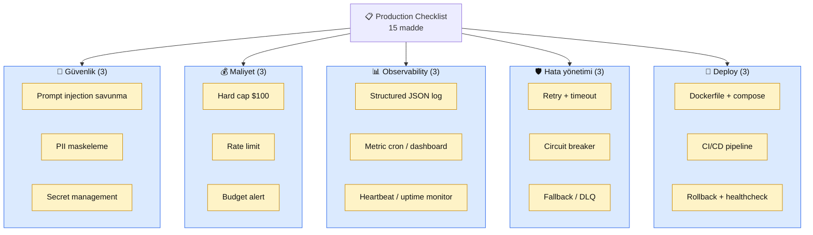

# 8.6 Production Checklist — Bölüm 8 İMZA SAYFASI

<div class="ma-meta" markdown>
<div class="ma-meta-row" markdown>
<strong>Kim için:</strong>
<span class="ma-persona ma-persona-baslangic">🟢 başlangıç</span>
<span class="ma-persona ma-persona-is">🔵 iş</span>
<span class="ma-persona ma-persona-kisisel">🟣 kişisel</span>
</div>
<div class="ma-meta-row"><strong>⏱️ Süre:</strong> ~25 dakika</div>
<div class="ma-meta-row"><strong>📋 Önkoşul:</strong> Bölüm 8'in tamamı (8.1-8.5) okundu. Canlı projen (9.4 veya 9.5) deploy edilmiş veya edilmek üzere.</div>
<div class="ma-meta-row"><strong>🎯 Çıktı:</strong> **15 maddeli pre-launch checklist** senin projene çalıştırılmış, her maddenin yanında **kanıt** (komut çıktısı, screenshot, commit SHA). Canlıya çıkmaya **objektif olarak** hazır — 15 madde dolu ise "GO", herhangi biri eksik ise "NO-GO". Bu sayfa Bölüm 8'in imza sayfası — 5 kategoride (güvenlik/maliyet/observability/hata/deploy) her biri 3 madde. **Platform'un ikinci imza sayfası** (ilki 9.4 RAG Chatbot portföy).</div>
</div>

!!! tip "Yabancı kelime mi gördün?"
    **Pre-launch** = canlıya çıkmadan önce. **Checklist** = kontrol listesi; havacılıktan gelen disiplin, her maddeyi atlatmadan uygulama. **GO/NO-GO** = uçuş öncesi karar; tüm maddeler yeşil ise GO, herhangi biri kırmızı ise NO-GO. **Smoke test** = canlıya çıkınca ilk 5 dakika temel fonksiyon kontrolü. **Rollback** = bozukluğu görüp önceki sürüme geri dönme.

## Neden bu sayfa?

Bölüm 8'de 5 sayfa boyunca **güvenlik + etik + maliyet + observability + hata yönetimi** öğrendin. Teorik olarak biliyorsun. **Pratikte uyguladın mı?**

Bu sayfa **objektif** test — 15 madde, her biri evet/hayır cevabı, her biri **kanıt** gerektiriyor. "Evet uyguladım" yetmez, kanıt ("komut çıktısı X", "screenshot Y", "commit Z") gerekli. Kanıt olmazsa madde geçmemiş sayılır.

İkincisi: Bu sayfa **havacılık disiplin** ile yazıldı. Pilot uçağa binmeden önce 50+ maddelik checklist'ten geçer — bildiği şeyleri bile işaretler. Tek eksik madde kaza sebebi olabilir. AI sistem de benzer — 14/15 madde yeterli değil, **15/15 ise GO**.

Üçüncüsü: Bu sayfa **platform'un imza sayfalarından biri.** İlk imza 9.4 RAG Chatbot portföy. İkinci imza burada — öğrenci tamamladığında Bölüm 8'in kapanışını kanıtlamış olur. Bu iki imza + 3.5 Semantic Search + 9.5 Agent + 9.7 Portföy Paketleme birlikte **Kemal hedefi ("sondan AI Engineer çıkar") objektif kriterleri.**

## Checklist'in mantığı — 5 kategori × 3 madde

<div class="ma-ekosistem" markdown>
<div class="ma-ekosistem-header">🗺️ 15 madde — 5 kategori</div>



**Her kategori 3 madde**, her madde **kanıt formatı** net. Tablo aşağıda.

</div>

## Kategori 1 — Güvenlik (8.1 + 8.2 referans)

### Madde G1 — Prompt injection savunma aktif

**Ne:** Sistem prompt sertleştirildi + Pydantic input validation + output sanitization + (mümkünse) `tool_choice` structured output.

**Kanıt:**
- Kod: `app/prompts.py` system prompt 5 kurallı (rol kilidi, injection reddi, prompt sızdırma reddi, link kontrolü, 3-cümle limit). Commit SHA.
- Kod: `app/main.py` veya `app/validation.py` `SoruInput` Pydantic model (`min_length`, `max_length`, `field_validator` ile injection pattern red).
- Kod: Output sanitization (`bleach` HTML temizleme veya `tool_choice` zorunlu).
- Test: Red team 10 soru (8.1 sayfasındaki) — en az 8 reddedilmiş. Log dosyası kanıt.

**Eksikse:** Canlıya çıkma. Önce 8.1'i tekrar oku, uygula.

### Madde G2 — PII log + DB'de maskelenmiş

**Ne:** Kullanıcı input'undaki PII (email, telefon, TC, kredi kartı) log'a + DB'ye yazılmıyor veya maskelenmiş yazılıyor.

**Kanıt:**
- `pip install presidio-analyzer` kurulu.
- `app/privacy.py` `maskele_pii()` ve `log_safe()` fonksiyonları.
- Test: `"Ben Ali, telefonum 0532 123 45 67"` input → log'da `"Ben <PERSON>, telefonum <PHONE_NUMBER>"`.
- KVKK rıza formu (varsa) kullanıcı arayüzünde — "Verim yurtdışı AI servisi tarafından işlenebilir, kabul ediyorum" checkbox'ı.

**Eksikse:** KVKK + GDPR riski; kişisel veri işleyen proje → ihlal. Mutlaka uygula.

### Madde G3 — Secret management 4 katman

**Ne:** API key'ler lokal (`.env` + `.gitignore`) + CI (GitHub Secrets) + VPS runtime (systemd EnvironmentFile) + pre-commit hook (detect-secrets) disiplinle yönetiliyor.

**Kanıt:**
- `.gitignore` içinde `.env` var; `git ls-files | grep -i env` → sadece `.env.example` döner.
- VPS'te `ls -la /home/deploy/app/.env` → `-rw------- 1 deploy deploy` (chmod 600).
- GitHub Secrets → `ANTHROPIC_API_KEY_PROD` + `VOYAGE_API_KEY` (screenshot).
- `.pre-commit-config.yaml` + `.secrets.baseline` repo'da commit'li.
- Test: Fake key (`sk-ant-api03-FAKE-TEST-XXX`) commit dene → pre-commit reddeder.

**Eksikse:** Key sızıntısı riski; scan bot 5 dk içinde yakalar. İlk gün kur.

## Kategori 2 — Maliyet (8.3 referans)

### Madde M1 — Anthropic Console hard cap $100 aktif

**Ne:** Aylık hard cap (sessiz) + alert threshold'lar kurulu.

**Kanıt:**
- Anthropic Console → Limits → "Monthly spending limit $100" ve "Alert thresholds $25/$50/$75" ekran görüntüsü.
- Email notification aktif (test email gelip gelmediği).
- Proje başına **ayrı key + ayrı cap** (9.4 $60, 9.5 $40 örnek blast radius sınırlama).

**Eksikse:** Gece $4000+ fatura riski. İlk 5 dakika iş.

### Madde M2 — Client-side rate limit (slowapi + Redis)

**Ne:** Uygulama tarafında rate limit; IP başı + user ID başı iki katman. Redis backend (multi-worker uyumu).

**Kanıt:**
- `pip list` → `slowapi` + `redis` var.
- `app/main.py` `Limiter(storage_uri="redis://...")` + `@limiter.limit("5/minute")` endpoint'lerde.
- `compose.yml`'de `redis` servisi.
- Test: 6 istek at (curl loop), 6. istek `429 Too Many Requests` döner. Log kanıt.
- Token budget Redis sayaç (günlük N token/user) — opsiyonel ama önerilir.

**Eksikse:** Kötü niyetli kullanıcı veya bug saniyede 100 istek atar, Console hard cap olsa bile gereksiz maliyet.

### Madde M3 — Budget alert cron + email

**Ne:** Kendi tarafında (Console'dan bağımsız) günlük maliyet takibi + eşik email.

**Kanıt:**
- `app/cost.py` `hesapla_maliyet()` fonksiyonu + Redis `cost:YYYY-MM` artırım.
- `/etc/cron.d/budget-alert` günlük 09:00 script.
- Son email (eşik geçilmiş veya manuel test).

**Eksikse:** Console alert 30-60 dk gecikme; kritik durumda geç.

## Kategori 3 — Observability (8.4 referans)

### Madde O1 — Structured JSON log + trace ID

**Ne:** Her log satırı JSON. Her istek `trace_id` taşıyor. PII maskelenmiş.

**Kanıt:**
- `tail -1 app.log | jq .` → valid JSON, `ts`, `level`, `trace_id`, `user_id` key'leri var.
- `app/logging_setup.py` veya `structlog.configure(...)` commit'li.
- TraceIDMiddleware kurulu (FastAPI'de `app.add_middleware(TraceIDMiddleware)`).
- Response header'da `X-Trace-ID: req_XXX` döner.

**Eksikse:** Hata debug saatler sürer; bir kullanıcı "hata aldım" dediğinde trace yapamazsın.

### Madde O2 — Metric cron veya Grafana dashboard

**Ne:** Error rate + p95 latency + token/saat metrikleri **sürekli görünür**.

**Kanıt (küçük proje):**
- `scripts/daily_report.sh` jq + awk + mail cron.
- Son email kutunda 3 günlük raporlar: `"error rate: 0.4%, p95: 1200ms, token: 45K/gün"`.

**Kanıt (orta-büyük):**
- Grafana dashboard URL (ekran görüntüsü) — aynı 3 metrik canlı.
- Loki datasource bağlı, LogQL query örneği.

**Eksikse:** Trend bozulduğunda (p95 2× arttı) haberin olmaz; canlı durumun sübjektif.

### Madde O3 — Heartbeat veya uptime monitor (9.5 için kritik)

**Ne:** 9.5 agent (cron/systemd timer) çalışıyor mu **otomatik** kontrol. Uptime Kuma / Sentry / basit cron alert.

**Kanıt:**
- Agent sonunda `last_success.txt` yazımı (timestamp).
- Monitor cron (`/etc/cron.d/agent-heartbeat`) 2+ saat eşiği — email.
- VEYA Uptime Kuma dashboard URL + heartbeat push.
- VEYA Sentry project + son 7 gün event log.
- Test: Agent manuel kapat, 2 saat bekle, alert email geldi.

**Eksikse:** Agent 3 gün sessiz durur, farkında olmazsın; rapor üretmez.

## Kategori 4 — Hata yönetimi (8.5 referans)

### Madde H1 — Retry + timeout

**Ne:** Tenacity decorator ile geçici hatalar otomatik retry (3 deneme, exponential jitter). Anthropic client 30s timeout.

**Kanıt:**
- `pip list` → `tenacity` var.
- `app/claude_client.py` `@retry(stop_after_attempt(3), wait=wait_exponential_jitter, retry=retry_if_exception_type(RETRY_ERRORS))` decorator.
- `Anthropic(timeout=30)` client konstruktörü.
- Test: mock `RateLimitError` → 3 retry + jitter + log kanıt.

**Eksikse:** 429/500 anında fail → kullanıcı hata görür. Geçici Anthropic outage'ta servisin durur.

### Madde H2 — Circuit breaker

**Ne:** `pybreaker` ile peş peşe 5 başarısızlıkta servisi 60s kapat.

**Kanıt:**
- `pip list` → `pybreaker` var.
- `app/claude_client.py` `@claude_breaker` decorator (5 fail, 60s reset).
- Test: mock 5 `InternalServerError` → 6. çağrı `CircuitBreakerError` (Anthropic'e istek gitmedi).

**Eksikse:** 10 dk outage'da 600 istek × 3 retry = 1800 gereksiz çağrı → $10-50 gereksiz fatura.

### Madde H3 — Fallback + DLQ

**Ne:** Ana model (Sonnet) down → Haiku fallback. 9.5 agent için dead letter queue.

**Kanıt:**
- `MODEL_ZINCIRI = ["claude-sonnet-4-6", "claude-haiku-4-5"]` kod.
- `claude_cevapla_fallback()` fonksiyonu (try next model in chain).
- 9.5 için: SQLite `dead_letter` tablosu `CREATE TABLE dead_letter (...)`.
- Test: mock Sonnet down → fallback Haiku log: `"Fallback: sonnet yerine haiku kullanıldı"`.
- 9.5 DLQ'da son 7 gün giriş sayısı log.

**Eksikse:** Sonnet outage'ta tam kesinti; 9.5 sessiz başarısızlık.

## Kategori 5 — Deploy (9.1 + 9.2 + 9.3 referans)

### Madde D1 — Dockerfile + compose.yml

**Ne:** Multi-stage Dockerfile, non-root user, healthcheck. Compose servisleri `127.0.0.1` bind, volume mount, env_file.

**Kanıt:**
- `Dockerfile` repo'da; `docker build -t app .` temiz geçer.
- `FROM python:3.12-slim` + `USER app` + `HEALTHCHECK` satırları.
- `compose.yml`'de `ports: - "127.0.0.1:8000:8000"` (dışa direkt expose yok, Caddy arkasında).
- `docker compose config --quiet` valid.

**Eksikse:** 9.2'deki sertleştirme kuralları eksik → güvenlik açıkları.

### Madde D2 — CI/CD pipeline aktif

**Ne:** `.github/workflows/ci.yml` her push'ta test + ruff + build. Optional: deploy.yml her main merge'te SSH ile VPS'e push.

**Kanıt:**
- `.github/workflows/ci.yml` commit'li; son 5 run yeşil.
- Badge README'de: ``.
- Optional: `deploy.yml` SSH_DEPLOY_KEY secret + deploy success log.

**Eksikse:** Her deploy elle; hata riski + zaman kaybı.

### Madde D3 — Healthcheck + rollback planı

**Ne:** `/health` endpoint + Docker/systemd healthcheck + rollback prosedürü yazılı.

**Kanıt:**
- `curl http://localhost:8000/health` → `200 OK` + `{"status": "ok", "git_sha": "abc123"}`.
- `docker compose ps` → healthy status.
- `ROLLBACK.md` veya README'de: "Deploy bozarsa: `git revert HEAD && git push` veya `docker compose pull prev-tag && docker compose up -d`."
- Deploy log'larında son 5 başarılı deploy + git SHA kaydı.

**Eksikse:** Canlı bozulduğunda panik; rollback 10 dk yerine 60 dk sürer.

## CHECKLIST — 15 madde form

<table class="ma-aktorler" markdown>

| # | Madde | Durum | Kanıt yerleşimi |
|---|---|---|---|
| G1 | Prompt injection savunma | ☐ | `app/prompts.py`, red team test log |
| G2 | PII maskeleme | ☐ | `app/privacy.py`, test input/output |
| G3 | Secret 4-katman | ☐ | `.gitignore`, GH Secrets, systemd, pre-commit |
| M1 | Console hard cap $100 | ☐ | Console screenshot |
| M2 | Rate limit slowapi + Redis | ☐ | 6. istek 429 log |
| M3 | Budget alert cron | ☐ | Email + cron entry |
| O1 | Structured JSON log + trace | ☐ | `app.log | jq .` |
| O2 | Metric dashboard/cron | ☐ | Rapor email veya Grafana URL |
| O3 | Heartbeat (9.5 için) | ☐ | Alert test emaili |
| H1 | Retry + timeout | ☐ | Tenacity decorator + mock test |
| H2 | Circuit breaker | ☐ | pybreaker + 5 fail test |
| H3 | Fallback + DLQ | ☐ | Model chain log + DLQ tablo |
| D1 | Dockerfile + compose | ☐ | `docker compose config` valid |
| D2 | CI/CD pipeline | ☐ | GH Actions green |
| D3 | Healthcheck + rollback | ☐ | `/health` 200 + ROLLBACK.md |

</table>

**Kullanım:**

1. Bu tabloyu `CHECKLIST.md` olarak projeye commit et.
2. Her maddeyi **sırayla** uygula.
3. Her maddeye `kanıt`ı yaz (komut çıktısı veya dosya referansı).
4. 15/15 dolduğunda GO.

## GO / NO-GO karar matrisi

<table class="ma-aktorler" markdown>

| Tamamlanan | Karar | Aksiyon |
|---|---|---|
| 15/15 | ✅ GO | Canlıya çıkart. İlk 24 saat yakın gözlem. |
| 13-14/15 | ⚠️ CONDITIONAL GO | Eksik maddeler **MUSKİN** olmamalı. Kabul edilebilir olan tek kategori: gelecek 7 gün içinde tamamlanır. |
| 10-12/15 | 🛑 NO-GO | Canlıya çıkma. 1-2 hafta daha çalış. |
| <10/15 | 🛑 Başa dön | Bölüm 8'i yeniden oku + uygula. |

</table>

**MUSTN'T BE incomplete (ASLA eksik kalamaz) 5 madde:**

- G3 (Secret management) — key sızıntısı bir gecede $1000+
- M1 (Hard cap) — fatura şoku engeli
- M2 (Rate limit) — saldırı savunması
- O1 (Log + trace) — hata debug mümkün değilse
- D3 (Rollback) — bozulduğunda geri dönüş yoksa panik

Bu 5 eksikse **her durumda NO-GO**. Diğer 10 madde bir miktar tolere edilebilir ama önerilmez.

## Launch sonrası ilk 24 saat

Canlıya çıktın. Sonraki 24 saat kritik:

### İlk 10 dakika — smoke test

```bash
# 5 temel işlev testi
curl https://senin-domain.com/health
curl https://senin-domain.com/ -X POST -d '{"soru": "test"}'
curl https://senin-domain.com/istatistik
# Her biri 200 OK dönmeli

# Log kontrol
ssh deploy@vps "tail -20 /home/deploy/app/app.log | jq ."
# Error yok, request_start + request_done log'ları var

# Resource kontrol
ssh deploy@vps "htop"
# CPU %50 altı, RAM kullanım normal
```

### İlk 2 saat — aktif gözlem

- Grafana/Loki dashboard (varsa) açık dur
- Slack/Telegram alert kanalı açık
- Her 30 dk `tail -f app.log | jq .` taraması
- İlk 3-5 gerçek kullanıcı isteği gözlemle — ne geliyor?

### İlk 24 saat — metrik analizi

- Saat başı error rate + p95 latency + token/saat trend
- Budget tahmini: 24 saatlik maliyet × 30 → aylık beklenen
- DLQ boş mu? (9.5 için)
- Circuit breaker hiç açıldı mı?

### İlk hafta — post-mortem hazır

Ne olursa olsun (sorun yoksa bile) **launch post-mortem** yaz:

```markdown
# Launch Post-Mortem — [Proje] — [Tarih]

## Planlanan vs gerçekleşen
- Plan: ...
- Gerçek: ...
- Sürpriz: ...

## İyi giden 3 şey
1. ...
2. ...
3. ...

## Düzeltilecek 3 şey
1. ...
2. ...
3. ...

## Sonraki 30 gün aksiyon
- [ ] ...
- [ ] ...
```

Bu dokümanı `LAUNCH.md` olarak commit et. 6 ay sonra başka proje launch edeceksen referans olur.

## 9.4 RAG Chatbot için checklist çalıştırma örneği

Örnek olarak 9.4 RAG Chatbot'a bu checklist'i uygula (15 madde, her biri kanıt):

```markdown
# CHECKLIST — rag-chatbot — 2026-04-XX

## Kategori 1 — Güvenlik
- [x] G1 Prompt injection: `app/prompts.py` + test-prompt-injection.md
- [x] G2 PII: presidio integrate + `log_safe()` + KVKK form
- [x] G3 Secret: `.gitignore` + GH Secrets + systemd env + detect-secrets

## Kategori 2 — Maliyet
- [x] M1 Hard cap $80: Anthropic Console screenshot → console-limits.png
- [x] M2 Rate limit: slowapi `/ara` 5/min, test → rate-limit-test.log
- [x] M3 Budget alert: cron 09:00 → budget-test-email.png

## Kategori 3 — Observability
- [x] O1 Structured log: `app/logging_setup.py` + trace_id örnek
- [x] O2 Metric: daily cron + email → daily-report-2026-04-XX.eml
- [ ] O3 Heartbeat: N/A (9.4 web servisi, cron değil)

## Kategori 4 — Hata yönetimi
- [x] H1 Retry + timeout: `app/claude_client.py` + mock test
- [x] H2 Circuit breaker: pybreaker 5/60s + test
- [x] H3 Fallback: MODEL_ZINCIRI Sonnet → Haiku + test log

## Kategori 5 — Deploy
- [x] D1 Dockerfile + compose: 9.4 referans proje kod
- [x] D2 CI/CD: .github/workflows/ci.yml + deploy.yml
- [x] D3 Healthcheck + rollback: /health + ROLLBACK.md

TOPLAM: 14/15 (O3 N/A — cron değil web servisi)

Karar: GO ✅ (O3 web servis için geçerli değil)
```

9.5 Agent için O3 **zorunlu** (cron çalışır), 9.4 için **N/A**.

## Anthropic ekosistemi — Production Readiness Review

<details class="ma-anthropic-oz" markdown>
<summary><strong>🤖 Anthropic-öz: enterprise PRR + Claude</strong></summary>

Anthropic ve büyük tech şirketler **Production Readiness Review (PRR)** yapar — senin bu checklist'in enterprise versiyonu. Google SRE Book'tan gelir, 50-100 madde olabilir.

**Büyük PRR'nin senin 15 madden üstüne eklediği:**

- **Disaster recovery** — veri merkezi yanınca servisi nasıl ayağa kaldırırsın? (küçük projede: cloud provider çoklu bölge)
- **Capacity planning** — 10× trafik gelirse sistem kaldırır mı? Yük testi (Locust).
- **Dependency review** — her 3. parti servis (Claude, Qdrant, Voyage) ne kadar bağımlıyız, alternatif nedir?
- **Security audit** — pentest + kod inceleme + compliance (SOC 2, ISO 27001)
- **Documentation** — runbook (her hata için ne yap), on-call rotation

Senin solo projen için bunlar **overkill**. 15 maddeli bu checklist eşik.

### Anthropic'in kendi "production" yayını

[Anthropic Responsible Scaling Policy (RSP)](https://www.anthropic.com/responsible-scaling-policy) Claude modellerinin "production'a çıkış" kriterleridir — AI Safety Levels (ASL-1 → ASL-4+). Her ASL için farklı güvenlik önlemi zorunlu.

Senin projen **Claude kullanıyorsa** Anthropic'in sağladığı güvenlik refleksinden (Constitutional AI + RSP) faydalanır. Bu kendi checklist'in **ek** — Claude tarafı güvenli, senin kodun güvenliği ayrı.

### Anthropic Console Claude's Operational Checklist (yayın yok, önerilir)

Anthropic resmi olarak "müşteri deploy checklist'i" yayınlamadı (2026 itibarıyla). Ama [Anthropic blog posts](https://www.anthropic.com/news) + [Claude docs](https://platform.claude.com/docs/) + community blog'lar (Simon Willison vs) ipuçları verir. Bu sayfanın 15 maddesi **endüstri standartı**na yakın.

</details>

## Platform'un son teknik sayfası

Bu sayfa Bölüm 8 kapanışı + **platform'un son teknik sayfası.** Bundan sonra:

- Bölüm 5 (RAG vs FT) — opsiyonel derinleşme
- Bölüm 7 (Multimodal) — opsiyonel
- Bölüm 10 (Kariyer) — teknik değil, kariyer detay
- Bölüm 9.6 (Multimodal imza) — Bölüm 7'ye bağlı

Yani **teknik olarak senin için platform tamam.** 2 canlı proje + 15 madde checklist dolu → AI Engineer pozisyonuna teknik hazırlığın **objektif** tamamlandı.

## Çıktı kanıtları — tek kanıt

<div class="ma-cikti-kaniti" markdown>
<div class="ma-cikti-kaniti-header">📏 Çıktı — büyük kanıt</div>

**CHECKLIST.md dolduruldu:**

Senin 9.4 veya 9.5 projen için 15 maddelik checklist tamamlandı. Her madde yanında:
- ☒ işareti
- Kanıt dosya yolu veya komut çıktısı
- Commit SHA (kod değişikliği gerektiren maddelerde)

Dosya: `CHECKLIST.md` projende commit'li.

Toplam: X/15. GO/NO-GO kararı yazılı.

**Bonus — LAUNCH.md:**

İlk 24 saat sonrası post-mortem yazıldı. 3 iyi giden + 3 düzeltilecek + 30 günlük aksiyon planı.

</div>

## Görev — 2-3 saat checklist çalıştırma

<div class="ma-gorev" markdown>
<div class="ma-gorev-header">🎯 Görev — kendi projene 15 madde uygula</div>

1. Projende `CHECKLIST.md` oluştur (yukarıdaki şablon).
2. **Kategori sırayla** her maddeyi uygula:
   - Eksikse: 8.1-8.5 ilgili sayfaya geri dön, uygula.
   - Varsa: kanıtı yaz, ☒ işaretle.
3. 15/15 veya N/A olmayan 15/15 dolduğunda commit.
4. Karar matrisine göre GO/NO-GO.
5. GO ise: launch sonrası ilk 24 saat gözlem.
6. 1 hafta sonra: `LAUNCH.md` post-mortem.

**Başarı kriteri:** 2-3 saat sonra kanıt dolu CHECKLIST.md projede commit'li, 15/15 GO karar.

</div>

<div class="ma-neden-sonuc" markdown>
<div class="ma-neden-sonuc-header">🔗 Birlikte okuma — neden ne oldu</div>

<ol class="ma-neden-sonuc-zincir" markdown>
<li>**A → B:** Bölüm 8 kavramları (güvenlik + etik + maliyet + observability + hata) checklist'e dönüştü. Bu yüzden **soyut → somut kontrol listesi.**</li>
<li>**B → C:** 5 kategori × 3 madde = 15 madde; her madde kanıt gerektirir. Bu yüzden **iddia değil, kanıt sayılır.**</li>
<li>**C → D:** G1-G2-G3 güvenlik (prompt injection + PII + secret); MUSTN'T BE incomplete. Bu yüzden **güvenlik zorunlu, tercihli değil.**</li>
<li>**D → E:** M1-M2-M3 maliyet (hard cap + rate limit + budget); fatura şoku engeli. Bu yüzden **maliyet kontrol sistematik.**</li>
<li>**E → F:** O1-O2-O3 observability (log + metric + heartbeat); sessiz başarısızlık engeli. Bu yüzden **görünmez hata yakalanır.**</li>
<li>**F → G:** H1-H2-H3 hata yönetimi (retry + circuit + fallback); outage dayanıklılığı. Bu yüzden **sistem tek nokta hataya dayanır.**</li>
<li>**G → H:** D1-D2-D3 deploy (Docker + CI/CD + rollback); standart production refleksi. Bu yüzden **deploy sürecinde sürpriz olmaz.**</li>
<li>**H → I:** GO/NO-GO karar matrisi; 5 zorunlu madde + 10 tolere edilebilir. Bu yüzden **ne zaman deploy? sorusu netleşir.**</li>
<li>**I → J:** Launch sonrası 10 dk/2 saat/24 saat/1 hafta gözlem + post-mortem. Bu yüzden **deploy bitti ≠ iş bitti.**</li>
</ol>

<div class="ma-neden-sonuc-sonuc" markdown>
**Sonuç:** Bölüm 8 kapandı — TAM 7/7. Canlıya çıkış **objektif kriter** ile yapılıyor. 15 madde checklist platform'un ikinci imza sayfası (ilki 9.4 RAG portföy). Kemal hedefi ("sondan AI Engineer çıkar") kriterleri daha da netleşti — 2 canlı proje + 15/15 checklist + LinkedIn strateji + topluluk bağlantısı.
</div>
</div>

<div class="ma-sonraki" markdown>
<div class="ma-sonraki-header">➡️ Sonraki adım</div>

**Bölüm 8 kapandı.** Platformun teknik parçaları tamam:

- **[10.2 Mülakat Soruları →](../bolum-10/02-mulakat.md)** — 30 soru + model cevap (henüz yazılıyor)
- **[5. Bölüm RAG vs FT →](../bolum-5/index.md)** — opsiyonel derinleşme
- **[7. Bölüm Multimodal →](../bolum-7/index.md)** — opsiyonel

← [8.5 Hata Yönetimi](05-hata-yonetimi.md) &nbsp;|&nbsp; [Bölüm 8 girişi](index.md) &nbsp;|&nbsp; [Ana sayfa](../index.md)

**Pekiştirme:** [Google SRE Book](https://sre.google/sre-book/table-of-contents/) (ücretsiz online kitap, SRE pratiklerinin kaynağı) + [High Scalability blog](http://highscalability.com/) + [Lessons Learned from the Outages](https://danluu.com/postmortem-lessons/) (Dan Luu postmortem derlemesi). Bir hafta sonu tarama, production refleksin kemikleşir.
</div>
