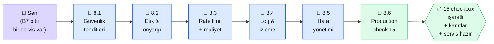

# Bölüm 8 — Güvenlik ve Production

**Persona:** Bölüm 7'ye kadar geldi, teknik olarak bir AI uygulamasını inşa edebiliyor. Şimdi **"canlıya çıkmadan önce ne eksik"** sorusu. Güvenlik, maliyet, loglama, hata yönetimi · **Süre:** ~4 saat (6 sayfa, checklist ağırlıklı) · **Önkoşul:** Bölüm 4 veya 6'dan elinde çalışan bir AI servisi var · **Çıktı:** Production'a açık bir servisin + 15 maddelik güvenlik checklist'i işaretlenmiş + maliyet alarmları kurulmuş

## Neden bu bölüm?

**Pet projesi ↔ production arası bir uçurum var.** Pet projesi "bende çalışıyor" ile biter; production "1000 kullanıcı geldiğinde çalışacak, saldırıya uğradığında ayakta kalacak, faturayı patlatmayacak" ile başlar. Bu bölüm o uçurumu geçirir.

Niye 6 sayfa? Çünkü AI servislerinin en sık ölüm sebebi **prompt injection + rate limit eksikliği.** 5 TL'lik bir bot bir gecede 5000 TL fatura çıkarabilir. Bu bölüm o senaryoyu somut örneklerle ele alır.

Üçüncüsü: İşyerinde AI projesi yaparken **"güvenlikçi onayı"** kritik. Bu bölüm o onayı almak için gereken kelimeleri + dokümantasyonu verir.

## Bölüm 8 kısaca

**8.1 — Güvenlik Tehditleri.** Prompt injection (en yaygın), jailbreak, data leakage, PII sızdırma, zehirli input. OWASP LLM Top 10 özeti.

**8.2 — Etik ve Önyargı.** Model önyargısı (race, gender, dil), deepfake riski, telif, üretken içerik etiketlemesi (AB AI Act). Anthropic'in "Constitutional AI" duruşu.

**8.3 — Rate Limit ve Maliyet Kontrolü.** İstemci başı ve IP başı rate limit, token usage cap, hard stop eşikleri, alarm sistemi. $100 fatura tehlikesini $5'e çekmek.

**8.4 — Loglama ve İzleme.** Yapılandırılmış loglar (JSON), token kullanımı + gecikme + hata oranı metrikleri, PII maskeleme. Grafana/Datadog vs basit dosya log.

**8.5 — Hata Yönetimi.** API zaman aşımı, model hatası, rate limit hit, fallback stratejileri (retry, circuit breaker, yedek model).

**8.6 — Production Checklist.** **15 madde kontrol listesi** — bu bölümün çıktısı. Her madde işaretlenip ispatı yazılıyor: "✅ rate limit kuruldu, kanıt: stress test sonucu".

## Bu bölümün yol haritası

### Aktör tablosu

| Düğüm | Nerede | Ne iş yapıyor |
|---|---|---|
| 👤 **Sen** | Python servis + logging/monitoring | Checkliste satır satır geç, ispatlarını topla |
| 📄 **8.1 Tehditler** | Platform + OWASP | 10 risk türü + somut örnek |
| 📄 **8.2 Etik** | Platform | AB AI Act + Anthropic Constitutional AI özeti |
| 📄 **8.3 Rate limit** | Python (slowapi) + ENV değişkeni cap'ler | 3 seviye kontrol (user, IP, toplam) |
| 📄 **8.4 Log & izleme** | Python logging + basit metrik | JSON log + log rotate |
| 📄 **8.5 Hata yönetimi** | Python try/except + retry lib | Retry + fallback + circuit breaker |
| 🏁 **8.6 Checklist** | README'de checkbox listesi | 15 madde, her biri işaretlenmiş + kanıt satırı |
| ✅ **Çıktı** | Servisin güvenlik dokümantasyonu | Bölüm 9'a (deploy) giden pasaport |

## Bu bölüm bittiğinde elinde ne olacak

- **Servisinin 15-madde güvenlik raporu:** Her madde için kanıt cümlesi (ör: "rate limit: slowapi 10 req/dk + 100 req/saat")
- **Rate limit kurulu:** Test ettiğin zaman 101. istekte 429 dönüyor, kanıt log'unda
- **Maliyet alarmı:** Günlük eşik aşımında e-posta/Slack bildirimi çalışıyor
- **Prompt injection defansı:** En azından 3 bilinen saldırı vektörüne karşı test edilmiş, cevap log'unda
- **JSON yapılandırılmış loglar:** PII maskeli, grep/jq ile sorgulanabilir
- **Retry + fallback deseni:** Servis API hatası alınca 2x retry, başarısızsa kullanıcıya anlaşılır mesaj
- **Anthropic Usage API entegrasyonu:** Token kullanımını canlı takip ediyorsun, faturan şaşırtmıyor

Bu çıktı **Bölüm 9 (Deploy) için ön koşul.** Deploy etmeden önce güvenlik sağlam olmalı — aksi halde ilk gün kötü bir ders alırsın.

📖 Anthropic bu bölümde ne der — öz

Anthropic production güvenliğine **son derece ağırlık verir** — şirket kültüründe AI safety merkezi. Kullanılabilir kaynaklar:

**1. API Best Practices — docs.claude.com/en/api/overview.** Rate limit, error codes, retry stratejisi. 8.3 ve 8.5'in temel referansı. Anthropic'in 429 response'a karşı `Retry-After` header önerisi ve exponential backoff deseni burada.

**2. Constitutional AI — anthropic.com/research.** Anthropic'in model güvenliği felsefesi. 8.2 etik bölümünün arka planı. Kısa okuma değil ama fikir çerçevesi oturması için ilk 2 sayfası yeter.

**3. Usage API — platform.claude.com/api/admin.** Kullanım + fatura metriklerini API ile çekme. 8.3 maliyet kontrolü burada bağlıyor. Alarm + dashboard için kanonik veri kaynağı.

**4. Prompt Injection konusunda Anthropic önerisi.** Docs'un güvenlik bölümünde "sistem prompt'u kullanıcı prompt'undan **açık XML tag'le** ayır" önerisi. 8.1'de bu deseni pratik uyguluyoruz.

**5. Responsible Scaling Policy — anthropic.com/rsp.** Anthropic'in kendi iç güvenlik disiplini dokümanı. Kendi projen için ilham kaynağı olarak faydalı — enterprise müşterisi seninle konuşurken bu dokümanı referans gösterebilirsin.

**Kaynak:** [docs.claude.com — API Overview (errors & rate limits)](https://docs.claude.com/en/api/errors) (İngilizce, ~15 dk). 8.3 ve 8.5 için birincil referans — Anthropic'in beklediği retry/backoff deseni net yazılı.

---

**Bir sonraki adım →** [8.1 Güvenlik Tehditleri](01-tehditler.md) (30 dk, OWASP LLM Top 10)

← [Bölüm 7 — Multimodal](../bolum-7/index.md) &nbsp;|&nbsp; [Ana Sayfa](../index.md)

