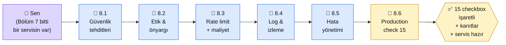

# Bölüm 8 — Güvenlik ve Production

👤 <strong>Kim için:</strong> Bölüm 7'ye kadar geldin, teknik olarak bir AI uygulaması inşa edebiliyorsun. Şimdi **"canlıya çıkmadan önce ne eksik"** sorusu. Güvenlik, maliyet, loglama, hata yönetimi

⏱️ <strong>Süre:</strong> ~4 saat (6 sayfa, kontrol listesi ağırlıklı)

📋 <strong>Önkoşul:</strong> Bölüm 4 veya 6'dan elinde çalışan bir AI servisi var

🎯 <strong>Çıktı:</strong> Üretime açık bir servis + 15 maddelik güvenlik kontrol listesi işaretli + maliyet alarmları kurulu

## Neden bu bölüm?

**Hobi projesiyle üretim arasında bir uçurum var.** Hobi projesi "bende çalışıyor" ile biter; üretim "1000 kullanıcı geldiğinde çalışacak, saldırıya uğradığında ayakta kalacak, faturayı patlatmayacak" ile başlar. Bu bölüm o uçurumu geçirir.

Niye 6 sayfa? Çünkü AI servislerinin en sık ölüm sebebi **prompt injection + istek sınırı (rate limit) eksikliği.** 5 TL'lik bir bot bir gecede 5000 TL fatura çıkarabilir. Bu bölüm o senaryoyu somut örneklerle ele alır.

Üçüncüsü: İşyerinde AI projesi yaparken **güvenlik ekibinin onayı** kritik. Bu bölüm o onayı almak için gereken kavramları + belgelendirmeyi verir.

## Bölüm 8 kısaca

**8.1 — Güvenlik Tehditleri.** Prompt injection (en yaygın), jailbreak, veri sızıntısı, PII sızdırma, zehirli girdi. OWASP LLM Top 10 (2025 güncellemesi) özeti. Anthropic'in **Constitutional Classifiers** (2025) ek savunma katmanı.

**8.2 — Etik ve Önyargı.** Model önyargısı (ırk, cinsiyet, dil), deepfake riski, telif, üretken içerik etiketlemesi (AB AI Act — Mart 2025'ten itibaren GPAI yükümlülükleri yürürlükte). Anthropic'in "Constitutional AI" duruşu + Model Spec.

**8.3 — İstek Sınırı (Rate Limit) ve Maliyet Kontrolü.** Kullanıcı başına ve IP başına istek sınırı, token kullanım üst sınırı, sert durdurma eşikleri, alarm sistemi. $100 fatura tehlikesini $5'e çekmek.

**8.4 — Loglama ve İzleme.** Yapılandırılmış loglar (JSON), token kullanımı + gecikme + hata oranı metrikleri, PII maskeleme. Grafana / Datadog / Helicone / LangFuse vs basit dosya logu.

**8.5 — Hata Yönetimi.** API zaman aşımı, model hatası, istek sınırına takılma, yedek planlar (retry, devre kesici / circuit breaker, yedek model).

**8.6 — Üretim Kontrol Listesi.** **15 maddelik kontrol listesi** — bu bölümün çıktısı. Her madde işaretlenip ispatı yazılıyor: "✅ istek sınırı kuruldu, kanıt: stres testi sonucu".

## Bu bölümün yol haritası

### Aktör tablosu

| Düğüm | Nerede | Ne iş yapıyor |
|---|---|---|
| 👤 **Sen** | Python servis + logging/monitoring | Checkliste satır satır geç, ispatlarını topla |
| 📄 **8.1 Tehditler** | Platform + OWASP | 10 risk türü + somut örnek |
| 📄 **8.2 Etik** | Platform | AB AI Act + Anthropic Constitutional AI özeti |
| 📄 **8.3 Rate limit** | Python (slowapi) + ENV değişkeni cap'ler | 3 seviye kontrol (user, IP, toplam) |
| 📄 **8.4 Log & izleme** | Python logging + basit metrik | JSON log + log rotate |
| 📄 **8.5 Hata yönetimi** | Python try/except + retry lib | Retry + fallback + circuit breaker |
| 🏁 **8.6 Checklist** | README'de checkbox listesi | 15 madde, her biri işaretlenmiş + kanıt satırı |
| ✅ **Çıktı** | Servisin güvenlik dokümantasyonu | Bölüm 9'a (deploy) giden pasaport |

## Bu bölüm bittiğinde elinde ne olacak

- **Servisin için 15 maddelik güvenlik raporu:** Her madde için kanıt cümlesi (ör: "istek sınırı: slowapi 10 req/dk + 100 req/saat")
- **İstek sınırı kurulu:** Test ettiğin zaman 101. istekte 429 dönüyor, kanıt loglarda
- **Maliyet alarmı:** Günlük eşik aşımında e-posta/Slack bildirimi çalışıyor
- **Prompt injection savunması:** En azından 3 bilinen saldırı vektörüne karşı test edilmiş, cevap loglarda; (Constitutional Classifiers + Haiku 4.5 ön-tarama desenleri 8.1'de)
- **JSON yapılandırılmış loglar:** PII maskeli, grep/jq ile sorgulanabilir
- **Retry + yedek plan deseni:** Servis API hatası alınca 2 kez yeniden dene, başarısızsa kullanıcıya anlaşılır mesaj
- **Anthropic Usage / Cost API entegrasyonu:** Token kullanımını canlı takip ediyorsun, faturan sürpriz değil

Bu çıktı **Bölüm 9 (Yayına Alma) için ön koşul.** Yayına almadan önce güvenlik sağlam olmalı — aksi halde ilk gün kötü bir ders alırsın.

📖 Anthropic bu bölümde ne der — öz

Anthropic production güvenliğine **son derece ağırlık verir** — şirket kültüründe AI safety merkezi. Kullanılabilir kaynaklar:

**1. API en iyi uygulamalar — [platform.claude.com/docs/en/api/errors](https://platform.claude.com/docs/en/api/errors).** İstek sınırı, hata kodları, yeniden deneme stratejisi. 8.3 ve 8.5'in temel referansı. Anthropic'in 429 yanıtına karşı `Retry-After` başlığı önerisi ve üstel geri çekilme (exponential backoff) deseni burada.

**2. Constitutional AI + Constitutional Classifiers — [anthropic.com/research](https://www.anthropic.com/research/constitutional-classifiers).** Anthropic'in model güvenliği felsefesi + 2025'te eklenen ek savunma katmanı (jailbreak başarı oranını ~%86'dan ~%4'e düşürdüğü iddia ediliyor). 8.2 etik bölümünün arka planı.

**3. Admin / Usage API — [platform.claude.com/docs/en/api](https://platform.claude.com/docs/en/api/administration-api).** Kullanım + fatura metriklerini API ile çekme. 8.3 maliyet kontrolü buraya bağlanıyor. Alarm + pano (dashboard) için kanonik veri kaynağı.

**4. Prompt Injection için Anthropic önerisi.** Docs'un güvenlik bölümünde "sistem promptunu kullanıcı promptundan **açık XML etiketleriyle** ayır" + Haiku 4.5 ön-tarama deseni. 8.1'de bu desenleri pratik uyguluyoruz.

**5. Responsible Scaling Policy — [anthropic.com/rsp](https://www.anthropic.com/responsible-scaling-policy).** Anthropic'in kendi iç güvenlik disiplini belgesi. Kendi projen için ilham kaynağı; kurumsal müşteriyle konuşurken bu belgeyi referans gösterebilirsin.

**Kaynak:** [platform.claude.com/docs — API Overview (errors & rate limits)](https://platform.claude.com/docs/en/api/errors) (İngilizce, ~15 dk). 8.3 ve 8.5 için birincil referans — Anthropic'in beklediği retry/backoff deseni net yazılı.

---

**Bir sonraki adım →** [8.1 Güvenlik Tehditleri](01-tehditler.md) (30 dk, OWASP LLM Top 10)

← [Bölüm 7 — Multimodal](../bolum-7/index.md) &nbsp;|&nbsp; [Ana Sayfa](../index.md)

