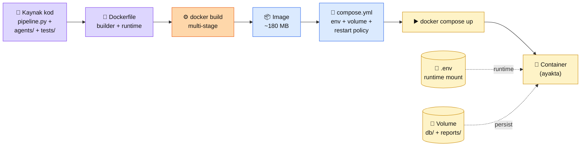

# 9.1 Docker ile Paketleme

<div class="ma-meta" markdown>
<div class="ma-meta-row" markdown>
<strong>Kim için:</strong>
<span class="ma-persona ma-persona-baslangic">🟢 başlangıç</span>
<span class="ma-persona ma-persona-is">🔵 iş</span>
<span class="ma-persona ma-persona-kisisel">🟣 kişisel</span>
</div>
<div class="ma-meta-row"><strong>⏱️ Süre:</strong> ~35 dakika</div>
<div class="ma-meta-row"><strong>📋 Önkoşul:</strong> Docker Desktop (yerel) veya Docker Engine (VPS) kurulu; Bölüm 4–6'dan çalışan bir servisin var (referans proje: [`examples/icerik-ozet-agent/`](https://github.com/KemalG-u/muhendisal-platform/tree/main/examples/icerik-ozet-agent))</div>
<div class="ma-meta-row"><strong>🎯 Çıktı:</strong> Servisin `Dockerfile` + `docker-compose.yml` ile paketli, `docker compose up` ile ayağa kalkıyor; image boyutu ≤ 200 MB (multi-stage build); `.env` dosyası image'a **gömülmemiş** (runtime mount); `docker compose down` + `up` ile temiz restart — yerel test artık VPS'e taşımaya hazır.</div>
</div>

!!! tip "Yabancı kelime mi gördün?"
    Bu sayfadaki **italik-altı çizili** ifadelerin (image, container, multi-stage build, volume, entrypoint gibi) üstüne mouse'unu getir — kısa tanım çıkar. Mobilde dokun.

## Neden bu sayfa?

8 bölüm boyunca kod yazdın, test ettin, optimize ettin. Yerel makinende çalışıyor — ama **arkadaşına gönder dediğinde** patlıyor. Python sürümü farklı, bağımlılık uyumsuzluğu, `httpx` vs `urllib3` çakışması, `ANTHROPIC_API_KEY` eksik. Deploy öncesi bu kaos seni her projede yavaşlatır. Docker bu kaosu bitirir — **"benim makinemde çalışıyor" sözünün sonu.**

İkincisi: VPS'e deploy (9.2) + CI/CD otomasyon (9.3) Docker olmadan 3 kat iş. "Benim kodum + bağımlılıklarım + Python sürümüm + env var'larım" paketi tek `docker compose up` komutuna inerse, 9.2'de SSH + `git clone` + `docker compose up` = 5 dakikada canlı. Docker'sız aynı iş saatler sürer, her seferinde farklı hata.

Üçüncüsü: Dockerfile yazmak **production refleksi**. İş ilanlarında "Dockerize ettim" ile "deploy ettim" arası uçurum var — birincisi junior, ikincisi mid-level AI Engineer. Bu sayfa uçurumu 30 dakikada kapatır.

## Docker kısaca — üç paragraf, matematiksiz

**Docker = "kodum + bağımlılıklarım + OS parçaları" tek kutu.** *Image* derlenmiş şablon (OS + Python + pip paketler + senin kodun); *container* bu şablonun çalışan kopyası. Dockerfile bir **tarif** — "Python 3.12 al, `pip install` yap, kodumu kopyala, `python pipeline.py` ile başlat". Bu tarif `docker build` ile image'a, image `docker run` ile container'a dönüşür. **Kod + sistem bir arada**, OS farklarına takılmazsın.

**Multi-stage build image'ı küçültür.** Naive Dockerfile 1–2 GB olur (Python tam sürüm + build tools + cache). Multi-stage iki aşama: **(1)** `builder` aşamada bağımlılıkları derle (gcc + pip wheel'leri); **(2)** `runtime` aşamada sadece Python slim + derlenen wheel'leri kopyala. Build tools final image'da yok, boyut %80 düşer. 200 MB altı hedef. Deploy hızı + disk + güvenlik üçü birden kazanır.

**`docker-compose.yml` çoklu servis orkestrasyonu.** Pipeline + DB + Redis + reverse proxy — tek `docker compose up` ile hepsi ayakta. Tek servis için de kullanışlı — env var'lar, volume'lar, restart policy tek YAML'de belgeli. Ayrıca `.env` dosyasını **image'a gömmeden** runtime'da enjekte eder; secret disiplinin temeli bu.

## Bu sayfanın ekosistemi — Dockerfile'dan container'a

<div class="ma-ekosistem" markdown>
<div class="ma-ekosistem-header">🗺️ Ekosistem — kaynak koddan ayakta container'a</div>



<table class="ma-aktorler" markdown>

| Düğüm | Rol | Ne iş yapıyor |
|---|---|---|
| 📁 **Kaynak kod** | Proje dizini | Sen yazdın — pipeline.py + agents/ + tests/ |
| 📄 **Dockerfile** | Tarif | "Python 3.12 al, pip install, kodumu kopyala" adımları |
| ⚙️ **docker build** | Derleme | Tarifi çalıştırıp image üretir; cache'lenen katmanlar hızlı re-build |
| 📦 **Image** | Değişmez paket | OS + Python + paketler + kod; ~180 MB multi-stage ile |
| 📄 **compose.yml** | Orkestrasyon | Image'ı nasıl çalıştıracağını belgeler (env, volume, restart) |
| ▶️ **docker compose up** | Komut | Image'dan container başlatır, servisleri birbirine bağlar |
| 🏃 **Container** | Çalışan kopya | Image'ın instance'ı — kod + süreç + ağ |
| 🔐 **.env** | Secret kaynak | Runtime'da mount edilir, image'a **asla** gömülmez |
| 💾 **Volume** | Kalıcı disk | `db/` + `reports/` — container silinse de veri durur |

</table>
</div>

## Uygulama — iki yol

### Yol A — Multi-stage Dockerfile (30 dk)

Referans projenin (`examples/icerik-ozet-agent/`) Docker'a alınması. Repo kökünde `Dockerfile` oluştur:

```dockerfile
# syntax=docker/dockerfile:1.7
# ─── 1. AŞAMA — builder (bağımlılık derleme) ─────────────────────────
FROM python:3.12-slim AS builder

ENV PIP_NO_CACHE_DIR=1 \
    PIP_DISABLE_PIP_VERSION_CHECK=1 \
    PYTHONDONTWRITEBYTECODE=1

WORKDIR /build

# pyproject.toml + requirements — dependency katmanı önce (cache-friendly)
COPY pyproject.toml ./
RUN pip install --prefix=/install "anthropic>=0.70" "httpx>=0.27" \
    "feedparser>=6.0.11" "python-dotenv>=1.0.1"

# ─── 2. AŞAMA — runtime (sadece çalışma dosyaları) ─────────────────
FROM python:3.12-slim AS runtime

# Güvenlik: non-root user
RUN useradd --create-home --shell /bin/bash agent
USER agent
WORKDIR /home/agent/app

# Builder'dan derlenen paketleri kopyala
COPY --from=builder /install /usr/local

# Uygulama kodu — .dockerignore kontrol altında
COPY --chown=agent:agent pipeline.py ./
COPY --chown=agent:agent agents/ ./agents/
COPY --chown=agent:agent db/schema.sql ./db/

# Non-blocking: .env runtime mount, image'a GÖMÜLMEZ
# Volume: db + reports persist için
VOLUME ["/home/agent/app/db", "/home/agent/app/reports"]

# Default komut — compose.yml override edebilir
CMD ["python", "pipeline.py"]
```

**Kritik CTO noktaları:**

1. **Multi-stage** — `builder` aşama build tools ile bağımlılık derler; `runtime` sadece derlenen `site-packages`'i kopyalar. Final image ~180 MB (naive: ~1.2 GB).
2. **`python:3.12-slim`** — `python:3.12` (tam) 1 GB, `slim` 120 MB. Alpine daha küçük (~80 MB) ama C extension'lar sorun çıkarır (numpy, httpx bazen). **Slim = üretimde doğru denge.**
3. **Non-root user** — `USER agent` zorunlu. Root ile çalışan container saldırı vektörüdür; kurumsal code review'da anında red.
4. **COPY sırası cache-friendly** — `pyproject.toml` önce, kod sonra. Kod değişir bağımlılık değişmez → Docker pip layer'ını cache'ler, re-build saniyeler.
5. **`.env` image'a YOK** — secret disiplin. Runtime'da `docker run --env-file .env` veya compose `env_file:` ile geçer.
6. **`VOLUME`** — db + reports container dışında kalır; `docker compose down` sonrası `up` yaparsan veri durur.

### Yol B — `docker-compose.yml` + `.dockerignore` + build

Repo kökünde `compose.yml`:

```yaml
services:
  pipeline:
    build:
      context: .
      dockerfile: Dockerfile
    image: icerik-ozet-agent:latest
    env_file:
      - .env                          # runtime secret enjeksiyonu
    volumes:
      - ./db:/home/agent/app/db       # SQLite persist
      - ./reports:/home/agent/app/reports  # markdown rapor persist
    restart: unless-stopped           # crash → otomatik restart
    # Scheduled cron için opsiyonel: her gün 06:00 UTC
    # Production'da systemd timer daha iyi (bkz. 9.3)
```

`.dockerignore` kritik — `build context`'e git, .env, venv dahil edilirse image şişer + secret sızar:

```gitignore
# Git + CI
.git
.github
.gitignore

# Python cache
__pycache__
*.py[cod]
*.egg-info
.venv
venv
.pytest_cache
.ruff_cache

# Secret + yerel artifact
.env
.env.local
db/*.db
db/*.db-journal
reports/*.md

# IDE
.vscode
.idea
.DS_Store

# Doc
README.md  # opsiyonel — image'a gerek yok
```

**Çalıştırma:**

```bash
# 1. İlk build (~2 dk, sonraki build'ler saniyeler)
docker compose build

# 2. Ayakta başlat
docker compose up -d              # -d: arkaplan
docker compose logs -f pipeline   # canlı log
docker compose ps                 # container durumu

# 3. Testleri container içinde koştur (CI hazırlığı)
docker compose run --rm pipeline pytest

# 4. Temiz restart
docker compose down && docker compose up -d

# 5. Image boyutu kontrol
docker images icerik-ozet-agent
```

**Beklenen çıktı:**

```
$ docker images icerik-ozet-agent
REPOSITORY              TAG       SIZE
icerik-ozet-agent       latest    184MB
```

## Docker disiplin — CTO tuzakları tablosu

| Tuzak | Sonuç | Çözüm |
|---|---|---|
| **`python:3.12` (full)** | 1+ GB image, deploy yavaş, disk şişer | `python:3.12-slim` — 90% daha küçük; Alpine sadece C-ext yokken |
| **Single-stage build** | build tools final image'da — 500 MB+ çöp | Multi-stage: builder + runtime ayrı |
| **Root user ile çalışma** | Container escape = sistem escape | `useradd` + `USER` satırı ZORUNLU |
| **`.env` image'a gömmek** | `docker history` ile secret sızar | `.dockerignore`'a `.env` + runtime `env_file:` |
| **Kod önce, bağımlılık sonra kopyala** | Her kod değişikliği → tam re-build | `COPY pyproject.toml` → `pip install` → `COPY agents/` sırası (cache) |
| **`.dockerignore` yok** | `.git`, `venv`, `.env` context'e girer | `.dockerignore` listeyi sıkı tut |
| **`restart: always`** | Hatalı config sonsuz döngü | `restart: unless-stopped` — user `docker stop` derse saygı |
| **Latest tag** prod'da | Sürüm belirsiz, hangi image canlı? | `icerik-ozet-agent:2026.04.22` — tarih/commit hash |
| **Volume unutmak** | Container silindiğinde DB kayıp | `VOLUME` Dockerfile + `volumes:` compose |
| **Port açık default** | Saldırı yüzeyi genişler | Sadece gerekirse `ports:`; iç servisler `expose:` ile container network |
| **`docker logs` sonsuz büyür** | Disk 6 ayda dolar | Compose'da `logging: driver: json-file, max-size: 10m, max-file: 3` |

## `docker compose` vs `docker-compose` — Nisan 2026 notu

Tarihi detay: Docker CLI'ya Go ile yazılmış native `docker compose` komutu (boşluklu) geldi, Python yazılmış eski `docker-compose` (tireli) v1 **2023'te deprecate** edildi. 2026'da neredeyse tüm tutorial'lar `docker compose` kullanıyor. Eski `docker-compose` hâlâ çalışır bazı sunucularda ama yeni projelerde **tire yok**.

**Docker Engine 28.x (Nisan 2026 mevcut)** → Compose v2 dahili, ayrı kurulum gerekmez. Sadece Docker'ı en güncel sürüme tut (`apt upgrade docker-ce`).

<div class="ma-anthropic-oz" markdown>
<div class="ma-anthropic-oz-header">📖 Anthropic bu konuyu nasıl anlatıyor — öz</div>

Anthropic doğrudan "Docker dersi" yayınlamıyor — bu genel DevOps konusu. Ama **ekosistemde iki önemli kesişim** var:

**1. Claude Code development container'ları.** Anthropic'in [DevContainer reference](https://github.com/anthropics/claude-code/tree/main/.devcontainer) — Claude Code geliştirilirken kullanılan Dockerfile örneği. VS Code Dev Containers özelliği için. Agent projesi üstüne `.devcontainer/devcontainer.json` koyarsan, herkes aynı Python + dep ortamda açar.

**2. Agent SDK + Docker deploy deseni.** [platform.claude.com/docs/agent-sdk](https://platform.claude.com/docs/en/agent-sdk/python) dokümantasyonunda `claude-agent-sdk` için önerilen prod deploy = Docker + systemd (veya Kubernetes CronJob). "Bundled Claude CLI" paket içinde geldiği için container image'a ekstra kurulum gerekmez — `pip install claude-agent-sdk` yeter. 6.6'daki SDK'nın Docker'ı: Dockerfile + `CMD ["python", "agent.py"]` minimal.

**3. Anthropic Cookbook — third_party klasörü.** [claude-cookbooks/third_party](https://github.com/anthropics/claude-cookbooks/tree/main/third_party) AWS Lambda, Modal, Vercel deploy örnekleri içerir. Lambda container image deseni özellikle serverless agent için kaydadeğer — cron tabanlı pipeline'ların low-cost alternatifi.

??? info "Teknik detay — isteyene (BuildKit cache, healthcheck, scan, secret)"

    **BuildKit cache mount.** `RUN --mount=type=cache,target=/root/.cache/pip pip install ...` — pip cache build'ler arası paylaşımlı. Re-build saniyeler yerine dakikalar. Syntax: `# syntax=docker/dockerfile:1.7` (Dockerfile başında zorunlu).

    **HEALTHCHECK direktif.** `HEALTHCHECK CMD python -c "import sys; sys.exit(0)"` — container sağlıklı mı? Docker orkestratörü (compose, swarm, k8s) bu sonuca göre restart kararı verir. Agent için: `HEALTHCHECK CMD sqlite3 db/taslaklar.db "SELECT 1" || exit 1` — DB erişilebilir mi?

    **Docker Scout (güvenlik tarama).** `docker scout cves icerik-ozet-agent:latest` — image'daki CVE'leri listeler. Free tier var; CI'da `docker scout cves --exit-code --only-severity critical` ile kritik açık varsa build fail.

    **BuildKit secret mount.** `RUN --mount=type=secret,id=pip_conf pip install ...` — build sırasında secret gerekiyorsa (private pip index, vs.) image'a sızmaz. Alternatif: multi-stage + env wipe.

    **Image tagging stratejisi.** CI'da üç tag aynı image'a: `:latest`, `:main-abc1234` (commit SHA), `:2026.04.22`. Registry'de her tag ayrı pointer, image aynı — disk tek.

    **Docker Hub rate limit.** Anonim pull 100/6 saat, authenticated 200. CI/CD'de hızla tüketir. Çözüm: GHCR (GitHub Container Registry) ücretsiz, GitHub Actions ile native.

<div class="ma-anthropic-oz-kaynak" markdown>
**Kaynak:** [Docker resmi multi-stage build rehberi](https://docs.docker.com/build/building/multi-stage/) (EN, canonical). Pekiştirme: [Python Docker official image](https://hub.docker.com/_/python) — slim/alpine/full varyantlar + güvenlik update ritmi. CI/CD entegrasyonu: [GitHub — docker/build-push-action](https://github.com/marketplace/actions/build-and-push-docker-images) — 9.3'te kullanacağımız action.
</div>
</div>

<div class="ma-cikti-kaniti" markdown>
### 📦 Bu sayfayı bitirdiğini nasıl kanıtlarsın

#### 1. 📝 Refleksiyon yazısı — 5 dakika

> "Docker'ladığım proje: [...]. Kullandığım base image: [python:3.12-slim]. Multi-stage kullandım mı: [evet]. Final image boyutu: [X MB]. Naive build hesabım: [Y MB — slim kullanmasam]. En büyük zorluk: [...], çözüm: [...]. Container içinde pytest sonucu: [...]."

Kaydet: `muhendisal-notlarim/bolum-9/01-docker/refleksiyon.txt`

#### 2. 📸 Konsol kaydı — 5 dakika

**Neyin görüntüsü:** `docker compose build` + `docker compose up -d` + `docker compose logs` + `docker images` çıktısı — image boyutu satırı + container'ın ayakta olduğu `docker ps` satırı. **Kanıt artifact'ı**: "proje artık taşınabilir bir kutuda."

Kaydet: `muhendisal-notlarim/bolum-9/01-docker/container-up.png`

#### 3. 💻 Kendi projeni Docker'la + GitHub — 45 dakika

Referans projeyi klonla ya da kendi Bölüm 4–6 projeni al. `Dockerfile` + `compose.yml` + `.dockerignore` yaz. Hedefler:

1. Image boyutu **< 250 MB** (multi-stage + slim)
2. Non-root user zorunlu
3. `.env` image'da YOK (`docker history` ile teyit: `docker history icerik-ozet-agent:latest | grep -i env` — secret satırı çıkmamalı)
4. `docker compose up` → container ayakta; `docker compose down` sonrası `up` → verileri kaybetmemeli (volume kanıtı)
5. `docker compose run --rm pipeline pytest` → testler container'da geçmeli

Repo linkini kaydet: `muhendisal-notlarim/bolum-9/01-docker/docker-repo.txt`

</div>

<div class="ma-neden-sonuc" markdown>
<div class="ma-neden-sonuc-header">🔗 Birlikte okuma — neden ne oldu</div>

<ol class="ma-neden-sonuc-zincir" markdown>
<li>**A → B:** Yerel makinende çalışan kod başka sistemde patlar (Python sürümü, bağımlılık, env) — 'benim makinemde çalışıyor' tuzağı. Docker paketleyerek bu kaosu bitirir. Bu yüzden **Docker ilk deploy adımı.**</li>
<li>**B → C:** Image (değişmez şablon) + Container (çalışan kopya) + Dockerfile (tarif) — üç kavram çekirdeği. Bu yüzden **üç kavramı bilmek her şeyi açar.**</li>
<li>**C → D:** Multi-stage build image'ı %80 küçültür — builder bağımlılık derler, runtime sadece derlenen wheel'leri kopyalar. 180 MB prod hedefi. Bu yüzden **multi-stage her production projede zorunlu.**</li>
<li>**D → E:** `docker compose` çoklu servis + env + volume + restart policy tek YAML — 2026'da default, tire-siz syntax. Bu yüzden **compose single-Docker'dan üstün.**</li>
<li>**E → F:** `.env` **runtime mount**, image'a GÖMÜLMEZ; `.dockerignore` git/venv/secret context dışında tutar. Bu yüzden **secret sızıntısı önlenebilir.**</li>
<li>**F → G:** `COPY` sırası cache-friendly (bağımlılık önce, kod sonra) → re-build saniyeler; non-root user + `VOLUME` prod disiplini. Bu yüzden **Dockerfile sırası süreyi belirler.**</li>
</ol>

<div class="ma-neden-sonuc-sonuc" markdown>
**Sonuç:** Artık servisin **taşınabilir bir kutuda** — image 180 MB, non-root, .env güvenli, volume ile veri persist. 9.2'de bu kutu VPS'e gidecek: SSH + git clone + `docker compose up` → ilk canlı URL. 9.3'te GitHub Actions bu kutuyu her push'ta otomatik build + deploy edecek. Docker deploy merdiveninin ilk basamağı.
</div>
</div>

<div class="ma-sonraki" markdown>
<div class="ma-sonraki-header">➡️ Sonraki adım</div>

**[9.2 Cloud Deploy (Hetzner / DigitalOcean) →](02-cloud.md)** — VPS kirala, SSH, Docker kur, servisi ayağa kaldır, domain + HTTPS. "İlk canlı URL" anı.

← [Bölüm 9 girişi](index.md) &nbsp;|&nbsp; [Ana sayfa](../index.md)

**Pekiştirme:** [Docker multi-stage build resmi rehberi](https://docs.docker.com/build/building/multi-stage/) — image optimizasyonu canonical. [Python Docker official image](https://hub.docker.com/_/python) — slim/alpine/full varyantları üstünden "hangi base ne zaman" refleksi.
</div>
