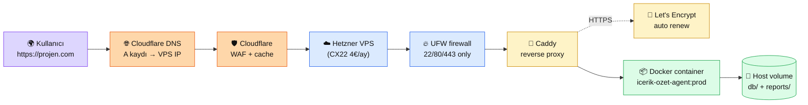

# 9.2 Cloud Deploy — Hetzner / DigitalOcean

<div class="ma-meta" markdown>
<div class="ma-meta-row" markdown>
<strong>Kim için:</strong>
<span class="ma-persona ma-persona-baslangic">🟢 başlangıç</span>
<span class="ma-persona ma-persona-is">🔵 iş</span>
<span class="ma-persona ma-persona-kisisel">🟣 kişisel</span>
</div>
<div class="ma-meta-row"><strong>📋 Önkoşul:</strong> 9.1 bitmiş — `Dockerfile` + `compose.yml` yerel makinede çalışıyor; kredi kartı (VPS provider için); bir **alan adı** (opsiyonel ama şiddetle önerilir, ~10 €/yıl)</div>
<div class="ma-meta-row"><strong>🎯 Çıktı:</strong> **Canlı URL** — `https://projen.alanadin.com` — tarayıcıdan açılıyor, arkadaşın da açabiliyor. VPS'te Docker ayakta, servisini restart sonrası otomatik başlatıyor, HTTPS sertifikası Let's Encrypt, basit firewall aktif. Aylık maliyet: **~5 €** (VPS) + **10 €/yıl** (domain).</div>
</div>

!!! tip "Yabancı kelime mi gördün?"
    Bu sayfadaki **italik-altı çizili** ifadelerin (VPS, shared CPU vs dedicated, reverse proxy, UFW gibi) üstüne mouse'unu getir — kısa tanım çıkar. Mobilde dokun.

## Neden bu sayfa?

Yerel Docker güzel — ama kimse senin laptop'unu ziyaret edemez. **İlk canlı URL** AI Engineer yolculuğunun dönüm noktası: 5 € aylık VPS kiralıyorsun, Docker image'ını koyuyorsun, domain bağlıyorsun, Let's Encrypt ile HTTPS alıyorsun, servisin canlıda. Arkadaşın linki tıkladığında yüzünde oluşan ifade seni motive eder. **İş görüşmelerinde "GitHub ve canlı demo linki var mı?" sorusunun cevabı.**

İkincisi: Platform seçimi para tasarrufu kadar **control-vs-convenience** dengesi. AWS/GCP/Azure ≈ şirket ölçeği (kompleksite + ayda 50$+); Vercel/Railway/Fly ≈ başlangıç dostu (otomatik ama az kontrol + vendor lock-in); Hetzner/DigitalOcean/Contabo **Linux VPS** (ham kontrol + ~5 €/ay + kendin öğrenirsin). AI Engineer yolu için **üçüncüsü doğru** — her katmanı görürsün, prod refleksi kazanırsın, maliyet minimum.

Üçüncüsü: Bu sayfa Hetzner'ı varsayılan yol olarak alır — platformun kendisi Hetzner Cloud'da (CCX23, Helsinki lokasyonu). **Gerçek deneyim.** DigitalOcean ve Contabo alternatifleri de ele alınır; karar matrisi seni doğru seçime götürür. Türkiye'den ödeme, gecikme, yedekleme, veri-güvenlik tarafları ayrıntılı.

## VPS seçimi kısaca — üç paragraf, matematiksiz

**VPS = kendi Linux sunucun, ayda ~5 €**. *Shared CPU* (diğer müşterilerle CPU paylaşımlı, ucuz — Hetzner CX22/CPX21) hobby/MVP için yeter. *Dedicated CPU* (Hetzner CCX serisi) kararlı performans ister — prod agent + veritabanı + gerçek kullanıcı. ARM CPU (Hetzner CAX serisi) x86'dan ~%25 ucuz + aynı performans çoğu Python iş yükünde; Docker image multi-arch build gerekir. **İlk canlı URL için:** Hetzner CX22 (2 vCPU / 4 GB RAM / 40 GB SSD / 20 TB trafik) ~**4 €/ay** — MVP için yeterinden fazla.

**Lokasyon seçimi gecikmeyi belirler.** Türkiye'den en yakın datacenterlar: Frankfurt/Almanya (~50 ms), Helsinki/Finlandiya (~60 ms), Ashburn/ABD (~130 ms). Avrupa = coğrafi + GDPR + latency avantajı. Hetzner Frankfurt (`fsn1`), Falkenstein (`fsn1`), Nürnberg (`nbg1`), Helsinki (`hel1`), Ashburn (`ash`), Hillsboro (`hil`), Singapur (`sin`). **Türkiye kullanıcı = Frankfurt** tercihi.

**Domain + Cloudflare DNS + Let's Encrypt HTTPS üçlüsü ücretsiz/ucuz standart.** Namecheap/Porkbun'dan `.com` alanı ~10 €/yıl; DNS'i Cloudflare'a yönlendir (ücretsiz); Cloudflare'da A kaydı VPS IP'ye; VPS'te Caddy veya Traefik reverse proxy Let's Encrypt sertifikasını otomatik alır ve yeniler. `https://projen.alanadin.com` 30 dk içinde yayında.

## Bu sayfanın ekosistemi — domainden container'a

<div class="ma-ekosistem" markdown>
<div class="ma-ekosistem-header">🗺️ Ekosistem — kullanıcının tarayıcısından Docker container'a</div>



<table class="ma-aktorler" markdown>

| Düğüm | Rol | Ne iş yapıyor |
|---|---|---|
| 🌍 **Kullanıcı** | Tarayıcı / API client | HTTPS URL'yi ziyaret eder |
| 🌐 **Cloudflare DNS** | Alan adı çözücü | `projen.com` → VPS public IP; TTL düşük değişikliğe uyum |
| 🛡 **Cloudflare WAF** | Edge katman (opsiyonel) | DDoS + bot + static cache; ücretsiz plan yeter |
| ☁️ **VPS** | Hetzner/DO/Contabo | Linux sunucu, public IP, 7/24 ayakta |
| 🔥 **UFW firewall** | OS firewall | Sadece 22 (SSH) + 80 (HTTP) + 443 (HTTPS) açık |
| 🔀 **Caddy** | Reverse proxy | Port 443 dinler; Let's Encrypt otomatik; `localhost:8000`'a yönlendirir |
| 🔐 **Let's Encrypt** | Sertifika | Caddy 90 gün sertifika alır, otomatik yeniler |
| 📦 **Container** | Docker çalışan instance | 9.1'de hazırladığın image; `docker compose up -d` ile ayakta |
| 💾 **Host volume** | Kalıcı disk | `/var/lib/docker/volumes/` + bind mount — container restart DB sağlam |

</table>
</div>

## VPS provider karşılaştırma — Nisan 2026

> **Fiyatlar sık değişir.** Aşağıdaki rakamlar yaklaşık; ziyaret edip güncel listeye bak: [hetzner.com/cloud](https://www.hetzner.com/cloud), [digitalocean.com/pricing](https://www.digitalocean.com/pricing), [contabo.com/en/vps](https://contabo.com/en/vps/).

| Provider | Giriş tier | CPU/RAM/Disk | ~Aylık | Güçlü yön | Zayıf yön |
|---|---|---|---|---|---|
| **Hetzner Cloud** (CX22) | Shared x86 | 2 / 4 GB / 40 GB | **~4 €** | En uygun fiyat, Avrupa dc, IPv6 ücretsiz, API güçlü | Kredi kartı + doğrulama süreci, ilk hesap bazen manuel onay |
| **Hetzner Cloud** (CAX11) | Shared ARM | 2 / 4 GB / 40 GB | **~4 €** | ARM avantajı (daha serin + ucuz) | Docker image ARM64 build gerekir |
| **Hetzner Cloud** (CCX13) | Dedicated | 2 / 8 GB / 80 GB | **~13 €** | Prod için kararlı performans | Hobbi fazla |
| **DigitalOcean Droplet** | Basic | 1 / 1 GB / 25 GB | **~$6** | UI basit, teknik doc bol, team kolay | Hetzner'e göre pahalı, EU dc sınırlı |
| **Contabo VPS S** | - | 4 / 8 GB / 200 GB NVMe | **~5 €** | Fiyat/performans lider | Abuse iddialarına hassas, customer support yavaş |
| **Linode / Akamai** | Nanode | 1 / 1 GB / 25 GB | **~$5** | Akamai altyapı, stabil | EU dc sayısı sınırlı |
| **AWS Lightsail** | - | 2 / 1 GB / 40 GB | **~$5** | AWS ekosistemine geçiş | Overhead + faturalandırma karmaşık |

**Pratik tavsiye (CTO):**
- **İlk canlı URL** (bu sayfa): **Hetzner CX22** (4 €/ay). Türkiye'den hızlı, stabil, ucuz.
- **Prod ajan + kullanıcı trafiği**: **Hetzner CCX13** (13 €/ay) veya **Contabo VPS M** (~8 €/ay).
- **ABD pazarı hedef**: **DigitalOcean Ashburn** (~$6).
- **Bütçe kritik + sabit yük**: **Contabo** (5 €/ay 4 vCPU + 8 GB — pazar lideri F/P).

## Uygulama — tam deploy yolu (Hetzner CX22 örneği)

### Yol A — VPS kirala + SSH hazırlığı (15 dk)

1. [hetzner.com/cloud](https://www.hetzner.com/cloud) → hesap aç → kredi kartı/SEPA ekle → doğrulama (bazen 24 saat).
2. Cloud panel → **New Project** → **Add Server**:
   - **Location:** Nuremberg (nbg1) veya Falkenstein (fsn1) — Türkiye'ye yakın
   - **Image:** Ubuntu 24.04 LTS
   - **Type:** CX22 (2 vCPU / 4 GB / 40 GB / 4 €/ay)
   - **SSH keys:** Yerel makinende `ssh-keygen -t ed25519 -C "deploy@projen"` çalıştır, `~/.ssh/id_ed25519.pub` içeriğini yapıştır. **Şifre yerine SSH key kullan** — parola deneme saldırılarını sıfırlar.
   - **Firewall:** Temel preset seç (22, 80, 443 açık) veya sonra UFW'de yap
   - **Backup:** +%20 fiyat; ayda ~0.80 € — prod için kesinlikle aç
3. **Create & Buy Now** → 30 sn içinde VPS IP adresin hazır.

Yerel makinende SSH test:

```bash
ssh -i ~/.ssh/id_ed25519 root@<VPS_IP>
# İlk bağlantıda fingerprint onayla (yes)
```

### Yol B — Güvenlik sertleştirme (15 dk) — atlanamaz

İlk `ssh root@ip` çalışıyorsa 3 şey hemen:

```bash
# 1. Sistem güncel tut
apt update && apt upgrade -y

# 2. Deploy için non-root user (root'la çalışmak prod'da yasak)
adduser deploy --gecos ""
usermod -aG sudo deploy
mkdir -p /home/deploy/.ssh
cp ~/.ssh/authorized_keys /home/deploy/.ssh/
chown -R deploy:deploy /home/deploy/.ssh
chmod 700 /home/deploy/.ssh
chmod 600 /home/deploy/.ssh/authorized_keys

# 3. UFW firewall — sadece SSH + HTTP + HTTPS
ufw default deny incoming
ufw default allow outgoing
ufw allow OpenSSH
ufw allow 80/tcp
ufw allow 443/tcp
ufw enable          # "y" ile onayla

# 4. SSH sertleştirme — /etc/ssh/sshd_config.d/99-hardening.conf
cat > /etc/ssh/sshd_config.d/99-hardening.conf << 'EOF'
PermitRootLogin no
PasswordAuthentication no
PubkeyAuthentication yes
MaxAuthTries 3
LoginGraceTime 30
EOF
systemctl restart ssh

# Test: YENİ terminalde `ssh deploy@<ip>` çalışmalı, root reddedilmeli
# (Root girişi kesmeden ÖNCE deploy user girişini doğrula!)
```

**CTO uyarısı:** `PermitRootLogin no` satırını etkin yapmadan önce `deploy` user'ı ile **yeni bir terminalden** başarılı giriş kanıtla. Yoksa kendini kilitleyebilirsin.

Opsiyonel — brute-force koruması için **fail2ban**:

```bash
apt install -y fail2ban
systemctl enable --now fail2ban
```

### Yol C — Docker kur + servisi deploy et (20 dk)

Deploy user olarak girdin. Docker Engine resmi repo (Ubuntu Docker package eski):

```bash
# Docker resmi kurulum
curl -fsSL https://get.docker.com | sudo sh
sudo usermod -aG docker deploy
exit
# Yeni SSH oturumunda `docker ps` sudo'suz çalışmalı
```

Repo'yu klonla + .env hazırla:

```bash
cd ~
git clone https://github.com/KemalG-u/muhendisal-platform
cd muhendisal-platform/examples/icerik-ozet-agent

# .env — production için yerelden kopyalama, doğrudan VPS'te yaz
cp .env.example .env
nano .env   # ANTHROPIC_API_KEY ve diğer secret'ları doldur

# Build + run
docker compose build
docker compose up -d
docker compose logs -f pipeline    # ilk çalışma logu
```

Agent çalıştı — ama şu an yalnız pipeline tekil görev koşturuyor (içerik özet). Web servis olsaydı (örn. FastAPI chatbot) `ports: - "127.0.0.1:8000:8000"` eklerdin; sonra reverse proxy'de 8000'i 443'e köprüledin.

**Kritik:** `ports: - "127.0.0.1:8000:8000"` — **`0.0.0.0` değil** `127.0.0.1`. Aksi halde Docker port'u public IP'ye açar, UFW'yi atlatır. Localhost bind + Caddy reverse proxy = güvenli desen.

### Yol D — Domain + Cloudflare DNS + Caddy HTTPS (20 dk)

Senaryoya göre iki vaka:

**Vaka 1: Pipeline = scheduled cron (HTTP yok).** Domain'e gerek yok. Cron ile VPS'te günde bir kez çalıştır (detay 9.3'te systemd timer).

**Vaka 2: Web servisin var (FastAPI agent, chatbot API, dashboard).** Domain + HTTPS şart:

1. Namecheap/Porkbun'dan `alanadin.com` al (~10 €/yıl).
2. DNS'i Cloudflare'a taşı: Cloudflare'da domain ekle → verdiği 2 nameserver'ı registrar panelinde gir. Yayılma 5 dk – 24 saat.
3. Cloudflare DNS kaydı:
   - **A** kaydı: `projen.alanadin.com` → `<VPS_IP>`
   - **Proxy durumu:** "DNS only" (gri bulut) — Caddy sertifika alırken Cloudflare proxy'si karıştırır; başta kapalı tut.
4. VPS'e Caddy kur:

```bash
# Caddy resmi kurulum
sudo apt install -y debian-keyring debian-archive-keyring apt-transport-https
curl -1sLf 'https://dl.cloudsmith.io/public/caddy/stable/gpg.key' | \
    sudo gpg --dearmor -o /usr/share/keyrings/caddy-stable-archive-keyring.gpg
curl -1sLf 'https://dl.cloudsmith.io/public/caddy/stable/debian.deb.txt' | \
    sudo tee /etc/apt/sources.list.d/caddy-stable.list
sudo apt update && sudo apt install -y caddy
```

5. `/etc/caddy/Caddyfile` düzenle:

```
projen.alanadin.com {
    reverse_proxy 127.0.0.1:8000
    encode gzip
    # Caddy otomatik Let's Encrypt sertifikası alır ve 90 günde bir yeniler
}
```

6. Reload:

```bash
sudo systemctl reload caddy
sudo systemctl status caddy    # "active (running)" olmalı
sudo journalctl -u caddy -f    # sertifika alımı logu
```

7. Test: tarayıcıdan `https://projen.alanadin.com` → HTTPS padlock + container çıktısı. **İlk canlı URL anın.**

## Maliyet hesabı — Türkiye'den 1 yıl

| Kalem | Tutar | Alternatif |
|---|---|---|
| **Hetzner CX22** | 4 €/ay × 12 = **48 €/yıl** | CCX13 prod için: 13 €/ay × 12 = 156 €/yıl |
| **Backup** (+%20) | ~10 €/yıl | Kendi `rsync` cron'u ile ücretsiz |
| **Domain** (Namecheap `.com`) | **~10 €/yıl** | `.xyz` ~2 €/yıl, `.dev` ~15 €/yıl |
| **Cloudflare DNS** | **0** | Free plan yeter |
| **Let's Encrypt** | **0** | - |
| **Claude API (agent çağrıları)** | 6.8'deki hesap: ~**31 €/yıl** (günde 20 başlık) | Kullanım bağımlı |
| **Toplam minimum** | **~100 €/yıl** | = ~8 €/ay |

Karşılaştırma: AWS EC2 t3.small + Route53 + Certificate Manager benzer konfig ~**$30/ay = 330 $/yıl** — 3× fark.

## CTO tuzakları — VPS deploy

| Tuzak | Sonuç | Çözüm |
|---|---|---|
| **Root ile SSH prod'da** | Tek şifre/key patlarsa sistem kayıp | `deploy` user + `PermitRootLogin no` |
| **Password auth açık** | Bot brute-force saldırısı saatler içinde başlar | `PasswordAuthentication no` + SSH key-only |
| **UFW unutmak** | Docker port'ları public IP'ye açar, UFW'yi bypass eder | `ufw enable` + Docker daemon `--iptables=true` |
| **Docker `0.0.0.0:8000:8000`** | Servis direkt public, UFW etkisiz | `127.0.0.1:8000:8000` — localhost bind + reverse proxy |
| **Backup yok** | VPS crash = veri kayıp | Hetzner Backup (+20%) veya gecelik `rsync` cron |
| **`.env` git'e commit** | API key public repo'da sızar | `.gitignore` + Deploy'da manuel `nano .env` |
| **Log rotasyon yok** | `/var/log` + Docker log diski doldurur | `logrotate` + Docker compose `max-size: 10m, max-file: 3` |
| **Cloudflare proxy ON ilk setup'ta** | Let's Encrypt doğrulama takılır | Sertifika alınana kadar "DNS only" (gri bulut) |
| **`docker system prune` düzensiz** | Eski image'lar disk yer | Haftalık cron: `docker system prune -af --volumes` |
| **SSH port 22 ısrarla** | Port-scan + brute-force log kirlenir | 22'yi değiştirme gerek yok (SSH key güvenli) ama `fail2ban` ekle |
| **Timezone yanlış** | Log saatleri karışır | `timedatectl set-timezone Europe/Istanbul` (veya UTC kalsın, prod tercih) |
| **Swap yok (4 GB RAM)** | Pik yükünde OOM-kill | `fallocate -l 2G /swapfile` + `/etc/fstab` |

## Sertleştirme hızlı checklist

Yeni VPS → prod-ready 30 dakika:

- [ ] SSH key-only, root girişi kapalı
- [ ] Non-root `deploy` user
- [ ] UFW: 22 + 80 + 443 açık, gerisi kapalı
- [ ] `fail2ban` kurulu
- [ ] Otomatik güvenlik güncellemesi: `unattended-upgrades`
- [ ] Timezone UTC (prod tercih)
- [ ] Swap 2 GB
- [ ] Docker + compose kurulu, deploy user `docker` group'ta
- [ ] Backup aktif (provider veya rsync cron)
- [ ] `.env` sadece VPS'te, git'te yok
- [ ] Caddy + Let's Encrypt HTTPS aktif (web servisse)
- [ ] `logrotate` + Docker log limit
- [ ] Monitoring (opsiyonel): `htop`, `netdata`, `netstat -tnlp` ile port kontrolü

<div class="ma-anthropic-oz" markdown>
<div class="ma-anthropic-oz-header">📖 Anthropic bu konuyu nasıl anlatıyor — öz</div>

Anthropic doğrudan "VPS deploy" dersi yayınlamıyor — bu genel infra konusu. Ama **Anthropic ekosisteminden üç önemli kesişim** var:

**1. API key güvenlik.** [docs.claude.com — API keys](https://docs.claude.com/en/docs/build-with-claude/administration-api) Anthropic'in resmi rehberi: env var'da tut, git'e commit etme, rotate et, kullanım monitörü aç. VPS'te `.env` + `env_file:` disiplini doğrudan bu rehberin uygulanışı.

**2. Usage limits + alerts.** Anthropic Console → Settings → Usage → **Budget alerts**. Günlük veya aylık harcama eşiği geç → email uyarısı. Prod agent deploy ettiğinde ZORUNLU — bir bug sonsuz loop'ta 1000$'ı 1 saatte harcar. Alert kur, sonra deploy et.

**3. Claude Code ile deploy scriptleme.** Claude Code (Anthropic'in CLI asistanı) SSH üstünden VPS yönetimi yapabiliyor — `ssh deploy@ip "claude commit ..."` tarzı. Karmaşık multi-step deploy için yararlı ama prod'da **insan onayı** gerekli adımlar (rm, migration) için `permission_mode: "default"` (6.6).

??? info "Teknik detay — isteyene (Cloudflare tier, Coolify, Traefik, systemd timer)"

    **Cloudflare ücretsiz tier sınırları.** DNS + SSL + basit WAF + DDoS + 100k istek/gün analytics ücretsiz. Paid plan $20/ay ek WAF kuralları. Çoğu proje için free yeter.

    **Cloudflare "orange cloud" (proxy) ne yapar?** HTTPS trafiği Cloudflare edge'inden geçer; static içeriği cache'ler; DDoS emer; gerçek IP maskelenir. Let's Encrypt doğrulama HTTP-01 gerektiriyorsa proxy kapalı olmalı (ya DNS-01 challenge kullan — Caddy desteği yok native).

    **Coolify — "Heroku gibi, self-hosted"** ([coolify.io](https://coolify.io), 2024+ popüler). VPS üstüne kurar; Git push → otomatik Docker build + Caddy + HTTPS + DB + env UI. Öğrenme eğrisi düşük, 9.1-9.3'ü birleştirir. Manuel öğrenmek istemiyorsan alternatif. Öğrenme için önce **manuel yolu bilmek** şart.

    **Traefik vs Caddy.** Traefik (Go) daha güçlü — dynamic config, Docker label'lardan otomatik route. Caddy (Go) daha basit — Caddyfile okunur, defaults akıllı. Başlangıç için **Caddy**; mikroservis karmaşıklığında Traefik.

    **systemd timer — cron alternatifi.** `scheduled agent` için `systemd-timer` cron'dan güçlü: dependency (service bekle), random delay (thundering herd yok), log `journalctl -u service` ile native. 9.3'te detay.

    **Hetzner Cloud Firewall.** Cloud panel'den kural yazabilirsin — UFW'den önce gelir (network layer). İkili katman: Cloud Firewall (geniş) + UFW (granular). Prod için ikisi aktif.

    **IPv6 unutma.** Hetzner default IPv6 adresi verir, AAAA kaydı eklemeyi unutma. `docker-compose` IPv6 default OFF — `enable_ipv6: true` gerekebilir. Bazı ISP'ler yalnız IPv6 verir.

    **Graceful shutdown.** Agent servisi kapanırken ortadaki işleri bitirmeli. `docker stop` default 10 sn SIGTERM sonra SIGKILL. Python kod `signal.SIGTERM` handler + `asyncio.gather` cancel yapısı kurmalı — yoksa yarım iş DB'de kalır.

<div class="ma-anthropic-oz-kaynak" markdown>
**Kaynak:** [docs.claude.com — API administration](https://docs.claude.com/en/docs/build-with-claude/administration-api) (EN, API key yaşam döngüsü + budget alerts). Pekiştirme: [DigitalOcean Community — Initial Server Setup](https://www.digitalocean.com/community/tutorials/initial-server-setup-with-ubuntu-22-04) (EN, Ubuntu 24.04 sertleştirme canonical rehber). Caddy: [caddyserver.com/docs](https://caddyserver.com/docs/) — reverse proxy + HTTPS defaults. Cloudflare: [developers.cloudflare.com](https://developers.cloudflare.com/dns/) — DNS + proxy davranışı.
</div>
</div>

<div class="ma-cikti-kaniti" markdown>
### 📦 Bu sayfayı bitirdiğini nasıl kanıtlarsın

#### 1. 📝 Refleksiyon yazısı — 5 dakika

> "Seçtiğim provider: [Hetzner/DO/Contabo] + tier: [...]. Lokasyon: [...]. Aylık maliyet: [...] €. Domain: [...]. HTTPS sertifika alımı kaç dakika sürdü: [...]. En büyük zorluk: [...]. İlk canlı URL: [...] — tarayıcıdan açıp ekran görüntüsü aldım."

Kaydet: `muhendisal-notlarim/bolum-9/02-cloud/refleksiyon.txt`

#### 2. 📸 Canlı URL ekran görüntüsü — 3 dakika

**Neyin görüntüsü:** Tarayıcıda `https://projen.alanadin.com` açık, HTTPS kilit simgesi görünür, Caddy proxy arkasındaki servisinin çıktısı/arayüzü. **Bu sayfanın somut eseri** — projenin canlıya çıktığı an.

Kaydet: `muhendisal-notlarim/bolum-9/02-cloud/canli-url.png`

#### 3. 💻 VPS sertleştirme + servisi deploy et — 2 saat

Referans projeyi (veya kendi servisini) Hetzner'a veya DigitalOcean'a deploy et:

1. VPS oluştur (non-root user, SSH key, UFW)
2. Docker kur + `git clone` + `.env` + `docker compose up -d`
3. (Web servisse) Domain bağla + Caddy + HTTPS
4. `curl -I https://projen.alanadin.com` → `HTTP/2 200` ve `strict-transport-security` header dön
5. Sertleştirme checklist'inin 10+'ini tamamla
6. Maliyet özet notu: "ilk yıl toplam X €"

Kanıt: `curl -I` çıktısı + `ufw status` + `docker ps` + `systemctl status caddy`

Dosyaya kaydet: `muhendisal-notlarim/bolum-9/02-cloud/deploy-kanit.txt`

</div>

<div class="ma-neden-sonuc" markdown>
<div class="ma-neden-sonuc-header">🔗 Birlikte okuma — neden ne oldu</div>

- **A → B:** Yerel Docker (9.1) güzel ama dışarıya açık değil — VPS gerekiyor: kendi Linux sunucun, 5 €/ay.
- **B → C:** Platform seçimi control-vs-convenience dengesi — AWS fazla, Vercel vendor lock-in, **Linux VPS** (Hetzner/DO/Contabo) doğru yol: ham kontrol + düşük maliyet + prod refleksi.
- **C → D:** Hetzner CX22 (4 €/ay, Nuremberg) Türkiye'den ideal: coğrafi + GDPR + latency + fiyat.
- **D → E:** Güvenlik sertleştirme atlanamaz: non-root user + SSH key-only + UFW + fail2ban. Prod'da pazarlıksız.
- **E → F:** Docker + git clone + .env + `docker compose up` → servis ayakta. `127.0.0.1` bind + Caddy reverse proxy + Let's Encrypt ile HTTPS 15 dk.
- **F → G:** Domain + Cloudflare DNS + Caddy = ücretsiz/ucuz standart. **İlk canlı URL.**
- **G → H:** Toplam maliyet ~100 €/yıl. AWS benzer konfig ~330 $/yıl — 3× tasarruf.

<div class="ma-neden-sonuc-sonuc" markdown>
**Sonuç:** Servisin canlıda. `https://projen.alanadin.com` çalışıyor, HTTPS, UFW aktif, non-root, backup açık, maliyet kontrol altında. Bir sonraki adım 9.3 CI/CD — her git push'ta otomatik build + deploy. "SSH'la gir, git pull, docker compose up" manuel akışını **saniyelere** indireceğiz.
</div>
</div>

<div class="ma-sonraki" markdown>
<div class="ma-sonraki-header">➡️ Sonraki adım</div>

**[9.3 CI/CD — GitHub Actions →](03-cicd.md)** — `main`'e push → otomatik test + build + deploy. SSH manual işi saniyelere iner.

← [9.1 Docker ile Paketleme](01-docker.md) &nbsp;|&nbsp; [Bölüm 9 girişi](index.md) &nbsp;|&nbsp; [Ana sayfa](../index.md)

**Pekiştirme:** [DigitalOcean Initial Server Setup](https://www.digitalocean.com/community/tutorials/initial-server-setup-with-ubuntu-22-04) + [Caddy Reverse Proxy Guide](https://caddyserver.com/docs/quick-starts/reverse-proxy) + [Cloudflare DNS docs](https://developers.cloudflare.com/dns/) üçlüsünü oku. Deploy refleksi bu üç kaynağın kesişiminde olgunlaşır.
</div>
