# 9.4 Portföy Projesi 1 — RAG Chatbot

<div class="ma-meta" markdown>
<div class="ma-meta-row" markdown>
<strong>Kim için:</strong>
<span class="ma-persona ma-persona-baslangic">🟢 başlangıç</span>
<span class="ma-persona ma-persona-kisisel">🟣 kişisel</span>
</div>
<div class="ma-meta-row"><strong>⏱️ Süre:</strong> ~60 dakika</div>
<div class="ma-meta-row"><strong>📋 Önkoşul:</strong> Bölüm 4 (RAG) tamamlanmış + 9.1 Docker + 9.2 Cloud + 9.3 CI/CD bilgisi; Anthropic API key + bir domain (opsiyonel ama önerilir); yerel makinede Docker Desktop veya engine</div>
<div class="ma-meta-row"><strong>🎯 Çıktı:</strong> **Canlı RAG Chatbot** — `https://rag.alanadin.com` — kullanıcı PDF yüklüyor, soru soruyor, Claude **kaynak chunk göstererek** cevap veriyor. FastAPI backend + Qdrant vector DB + HTMX frontend (zero JavaScript build). Docker compose tek komutla ayağa kalkıyor, 9.3 pipeline ile otomatik deploy. Portföy README: ekran görüntüsü + demo GIF + maliyet + GitHub link. Aylık maliyet: **~$2–5** (VPS 5 € + Anthropic ~$1–3 orta kullanım).</div>
</div>

!!! tip "Yabancı kelime mi gördün?"
    **RAG** (Retrieval-Augmented Generation) = dışarıdan belge çek → içinden alakalı parça bul → LLM'e context olarak ver. **Qdrant** = açık kaynak vector database (Rust yazılı, hızlı). **HTMX** = JavaScript framework değil — HTML öznitelikleriyle AJAX, SPA benzeri UX, build adımı yok. **Chunk** = PDF'i böldüğümüz 500-1000 tokenlik parça. **Embedding** = metnin vektör temsili (768–3072 boyutlu sayı dizisi). **Streaming** = Claude cevabı token-token geldiği gibi göster (kullanıcı bekletmez).

## Neden bu sayfa?

Portföyün en etkili parçası **"git, tıkla, kullan" canlı demodur**. GitHub README'sinde sadece kod gören işveren etkilenmez; `https://rag.alanadin.com`'a tıkladığında PDF yükleyip soru sorabildiğinde etkilenir. **İlk portföy projen kullanılabilir olmalı** — akademik makale, şirket dokümanı, veya kişisel notları yükle, Claude alakalı pasajları bulup cevap versin. Bölüm 4'te öğrendiğin RAG desenini artık bir web servisi olarak sunuyorsun.

İkincisi: Bu proje Bölüm 9'un **1+2+3 sayfalarının sentezi**. 9.1'deki Dockerfile, 9.2'deki VPS + HTTPS, 9.3'teki GitHub Actions pipeline — hepsi burada bir araya geliyor. Ayrı ayrı öğrendiğin desenler tek çalışan bir sistemde birleşiyor. **Teori → tek proje → canlı URL** döngüsü tamamlanıyor. 9.5'te ikinci portföy (agent otomasyon) bu iskeleti tekrar kullanacak — bir kere kuruyorsun, kopyalıyorsun.

Üçüncüsü: AI Engineer iş ilanlarında en çok sorulan teknoloji setlerinden biri **"Python backend + vector DB + LLM"** üçlüsü. Bu sayfa sana tam o üçlüyü veriyor: FastAPI (Python backend standardı), Qdrant (Rust-yazılı production vector DB), Anthropic Claude (tool calling + streaming + uzun context). HTMX tercihi **frameworksüz frontend** refleksi — React/Next.js öğrenme yükünü ileriye erteleyip işin backend'ine odaklanmana izin verir. Görüşmede "neden HTMX?" sorusu iyi bir konuşma başlangıcı olur — minimum karmaşıklık, maksimum iş sonucu.

## Stack kararı — neden bu 5 araç

<table class="ma-aktorler" markdown>

| Katman | Tercih | Alternatif | Red gerekçesi |
|---|---|---|---|
| **Backend** | FastAPI 0.136 | Flask, Django | FastAPI async-native + OpenAPI otomatik + type hint valid; Claude streaming için ideal |
| **Vector DB** | Qdrant 1.17.1 (Docker) | Pinecone, Weaviate, Chroma | Qdrant self-host ücretsiz + Rust hızı + filter zengin; Pinecone vendor lock-in; Chroma prod için çok genç |
| **Embedding** | `voyage-4` (Voyage AI by MongoDB) | OpenAI `text-embedding-3`, Cohere | Voyage AI Anthropic'in resmi tavsiyesi (platform.claude.com/docs'ta önerilen); RAG için optimize edilmiş; MongoDB satın aldı (Şub 2025) |
| **LLM** | Claude Sonnet 4.6 | GPT-4o, Gemini 2.5 | Sonnet 4.6 uzun context (200K) + streaming + tool calling + Türkçe güçlü |
| **Frontend** | HTMX + Tailwind CDN | React/Next.js, Vue, Streamlit | HTMX build yok, deploy basit; Streamlit **portföy demoya uygun değil** — iş ilanı refleksi değil |

</table>

!!! danger "Streamlit neden reddedildi?"
    Streamlit hızlıdır, prototip için güzeldir — **portföy değildir**. İşveren "bu kişi production web servisi kurabiliyor mu?" sorar. Streamlit cevabı "hayır, sadece data demo"dur. FastAPI + HTMX ile yazdığın aynı RAG chatbot "bu kişi HTTP, routing, state management, async biliyor" sinyali verir. **Demo için Streamlit, portföy için FastAPI.**

## Bu sayfanın ekosistemi — PDF'ten cevaba akış

```mermaid
flowchart TB
    subgraph "1. YÜKLEME (bir kere)"
        U1[👤 Kullanıcı] -->|PDF upload| UPLOAD[POST /upload]
        UPLOAD --> PARSE[pypdf parse]
        PARSE --> CHUNK[chunk 800 token]
        CHUNK --> EMB1[Voyage AI embed]
        EMB1 --> QS[Qdrant upsert]
    end

    subgraph "2. SORGU (her soru)"
        U2[👤 Kullanıcı] -->|soru| ASK[POST /ask]
        ASK --> EMB2[Voyage AI embed soru]
        EMB2 --> QR[Qdrant search top-5]
        QR --> CTX[Context oluştur]
        CTX --> CL[Claude Sonnet 4.6]
        CL -->|stream| U2
        CL --> SRC[Kaynak chunk'lar]
        SRC --> U2
    end

    classDef upload fill:#dbeafe,stroke:#2563eb,color:#111
    classDef query fill:#fef3c7,stroke:#ca8a04,color:#111
    classDef llm fill:#fef3c7,stroke:#ca8a04,color:#111
    class UPLOAD,PARSE,CHUNK,EMB1,QS upload
    class ASK,EMB2,QR,CTX,SRC query
    class CL llm
```

<div class="ma-ekosistem" markdown>
<div class="ma-ekosistem-header">🗺️ Ekosistem — PDF yükle → soru sor → kaynak-gösterimli cevap</div>



**İki aşamalı sistem:** yükleme bir kere olur (ağır iş), sorgu her soruda olur (hafif iş). Qdrant her iki aşamada merkezde — upsert ile alıyor, search ile veriyor.

</div>

## Proje yapısı — 18 dosya

```
rag-chatbot/
├── app/
│   ├── __init__.py
│   ├── main.py              # FastAPI app + endpoint'ler
│   ├── rag.py               # chunk + embed + search mantığı
│   ├── claude.py            # Anthropic client + streaming
│   ├── templates/
│   │   ├── index.html       # HTMX UI
│   │   └── _answer.html     # streaming cevap fragment
│   └── static/
│       └── style.css        # minimal CSS (Tailwind CDN)
├── tests/
│   ├── __init__.py
│   ├── test_rag.py          # 8 test: chunk + PDF parse
│   ├── test_claude.py       # 6 test: prompt builder + mock stream
│   └── test_api.py          # 5 test: endpoint'ler (TestClient)
├── Dockerfile               # 9.1'deki multi-stage
├── compose.yml              # app + qdrant
├── pyproject.toml
├── .env.example
├── .gitignore
├── .github/workflows/deploy.yml   # 9.3'teki pipeline
└── README.md
```

!!! success "Referans repo: `examples/rag-chatbot/`"
    Bu sayfanın tüm kodu platform repo'sunda **çalışan** referans proje olarak mevcut — `/examples/rag-chatbot/`. 4 CTO kanıtı geçti:

    - **AST syntax** ✅ `python -m compileall -q app tests`
    - **Ruff lint** ✅ `All checks passed!`
    - **Pytest** ✅ **19/19 PASSED** (1.44s) — API 5 + Claude 6 + RAG 8
    - **Sürüm pin** ✅ fastapi 0.136.0 · anthropic 0.96.0 · qdrant-client 1.17.1 · voyageai 0.3.7 · pypdf 6.10.2

    `docker compose config --quiet` ✅ geçti. `env_file` opsiyonel (`required: false`) — `.env` yokken de valid.

    ```bash
    cd examples/rag-chatbot
    python -m venv .venv && source .venv/bin/activate
    pip install -e ".[dev]"
    pytest -q         # 19 passed
    ruff check .      # All checks passed
    ```

## `pyproject.toml` — sürüm pin

```toml
[project]
name = "rag-chatbot"
version = "0.1.0"
requires-python = ">=3.12"
dependencies = [
    "fastapi==0.136.0",
    "uvicorn[standard]==0.46.0",
    "anthropic>=0.96.0",
    "qdrant-client==1.17.1",
    "voyageai>=0.3.0",
    "pypdf==6.10.2",
    "jinja2==3.1.6",
    "python-multipart>=0.0.20",
    "pydantic>=2.10",
    "pydantic-settings>=2.7",
]

[project.optional-dependencies]
dev = [
    "pytest>=8.3",
    "pytest-asyncio>=0.24",
    "httpx>=0.28",
    "ruff>=0.8",
]

[tool.ruff]
line-length = 100
target-version = "py312"

[tool.pytest.ini_options]
asyncio_mode = "auto"
```

!!! tip "Sürüm pin disiplini"
    `==` (exact) kritik kütüphaneler için (FastAPI, Qdrant, pypdf); `>=` (minimum) esnek kütüphaneler için (anthropic — API ilave özellikler gelebilir, alsak iyi). `Dependabot` GitHub Settings'den aç — haftalık PR açar, testler geçerse güvenle merge edersin.

## `app/rag.py` — chunk + embed + search

```python
"""RAG pipeline: PDF'i parçala, embed et, Qdrant'a yaz, sorguda ara."""
from __future__ import annotations

import hashlib
import io
from dataclasses import dataclass

import voyageai
from pypdf import PdfReader
from qdrant_client import QdrantClient
from qdrant_client.models import Distance, PointStruct, VectorParams

COLLECTION = "documents"
EMBED_MODEL = "voyage-4"
EMBED_DIM = 1024
CHUNK_TOKENS = 800
CHUNK_OVERLAP = 100


@dataclass
class Chunk:
    id: str
    text: str
    doc_name: str
    page: int


def _pdf_to_text_pages(pdf_bytes: bytes) -> list[tuple[int, str]]:
    """PDF'i sayfa-sayfa metin olarak çıkar."""
    reader = PdfReader(io.BytesIO(pdf_bytes))
    pages: list[tuple[int, str]] = []
    for i, page in enumerate(reader.pages, start=1):
        text = page.extract_text() or ""
        if text.strip():
            pages.append((i, text))
    return pages


def _chunk_text(text: str, chunk_size: int = CHUNK_TOKENS, overlap: int = CHUNK_OVERLAP) -> list[str]:
    """Basit kelime tabanlı chunker. Production için semantic chunking değerlendir."""
    words = text.split()
    approx_tokens_per_word = 1.3
    step = int(chunk_size / approx_tokens_per_word) - int(overlap / approx_tokens_per_word)
    size = int(chunk_size / approx_tokens_per_word)
    chunks = [" ".join(words[i : i + size]) for i in range(0, len(words), step)]
    return [c for c in chunks if c.strip()]


def pdf_to_chunks(pdf_bytes: bytes, doc_name: str) -> list[Chunk]:
    chunks: list[Chunk] = []
    for page_num, page_text in _pdf_to_text_pages(pdf_bytes):
        for chunk_text in _chunk_text(page_text):
            chunk_id = hashlib.sha256(f"{doc_name}|{page_num}|{chunk_text[:50]}".encode()).hexdigest()[:16]
            chunks.append(Chunk(id=chunk_id, text=chunk_text, doc_name=doc_name, page=page_num))
    return chunks


def ensure_collection(client: QdrantClient) -> None:
    collections = [c.name for c in client.get_collections().collections]
    if COLLECTION not in collections:
        client.create_collection(
            collection_name=COLLECTION,
            vectors_config=VectorParams(size=EMBED_DIM, distance=Distance.COSINE),
        )


def upsert_chunks(client: QdrantClient, vo: voyageai.Client, chunks: list[Chunk]) -> int:
    if not chunks:
        return 0
    # Voyage AI batch embed (document input_type)
    texts = [c.text for c in chunks]
    result = vo.embed(texts, model=EMBED_MODEL, input_type="document")
    vectors = result.embeddings

    points = [
        PointStruct(
            id=int(c.id, 16) % (2**63 - 1),  # Qdrant int id zorunlu
            vector=vec,
            payload={"text": c.text, "doc_name": c.doc_name, "page": c.page},
        )
        for c, vec in zip(chunks, vectors)
    ]
    client.upsert(collection_name=COLLECTION, points=points, wait=True)
    return len(points)


def search(client: QdrantClient, vo: voyageai.Client, query: str, top_k: int = 5) -> list[dict]:
    result = vo.embed([query], model=EMBED_MODEL, input_type="query")
    query_vector = result.embeddings[0]
    # query_points modern API (Qdrant 1.18'de eski search() kaldırılıyor)
    hits = client.query_points(
        collection_name=COLLECTION,
        query=query_vector,
        limit=top_k,
    ).points
    return [
        {
            "text": h.payload["text"],
            "doc_name": h.payload["doc_name"],
            "page": h.payload["page"],
            "score": round(h.score, 4),
        }
        for h in hits
    ]
```

**CTO notu — `input_type` neden önemli?** Voyage AI asimetrik embed'ler: `"document"` (yükleme) ve `"query"` (sorgu) farklı vektör uzaylarına düşer. Aynı metin iki modda farklı embedding üretir. Karıştırırsan retrieval kalitesi %20–30 düşer. Bu detay **Anthropic docs** RAG rehberinde açıkça belirtilir — küçük parametre, büyük fark.

## `app/claude.py` — streaming + kaynak gösterme

```python
"""Claude Sonnet 4.6 ile streaming cevap + kaynak chunk'ları."""
from __future__ import annotations

import os
from collections.abc import AsyncIterator

from anthropic import AsyncAnthropic

MODEL = "claude-sonnet-4-6"
MAX_TOKENS = 1024

SYSTEM_PROMPT = """Sen bir RAG asistanısın. Kullanıcının sorusuna SADECE verilen
kaynak parçalarına dayanarak cevap ver. Kaynak dışı bilgi kullanma.

Kurallar:
1. Cevabını kaynaklara dayandır; her iddiada ilgili kaynak numarasını köşeli
   parantezde belirt, örnek: [1], [2].
2. Kaynaklar soruya yeterli cevap vermiyorsa açıkça söyle: "Verilen kaynaklarda
   bu sorunun cevabı yok."
3. Kısa, net ol. Türkçe cevap ver.
4. Halüsinasyon yok — emin değilsen söyleme.
"""


def build_user_prompt(question: str, sources: list[dict]) -> str:
    lines = ["Kaynaklar:\n"]
    for i, src in enumerate(sources, start=1):
        lines.append(f"[{i}] ({src['doc_name']}, s.{src['page']}, skor={src['score']})")
        lines.append(src["text"])
        lines.append("---")
    lines.append(f"\nSoru: {question}")
    return "\n".join(lines)


async def stream_answer(
    question: str,
    sources: list[dict],
    client: AsyncAnthropic | None = None,
) -> AsyncIterator[str]:
    """Claude'dan streaming cevap. client=None default; test icin mock enjekte edilebilir."""
    if client is None:
        client = AsyncAnthropic(api_key=os.environ["ANTHROPIC_API_KEY"])
    user_content = build_user_prompt(question, sources)

    async with client.messages.stream(
        model=MODEL,
        max_tokens=MAX_TOKENS,
        system=SYSTEM_PROMPT,
        messages=[{"role": "user", "content": user_content}],
    ) as stream:
        async for text in stream.text_stream:
            yield text
```

**CTO notu — neden AsyncAnthropic + `stream()`?** FastAPI async-native; `StreamingResponse` ile `AsyncIterator` döndürmek kullanıcıya token-token cevap gösterir. 2 saniye "yükleniyor" ekranı yerine 300 ms sonra ilk kelime akmaya başlar — **algılanan hız 6× artar**. Sync SDK kullansaydın tüm cevabı beklemen gerekirdi.

## `app/main.py` — FastAPI endpoint'leri

```python
"""FastAPI app: /upload, /ask, /kaynaklar, /health."""
from __future__ import annotations

import os
from contextlib import asynccontextmanager
from pathlib import Path

import voyageai
from fastapi import FastAPI, File, Form, HTTPException, Request, UploadFile
from fastapi.responses import HTMLResponse, StreamingResponse
from fastapi.staticfiles import StaticFiles
from fastapi.templating import Jinja2Templates
from qdrant_client import QdrantClient

from app.claude import stream_answer
from app.rag import ensure_collection, pdf_to_chunks, search, upsert_chunks

BASE = Path(__file__).parent
templates = Jinja2Templates(directory=BASE / "templates")


@asynccontextmanager
async def lifespan(app: FastAPI):
    app.state.qdrant = QdrantClient(url=os.environ.get("QDRANT_URL", "http://qdrant:6333"))
    app.state.voyage = voyageai.Client(api_key=os.environ["VOYAGE_API_KEY"])
    ensure_collection(app.state.qdrant)
    yield


app = FastAPI(title="RAG Chatbot", lifespan=lifespan)
app.mount("/static", StaticFiles(directory=BASE / "static"), name="static")


@app.get("/health")
def health():
    return {"status": "ok", "git_sha": os.environ.get("GIT_SHA", "dev")}


@app.get("/", response_class=HTMLResponse)
async def index(request: Request):
    return templates.TemplateResponse(request, "index.html")


@app.post("/upload")
async def upload(file: UploadFile = File(...)):
    if not file.filename.lower().endswith(".pdf"):
        raise HTTPException(400, "Sadece PDF")
    if file.size and file.size > 20 * 1024 * 1024:
        raise HTTPException(413, "Max 20 MB")

    content = await file.read()
    chunks = pdf_to_chunks(content, doc_name=file.filename)
    n = upsert_chunks(app.state.qdrant, app.state.voyage, chunks)
    return {"doc": file.filename, "chunks": n}


@app.post("/ask", response_class=HTMLResponse)
async def ask(request: Request, question: str = Form(...)):
    sources = search(app.state.qdrant, app.state.voyage, question, top_k=5)
    if not sources:
        return HTMLResponse('<div class="answer">Önce PDF yükle.</div>')

    async def generate():
        yield '<div class="answer"><div class="stream">'
        async for token in stream_answer(question, sources):
            yield token
        yield "</div>"
        yield templates.get_template("_answer.html").render(sources=sources)
        yield "</div>"

    return StreamingResponse(generate(), media_type="text/html")
```

**Güvenlik notları:**

- **20 MB limit** — DoS koruması. Uvicorn `--limit-max-requests` ek koruma.
- **`file.filename`** kullanıcıdan — path traversal için sadece display. Qdrant'a payload olarak gider, dosya sistemine yazmıyoruz.
- **Rate limit** — bu kod eksik; production için `slowapi` veya Caddy-side rate limit ekle. 9.2'deki sertleştirme checklist'inin devamı.
- **Collection multi-tenancy** — şu an herkes aynı `documents` koleksiyonuna yazar. Gerçek prod'da user ID ile filter veya ayrı collection (ücretsiz tier'da bile çalışır).

## `compose.yml` — iki servis, tek komut

```yaml
services:
  app:
    image: ghcr.io/kullanici/rag-chatbot:latest
    build: .
    restart: unless-stopped
    env_file:
      - path: .env
        required: false   # .env yoksa hata yerine warning — validate gecer
    environment:
      QDRANT_URL: http://qdrant:6333
      GIT_SHA: ${GIT_SHA:-dev}
    ports:
      - "127.0.0.1:8000:8000"
    depends_on:
      qdrant:
        condition: service_healthy
    networks:
      - rag

  qdrant:
    image: qdrant/qdrant:v1.17.1
    restart: unless-stopped
    volumes:
      - qdrant_storage:/qdrant/storage
    healthcheck:
      test: ["CMD-SHELL", "bash -c ':> /dev/tcp/127.0.0.1/6333' || exit 1"]
      interval: 10s
      timeout: 3s
      retries: 5
    networks:
      - rag

volumes:
  qdrant_storage:

networks:
  rag:
```

**Kritik ayrıntılar:**

- `127.0.0.1:8000:8000` — app sadece VPS'in localhost'una bind; dışa açık DEĞİL. Caddy reverse proxy (9.2) HTTPS ile önüne geçer.
- Qdrant port'u **hiç expose edilmez** — sadece `rag` network'ünden erişilir. Dışarıdan kimse Qdrant'a dokunamaz.
- `healthcheck` + `depends_on: condition: service_healthy` — Qdrant hazır olmadan app başlamaz; ilk deploy'da race condition yok.
- `qdrant_storage` named volume — container silinse bile veriler sağlam. `docker compose down -v` demeden veri kaybı yok.

## Deploy — 9.3 pipeline ile otomatik

9.3'teki `deploy.yml`'i bu projeye kopyala, 2 değişiklik yap:

```yaml
# 1. Anthropic + Voyage secret'ları ekle
- name: Deploy to VPS
  uses: appleboy/ssh-action@v1.2.5
  with:
    host: ${{ secrets.VPS_HOST }}
    username: ${{ secrets.VPS_USER }}
    key: ${{ secrets.SSH_PRIVATE_KEY }}
    envs: GIT_SHA
    script: |
      cd /home/${{ secrets.VPS_USER }}/rag-chatbot
      # .env dosyası VPS'te kurulumda bir kere oluşturulur
      export GIT_SHA=${{ github.sha }}
      echo "${{ secrets.GITHUB_TOKEN }}" | docker login ghcr.io -u ${{ github.actor }} --password-stdin
      docker compose pull
      docker compose up -d --remove-orphans
      docker image prune -f
```

**İlk kurulum VPS'te (tek seferlik):**

```bash
ssh deploy@rag.alanadin.com
mkdir -p ~/rag-chatbot && cd ~/rag-chatbot
# compose.yml + .env dosyasını yükle (scp veya git clone)
cat > .env <<EOF
ANTHROPIC_API_KEY=sk-ant-api03-...
VOYAGE_API_KEY=pa-...
EOF
chmod 600 .env
docker login ghcr.io -u <kullanici>  # ilk kez GHCR auth
docker compose up -d
```

Caddy konfigü (9.2'den):

```caddy
rag.alanadin.com {
    reverse_proxy localhost:8000
    encode gzip
    request_body {
        max_size 25MB
    }
}
```

!!! tip "`request_body max_size` neden?"
    FastAPI'de 20 MB limit koyduk, ama Caddy default body limiti 10 MB. Proxy kırar, FastAPI'ye ulaşmaz. **İki katmanda da limit ayarla** — biri gevşek, biri sıkı; sıkı olan kazanır.

## Maliyet — gerçek rakam

| Kalem | Aylık | Yıllık | Not |
|---|---|---|---|
| Hetzner CX22 VPS | 4.15 € | 50 € | Nürnberg, 2 vCPU / 4 GB |
| Domain `.com` | 0.9 € | 11 € | Porkbun ortalama |
| Cloudflare | 0 | 0 | Ücretsiz tier yeterli |
| Let's Encrypt | 0 | 0 | Caddy otomatik |
| Anthropic API (kişisel kullanım ~50 soru/gün) | 1–3 $ | 12–36 $ | Sonnet 4.6 input $3/M, output $15/M |
| Voyage AI embedding (50 PDF + 1500 sorgu) | 0.4 $ | 5 $ | voyage-4 $0.06/1M token (200M ücretsiz katmanı) |
| GitHub Actions (public repo) | 0 | 0 | Sınırsız |
| GHCR storage (image ~180 MB × 10 tag) | 0 | 0 | 500 MB ücretsiz tier |
| **Toplam (orta kullanım)** | **~$6–8** | **~$80** | Bir Netflix Basic |

**100 aktif kullanıcı olsa?** Anthropic faturası ~$30–50/ay'a çıkar (chat başına ~1000 input + 500 output token × 100 soru/kullanıcı/ay). Qdrant VPS'te hâlâ ücretsiz; VPS CX22 4 GB RAM 10K+ doküman için yeterli. Scale sorunu gerçekten hit olduğunda gelir — o zaman Hetzner CCX13 (dedicated CPU, 14 €/ay) veya Qdrant Cloud'a taşırsın.

## Anthropic ekosistemi — cookbook + Academy köprüleri

<details class="ma-anthropic-oz" markdown>
<summary><strong>🤖 Anthropic-öz: bu sayfayı Anthropic resmi kaynaklarına bağla</strong></summary>

- **[Anthropic Cookbook — RAG](https://github.com/anthropics/claude-cookbooks)** — RAG pipeline'ı için referans notebook; bu sayfadaki `_chunk_text` yaklaşımı buradan basitleştirildi.
- **[Anthropic Docs — Embeddings](https://platform.claude.com/docs/en/build-with-claude/embeddings)** — Voyage AI'ın Anthropic'in resmi embedding tavsiyesi olduğu ve `input_type` ayrımı burada açıklanır.
- **[Contextual Retrieval](https://www.anthropic.com/news/contextual-retrieval)** — ileri seviye: her chunk'ı belgenin genel bağlamı ile zenginleştirmek %49'a varan retrieval iyileşmesi sağlar. Bu sayfa **uygulamadı** çünkü tek-PDF kişisel kullanımda chunk başına 3 kat maliyet artışı ekler; 4.8 HBV'deki dürüst sapma mantığı — koşula göre karar.
- **[Streaming messages](https://platform.claude.com/docs/en/api/messages-streaming)** — `async with client.messages.stream()` pattern'inin resmi referansı.
- **Anthropic Academy → [Claude Prompting Best Practices](https://platform.claude.com/docs/en/build-with-claude/prompt-engineering/claude-prompting-best-practices)** — `SYSTEM_PROMPT` tasarımının pedagojik temeli (2026'da prompt-engineering alt sayfaları bu sayfada birleşti).

**Dürüst sapma notu:** Anthropic'in "en iyi chunking" tavsiyesi semantic chunking (tümce/paragraf sınırlarına saygılı); bu sayfadaki basit kelime-tabanlı chunker **pedagojik öncelik** — önce çalışsın, sonra iyileştirilsin. `unstructured` veya `langchain-text-splitters` kütüphanesi ile 10 satırda upgrade edilir; portföy v2'de yap.

</details>

## CTO tuzakları — 8 klasik hata

| # | Tuzak | Sonuç | Doğru |
|---|---|---|---|
| 1 | Aynı `input_type` hem upload hem search'te | Retrieval kalitesi %20-30 düşer | `"document"` yüklemede, `"query"` aramada |
| 2 | PDF metin çıkarımında pypdf yerine OCR kullanmama | Taranmış PDF'lerde metin gelmez | pypdf başarısızsa `pytesseract` fallback |
| 3 | Chunk büyüklüğü 2000+ token | Embedding kalitesi düşer, gürültü artar | 500–1000 token + 100–200 overlap |
| 4 | Qdrant port'unu VPS'te expose | Auth yok, veri dışarı açık | Sadece Docker network'ünden erişim |
| 5 | Streaming yerine sync çağrı | İlk token 3-5 sn gecikir, UX kötü | `AsyncAnthropic` + `StreamingResponse` |
| 6 | Kaynak göstermeyen system prompt | Halüsinasyon kaçar, güven yok | "Her iddiada [n] formatında kaynak" zorunlu |
| 7 | `.env` dosyasını Docker image'a COPY | API key image'da, GHCR'de public görünür | Runtime mount (`env_file` compose.yml) |
| 8 | File upload limit yok | 500 MB PDF = OOM + maliyet patlar | FastAPI + Caddy iki katmanda limit |

Bonus tuzak 9: **Collection quota**. Qdrant default sınırsız, ama 100K+ chunk'ta bellek artar — `scalar quantization` aç (vector boyut ~4× küçülür, kalite %1-3 düşer). Qdrant docs'ta `quantization_config`.

## README — portföy dokümantasyonu

GitHub repo README.md'si bu şablonu takip et:

```markdown
# RAG Chatbot — PDF'in ile sohbet et

[](https://github.com/kullanici/rag-chatbot/actions)
[](LICENSE)

**Canlı demo:** [rag.alanadin.com](https://rag.alanadin.com)


## Nedir?

PDF yükle → soru sor → Claude Sonnet 4.6 kaynak chunk'ları göstererek cevaplasın.
200 sayfalık makaleyi 3 saniyede tara, spesifik sorular sor.

## Stack

- FastAPI 0.136 (async backend)
- Qdrant 1.17 (vector DB, self-hosted)
- Voyage AI `voyage-4` (embedding, Anthropic önerisi)
- Anthropic Claude Sonnet 4.6 (streaming)
- HTMX + Tailwind CDN (frontend, build yok)
- Docker Compose + GitHub Actions (deploy)

## Yerelde çalıştır

\`\`\`bash
cp .env.example .env
# ANTHROPIC_API_KEY ve VOYAGE_API_KEY'i doldur
docker compose up -d
open http://localhost:8000
\`\`\`

## Maliyet

Aylık ~$6–8 (VPS + Anthropic + Voyage). [Detay](#maliyet).

## Mimari

[Mimari diyagramı...]

## Lisans

MIT
```

**Demo GIF** [kap](https://getkap.co/) veya [LICEcap](https://www.cockos.com/licecap/) ile 15-20 saniye kayıt. PDF yükle → soru sor → cevap akarken kaydı durdur. README'nin en üstüne koy — işveren 8 saniye bakar, GIF o 8 saniyeyi satın alır.

## Çıktı kanıtları — 3 kanıt

<div class="ma-cikti-kaniti" markdown>
<div class="ma-cikti-kaniti-header">📏 Çıktı — 3 kanıt</div>

**1. Canlı URL erişilebilir:**

```bash
curl -I https://rag.alanadin.com/health
# HTTP/2 200
# content-type: application/json

curl https://rag.alanadin.com/health
# {"status":"ok","git_sha":"abc1234"}
```

**2. PDF yükleme çalışıyor:**

```bash
curl -X POST https://rag.alanadin.com/upload \
  -F "file=@benim-makale.pdf"
# {"doc":"benim-makale.pdf","chunks":42}
```

**3. Soru + streaming cevap çalışıyor:**

Tarayıcıda aç, PDF yükle, soru sor → cevap token-token akıyor, altta "Kaynaklar: [1] makale.pdf s.7, [2] s.12" listesi beliriyor. Ekran kaydı + `docker compose logs app | tail -50` çıktısında streaming log'ları.

**Kanıt dosyası:** `muhendisal-notlarim/bolum-9/04-proje-1/kanit/` — curl çıktıları + demo ekran görüntüsü + `docker compose ps` + Anthropic Console usage grafiği.

</div>

## Görev — kendi RAG chatbot'unu canlıya al

<div class="ma-gorev" markdown>
<div class="ma-gorev-header">🎯 Görev — 4 saatte portföyüne bir proje</div>

1. Yeni GitHub repo: `rag-chatbot`. Bu sayfadaki 11 dosyayı oluştur.
2. Yerelde `docker compose up` → `localhost:8000`'de çalışıyor olmalı. Küçük bir PDF (kendi CV'in olur) yükle, "Bu kişinin deneyimi ne?" sor.
3. GitHub secrets'a `ANTHROPIC_API_KEY`, `VOYAGE_API_KEY`, `VPS_HOST`, `VPS_USER`, `SSH_PRIVATE_KEY` ekle.
4. 9.2'deki VPS'e ilk kurulum yap (SSH + `.env` + `docker login ghcr.io` + ilk `docker compose up -d`).
5. `main`'e push → 9.3 pipeline yeşil akmalı → 5 dk sonra canlıda.
6. Caddy'de domain bağla → HTTPS alın → `curl -I https://...` 200.
7. README'yi yaz + demo GIF kaydet + public yap.
8. LinkedIn'de paylaş: "İlk AI Engineering portföy projem canlıda: [link]. PDF yükle, soru sor."

**Başarı kriteri:** işverenin linke tıkladığında 30 saniyede PDF yüklemesi + alakalı cevap alması.

Kanıt: canlı URL + GitHub repo link + 3 farklı PDF ile denenmiş ekran görüntüsü + Anthropic Console usage grafiği (küçük ama sıfır değil).

</div>

<div class="ma-neden-sonuc" markdown>
<div class="ma-neden-sonuc-header">🔗 Birlikte okuma — neden ne oldu</div>

<ol class="ma-neden-sonuc-zincir" markdown>
<li>**A → B:** Portföy canlı demo = tek ikna edici kanıt; README + kod yetmez, tıklanabilir URL gerekir. Bu yüzden **canlı URL portföyün kalbidir.**</li>
<li>**B → C:** Stack kararı 5 katmanda: FastAPI + Qdrant + Voyage AI + Claude Sonnet 4.6 (streaming) + HTMX. Streamlit reddedildi — iş refleksi değil. Bu yüzden **araç seçimi karar değeri taşır.**</li>
<li>**C → D:** RAG akışı iki aşama: yükleme (PDF → chunk → embed → Qdrant) + sorgu (soru → embed → search → Claude). `input_type` ayrımı retrieval kalitesi için kritik. Bu yüzden **4 bölümün bilgisi burada birleşir.**</li>
<li>**D → E:** Compose.yml iki servis (app + qdrant); app sadece localhost:8000 bind; Qdrant hiç expose yok; Caddy HTTPS önünde. Bu yüzden **güvenli mimari tasarımın parçası.**</li>
<li>**E → F:** 9.3 pipeline bu projeye kopyalanır + 2 secret eklenir (Anthropic + Voyage); her push canlıya 5 dk'da akar. Bu yüzden **CI/CD şablonu tekrar kullanılır.**</li>
<li>**F → G:** Maliyet aylık ~$6–8 (VPS 5 € + Anthropic $1–3 + Voyage $0.4); ölçek 100 kullanıcı olsa ~$30-50. Bu yüzden **maliyet öngörülür ve yönetilebilir.**</li>
<li>**G → H:** README + demo GIF + LinkedIn paylaşımı = portföyün canlı kartı. 'Claude + RAG + production' üçlü sinyali. Bu yüzden **görünürlük teknik kalite kadar değer.**</li>
</ol>

<div class="ma-neden-sonuc-sonuc" markdown>
**Sonuç:** İlk AI Engineer portföy projen canlıda, URL paylaşılabilir, GitHub yeşil ✓ rozetli, maliyet öngörülebilir, stack iş ilanlarında aranır. 9.1–9.3'teki desenler tek projede birleşti. **Bir sonraki:** 9.5'te agent otomasyon — aynı pipeline, farklı pattern, ikinci portföy vakası.
</div>
</div>

<div class="ma-sonraki" markdown>
<div class="ma-sonraki-header">➡️ Sonraki adım</div>

**[9.5 Portföy Projesi 2 — Agent Otomasyon →](05-proje-2.md)** — `examples/icerik-ozet-agent/` referans projesi canlıya; cron + agent + SMTP. İkinci portföy, farklı pattern.

← [9.3 CI/CD GitHub Actions](03-cicd.md) &nbsp;|&nbsp; [Bölüm 9 girişi](index.md) &nbsp;|&nbsp; [Ana sayfa](../index.md)

**Pekiştirme:** [Anthropic Cookbook RAG](https://github.com/anthropics/claude-cookbooks) + [Qdrant docs Python client](https://python-client.qdrant.tech/) + [FastAPI async docs](https://fastapi.tiangolo.com/async/) üçlüsünü oku. RAG production refleksi bu üç kaynağın kesişiminde olgunlaşır.
</div>
