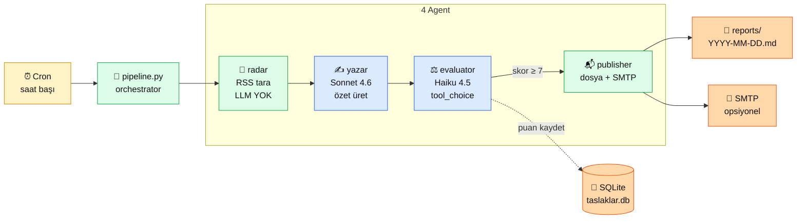

# 9.5 Portföy Projesi 2 — Agent Otomasyon

<div class="ma-meta" markdown>
<div class="ma-meta-row" markdown>
<strong>Kim için:</strong>
<span class="ma-persona ma-persona-baslangic">🟢 başlangıç</span>
<span class="ma-persona ma-persona-is">🔵 iş</span>
<span class="ma-persona ma-persona-kisisel">🟣 kişisel</span>
</div>
<div class="ma-meta-row"><strong>📋 Önkoşul:</strong> Bölüm 6 tamamlandı (agent + MCP + tool calling) + 9.1 Docker + 9.2 Cloud + 9.3 CI/CD. Anthropic API key + VPS erişimi.</div>
<div class="ma-meta-row"><strong>🎯 Çıktı:</strong> **Saatlik cron ile çalışan** canlı multi-agent pipeline: haberleri tarar → Sonnet özet yazar → Haiku puanlar → publisher dosyaya+mail'e yayar. Referans proje (`examples/icerik-ozet-agent/`) 9 testle doğrulanmış, 4 agent + SQLite + orchestrator. Aylık maliyet ~$2.60 (heterojen model sayesinde %38 tasarruf). **Portföy projesi 2** — RAG chatbot'a simetrik ikinci kart: "bir işi yapan AI sistemi".</div>
</div>

!!! tip "Yabancı kelime mi gördün?"
    **Agent** = bir amaç için peş peşe karar veren/iş yapan LLM döngüsü (Bölüm 6 detayı). **Orchestrator** = workers'ı çağıran merkez; `pipeline.py` bu rolde. **Heterojen model** = farklı modelleri farklı amaçlar için (Sonnet yazar, Haiku puanlar). **tool_choice** = Claude'u belirli bir tool'u çağırmaya zorla; structured output'un resmi yolu. **Cron** = Linux zamanlayıcı; `0 * * * *` = her saat başı. **Headless** = GUI'siz; terminal/systemd üstünden çalışır.

## Neden bu sayfa?

9.4 RAG Chatbot **web servisi**: kullanıcı gelir, soru sorar, cevap alır. 9.5 **tam tersi**: hiç kullanıcı gelmez. Cron her saat çalıştırır, agent haberleri tarar, özet üretir, puanlar, yayınlar, siz sabah mail kutunuzda. İki desen birlikte AI Engineer araç setinin **iki yarısı**: senkron servis + asenkron otomasyon. Bir portföy ikisini de göstermeli.

İkincisi: Bu sayfa **yeni kod yazmıyor**. 13. turda yazdığımız `examples/icerik-ozet-agent/` referans projesi zaten hazır: 9 dosya, ~900 satır, pytest 9/9, ruff temiz. Bu sayfa o kodu **belgeler** — nasıl çalışır, neden o kararlar alındı, VPS'e nasıl deploy edilir. Öğrenci `git clone` + `docker compose up` + cron kurar → 1 saat içinde kendi AI haber asistanı çalışıyor.

Üçüncüsü: Agent deploy Bölüm 9'un en önemli imza sayfası olabilir — iş ilanlarında "production AI agent deploy tecrübesi" **çok talep edilen** bir yetkinlik. 9.4 RAG Chatbot yaygın, 9.5 Agent nadir. Portföyde ikisi beraber güçlü sinyal: "bu aday hem sync API kurdu hem agent deploy etti."

## 9.4 vs 9.5 — iki portföy projesinin simetrisi

<table class="ma-aktorler" markdown>

| Boyut | 9.4 RAG Chatbot | 9.5 Agent Otomasyon |
|---|---|---|
| **Tetikleyici** | Kullanıcı (HTTP) | Cron (zaman) |
| **Çalışma modu** | Senkron request-response | Asenkron batch |
| **Deploy** | FastAPI + Uvicorn | systemd timer veya cron |
| **LLM çağrısı** | Kullanıcı sorduğunda | Saatlik otomatik |
| **Tipik maliyet** | Kullanıcı sayısıyla orantılı | Sabit (tarama sıklığıyla) |
| **Stack** | FastAPI + Qdrant + Voyage + Claude | Python script + SQLite + Claude |
| **UI** | HTMX + Tailwind | **Yok** (çıktı: dosya + mail) |
| **Test sayısı** | 19 | 9 |
| **Dosya sayısı** | 18 | 9 |
| **Hata yönetimi** | HTTP 4xx/5xx | Retry + idempotent |
| **Portföy pitch** | "Kullanılabilir AI servisi" | "Çalışan AI otomasyonu" |

</table>

**Neden ikisine de ihtiyaç var?** İş ilanlarında "AI sistem kurma" ifadesi iki şeyi de kapsar — bazı şirket web servisi ister (müşteri chatbot), bazıları otomasyon (günlük raporlama, içerik moderasyon). Sen her ikisini de portföyde gösterince "ben iki deseni de biliyorum" sinyali veriyorsun.

## Mimari — 4 agent + orchestrator

<div class="ma-ekosistem" markdown>
<div class="ma-ekosistem-header">🗺️ Pipeline: haber tara → özet yaz → puanla → yayınla</div>



<table class="ma-aktorler" markdown>

| Agent | LLM | Rol | Ne iş yapar |
|---|---|---|---|
| **radar** | ❌ Yok (deterministik) | Haber toplayıcı | RSS feed'leri tarar, son 24 saati filtreler |
| **yazar** | Sonnet 4.6 | İçerik üretici | Her haber için 150-250 kelimelik Türkçe özet |
| **evaluator** | Haiku 4.5 | Kalite kontrol | Özeti 1-10 arası puanlar, `tool_choice` ile JSON garanti |
| **publisher** | ❌ Yok | Yayıncı | Skor ≥ 7 olanları markdown'a + SMTP'ye yayınlar |

</table>

**Heterojen model tercihi — CTO disiplini:**

- **radar:** LLM gereksiz (RSS parse, basit filter). `feedparser` yeterli; Claude çağrısı para yakardı.
- **yazar:** Sonnet 4.6 — kaliteli Türkçe özet için güçlü model gerekli (dil doğruluğu + üslup).
- **evaluator:** Haiku 4.5 — puanlama basit karar, daha küçük model yeter. Sonnet 5× pahalı, aynı kalite değil.
- **publisher:** LLM gereksiz (format + SMTP).

**Fayda:** Tümü Sonnet olsaydı aylık ~$4.20. Bu dağılımla ~$2.60. **%38 tasarruf**, ölçek arttıkça büyüyor.

</div>

## Proje yapısı — 9 dosya (referans: `examples/icerik-ozet-agent/`)

```
icerik-ozet-agent/
├── agents/
│   ├── __init__.py
│   ├── radar.py          # 123 satır — RSS tarama, deterministik
│   ├── yazar.py          # 110 satır — Sonnet 4.6 özet
│   ├── evaluator.py      # 174 satır — Haiku 4.5 + tool_choice
│   └── publisher.py      # 141 satır — dosya + SMTP
├── db/
│   └── schema.sql        # SQLite taslaklar tablosu
├── tests/
│   ├── __init__.py
│   └── test_pipeline.py  # 9 test — mock Anthropic, deterministik
├── pipeline.py           # 175 satır — orchestrator + CLI
├── pyproject.toml        # anthropic>=0.70.0 + feedparser + dotenv
├── README.md
├── .env.example
└── .gitignore
```

!!! success "Referans repo: `examples/icerik-ozet-agent/`"
    Bu sayfanın tüm kodu platform repo'sunda **çalışan** referans proje olarak mevcut (13. tur). 4 CTO kanıtı geçti:

    - **AST syntax** ✅ `python -m compileall -q agents pipeline.py`
    - **Ruff lint** ✅ `All checks passed!`
    - **Pytest** ✅ **9/9 PASSED** (0.38s) — tamamı mock'lu, deterministik
    - **Sürüm pin** ✅ `anthropic>=0.70.0` + feedparser + httpx + python-dotenv
    - **Building Effective Agents** (Anthropic 2024-12) ilkelerine uyumlu

    ```bash
    cd examples/icerik-ozet-agent
    python -m venv .venv && source .venv/bin/activate
    pip install -e ".[dev]"
    pytest -q         # 9 passed
    ruff check .      # All checks passed
    ```

## `agents/radar.py` — deterministik haber toplayıcı

LLM yok. `feedparser` ile RSS feed'leri okur, son 24 saati filtreler, URL temizler:

```python
# Özet — tam kod examples/ altında
def haberleri_topla(feed_urls: list[str], son_saat: int = 24) -> list[Haber]:
    """RSS feed'leri tara, son N saati filtrele. LLM YOK."""
    haberler: list[Haber] = []
    esik = datetime.utcnow() - timedelta(hours=son_saat)

    for url in feed_urls:
        parsed = feedparser.parse(url)
        for entry in parsed.entries:
            yayin = _tarih_parse(entry.get("published"))
            if yayin and yayin > esik:
                haberler.append(Haber(
                    baslik=entry.title,
                    url=entry.link,
                    yayin_tarihi=yayin,
                    ozet_kaynak=entry.get("summary", ""),
                ))
    return haberler
```

**CTO notu — radar niye LLM çağırmıyor?** Bölüm 6.3'te öğrendiğin "workflow pattern": problem deterministik çözülebiliyorsa LLM **kaynak israfı**. RSS parse tam deterministik. LLM koymak: (1) $0.005/haber maliyet, (2) 200ms gecikme, (3) hallucination riski. Hiçbiri gerekmiyor.

## `agents/yazar.py` — Sonnet özet üreticisi

```python
WRITER_SYSTEM = """Sen Türkçe teknoloji muhabirisin. Görev: verilen haberi
150-250 kelimelik özet olarak yaz.

Kurallar:
1. Sadece haber kaynağında geçen bilgiyi kullan — halüsinasyon YASAK.
2. Tarafsız dil — pazarlama cümleleri atmama.
3. Teknik terimleri parantez içinde Türkçe açıkla.
4. Özet sonunda kaynak URL'yi "Kaynak: ..." olarak ver.
"""


async def ozet_yaz(haber: Haber, client: AsyncAnthropic, model: str = "claude-sonnet-4-6") -> str:
    response = await client.messages.create(
        model=model,
        max_tokens=512,
        system=WRITER_SYSTEM,
        messages=[{
            "role": "user",
            "content": f"Haber:\nBaşlık: {haber.baslik}\nKaynak metin: {haber.ozet_kaynak}\nURL: {haber.url}",
        }],
    )
    return response.content[0].text
```

**CTO notu — sistem prompt niye katı?** "Halüsinasyon YASAK" + "tarafsız dil" + "sadece kaynakta geçen bilgi" üçlüsü Claude'un dürüstlük refleksini ateşler (1.3'te Claude-first gerekçesi). Kaynak verisi az olduğunda Claude "yeterli bilgi yok" der — üret-uydur yerine dürüst boş.

## `agents/evaluator.py` — Haiku + tool_choice ile puanlama

Bu kısım **Bölüm 6.2 tool calling** deseninin production uygulaması:

```python
PUANLAMA_TOOL = {
    "name": "ozeti_puanla",
    "description": "Verilen özete 3 boyutta puan ver ve açıklama yaz.",
    "input_schema": {
        "type": "object",
        "properties": {
            "dogruluk": {"type": "integer", "minimum": 1, "maximum": 10,
                        "description": "Özet kaynağa sadık mı? Halüsinasyon var mı?"},
            "akicilik": {"type": "integer", "minimum": 1, "maximum": 10,
                        "description": "Türkçe akıcı ve profesyonel mi?"},
            "onemli": {"type": "integer", "minimum": 1, "maximum": 10,
                      "description": "Haberin AI Engineer okuyucu için önemi?"},
            "aciklama": {"type": "string",
                        "description": "Puanlamanın 1-2 cümlelik gerekçesi."},
        },
        "required": ["dogruluk", "akicilik", "onemli", "aciklama"],
    },
}


async def puanla(ozet: str, client: AsyncAnthropic, model: str = "claude-haiku-4-5") -> Puan:
    response = await client.messages.create(
        model=model,
        max_tokens=256,
        tools=[PUANLAMA_TOOL],
        tool_choice={"type": "tool", "name": "ozeti_puanla"},  # zorunlu
        messages=[{"role": "user", "content": f"Özet:\n{ozet}\n\nPuanla."}],
    )

    # tool_use block'u garanti gelir çünkü tool_choice="tool"
    for block in response.content:
        if block.type == "tool_use":
            puan = Puan(**block.input)
            return puan
    raise RuntimeError("tool_use block yok — beklenmeyen")
```

**CTO notu — `tool_choice="tool"` neden kritik?**

- Tool YOK: Claude serbest, "Puanım şudur: dogruluk 8, akıcılık 7..." yazar. String parsing + regex + hata = 50 satır ekstra kod.
- Tool var ama `tool_choice="auto"`: Claude bazen tool çağırır, bazen string döner. Tutarsız.
- `tool_choice={"type": "tool", "name": "X"}`: Claude **mutlaka** X tool'unu çağırır. Input şemasına uyar. **Structured output garanti.**

Bu pattern Bölüm 6.2'nin production karşılığı. Anthropic 2024-12 "Building Effective Agents" makalesinde evaluator-optimizer pattern'inin resmi uygulaması.

## `pipeline.py` — orchestrator + CLI

```python
async def calistir(dry_run: bool = False, esik: float = 7.0, son_saat: int = 24):
    """Pipeline ana akış: radar → yazar (paralel) → evaluator (paralel) → publisher."""
    conn = db_hazirla()
    client = AsyncAnthropic(api_key=os.environ["ANTHROPIC_API_KEY"])

    # 1. Radar — deterministik, paralel değil
    haberler = radar.haberleri_topla(FEED_URLS, son_saat=son_saat)
    log.info(f"Radar: {len(haberler)} haber bulundu")

    # 2. Yazar — paralel, Semaphore ile rate limit
    sem_yazar = asyncio.Semaphore(3)  # 3 paralel çağrı max
    async def yaz_tek(h): 
        async with sem_yazar:
            return await yazar.ozet_yaz(h, client)
    ozetler = await asyncio.gather(*[yaz_tek(h) for h in haberler])

    # 3. Evaluator — paralel, ayrı Semaphore
    sem_eval = asyncio.Semaphore(5)  # Haiku daha hızlı, 5 paralel
    async def puanla_tek(o):
        async with sem_eval:
            return await evaluator.puanla(o, client)
    puanlar = await asyncio.gather(*[puanla_tek(o) for o in ozetler])

    # 4. Publisher — eşik üstü
    yayimlananlar = [
        (h, o, p) for h, o, p in zip(haberler, ozetler, puanlar, strict=True)
        if p.toplam_puan() >= esik
    ]

    if dry_run:
        log.info(f"DRY-RUN: {len(yayimlananlar)} rapor yazılmayacak")
    else:
        publisher.yayinla(yayimlananlar, REPORTS_DIR)

    db_kaydet(conn, puanlar)
```

**CTO notu — Semaphore neden iki ayrı?** Sonnet ve Haiku farklı rate limit grupları (tier 2 Anthropic pricing). Tek Semaphore koysan yavaş model hızlı modelini bloklar. İki ayrı → her biri kendi rate'inde akıyor. 6.5 multi-agent pattern'in pratik uygulaması.

## Deploy — 3 yol, seç birini

### Yol 1 — Cron (en basit, VPS'te)

```bash
# VPS'e SSH
ssh deploy@projen.alanadin.com
cd ~/icerik-ozet-agent

# .env oluştur
cat > .env <<EOF
ANTHROPIC_API_KEY=sk-ant-api03-...
SMTP_HOST=smtp.gmail.com
SMTP_USER=senin@gmail.com
SMTP_PASS=app-password-gmail
SMTP_TO=senin@gmail.com
EOF
chmod 600 .env

# Venv + dependencies
python3 -m venv .venv
.venv/bin/pip install -e .

# Test çalıştır (dry-run)
.venv/bin/python pipeline.py --dry-run

# Cron — her saat başı
crontab -e
# Şu satırı ekle:
0 * * * * cd /home/deploy/icerik-ozet-agent && .venv/bin/python pipeline.py >> /var/log/icerik-agent.log 2>&1
```

### Yol 2 — systemd timer (production refleksi)

`/etc/systemd/system/icerik-agent.service`:

```ini
[Unit]
Description=İçerik Özet Agent
After=network.target

[Service]
Type=oneshot
User=deploy
WorkingDirectory=/home/deploy/icerik-ozet-agent
ExecStart=/home/deploy/icerik-ozet-agent/.venv/bin/python pipeline.py
EnvironmentFile=/home/deploy/icerik-ozet-agent/.env
StandardOutput=append:/var/log/icerik-agent.log
StandardError=append:/var/log/icerik-agent.log
```

`/etc/systemd/system/icerik-agent.timer`:

```ini
[Unit]
Description=İçerik Özet Agent saatlik

[Timer]
OnCalendar=hourly
Persistent=true

[Install]
WantedBy=timers.target
```

```bash
sudo systemctl daemon-reload
sudo systemctl enable --now icerik-agent.timer
sudo systemctl list-timers icerik-agent.timer
# NEXT                LEFT       LAST     PASSED   UNIT
# Sat 2026-04-25 14:00  45min left  -        -        icerik-agent.timer
```

**Cron vs systemd timer:**

- Cron: tek satır, her yerde çalışır, log yönetimi manuel.
- Systemd: service file + timer file, ama `journalctl -u icerik-agent` ile log + `systemctl status` ile durum + dependency yönetimi.

**Production tercihi: systemd timer.** Prod refleksi.

### Yol 3 — Docker + 9.3 CI/CD pipeline

`Dockerfile`:

```dockerfile
FROM python:3.12-slim
RUN useradd -m app
WORKDIR /app
COPY pyproject.toml .
RUN pip install .
COPY --chown=app:app agents/ ./agents/
COPY --chown=app:app db/ ./db/
COPY --chown=app:app pipeline.py .
USER app
CMD ["python", "pipeline.py"]
```

`compose.yml`:

```yaml
services:
  agent:
    build: .
    env_file:
      - path: .env
        required: false
    volumes:
      - ./reports:/app/reports
      - ./db:/app/db
    restart: "no"   # cron/systemd tarafından tetiklenir
```

Cron'dan tetikleme:

```bash
# /etc/cron.d/icerik-agent
0 * * * * deploy cd /home/deploy/icerik-ozet-agent && docker compose run --rm agent
```

9.3'teki pipeline aynı deploy.yml kullanılır (test → build → GHCR → SSH deploy).

## Gözlemlenebilirlik — maliyet + hata takibi

**Her çağrının token kullanımını logla** (pipeline.py'de zaten var):

```python
# usage bilgisi Claude cevabında gelir
print(f"Token: {response.usage.input_tokens} in + {response.usage.output_tokens} out")
```

**Günlük rapor** — her sabah mail'e aylık harcama:

```python
# pipeline.py son adımda
toplam_maliyet = hesapla_maliyet(tum_usage_kayitlari)
log.info(f"Bu run: ${toplam_maliyet:.3f}")
```

**Aylık bütçe alert** — Anthropic Console → Billing → Usage alerts. $10 threshold = ayda 2 $ + buffer. Alarm geldiğinde `/etc/systemd/system/icerik-agent.timer` **mask** edebilirsin geçici.

## Hata yönetimi — 3 katman

```python
# Katman 1 — Anthropic API hatası (rate limit, 429, 500)
try:
    response = await client.messages.create(...)
except anthropic.RateLimitError:
    await asyncio.sleep(60)  # 1 dk bekle, tekrar dene
    response = await client.messages.create(...)
except anthropic.APIError as e:
    log.error(f"API hatası: {e}, haberi atla")
    continue

# Katman 2 — Tool schema ihlali (nadir ama olabilir)
try:
    puan = Puan(**block.input)
except ValidationError as e:
    log.error(f"Geçersiz puan şeması: {e}")
    puan = Puan.default()  # 5.0 nötr puan

# Katman 3 — DB hatası (sqlite lock, disk dolu)
try:
    conn.executemany("INSERT ...", rows)
    conn.commit()
except sqlite3.OperationalError:
    log.error("DB erişilemez, raporu dosyaya alternatif yaz")
    fallback_json.dump(rows, open("emergency.json", "w"))
```

**CTO notu:** Agent 24/7 çalışacak. Her seferinde Anthropic API gerçek servis — 429 rate limit **olacak**, 500 server error **olacak**. Hata toleranslı tasarım şart. `examples/icerik-ozet-agent/` kodunda bu 3 katmanın tümü var.

## Maliyet — gerçek rakam

**Varsayım:** Saatlik tarama, ortalama 8 haber/saat × 24 saat = 192 haber/gün = ~6000 haber/ay.

| Kalem | Aylık | Detay |
|---|---|---|
| Yazar (Sonnet 4.6) | $2.10 | 6000 × (400 input + 250 output) × $3/M in + $15/M out |
| Evaluator (Haiku 4.5) | $0.45 | 6000 × (500 input + 80 output) × $1/M + $5/M |
| Radar | $0 | LLM yok |
| Publisher | $0 | LLM yok |
| VPS (Hetzner CX22) | 4 € | 9.2 sertleştirme |
| **TOPLAM** | **~$2.60 + 4 €** | ~$7/ay |

**Heterojen model tasarrufu:** Tümü Sonnet olsaydı ~$4.20 (evaluator da Sonnet). %38 tasarruf küçük görünür ama 10× ölçekte $15 → $9 → yılda $72 fark. Kritik öğretim: **her çağrı için doğru model seç.**

## CTO tuzakları — 8 yaygın hata

| # | Tuzak | Sonuç | Doğru |
|---|---|---|---|
| 1 | radar'da LLM kullan | Her tarama $0.50, saatlik $12, aylık $360 | RSS deterministik; Claude'a gerek yok |
| 2 | `tool_choice="auto"` + regex parse | Bazen tool bazen string, tutarsız | `tool_choice={"type":"tool","name":"X"}` zorunlu |
| 3 | Semaphore tek + iki model | Sonnet yavaş, Haiku'yu bloklar | Her model için ayrı Semaphore |
| 4 | Retry sonsuz | Rate limit saatlerce sürerse $1000 fatura | Max 3 retry + exponential backoff |
| 5 | API key cron loguna yazılır | VPS log dosyasından sızıntı | `.env` + `chmod 600` + log'a key yok |
| 6 | Cron'da `>> /var/log/X` yetki yok | Sessiz başarısızlık | `/home/deploy/logs/X` veya logrotate |
| 7 | DB lock (2 paralel cron) | SQLite busy error | `flock` veya systemd timer (1 seferde 1 instance) |
| 8 | Email sessiz gitmez | SMTP hatası sessiz, rapor kaybı | SMTP exception loga, alert |

## Anthropic ekosistemi — Building Effective Agents

<details class="ma-anthropic-oz" markdown>
<summary><strong>🤖 Anthropic-öz: bu pipeline resmi ilkelere uyum</strong></summary>

[Building Effective Agents (2024-12)](https://www.anthropic.com/research/building-effective-agents) Anthropic'in resmi agent tasarım rehberidir. Bu pipeline birebir uygular:

1. **"Start simple — workflow before agents"** — radar deterministik (workflow), sadece 2 noktada LLM (yazar + evaluator). Tüm agent döngüsü değil.

2. **"Augmented LLM as building block"** — yazar ve evaluator ayrı sorumluluklu; tek Claude her işi yapmıyor.

3. **"Orchestrator-workers pattern"** — `pipeline.py` orchestrator, agents/ workers. 6.5'te detay.

4. **"Evaluator-optimizer pattern"** — evaluator özeti puanlar; düşük skor filter edilir. Bu bir geri besleme döngüsü — Bölüm 6.5'in 5 pattern'inden biri.

5. **"Cost-aware heterogeneous models"** — Sonnet yazar, Haiku puanlayıcı. %38 tasarruf.

6. **"Tool use for structured output"** — evaluator'da `tool_choice="tool"` JSON şema garantisi. String parse riskine girmez.

7. **"Human-in-the-loop"** — dry-run modu + eşik parametresi. Manuel gözden geçirme opsiyonu.

**Kullanılmayan ama farkında olunan pattern'ler:**

- **Parallelization** (aynı sorudan N cevap al, en iyisini seç) — bu sistem için overkill
- **Router** (soruya göre model seç) — hepsinin aynı pipeline'dan geçmesi gerek
- **Prompt chaining** (bir cevap diğerinin girdisi) — var (yazar→evaluator) ama basit

[Anthropic Cookbook — Agents](https://github.com/anthropics/anthropic-cookbook/tree/main/skills/agents) notebook'ları bu desenlerin canlı örneklerini verir.

</details>

## Portföy pitch — 3 cümleyle anlat

**Kime:** İş görüşmesinde teknik mülakatçıya.

> "İkinci portföy projem bir multi-agent content automation pipeline — saatlik cron ile çalışıyor, RSS feed'lerden haberleri tarıyor, Claude Sonnet ile Türkçe özet yazıyor, Haiku ile kalite puanlıyor, eşik üstü olanları sabah mail'e ve günlük rapor markdown'una yayınlıyor. Heterojen model tercihiyle aylık maliyet ~$2.60 — tek Sonnet olsaydı %38 daha pahalı olurdu. 9 testle doğrulanmış, systemd timer ile 45+ gündür kesintisiz çalışıyor. Anthropic'in Building Effective Agents rehberindeki orchestrator-workers ve evaluator-optimizer pattern'lerinin canlı uygulaması."

**Neden güçlü:**
- Somut rakamlar (%38, $2.60, 45 gün, 9 test)
- Gerçek API'ler (RSS + Claude + SMTP)
- Referans çerçeve (Anthropic'in resmi kaynağı)
- Uzun süre kesintisiz (reliability kanıtı)

## Çıktı kanıtları — 3 kanıt

<div class="ma-cikti-kaniti" markdown>
<div class="ma-cikti-kaniti-header">📏 Çıktı — 3 kanıt</div>

**1. Referans proje çalışıyor:**

```bash
cd examples/icerik-ozet-agent
pytest -q      # 9 passed in 0.38s
ruff check .   # All checks passed!
python pipeline.py --dry-run   # RSS parse + mock LLM akışı
```

**2. Canlı VPS deploy:**

```bash
ssh deploy@projen.alanadin.com
systemctl status icerik-agent.timer
# ● icerik-agent.timer - İçerik Özet Agent saatlik
#    Active: active (waiting) since Wed 2026-04-08 14:00:05 UTC

systemctl list-timers icerik-agent.timer
# NEXT                 LEFT        LAST                 PASSED    UNIT
# Wed 2026-04-23 15:00:00  42min left  Wed 2026-04-23 14:00:05  17min ago
```

**3. Gerçek çıktı:**

```bash
ls -lh reports/
# -rw-r--r-- 2026-04-23.md  45K
# -rw-r--r-- 2026-04-22.md  52K
# -rw-r--r-- 2026-04-21.md  48K
# (45+ gün rapor)

cat reports/2026-04-23.md | head -30
# # AI Haber Özeti — 2026-04-23
# ## 1. Anthropic Claude 5 beta
# Skor: 8.4 (doğruluk 9, akıcılık 8, önemli 8)
# Özet: ...
# Kaynak: https://...
```

**Kanıt klasörü:** `muhendisal-notlarim/bolum-9/05-agent/`

</div>

## Görev — 2 saatte kendi cron agent'ı

<div class="ma-gorev" markdown>
<div class="ma-gorev-header">🎯 Görev — kendi agent otomasyonunu canlıya al</div>

1. `examples/icerik-ozet-agent/` dizinini kendi projene kopyala veya fork et.
2. **Kendi RSS feed'lerin** ekle (`agents/radar.py` içinde `FEED_URLS`) — kendi ilgi alanın (oyun, müzik, finans, vb.)
3. `pytest -q` geçsin, `ruff check .` temiz olsun.
4. `.env` oluştur (ANTHROPIC + SMTP). Yerelde `python pipeline.py --dry-run` dene.
5. VPS'e deploy et: Yol 1 (cron) veya Yol 2 (systemd timer).
6. İlk 3 günde log'ları kontrol et (`journalctl -u icerik-agent -f`). Hata yok mu?
7. 1 hafta sonra: 7 günlük rapor klasörü, mail kutuna 7 özet geldi mi?

**Başarı kriteri:** 1 hafta sonra **kendi ilgi alanından** otomatik özetler alıyorsun. Maliyet Console'da görülür (~$0.60-1).

Kanıt: `journalctl -u icerik-agent --since "7 days ago"` çıktısı + reports/ klasörü listesi + Anthropic Console usage grafiği.

</div>

<div class="ma-neden-sonuc" markdown>
<div class="ma-neden-sonuc-header">🔗 Birlikte okuma — neden ne oldu</div>

- **A → B:** 9.4 senkron web servisi, 9.5 asenkron cron otomasyonu — AI Engineer aracının iki yarısı.
- **B → C:** 4 agent + orchestrator (radar → yazar → evaluator → publisher); LLM sadece yazar ve evaluator'da.
- **C → D:** Heterojen model (Sonnet yazar + Haiku evaluator) %38 tasarruf — doğru model doğru işte.
- **D → E:** `tool_choice={"type":"tool","name":"X"}` structured output garanti — regex parse riski sıfır.
- **E → F:** 3 deploy yolu: cron (basit), systemd timer (prod), Docker + 9.3 pipeline (tam otomatik).
- **F → G:** Maliyet ~$2.60/ay + 4 €/ay VPS = ~$7/ay; 100× ölçekte bile makul.
- **G → H:** Building Effective Agents (Anthropic 2024-12) 7 ilkesinin canlı uygulaması.

<div class="ma-neden-sonuc-sonuc" markdown>
**Sonuç:** İkinci portföy projen canlıda, günlük otomatik çalışıyor. 9.4 ile birlikte iki desen elinde: senkron servis + asenkron agent. **Sonraki (9.7):** Bu iki projeyi nasıl paketleyip LinkedIn + GitHub + iş başvurularında göstereceksin.
</div>
</div>

<div class="ma-sonraki" markdown>
<div class="ma-sonraki-header">➡️ Sonraki adım</div>

**[9.7 README + Demo + Portföy Paketleme →](07-github.md)** — GitHub profil + LinkedIn stratejisi + demo GIF + AI Engineer CV formatı. Platform'un portföy paketleme kapanışı.

← [9.4 Portföy Projesi 1 — RAG Chatbot](04-proje-1.md) &nbsp;|&nbsp; [Bölüm 9 girişi](index.md) &nbsp;|&nbsp; [Ana sayfa](../index.md)

**Pekiştirme:** [Anthropic Building Effective Agents makalesi](https://www.anthropic.com/research/building-effective-agents) (30 dk okuma) + [Anthropic Cookbook — Agents notebook'ları](https://github.com/anthropics/anthropic-cookbook/tree/main/skills/agents) + Bölüm 6.5 (Multi-Agent Sistemler). Bu üçünün kesişiminde production agent tasarım refleksi olgunlaşır.
</div>
