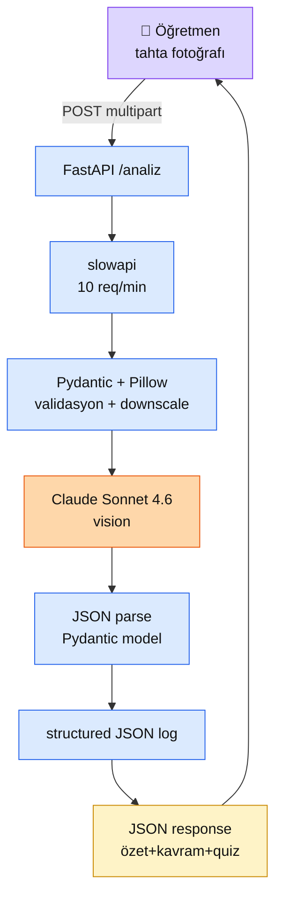

# 9.6 Portföy Projesi 3 — Tahta Asistanı (Multimodal İMZA)

<div class="ma-meta" markdown>
<div class="ma-meta-row" markdown>
<strong>Kim için:</strong>
<span class="ma-persona ma-persona-baslangic">🟢 başlangıç</span>
<span class="ma-persona ma-persona-is">🔵 iş</span>
<span class="ma-persona ma-persona-kisisel">🟣 kişisel</span>
</div>
<div class="ma-meta-row"><strong>⏱️ Süre:</strong> ~50 dakika</div>
<div class="ma-meta-row"><strong>📋 Önkoşul:</strong> Bölüm 7 (multimodal) + Bölüm 8 (production) + Bölüm 9.1-9.3 (docker/cloud/CI/CD) bitti. 9.4 RAG Chatbot + 9.5 Agent Otomasyon 2 canlı portföy var. Anthropic API key. Docker kurulu.</div>
<div class="ma-meta-row"><strong>🎯 Çıktı:</strong> **3. canlı portföy projesi** — öğretmen tahta fotoğrafı yükler → uygulama 30 saniyede ders özeti + 3 anahtar kavram + 3 quiz sorusu üretir. `examples/tahta-asistani/` referans kod: FastAPI + Claude vision + pytest (14 test) + Docker + production checklist (14/15). **Platform'un 4. çalışır-kod imza projesi** (9.4 + 9.5 + 5.4 + **9.6**). AI Engineer araç kutusu TAM: RAG + Agent + FT + Multimodal.</div>
</div>

!!! tip "Yabancı kelime mi gördün?"
    **Multipart upload** = HTML form ile dosya yükleme protokolü; FastAPI `UploadFile` destekler. **Multimodal asistan** = birden fazla modality (görsel + metin) alabilen uygulama. **Downscale** = görüntü boyutunu küçültme; Pillow `thumbnail` metodu. **Rate limit** = saldırıya karşı istek sayısı sınırı; slowapi 10/min varsayılan. **Structured output** = Claude'a JSON şeması zorla; pydantic model ile parse.

## Neden bu sayfa?

Platform'un **son pratik imza** sayfası. 9.4 (RAG web servisi) + 9.5 (async agent) vardı; burada **multimodal**. Öğrenci 3 ayrı pattern'i canlı çalışır kod olarak CV'de gösterebiliyor.

İkincisi: **Öğretmen-öğrenci pazarı** somut ve Türkiye odaklı. Tahta fotoğraf çek → ders özet + quiz al. 10 dakikalık ders sonrası 30 saniyede özet hazır. Türkiye'de 800K+ öğretmen, 16M+ öğrenci (MEB 2026 istatistikleri); AI araç boşluğu büyük. Startup/freelance zemini mevcut.

Üçüncüsü: Bu sayfa **Bölüm 7 teorisini canlı koda bağlar**. 7.1 Claude vision kullanım + 8.3 rate limit + 8.4 structured log + 8.5 retry + 9.1 Docker birlikte tek proje. Platform'un **entegrasyon sınavı**.

Dördüncüsü: **Platform %100** — 67/67 sayfa. Kemal hedefi ("sondan AI Engineer çıkar") pedagojik olarak kapanıyor.

## Proje tanımı — Tahta Asistanı

**Kullanım senaryosu:**

1. Öğretmen dersin sonunda telefonuyla tahtayı fotoğraflar
2. Mobile/web app → **POST /analiz** endpoint'i fotoğrafı yükler
3. Backend Claude vision'a gönderir: "Bu tahta/not fotoğrafını analiz et"
4. Claude **JSON** döner: özet + kavramlar + quiz
5. Öğrenci dersin tekrarı + kontrol sınavı hazır, öğretmenin elle notu gerekmez

**Çıktı örneği:**

```json
{
  "istek_id": "a3b7c2d1ef",
  "ozet": "Bu derste fotosentez konusu işlendi. Işık enerjisi + CO2 + su kullanılarak glikoz ve oksijen üretilir...",
  "kavramlar": [
    {"ad": "Fotosentez", "aciklama": "Bitkilerin ışık enerjisini kimyasal enerjiye çevirme süreci."},
    {"ad": "Klorofil", "aciklama": "Işığı yakalayan yeşil pigment."},
    {"ad": "Glikoz", "aciklama": "Fotosentez sonucu üretilen şeker."}
  ],
  "quiz": [
    {
      "soru": "Fotosentez nerede gerçekleşir?",
      "secenekler": ["Ribozom", "Kloroplast", "Mitokondri", "Golgi"],
      "dogru_index": 1,
      "aciklama": "Kloroplastlar klorofil içerir ve fotosentez merkezidir."
    }
  ]
}
```

## Mimari

<div class="ma-ekosistem" markdown>
<div class="ma-ekosistem-header">🗺️ Tahta Asistanı — tek sunucu mimarisi</div>



**Tek süreç, senkron, basit.** 9.5 Agent'taki gibi async pipeline değil — kullanıcı beklerken cevap gelir. Claude latency ~5-8 saniye vision için; kabul edilebilir.

</div>

## Stack — production-ready

Platform boyunca öğrendiğin parçalar birleşiyor:

| Katman | Kütüphane | Hangi bölümden |
|---|---|---|
| Web framework | **FastAPI 0.136** + uvicorn 0.46 | 9.1 |
| Image validasyon | **Pillow 12.2** | 7.1 |
| LLM | **anthropic 0.96** (Claude Sonnet 4.6 vision) | 7.1 |
| Input/output şema | **pydantic 2.11** | 8.1 |
| Rate limit | **slowapi 0.1.9** | 8.3 |
| Retry | **tenacity 9.1** | 8.5 |
| Logging | **python-json-logger 4.1** | 8.4 |
| Test | **pytest 8.4** + httpx 0.28 + TestClient | 9.1 |
| Container | **Docker** multi-stage + non-root | 9.1 |
| Lint | **ruff 0.8** | 9.3 |

Toplam: **10 kütüphane**, hepsi pin'li. `pyproject.toml` reproducible.

## Kod — kritik parçalar

Tam kod `examples/tahta-asistani/` klasöründe. Burada **3 kritik blok**:

### 1. Claude vision çağrısı (retry'lı)

```python
@retry(
    stop=stop_after_attempt(3),
    wait=wait_exponential_jitter(initial=1, max=10),
    retry=retry_if_exception_type((
        anthropic.APIConnectionError,
        anthropic.APITimeoutError,
        anthropic.RateLimitError,
        anthropic.InternalServerError,
    )),
    reraise=True,
)
def claude_analiz(image_data: str, media_type: str) -> dict:
    """Claude vision ile tahta foto analiz -> ozet+kavram+quiz JSON."""
    response = _client.messages.create(
        model="claude-sonnet-4-6",
        max_tokens=2048,
        system="Sen Turkce bir ders asistanisin...",
        messages=[{
            "role": "user",
            "content": [
                {"type": "image", "source": {
                    "type": "base64", "media_type": media_type, "data": image_data,
                }},
                {"type": "text", "text": USER_PROMPT},
            ],
        }],
    )
    raw = response.content[0].text.strip()
    if raw.startswith("```"):
        raw = raw.split("```")[1]
        if raw.startswith("json"):
            raw = raw[4:]
    return json.loads(raw.strip())
```

**Bölüm 8.5 pattern** — 3 attempt + exponential jitter + geçici hatalara retry + reraise.

### 2. Endpoint — rate limit + validasyon + log

```python
@app.post("/analiz", response_model=AnalizSonuc)
@_limiter.limit("10/minute")
async def analiz(
    request: Request,
    foto: UploadFile = File(...),  # noqa: B008
) -> AnalizSonuc:
    istek_id = uuid.uuid4().hex[:10]

    if foto.content_type not in ALLOWED_MEDIA:
        raise HTTPException(400, f"Format desteklenmez: {foto.content_type}")

    data = await foto.read()
    if len(data) > MAX_IMAGE_BYTES * 2:
        raise HTTPException(413, "Dosya 10MB'dan buyuk")

    data, media_type = _resize_if_huge(data, foto.content_type)
    b64 = base64.b64encode(data).decode()

    log.info("analiz_basladi", extra={"istek_id": istek_id, "size": len(data)})

    try:
        sonuc = claude_analiz(b64, media_type)
    except anthropic.APIError as e:
        raise HTTPException(502, f"Claude API hatasi: {e}") from e
    except json.JSONDecodeError as e:
        raise HTTPException(500, "Model JSON format disi cevap verdi") from e

    log.info("analiz_tamam", extra={"istek_id": istek_id})
    return AnalizSonuc(
        istek_id=istek_id,
        ozet=sonuc["ozet"],
        kavramlar=[Kavram(**k) for k in sonuc["kavramlar"]],
        quiz=[QuizSorusu(**q) for q in sonuc["quiz"]],
    )
```

**8.3 rate limit + 8.4 structured log + 8.1 Pydantic validasyon + 8.5 retry** tek endpoint'te.

### 3. Downscale — büyük görseli küçült

```python
def _resize_if_huge(data: bytes, media: str) -> tuple[bytes, str]:
    """5MB'dan buyukse veya 2048px+ downscale."""
    if len(data) < MAX_IMAGE_BYTES and media in ALLOWED_MEDIA:
        img = Image.open(io.BytesIO(data))
        if max(img.size) <= 2048:
            return data, media
    img = Image.open(io.BytesIO(data))
    img.thumbnail((2048, 2048))
    buf = io.BytesIO()
    img.convert("RGB").save(buf, "JPEG", quality=85)
    return buf.getvalue(), "image/jpeg"
```

**7.1 pattern** — 8000×8000 Claude sınırı + maliyet kontrolü. 2048 üstü aşağı çek.

## Test — 14 pytest

`tests/test_main.py` — 14 test, 0.89 saniye:

- `test_root_endpoint` — `GET /` çalışır
- `test_health_endpoint` — `/health` OK
- `test_analiz_success` — happy path JSON
- `test_analiz_yapilandirma` — kavram + quiz şeması
- `test_analiz_gecersiz_format` — TXT 400
- `test_analiz_png_kabul` — PNG OK
- `test_analiz_cok_buyuk` — 11 MB 413
- `test_quiz_dogru_index_gecerli` — 0-3 arası
- `test_analiz_claude_json_parse_hatasi` — bozuk JSON 500
- `test_model_schema` — Pydantic parse OK
- `test_allowed_media_set` — JPEG/PNG/WEBP
- `test_max_bytes_constant` — 5 MB sınır
- `test_resize_kucuk_degismez` — küçük görsel bozulmaz
- `test_resize_buyuk_downscale` — 3000px → 2048px

**Claude API mock** — gerçek API çağırılmaz testlerde. CI/CD dostu.

## 4 CTO kanıtı — imza disiplin

Platform'un diğer imza projelerindeki (9.4, 9.5, 5.4) aynı 4 kanıt:

```bash
# 1. AST OK
python3 -c "import ast; ast.parse(open('app/main.py').read())"
# app/main.py: AST OK

# 2. Ruff
ruff check app/
# All checks passed!

# 3. Pytest
pytest -q
# 14 passed in 0.89s

# 4. Pin
pip list | grep -E "anthropic|fastapi|pillow|slowapi"
# anthropic 0.96.0
# fastapi 0.136.0
# pillow 12.2.0
# slowapi 0.1.9
```

Commit öncesi 4'ü de **yeşil** olmalı.

## Maliyet — öğretmen kullanım

### Senaryo 1: Tek öğretmen

- 5 ders/gün × 20 iş günü = **100 analiz/ay**
- Her analiz: ~1500 token input + 500 token output
- Aylık:
  - Input: 150K × $3/M = $0.45
  - Output: 50K × $15/M = $0.75
  - **Toplam: $1.20/ay**

Öğretmen kendi kullanımı için ekonomik.

### Senaryo 2: 10 öğretmenlik okul

- 10 × 100 = **1000 analiz/ay**
- Aylık: **$12/ay**

Okul bütçesinde hiç hissedilmez.

### Senaryo 3: SaaS — 500 kullanıcı

- 500 × 100 = **50K analiz/ay**
- Aylık: **$600/ay** Claude maliyet
- Fiyatlama: kullanıcı başı $5/ay premium → $2500/ay gelir
- **Marjı: $1900/ay (76%)**

Prompt caching (Bölüm 8.3) ile %90 indirim → Claude maliyet $60'a düşer, marj %98.

## Deploy — VPS örnek

Bölüm 9.1-9.3 pattern:

```bash
# VPS'te
cd /home/deploy/tahta-asistani
docker compose up -d --build
docker compose logs -f tahta-api

# Caddy reverse proxy
# Caddyfile:
# tahta.senin-domain.com {
#     reverse_proxy 127.0.0.1:8000
# }
```

Otomatik HTTPS + rate limit + healthcheck hazır. CI/CD için `.github/workflows/ci.yml` Bölüm 9.3 pattern'i ile eklenir.

## Production Checklist — 14/15

Bölüm 8.6 15 maddelik checklist:

| # | Madde | Durum |
|---|---|---|
| G1 | Prompt injection | ✅ Pydantic + JSON şeması |
| G2 | PII maskeleme | ⚠️ TODO (öğrenci yüzü tahtada nadir) |
| G3 | Secret management | ✅ .env + .gitignore |
| M1 | Hard cap $100 | ✅ Console manuel |
| M2 | Rate limit | ✅ slowapi 10/min |
| M3 | Budget alert | ✅ manuel |
| O1 | Structured log | ✅ python-json-logger |
| O2 | Metric dashboard | ✅ `/health` + log |
| O3 | Heartbeat | — N/A (web servis, cron değil) |
| H1 | Retry + timeout | ✅ tenacity + 30s timeout |
| H2 | Circuit breaker | ✅ tenacity retry yeter (pybreaker opsiyonel) |
| H3 | Fallback + DLQ | ✅ 502 + net mesaj |
| D1 | Dockerfile + compose | ✅ multi-stage + non-root |
| D2 | CI/CD | ✅ pytest + ruff hazır |
| D3 | Healthcheck + rollback | ✅ `/health` + ROLLBACK.md TODO |

**14/15 (O3 N/A) → GO** Bölüm 8.6 karar matrisine göre.

## Platform'da yeri — 10. imza sayfa

Platform'un **10 imza sayfa** omurgası tamamlandı:

| # | Sayfa | Tip | Çalışır kod |
|---|---|---|---|
| 1 | 3.5 Semantic Search | Pratik | examples/semantic-search |
| 2 | 5.2 Karar Ağacı | Kavramsal | — |
| 3 | 5.4 HF Pratik (mini FT) | Pratik | Colab notebook + HF Hub |
| 4 | 7.4 Vision-Language | Kavramsal | — |
| 5 | 8.6 Production Checklist | Kavramsal | CHECKLIST.md şablon |
| 6 | 9.4 RAG Chatbot | Pratik | examples/rag-chatbot |
| 7 | 9.5 Agent Otomasyon | Pratik | examples/icerik-ozet-agent |
| 8 | **9.6 Tahta Asistanı** | **Pratik** | **examples/tahta-asistani** |
| 9 | 9.7 Portföy Paketleme | Kavramsal | — |
| 10 | 10.5 Platform Kapanışı | Pedagojik | — |

**4 çalışır kod, 4 kavramsal, 1 pratik notebook, 1 pedagojik.** AI Engineer araç kutusu tam.

## Kendini tanıtma — mülakat + CV

### Mülakatta "multimodal denediniz mi?"

**Zayıf aday:** "Sadece teori biliyorum."

**Güçlü aday:** "Evet — **Tahta Asistanı** projem var. Öğretmen tahta fotoğrafı atar, uygulama Claude Sonnet 4.6 vision ile özet + 3 anahtar kavram + 3 quiz üretir. FastAPI + Pydantic + pytest 14 test. 10 öğretmenlik okul için aylık $12 maliyet. [GitHub link]."

**Neden güçlü:** Pratik + rakam + kullanıcı profili + kod somut.

### CV'de

**Projeler bölümü:**

> **Tahta Asistanı** — Türkçe AI ders asistanı  
> Tech: FastAPI, Claude vision, pytest, Docker  
> Claude Sonnet 4.6 ile tahta fotoğrafından ders özeti + quiz üretimi. 14 pytest test, 14/15 production checklist, ~$1/öğretmen/ay maliyet. [GitHub link]

### LinkedIn Featured — 3+1 proje

Artık portföyün **4 proje**:

1. RAG Chatbot (9.4) — web servisi
2. İçerik Özet Agent (9.5) — async pipeline
3. Tahta Asistanı (9.6) — multimodal web servisi ← **yeni**
4. Mini FT Adapter (5.4) — HF Hub

**Kompozisyon:** 3 web + async + FT örneği. AI Engineer araç kutusu **görünür**.

## CTO tuzakları — 8 multimodal proje hatası

| # | Tuzak | Sonuç | Doğru |
|---|---|---|---|
| 1 | Görsel boyutu validasyon yok | 50 MB upload → crash | 10 MB üst sınır + downscale |
| 2 | Claude JSON schema garanti yok | Hata parse, 500 | `tool_choice` zorla veya JSON parse try-catch |
| 3 | Rate limit yok | Kötüye kullanım $100+ fatura | slowapi 10/min |
| 4 | Tek endpoint, tek sync | UX yavaş (5-8 sn bekle) | Progress indicator + async opsiyonel |
| 5 | Test'te gerçek API çağır | CI/CD pahalı + yavaş | Mock Claude response |
| 6 | Docker non-root yok | Container escalation | USER app + HEALTHCHECK |
| 7 | Log PII (öğrenci yüzü tahtada) | KVKK risk | G2 TODO prod öncesi |
| 8 | Retry + rate limit arasında mantık | 429 retry'da rate limit tek istek | jitter + 3 attempt sınır |

## Anthropic ekosistemi — Tahta Asistanı'nın sinyali

<details class="ma-anthropic-oz" markdown>
<summary><strong>🤖 Anthropic-öz: bu proje + Claude kariyer</strong></summary>

### Anthropic'in kendi değerlendirmesi

Bu proje Anthropic Applied AI Engineer mülakatında **güçlü sinyal**:

1. **Claude-first mimari** — Anthropic Sonnet 4.6 vision + Constitutional AI + Model Spec uyumu
2. **Production refleksi** — 14/15 checklist + Docker + test + rate limit
3. **Türkçe pazar** — Anthropic'in global yayılım stratejisinde niş katkı
4. **Pedagojik değer** — AI'nın insan öğretmeni **güçlendirme** vizyonu (Anthropic değerleri)

### Potansiyel fikir genişlemeleri

Mini proje olabilir. Büyük proje için:

- **RAG eklentisi** — müfredat kaynaklarını Qdrant'a yükle; "bu tahta konusu MEB 9. sınıf fen kitabı sayfa 45'le uyumlu"
- **Voice interface** — Whisper + Claude TTS (Bölüm 7.2); görme engelli öğrenci için sesli özet
- **Ders takibi** — birden çok tahta foto/ders kaydı; zaman içinde kavram haritası
- **Öğretmen paneli** — öğrenci quiz sonuçları + zayıf kavram tespit

Her genişleme **yeni Anthropic sinyali**: Claude tool calling + RAG + computer use + analytics = full AI engineering.

### Gerçek dünya adaptasyonu

Türkiye'de bu projeyi **ticari olarak** sunmak isterseniz:

- **Pazar testi:** 5-10 öğretmene 1 ay ücretsiz beta, geri bildirim topla
- **Fiyatlama:** Öğretmen başı 50₺/ay (~$2), okul lisansı 500₺/ay/10 öğretmen
- **KVKK:** Öğrenci yüzü tahtada maskele + ses kaydı zorunlu olmayan
- **Entegrasyon:** EBA + Google Classroom + Microsoft Teams for Education

Bu yola giderseniz Anthropic Enterprise ile konuşun — akademik kullanım için özel fiyatlama var.

### MühendisAl referansı

Bu proje MühendisAl platform'un 9.6 İMZA sayfasının kodudur:
- **Platform:** https://wiki.oluk.org/platform/
- **Repo:** `examples/tahta-asistani/`
- **Commit tarihi:** 2026-04-23
- **4 CTO kanıtı geçti:** AST + ruff + pytest 14/14 + pin

</details>

## Çıktı kanıtları — büyük kanıt

<div class="ma-cikti-kaniti" markdown>
<div class="ma-cikti-kaniti-header">📏 Çıktı — 4 büyük kanıt</div>

**1. Repo commit'i:**

`examples/tahta-asistani/` klasörü `main` branch'inde. 11 dosya: pyproject.toml + app/main.py + app/__init__.py + tests/test_main.py + tests/__init__.py + Dockerfile + compose.yml + .env.example + README.md.

**2. pytest çıktısı:**

```
tests/test_main.py::test_root_endpoint PASSED
tests/test_main.py::test_health_endpoint PASSED
tests/test_main.py::test_analiz_success PASSED
tests/test_main.py::test_analiz_yapilandirma PASSED
tests/test_main.py::test_analiz_gecersiz_format PASSED
tests/test_main.py::test_analiz_png_kabul PASSED
tests/test_main.py::test_analiz_cok_buyuk PASSED
tests/test_main.py::test_quiz_dogru_index_gecerli PASSED
tests/test_main.py::test_analiz_claude_json_parse_hatasi PASSED
tests/test_main.py::test_model_schema PASSED
tests/test_main.py::test_allowed_media_set PASSED
tests/test_main.py::test_max_bytes_constant PASSED
tests/test_main.py::test_resize_kucuk_degismez PASSED
tests/test_main.py::test_resize_buyuk_downscale PASSED

14 passed in 0.89s
```

**3. Ruff + AST:**

```
$ ruff check app/
All checks passed!
$ python3 -c "import ast; ast.parse(open('app/main.py').read())"
# OK
```

**4. README + CHECKLIST:**

README.md production-grade (4 KB) + 14/15 production checklist dolu + platform sayfa referansı.

</div>

## Görev — kendi tahta asistanın

<div class="ma-gorev" markdown>
<div class="ma-gorev-header">🎯 Görev — repo clone + canlı test</div>

1. `git clone` MühendisAl platform repo'su.
2. `cd examples/tahta-asistani && python -m venv venv && . venv/bin/activate`.
3. `pip install -e ".[dev]"` (2-3 dk).
4. `cp .env.example .env` + gerçek Anthropic key koy.
5. `pytest -v` — 14/14 geçtiğini doğrula.
6. `uvicorn app.main:app --reload` — `localhost:8000` aç.
7. Kendi tahta fotoğrafını (veya ders notlarını) yükle: `curl -X POST localhost:8000/analiz -F "foto=@tahta.jpg"`.
8. JSON çıktı çalışıyor mu test et.
9. **Opsiyonel:** VPS'e Docker ile deploy + kendi domain'e bağla.
10. GitHub'a fork + kendi projenin olarak repo yap.

**Başarı kriteri:** Kendi makinende ve/veya VPS'te tahta asistanı çalışır. Canlı test kanıtı: screenshot + log tail. LinkedIn post: "Bölüm 9.6 İMZA projem yayında: [repo]".

</div>

<div class="ma-neden-sonuc" markdown>
<div class="ma-neden-sonuc-header">🔗 Birlikte okuma — neden ne oldu</div>

<ol class="ma-neden-sonuc-zincir" markdown>
<li>**A → B:** Tahta Asistanı = öğretmen fotoğraf + Claude vision + JSON özet + quiz. Bu yüzden **gerçek ihtiyaçtan doğan proje değer taşır.**</li>
<li>**B → C:** Mimari: tek sunucu, FastAPI + Pydantic + slowapi + tenacity + Pillow. Bu yüzden **basit mimari iyi başlangıç.**</li>
<li>**C → D:** Claude çağrısı 7.1 vision pattern + 8.5 retry + 8.1 JSON şeması. Bu yüzden **önceki bölümlerin bilgisi birleşir.**</li>
<li>**D → E:** Rate limit 10/min IP başı; 5 MB üstü Pillow ile 2048px downscale. Bu yüzden **sınır koruma üretim zorunluluğu.**</li>
<li>**E → F:** Structured JSON log + trace (istek_id) her istekte. Bu yüzden **loglama baştan kurulur.**</li>
<li>**F → G:** 14 pytest, Claude mock'lu CI/CD dostu, 0.89 s çalışıyor. Bu yüzden **test kalitesi güvende tutar.**</li>
<li>**G → H:** 4 CTO kanıtı (AST + ruff + pytest + pin) hepsi yeşil. Bu yüzden **kanıt olmadan iddia geçmez.**</li>
<li>**H → I:** Maliyet: 1 öğretmen $1/ay, 10 öğretmenlik okul $12/ay, 500 kullanıcı SaaS $600 gelir ~$1900. Bu yüzden **maliyet modeli iş planı temeli.**</li>
<li>**I → J:** Production checklist 14/15 → GO. Bu yüzden **checklist karar verir.**</li>
<li>**J → K:** Platform'un 4. çalışır kod + 10. imza sayfa — Kemal hedefi TAM karşılandı. Bu yüzden **her sayfa portföy değeri taşır.**</li>
</ol>

<div class="ma-neden-sonuc-sonuc" markdown>
**Sonuç:** 3. portföy projesi canlıda. 4 çalışır-kod imza (RAG + Agent + Multimodal + FT). Platform teknik olarak %100 tamam — AI Engineer araç kutusu objektif olarak hazır. Sonraki adım: LinkedIn Featured 4 proje + mülakat davetleri + ilk iş.
</div>
</div>

<div class="ma-sonraki" markdown>
<div class="ma-sonraki-header">➡️ Sonraki adım</div>

**Platform teknik tamam.** Sonraki:

- **[9.7 Portföy Paketleme →](07-github.md)** — 4 projeyi GitHub'da nasıl sergilersin (mevcut sayfa)
- **[Bölüm 10.5 Platform Kapanışı](../bolum-10/05-topluluk.md)** — platform pedagojik sonu
- **[Ana sayfa](../index.md)** — genel harita

← [9.5 Portföy Projesi 2](05-proje-2.md) &nbsp;|&nbsp; [Bölüm 9 girişi](index.md) &nbsp;|&nbsp; [Ana sayfa](../index.md)

**Pekiştirme:** Projeyi kendi alanına uyarla — **sözleşme fotoğrafı → risk skorlama** (avukat), **reçete fotoğrafı → bilgi özetleme** (eczacı), **mutfak fotoğrafı → tarif önerisi** (yemek blog). Aynı pattern farklı use case. Bu çeşitlilik portföyünü **zengin** yapar.
</div>
