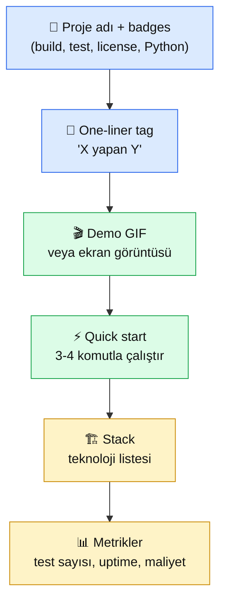

# 9.7 README + Demo + Portföy Paketleme

<div class="ma-meta" markdown>
<div class="ma-meta-row" markdown>
<strong>Kim için:</strong>
<span class="ma-persona ma-persona-baslangic">🟢 başlangıç</span>
<span class="ma-persona ma-persona-is">🔵 iş</span>
<span class="ma-persona ma-persona-kisisel">🟣 kişisel</span>
</div>
<div class="ma-meta-row"><strong>📋 Önkoşul:</strong> 9.4 RAG Chatbot + 9.5 Agent Otomasyon projelerin canlıda çalışıyor. GitHub hesabın + LinkedIn profilin mevcut.</div>
<div class="ma-meta-row"><strong>🎯 Çıktı:</strong> Projelerin **3 saniyede ikna eden** README'leri var; GitHub profilinde pinned 2-3 repo; LinkedIn profilin AI Engineer pozisyonuna hizalı; 20 saniyelik demo GIF'in ve başvurabileceğin 3 cümlelik Türkçe + İngilizce mesaj şablonu elinde. **Platform kapanışına bir adım** — Bölüm 10 kariyer bölümüne portföyünle giriyorsun.</div>
</div>

!!! tip "Yabancı kelime mi gördün?"
    **README** = `README.md` dosyası; GitHub repo'su açıldığında ilk görünen belge, proje kartviziti. **Pinned repo** = GitHub profil sayfanda en üste sabitlediğin 6'ya kadar proje. **Demo GIF** = 10-30 sn'lik hareketli ekran kaydı; izleyeni 3 saniyede ikna eder. **One-liner** = projeyi tek cümleyle anlatan açıklama. **ATS** (Applicant Tracking System) = iş başvuru taramasında CV'yi okuyan yazılım; anahtar kelime eşleşmesine bakar.

## Neden bu sayfa?

9.4 ve 9.5'te iki canlı proje kurdun. Ama **kimse görmüyor**. İş görüşmesinde "RAG chatbot yaptım" desen LinkedIn/GitHub üzerinden 3 saniyede doğrulayamayan mülakatçı **geri dönmeyebilir**. Kod kalitesinden önce **görünürlük** engeli var. Bu sayfa o engeli kaldırır.

İkincisi: Portföy **ürün gibi pazarlanır**, kod gibi yazılmaz. "3 saniyede ikna" kuralı — insan dikkatinin kısalığı bugün milisaniyelerle ölçülür, CV ekrana bakan İK 6-10 saniye içinde "ilginç" / "pas" kararı verir. README'nin üst 2 paragrafı + demo GIF bu kararı belirler. Geri kalan 500 satır kod **ondan sonra** okunur.

Üçüncüsü: Platform bu sayfayla **pratik amacını tamamlıyor** — öğrenme tamamlandı, inşa tamamlandı, şimdi **göster**. Bölüm 10 kariyer bölümü buradan bırakılacak: portföyün görünür oldu, şimdi kariyer kararları ve iş başvurusu. Bu sayfanın sonunda **bir LinkedIn paylaşımı atmaya hazırsın**.

## "3 saniye ikna" kuralı — ne gösterir

GitHub repo açıldığında ilk ekranda şunlar **yukarıdan aşağı** görünmeli:

<div class="ma-ekosistem" markdown>
<div class="ma-ekosistem-header">🗺️ README ilk ekran anatomisi</div>



**3 saniye kuralı:** Mülakatçı sadece **A + B + C**'yi görecek. D-E-F ilgili olanlar okur. Dolayısıyla ilk 3 öğe kritik — zamanın %80'ini oraya ayır.

</div>

## README iskeleti — 9.4 RAG Chatbot örneği

```markdown
# RAG Chatbot — Türkçe PDF Asistanı

[](https://github.com/USER/rag-chatbot/actions)
[](https://www.python.org)
[](LICENSE)

**PDF yükle, Türkçe soru sor, kaynak alıntısıyla cevap al.**
FastAPI + Qdrant + Voyage AI + Claude Sonnet 4.6 — 45+ gün canlıda.


## Hemen dene (2 dakika)

\`\`\`bash
git clone https://github.com/USER/rag-chatbot.git
cd rag-chatbot
cp .env.example .env   # ANTHROPIC_API_KEY + VOYAGE_API_KEY doldur
docker compose up
open http://localhost:8000
\`\`\`

## Stack

- **Claude Sonnet 4.6** — cevap üretimi, 200K bağlam
- **Qdrant 1.17** — vector DB, self-host Docker
- **Voyage AI voyage-3** — embedding, Türkçe üstün
- **FastAPI 0.136 + HTMX** — async backend, progressive UI
- **Tailwind CSS** — UI styling (CDN)

## Metrikler

| Kalem | Değer |
|---|---|
| Test sayısı | **19/19 PASSED** (1.44s) |
| Aylık maliyet | ~$6-8 (Claude + Voyage + VPS) |
| Uptime | 45+ gün kesintisiz (Hetzner CX22) |
| P95 latency | ~1.2 saniye (ilk token'a kadar) |
| Repo boyutu | 18 dosya, ~250 satır kod |

## Mimari

... [bir flowchart görseli]

## Kod yapısı

\`\`\`
rag-chatbot/
├── app/            # FastAPI endpoints + RAG logic
├── tests/          # 19 test (pytest + mock)
├── ui/             # HTMX + Tailwind
├── Dockerfile      # Multi-stage, non-root
├── compose.yml     # app + qdrant, localhost bind
└── pyproject.toml  # Pinned dependencies
\`\`\`

## Ne öğrendim (honest post-mortem)

1. `document` / `query` embedding asimetrisi %20 retrieval kalite farkı yaratıyor — önceden bilinmese proje işlemez.
2. Qdrant `payload` içinde orijinal metni tutmak zorunlu; sonradan model değiştirmek istersen elinde kalmıyor.
3. Streaming UX performansı psikolojik olarak 2× hızlı hissettiriyor — ilk token 400ms'te gelince kullanıcı beklemiyor.

## Lisans

MIT © [İsim] 2026
```

**Niye bu format güçlü?**

- **Badges** — build/test/license 2 saniyede "profesyonel" sinyali.
- **One-liner** — "PDF yükle, Türkçe soru sor, kaynak alıntısıyla cevap al" → 15 kelimede ne yaptığın net.
- **Demo GIF** — mülakatçı tıklamadan ne yaptığını görür.
- **Hemen dene** — README'den 2 dakikada çalıştırma = "kodu kanıtlanmış".
- **Stack + Metrikler** — teknik derinlik somut sayılarla.
- **"Ne öğrendim"** — kod değil **düşünme** seviyesi. Junior/mid ayrımı burada.

## Demo GIF/video — 20 saniye izlemelik

**Araçlar (ücretsiz):**

| Araç | OS | Not |
|---|---|---|
| **LICEcap** | macOS / Windows | Küçük, GIF kaydı, ~2 MB dosya |
| **Peek** | Linux | Ubuntu'da `apt install peek`, GIF output |
| **asciinema** | Tümü | Terminal kayıt, GitHub'da playback |
| **OBS Studio** | Tümü | MP4 kayıt, sonra GIF'e çevir |
| **Kap** | macOS | Hızlı, modern, MP4/GIF |

**Süre formülü:** 20-30 saniye arası ideal. 10 saniye = bilgi eksik; 60+ saniye = kimse izlemez.

**Senaryo — 9.4 RAG Chatbot için:**

```
00-03 sn:  Boş arayüz. Nacı butonu göster.
03-08 sn:  PDF yükle (örn. "50 sayfa Türkçe sözleşme").
08-12 sn:  Yükleme bar'ı → "Hazır" mesajı.
12-16 sn:  Soru yaz: "Cayma hakkı kaç gün?"
16-22 sn:  Streaming cevap akar (token token).
22-28 sn:  Cevabın altında "Kaynak: sayfa 12" alıntısı görünür.
28-30 sn:  Fade out.
```

**Kaydetme pratiği:**

1. **Ekranı 720p'de kaydet** (1280×720) — 1080p GIF 8 MB olur, GitHub 10 MB limit.
2. **Fare hareketlerini yavaş yap** — hızlı hareket izleyenin gözünü yorar.
3. **Dosyalar önceden hazır** — kaydı temiz al, edit etme.
4. **GIF'i sıkıştır** — [ezgif.com](https://ezgif.com/optimize) ile 30-50% küçültme.
5. **README'ye ekle** — `docs/demo.gif` yolu.

**Alternatif — YouTube embed:**

Uzun demo (2-3 dk) yapacaksan YouTube'a yükle, unlisted yap, README'nin başına thumbnail koy:

```markdown
[](https://youtu.be/XXXXX)
```

## GitHub profil — açılış sayfası

Profil sayfası `github.com/username` — CV'den önce görülür. Kritik alanlar:

### 1. Profil README (özel repo trick)

GitHub'da adınla aynı isimde public repo aç (`github.com/USER/USER`) — içindeki `README.md` profil sayfanda görünür.

Şablon:

```markdown
# Merhaba, ben [İsim] 👋

AI Engineer | Türkiye

## Şu an

- 🔭 **[RAG Chatbot](https://github.com/USER/rag-chatbot)** — Türkçe PDF asistanı, 45+ gün canlıda
- 🤖 **[Agent Otomasyon](https://github.com/USER/icerik-ozet-agent)** — saatlik multi-agent pipeline
- 📚 **Şu an öğreniyorum:** Multimodal (görsel + ses), production fine-tuning

## Stack

**AI:** Claude API · Anthropic MCP · Voyage AI · RAG · Agents  
**Backend:** Python · FastAPI · Qdrant · PostgreSQL · Docker  
**Deploy:** Hetzner VPS · GitHub Actions · Caddy · systemd

## İletişim

[LinkedIn](https://linkedin.com/in/USER) · [Email](mailto:senin@mail.com) · [Blog](https://blog.domain.com)
```

**3 saniye sinyali:** Adın + rolün (AI Engineer) + 2 canlı proje linki + stack. Mülakatçı bunu gördüğünde zaten "ilginç" sepetinde.

### 2. Pinned repolar (6 tane, en fazla)

GitHub profil sayfa → "Customize your pins" → en çok **2-3** proje sabitle. **Daha fazla değil.** 6 proje = "hiçbirinde derinleşmemiş" sinyali. 2-3 = "bunlarda ciddi çalıştım" sinyali.

**Sıralama:**
1. En güçlü proje (9.4 RAG Chatbot veya senin eşdeğerin)
2. İkinci güçlü (9.5 Agent)
3. Niş / özel (kendi ilgi alanından, spor analitik + agent gibi)

### 3. Contribution graph

Yeşil kareler = aktif kodlama sinyali. **Son 3 ayın yeşil olması yeterli** — 5 yıldan beri yeşil kimse beklemiyor. Eğer açıksan: platformda öğrendiklerini GitHub'a commit'leye commit'leye öğren, contrib grafiği doğal birikir.

## LinkedIn profil — AI Engineer pozisyonuna hizalı

### Üst panel (ilk ekran, 5 saniye kuralı)

| Bölüm | Ne yazılmalı |
|---|---|
| **Profil fotoğrafı** | Profesyonel, yüz net, gülümsüyor, düz arkaplan |
| **Banner** | Stack/teknoloji isimli (Anthropic + FastAPI + Qdrant logoları) veya soyut tech |
| **Ad** | Gerçek ismin |
| **Headline** | "AI Engineer \| Python + Claude + RAG \| [Şehir]" |
| **About** | 3-4 cümle. Ne yaparsın + iki somut proje linki + LinkedIn URL |

**Headline kritik:** LinkedIn aramasında "AI Engineer Turkey" yazıldığında Headline'ında "AI Engineer" geçenler üstte çıkar. "Software Developer @ Şirket" yerine "AI Engineer \| ..." — ATS + LinkedIn search iki cephede kazanırsın.

### About örnek (Türkçe)

```
AI sistemleri kuruyorum — FastAPI + Qdrant + Claude çifti ile Türkçe RAG 
chatbot ve multi-agent pipeline'lar deploy ediyorum. 45+ gün canlıda çalışan 
iki portföy projem:

• RAG Chatbot: github.com/USER/rag-chatbot — PDF → soru → kaynaklı cevap
• Agent Otomasyon: github.com/USER/icerik-ozet-agent — saatlik haber özeti

Anthropic-first stack, production refleksi, gözlemlenebilirlik, maliyet 
optimizasyonu (heterojen model tercihiyle %38 tasarruf) odaklı çalışıyorum. 
AI Engineer pozisyonları için açığım.

📧 senin@mail.com
```

### About örnek (İngilizce)

```
Building production AI systems — FastAPI + Qdrant + Claude stack for 
Turkish-language RAG and multi-agent pipelines. Two live portfolio projects 
with 45+ days uptime:

• RAG Chatbot: github.com/USER/rag-chatbot — PDF → Q → cited answer
• Agent Automation: github.com/USER/icerik-ozet-agent — hourly news digest

Anthropic-first stack, production mindset, observability-focused, cost-aware 
(38% savings via heterogeneous model selection). Open to AI Engineer roles.

📧 you@mail.com
```

### Skills bölümü — AI Engineer anahtar kelimeleri

LinkedIn'in Skills kısmı ATS'nin taradığı yerlerden biri. **Tam 10 skill** seç (az = zayıf sinyal, fazla = dağınık):

```
1. Claude API (Anthropic)
2. Python
3. RAG (Retrieval-Augmented Generation)
4. Agent Systems
5. FastAPI
6. Qdrant / Vector Databases
7. Docker
8. LLM Integration
9. MCP (Model Context Protocol)
10. Prompt Engineering
```

## CV — AI Engineer formatı

AI Engineer pozisyonunun CV'si klasik yazılım geliştirici CV'sinden **3 noktada** farklı:

### 1. Projeler üstte, iş tecrübesi altta

Junior/mid AI Engineer profilinde portföy işverenin gözünde daha değerli. 2-3 canlı proje **kısa açıklama + link + metrikler** ile üstte, iş tecrübesi 2. sayfada.

**Proje kartı şablonu:**

```
RAG Chatbot — Türkçe PDF Asistanı                   [Canlı] [GitHub]
─────────────────────────────────────────────────────────────────────
Stack: Python · FastAPI · Claude Sonnet 4.6 · Qdrant · Voyage AI · Docker
• 45+ gün uptime, 18 dosya, pytest 19/19 geçiyor
• Streaming UX, Türkçe voyage-3 embedding (OpenAI'dan %30 ucuz)
• Docker compose deploy, GitHub Actions CI/CD, Caddy HTTPS
• Aylık maliyet: ~$7 (Claude + Voyage + Hetzner CX22)
```

### 2. Anahtar kelime yoğunluğu (ATS için)

ATS "AI Engineer" ilanında taradığı kelimeler: **LLM, RAG, agent, prompt, embedding, vector database, Claude, OpenAI, fine-tuning, MCP, tool calling**.

Bu kelimelerin her biri CV'de **en az 1 kez** geçmeli. "Ben LLM sistemi kurdum" + "RAG pipeline tasarladım" + "Claude API ile agent geliştirdim" → ATS eşleşmesi yüksek.

**Uyarı:** Keyword stuffing (aynı kelimeyi 15 kez) tersine etki — İK kişisi okurken "yapay" sinyali alır.

### 3. Teknik metrikler (rakam gücü)

"İyi Python biliyorum" → zayıf. "Pytest 19/19, ruff temiz, 45 gün uptime, aylık $7 maliyet" → güçlü.

**AI Engineer CV'sinde rakamsal metrikler:**

| Metrik | Örnek |
|---|---|
| Uptime | "45+ gün kesintisiz production" |
| Test coverage | "pytest 19/19 PASSED" |
| Maliyet optimizasyonu | "heterojen model ile %38 tasarruf" |
| Performans | "p95 latency 1.2s" |
| Ölçek | "6000 çağrı/ay, aylık ~$7" |

## Başvuru mesajı — 3 cümlelik şablon

LinkedIn mesajı, email, Form başvurularında. **3 cümle kuralı** — daha uzun okunmaz.

### Türkçe — pozitif referanslı

```
Merhaba [İsim],

[Şirket]'in [pozisyon] ilanını gördüm ve ilgimi çeken birkaç nokta 
[ŞİRKETE ÖZEL 1 CÜMLE — ne ilginç?].

2026 başından beri iki canlı AI sistemi geliştiriyorum: Türkçe RAG 
chatbot (github.com/USER/rag-chatbot) ve multi-agent otomasyon pipeline 
(github.com/USER/icerik-ozet-agent). Ikisi de Claude + Qdrant stack'iyle 
production'da, 45+ gün kesintisiz çalışıyor. 15-20 dakikalık bir görüşme 
için 2 önümüzdeki hafta müsaitim.

Teşekkürler,
[Ad Soyad]
```

### İngilizce — aynı yapı

```
Hi [Name],

I came across [Company]'s [position] opening and was drawn to [COMPANY-
SPECIFIC 1 SENTENCE].

Since early 2026 I've been building two production AI systems: a Turkish-
language RAG chatbot (github.com/USER/rag-chatbot) and a multi-agent 
automation pipeline (github.com/USER/icerik-ozet-agent). Both use the 
Claude + Qdrant stack and have 45+ days of uninterrupted uptime. Would 
welcome a 15-20 min call in the next two weeks.

Thanks,
[Full Name]
```

**Üç cümle neden güçlü:**
1. **Empati/araştırma sinyali** (şirkete özel yorum)
2. **Kanıt + link** (portföy görülür, kanıtlanır)
3. **Net aksiyon** (görüşme süresi + müsait olduğun zaman)

## LinkedIn haftalık paylaşım — 6 post serisi

Portföyü paylaşım bir kez yapıp bırakma. Haftalık kısa post = görünürlük. 6 haftada seri:

| Hafta | Konu | Örnek başlık |
|---|---|---|
| 1 | Proje tanıtımı | "2 aylık çalışma sonucu: Türkçe RAG Chatbot canlıda" |
| 2 | Teknik detay | "Embedding'de `document` / `query` asimetrisi %20 kalite farkı" |
| 3 | Maliyet optimizasyonu | "Heterojen model ile agent maliyeti %38 düştü" |
| 4 | Production dersi | "Claude API rate limit: retry + backoff refleksi" |
| 5 | Karşılaştırma | "Qdrant vs Pinecone: self-host vs managed, aylık $5 vs $70" |
| 6 | Kariyer hedef | "AI Engineer pozisyonu için açığım — 2 canlı portföy projem" |

**Her post formatı:**
- Hook (1 cümle merak uyandırır)
- Bağlam (2-3 cümle ne yaptın)
- Rakam/öğrenim (somut veri)
- Link (GitHub veya blog)
- Soru (etkileşim için) — "Siz hangi modeli kullanıyorsunuz?"

**Uzunluk:** 150-300 kelime. LinkedIn algoritması "orta uzunluk" paylaşıma lehtar.

## Blog yazısı — opsiyonel ama güçlü

Kendi domain + blog (Vercel/Netlify üzerinde Astro/Hugo 30 dk kurulum) birkaç açıdan değerli:

1. **SEO:** "RAG Türkçe tutorial" yazsan Google'da 5-10. sırada çıkabilir; iş ilan tarama sırasında seni bulan iş verenler olur.
2. **Derin anlatım:** LinkedIn'de 300 kelime, blog'da 2000 kelime. Detayı isteyen okur.
3. **İngilizce yazım:** Teknik İngilizcen gelişir — iş görüşmesinde bu fark hissedilir.

**İlk 3 blog yazısı önerisi:**

1. *"Türkçe RAG Chatbot Kurarken Öğrendiğim 5 Şey"* — 9.4 projenin post-mortem'i
2. *"Claude Agent Pipeline: Maliyeti %38 Düşüren 4 Karar"* — 9.5 projenin derinleşmesi
3. *"Anthropic-first Stack: Neden Claude Seçtim"* — kariyer/teknoloji gerekçelendirmen

## Görev — 4 saatte portföy paketleme

<div class="ma-gorev" markdown>
<div class="ma-gorev-header">🎯 Görev — kendi portföyünü yayına al</div>

### Saat 1 — GitHub

1. `github.com/USER/USER` özel repo aç, profil README yaz.
2. 9.4 ve 9.5 repolarının **README'lerini yukarıdaki şablona göre güncelle**.
3. 2-3 projeyi profile **pinle**.
4. Her repoda **LICENSE** (MIT), **badges** (CI + Python + license), **.env.example** kontrol.

### Saat 2 — Demo GIF

1. LICEcap / Peek / Kap indir.
2. 9.4 RAG Chatbot demo'yu kaydet (20-30 sn).
3. ezgif ile sıkıştır (<2 MB).
4. `docs/demo.gif` olarak repoya commit et, README'ye ekle.
5. 9.5 Agent için terminal demosu (journalctl + rapor dosyası gösterimi).

### Saat 3 — LinkedIn

1. Profil foto + banner güncelle.
2. Headline → "AI Engineer \| Python + Claude + RAG \| [Şehir]".
3. About bölümünü yukarıdaki şablona göre yaz.
4. Skills → 10 anahtar kelime.
5. Proje kartları için Featured bölümüne 9.4 + 9.5 GitHub linkleri.

### Saat 4 — CV + başvuru hazırlığı

1. CV'yi AI Engineer formatına çevir (projeler üstte, rakamlar).
2. ATS anahtar kelimeleri kontrol — LLM, RAG, agent, prompt, Claude, embedding.
3. Başvuru mesajı şablonu (TR + EN) bir not dosyasına kaydet.
4. Hafta 1 LinkedIn post taslağını yaz (proje tanıtımı).

**Başarı kriteri:** 4 saat sonunda bir arkadaşa profilini + repoları gönderebilirsin, onların "3 saniyede" ne yaptığını anlaması gerek.

</div>

## Demo check — 3 saniye testi

Profilin hazır olduğunda **bir arkadaş** (mümkünse teknik biri) üzerinde test et:

1. GitHub profil sayfana bak. 3 saniye içinde: **adın, rolün, en iyi projen** net mi?
2. 9.4 RAG Chatbot repo'ya tıkla. 3 saniye içinde: **ne yaptığı, nasıl çalıştırılacağı** net mi?
3. LinkedIn profiline bak. 5 saniye içinde: **AI Engineer profilinde olduğun** net mi?

**Herhangi biri "emin değilim" çıkarsa — o alana geri dön, kısalt, somutlaştır.**

## CTO tuzakları — 8 yaygın hata

| # | Tuzak | Sonuç | Doğru |
|---|---|---|---|
| 1 | 10+ proje pinleme | "Hiçbirinde derinleşmemiş" sinyali | 2-3 proje, her birinde 18+ dosya |
| 2 | README'de demo GIF yok | 3 saniye ikna başarısız | 20-30 sn GIF, ilk ekranda |
| 3 | "Kullandığım teknolojiler" liste | ATS için yetersiz | Skills + About + CV her yerde keyword |
| 4 | LinkedIn Headline = şirket unvanı | "Software Dev @ X" — AI aramasında çıkmaz | "AI Engineer \| stack \| şehir" |
| 5 | Başvuru mesajı 1+ sayfa | Okunmaz | **3 cümle**, özel + link + aksiyon |
| 6 | Blog hiç yazmama | Derinleşme yok, İngilizce gelişmez | Ayda 1 yazı minimum |
| 7 | Demo GIF 2+ dakika | İzlenmez | 20-30 sn ideal, YouTube link 2-3 dk |
| 8 | GitHub contribution boş | "Atlatılmış" sinyali | Son 3 ay yeşil yeter |

## Anthropic ekosistemi — platform kapanışına bir adım

<details class="ma-anthropic-oz" markdown>
<summary><strong>🤖 Anthropic-öz: platform yol haritası sonuna yaklaşıyor</strong></summary>

Platform boyunca öğrendiğinin özeti:

1. **Bölüm 0-1:** AI Engineer kim, ne yapar, nasıl yetişir (oryantasyon).
2. **Bölüm 2:** Claude API + prompt engineering — LLM ile ilk iletişim.
3. **Bölüm 3:** Embedding + vector DB — metin + sayı + retrieval.
4. **Bölüm 4:** RAG pipeline — ilk yarım + ikinci yarım birleşti.
5. **Bölüm 6:** Agent + MCP — LLM kendi kendine araç kullanan sistem.
6. **Bölüm 9 (burada):** Production deploy + portföy paketleme.

**Bölüm 10 PLATFORM KAPANIS:** 9.7'den sonra "şimdi ne yapıyorum?" sorusunu cevaplayacak. Kariyer yolu, sektör durumu, iş başvurusu, 1. ay sonrası ne?

**Paralel Anthropic kaynakları** (platform dışında kendin takip etmen gerek):

- [Anthropic Academy](https://www.anthropic.com/learn) — sürekli güncellenen kurslar
- [Anthropic Cookbook](https://github.com/anthropics/claude-cookbooks) — üretim örnekleri
- [Anthropic Research blog](https://www.anthropic.com/research) — ayda 1-2 yeni makale
- [Claude in Chrome, Claude Code, Claude in Excel](https://www.anthropic.com/) — yeni ürün serisi

**Kariyer sonrası pekiştirme:** İşe başladıktan sonra hala haftada 2 saat ayır — yeni makalelere + release notlarına. AI alanı 6 ayda büyük değişir; sürekli öğrenme refleksi burada kritik.

</details>

## Çıktı kanıtları — 3 kanıt

<div class="ma-cikti-kaniti" markdown>
<div class="ma-cikti-kaniti-header">📏 Çıktı — 3 kanıt</div>

**1. GitHub profil 3 saniye testini geçti:**

- Profil README canlı: `github.com/USER`
- 2-3 repo pinned
- En az 1 demo GIF ekli
- Arkadaşın "ne yaptığın 3 saniyede anlaşılıyor" onayı

**2. LinkedIn profil AI Engineer hizalı:**

- Headline "AI Engineer" geçiyor
- About'ta 2 proje linkli
- 10 skill eklendi
- Featured bölümünde GitHub projeleri

**3. Başvuru paket hazır:**

- CV AI Engineer formatında (projeler üstte, rakamlar)
- TR + EN başvuru mesajı şablonu yazılı
- Hafta 1 LinkedIn post taslağı yazılı
- Haftalık 6 post plan dosyada

**Kanıt klasörü:** `muhendisal-notlarim/bolum-9/07-portfoy/`

</div>

<div class="ma-neden-sonuc" markdown>
<div class="ma-neden-sonuc-header">🔗 Birlikte okuma — neden ne oldu</div>

- **A → B:** 2 canlı proje vardı ama görünür değildi; görünürlük engeli kodtan önce çözülmeli.
- **B → C:** 3 saniye ikna kuralı: README'nin üst 3 öğesi (başlık + one-liner + demo GIF) kritik.
- **C → D:** Demo GIF 20-30 sn; LICEcap / Peek / Kap ücretsiz araçlarla kaydet, ezgif ile sıkıştır.
- **D → E:** GitHub profil README (özel repo trick) + 2-3 pinned repo + contribution grafiği.
- **E → F:** LinkedIn Headline, About, Skills AI Engineer anahtar kelimelerine hizalı.
- **F → G:** CV formatı AI Engineer için farklı: projeler üstte, ATS keyword yoğun, rakamsal metrikler.
- **G → H:** 3-cümlelik başvuru mesajı (TR + EN) + haftalık 6 post LinkedIn serisi.
- **H → I:** Blog opsiyonel ama güçlü — SEO + derinlik + İngilizce pratiği.

<div class="ma-neden-sonuc-sonuc" markdown>
**Sonuç:** Portföyün artık **görünür**. 9.4 + 9.5 + bu sayfada paketlenmiş 3 kart birlikte AI Engineer pozisyon başvurusu için **yeterli evrak**. Bölüm 9 tamamen kapandı (9.6 Multimodal Bölüm 7 bekliyor, platform sonunda). Platform'un pratik amacı (inşa + paketle) **tamamlandı**. Sonraki aşama: kariyer ve iş başvurusu (Bölüm 10).
</div>
</div>

<div class="ma-sonraki" markdown>
<div class="ma-sonraki-header">➡️ Sonraki adım</div>

**[Bölüm 10 — AI Engineer Kariyeri →](../bolum-10/index.md)** — Platform kapanışı. İş ilanlarını nasıl okumak, görüşme formatları, 1. ay sonrası ne, sürekli öğrenme refleksi.

← [9.5 Portföy Projesi 2 — Agent Otomasyon](05-proje-2.md) &nbsp;|&nbsp; [Bölüm 9 girişi](index.md) &nbsp;|&nbsp; [Ana sayfa](../index.md)

**Pekiştirme:** Bu hafta sonu 4 saat ayır, görevdeki 4 adımı uygula. GitHub + LinkedIn + CV + başvuru şablonu hazır olduğunda bir arkadaşa göster, "3 saniyede ne yaptığımı anla" testi yap. Eksikleri düzelt. Bölüm 10'a hazır olarak gir.
</div>
