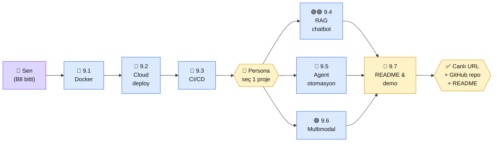

# Bölüm 9 — Deployment ve Portföy

**Persona:** Bölüm 8'i bitirmiş, güvenlik checklist işaretli. "Artık canlıya çıkarmanın zamanı" diyor. Portföye ne koyacağına karar vermesi gerek · **Süre:** ~6 saat (7 sayfa, 3'ü somut portföy projesi) · **Önkoşul:** Bölüm 4 veya 6'dan hazır servis, GitHub hesabı, 1 domain veya subdomain · **Çıktı:** **Canlı, deploy edilmiş 1 portföy projesi** — URL paylaşılabilir, GitHub repo public + README'li

## Neden bu bölüm?

Platformun **"başarı kriterini geçtiğin yer" bu bölüm.** Kapsam v2'ye göre başarı: "4-6 hafta sonunda çalışan, deploy edilmiş Claude-destekli proje." Bu cümlenin ilk 4-6 hafta kısmı önceki 8 bölümdü; **deploy kısmı burası.** Burayı atlarsan platform başarısız sayılır.

Niye 7 sayfa? Çünkü 3 somut portföy projesi var (RAG chatbot, Agent otomasyon, Multimodal asistan) — her biri önceki bölümlerin birleşmiş hali. Senin persona'na göre birini (veya birkaçını) seçip deploy edeceksin.

Üçüncüsü: **İş görüşmesinde "GitHub link ne?" sorusu 10 saniyede kaybettirir veya kazandırır.** Bu bölüm o linki sana kazandırır. README + canlı URL + ekran görüntüsü paketi.

## Bölüm 9 kısaca

**9.1 — Docker ile Paketleme.** `Dockerfile` + `docker-compose.yml`. Python + FastAPI + Qdrant + Claude API key tek `docker-compose up` ile. Servis taşınabilir oldu.

**9.2 — Cloud Deploy (Hetzner / DigitalOcean).** $5-10/ay VPS kiralayıp Docker ile deploy. Domain + Cloudflare DNS + Let's Encrypt SSL. "İlk canlı URL" anın.

**9.3 — CI/CD GitHub Actions.** Her push'ta test + build + deploy otomasyonu. 30 dakikalık kurulum, ömür boyu işe yarayan rahatlık.

**9.4 — Portföy Projesi 1: RAG Chatbot (🟢🟣 persona odak).** "Kitap/doküman asistanı" — PDF yükle, soru sor, cevap + kaynak al. Bölüm 4 tabanlı.

**9.5 — Portföy Projesi 2: Agent Otomasyon (🔵 persona odak).** "Email triaj asistanı" — gelen email'leri Claude'la kategorize + taslak cevap üret. Bölüm 6 tabanlı.

**9.6 — Portföy Projesi 3: Multimodal Asistan (🟣 persona odak).** "Tahta fotoğrafı → özet + soru seti." Bölüm 7 tabanlı. Öğrenciler/öğretmenler için.

**9.7 (nav'da kapalı):** README yazma + ekran görüntüsü + demo video çekimi — **projeyi paylaşılabilir hale getirmek.**

## Bu bölümün yol haritası

### Aktör tablosu

| Düğüm | Nerede | Ne iş yapıyor |
|---|---|---|
| 👤 **Sen** | GitHub + Docker + VPS | 9.1-9.3 kur, 9.4/5/6'dan birini seç, 9.7 ile kapat |
| 📄 **9.1 Docker** | Yerel + Docker | `Dockerfile` yaz, `docker-compose up` çalıştır |
| 📄 **9.2 Cloud** | Hetzner/DO VPS ($5/ay) | SSH + Docker install + servisi çalıştır + domain bağla |
| 📄 **9.3 CI/CD** | GitHub Actions | `main`'e push → otomatik deploy |
| 📄 **9.4 RAG chatbot** | Bölüm 4 kodu + FastAPI + basit UI | "Kitap asistanı" tipi proje |
| 📄 **9.5 Agent otomasyon** | Bölüm 6 kodu + MCP + e-mail API | "Email triaj" tipi proje |
| 📄 **9.6 Multimodal** | Bölüm 7 kodu + vision + OCR | "Tahta fotoğrafı → özet" tipi proje |
| 🏁 **9.7 README & demo** | GitHub repo + demo video | Pazarlama tarafı: projen görünür |
| ✅ **Çıktı** | Paylaşılabilir URL + repo | Platformun zirve kanıtı |

## Bu bölüm bittiğinde elinde ne olacak

- **Canlı URL:** `https://projem.sendomain.com` veya benzeri — arkadaşına atarsan tıklayıp deneyebiliyor
- **Public GitHub repo:** Kod + README + ekran görüntüleri + demo video linki
- **CI/CD pipeline:** Push atınca deploy olan refleks. Gelecek projeler için şablon
- **Docker disiplini:** Servisi herhangi bir makineye 30 sn'de taşıyabiliyorsun
- **README yazma becerisi:** GitHub'da izlenebilir proje anlatımı — hikâye + kurulum + ekran + demo
- **Portföyün başlangıcı:** Bir tane çalışan canlı proje var — Bölüm 10'da bu portföyün üstüne LinkedIn + mülakat hazırlığı geleceği
- **Deploy maliyet modeli:** "Bu proje ayda $X tutuyor" rakamı belli — müşteri/işveren sorarsa hazır cevap

Bu çıktı **platformun bitiş çizgisi sayılır.** Bölüm 10 kariyer haritası — teknik iş burada biter.

📖 Anthropic bu bölümde ne der — öz

Deploy tarafında Anthropic **kendi ürünlerinde bir desen gösterir** — sen de ona bakabilirsin:

**1. Claude Code 101 (Academy, ~30 dk, sertifikalı).** Anthropic'in kod asistanı ürününü nasıl kullanacağını öğretir. Bu bölümün CI/CD + deploy işlerini Claude Code ile yapabilirsin — 9.3 hızlanır.

**2. Introduction to Claude Cowork (Academy, ~40 dk, sertifikalı).** Yeni ürün (2025). Ekip içi Claude entegrasyonu — Slack, Notion, GitHub tool'larıyla. Portföy projeni sunarken "bu Cowork'e entegre olur" senaryosu 9.4-9.6'yı zenginleştirir.

**3. Anthropic Cookbook — deployment örnekleri.** [claude-cookbooks/third_party](https://github.com/anthropics/claude-cookbooks/tree/main/third_party) AWS Lambda, Vercel, Modal gibi platformlarda Claude deploy örnekleri. 9.2'deki kararını destekler (Hetzner/DO dışında ilgilenirsen).

**4. API anahtarı güvenliği.** [platform.claude.com — Administration API](https://platform.claude.com/docs/en/build-with-claude/administration-api) — ortam değişkeni disiplinini tekrarlar. 9.1 Docker yapılandırmamızda bu disiplin üzerine kuruluyor (`.env` dosyası asla image'a gömülmez).

**5. Status Page.** [status.anthropic.com](https://status.anthropic.com) — Anthropic'in uptime takip sayfası. 9.5 "hata yönetimi"nde "Claude aşağı mı?" sorusunun ilk bakılacak yeri.

**Kaynak:** [Anthropic Academy — Claude Code 101](https://anthropic.skilljar.com/) (İngilizce, ~30 dk, ücretsiz + sertifika). 9.3 CI/CD kurduktan sonra aç — Claude Code ile deploy otomasyonunu genişletirsin. Opsiyonel ama bolca zaman kazandırır.

---

**Bir sonraki adım →** [9.1 Docker ile Paketleme](01-docker.md) (45 dk, Dockerfile + compose)

← [Bölüm 8 — Güvenlik](../bolum-8/index.md) &nbsp;|&nbsp; [Ana Sayfa](../index.md)

