---
hide:
  - navigation
  - toc
---

# 🛠️ MühendisAl

**AI Engineer olmak için Türkçe rehber ve pratik öğrenme platformu**

---

!!! tip "Hoş geldin Kemal"
    Bu platform 3-4 ayda sıfırdan üretken bir AI Engineer portföyüne ulaşman için tasarlandı.
    Her gün 30 dakika ayır, her sayfada 1 küçük şey üret. **Sıralı ilerle**, atlama.

## :material-rocket-launch: Hızlı Başlangıç

-   :material-numeric-0-circle:{ .lg .middle } **Henüz hazır değilsen**

    ---

    Bölüm 0 ile başla. Python, Ollama, FastAPI kurulum.

    [:octicons-arrow-right-24: Bölüm 0'a git](bolum-0/index.md)

-   :material-school:{ .lg .middle } **Temel öğrenmek istiyorsan**

    ---

    Bölüm 1'den başla. AI Engineer dünyasının haritasını öğren.

    [:octicons-arrow-right-24: Bölüm 1'e git](bolum-1/index.md)

-   :material-rocket:{ .lg .middle } **HBV/KarincaAI projeni geliştirmek istiyorsan**

    ---

    Doğrudan RAG, Agent, Production bölümlerine atla.

    [:octicons-arrow-right-24: Bölüm 4 RAG](bolum-4/index.md)

-   :material-briefcase-search:{ .lg .middle } **İş başvurusuna hazırlanıyorsan**

    ---

    Portföy projeleri ve LinkedIn rehberi.

    [:octicons-arrow-right-24: Bölüm 9 Portföy](bolum-9/index.md)

## :material-map: Yol Haritası

```mermaid
graph LR
    A[Bölüm 0<br/>Temel Hazırlık] --> B[Bölüm 1<br/>Giriş]
    B --> C[Bölüm 2<br/>LLM + Prompt]
    C --> D[Bölüm 3<br/>Embeddings]
    D --> E[Bölüm 4<br/>RAG]
    E --> F[Bölüm 5<br/>Fine-tuning]
    F --> G[Bölüm 6<br/>Agents + MCP]
    G --> H[Bölüm 7<br/>Multimodal]
    H --> I[Bölüm 8<br/>Güvenlik]
    I --> J[Bölüm 9<br/>Deployment]
    J --> K[Bölüm 10<br/>Kariyer]

    style A fill:#ff6b35,stroke:#cc5520,color:#fff
    style E fill:#ff6b35,stroke:#cc5520,color:#fff
    style G fill:#ff6b35,stroke:#cc5520,color:#fff
    style J fill:#ff6b35,stroke:#cc5520,color:#fff
    style K fill:#ff6b35,stroke:#cc5520,color:#fff
```

**Turuncu kutular** = senin hedeflerin için en derin işlenecek bölümler (HBV + KarincaAI + portföy).

## :material-progress-check: İlerleme Takibi

| Bölüm | Sayfa | Tahmini Süre | Durum |
|---|---|---|---|
| 0 — Temel Hazırlık | 5 | 2 saat | ⏳ Bekliyor |
| 1 — Giriş ve Temeller | 4 | 2 saat | ⏳ Bekliyor |
| 2 — LLM + Prompt Engineering | 8 | 3 saat | ⏳ Bekliyor |
| 3 — Embeddings + Vector DB | 5 | 2 saat | ⏳ Bekliyor |
| 4 — RAG | 8 | 3 saat | ⏳ Bekliyor |
| 5 — RAG vs Fine-tuning | 4 | 2 saat | ⏳ Bekliyor |
| 6 — AI Agents + MCP | 8 | 3 saat | ⏳ Bekliyor |
| 7 — Multimodal | 4 | 2 saat | ⏳ Bekliyor |
| 8 — Güvenlik + Production | 6 | 2 saat | ⏳ Bekliyor |
| 9 — Deployment + Portföy | 7 | 3 saat | ⏳ Bekliyor |
| 10 — İleri Seviye + Kariyer | 5 | 2 saat | ⏳ Bekliyor |
| **Toplam** | **64** | **31 saat** | **0 / 64 (%0)** |

## :material-format-list-bulleted: Her Sayfada Bulacağın Standart Bölümler

1. 📘 **Teori** — Türkçe, basit dil, gereksiz jargon yok
2. 🗣️ **İngilizce Terimler Kutusu** — Yabancı kelime + Türkçe karşılığı + nerede kullanılır
3. 💻 **Pratik Kod Örneği** — Kopyala-çalıştır, VPS'inde test edilebilir
4. 🛠️ **Bugün Yapacağın Görev** — 15-30 dakikalık somut iş
5. 🧪 **Simülasyon ve Test** — Beklenen çıktı, hata durumları
6. ❓ **Kendini Test Et** — 5 quiz sorusu + cevap

## :material-link-variant: Referans Kaynaklar

- **[158 Türkçe roadmap.sh çevirisi](https://wiki.oluk.org/muhendisal/)** — Kavram sözlüğü olarak kullan
- **[Ham İngilizce kaynaklar](https://wiki.oluk.org/muhendisal-files/)** — Orijinal metinler
- **roadmap.sh** orijinal: [roadmap.sh/ai-engineer](https://roadmap.sh/ai-engineer?fl=1)

## :material-account: Bu Platform Hakkında

Bu rehber [Kemal](https://x.com/KarincaAI) tarafından, kişisel öğrenme + KarincaAI içerik + HBV chatbot geliştirme + AI Engineer portföyü hedefleriyle kuruldu. Claude (Anthropic) CTO ortaklığı ile inşa ediliyor.

**Felsefe:** Teori önemli ama yetmez. Her sayfada 1 üretim, her bölümde 1 mini proje. 3-4 ay sonra portföyünde **gerçek çalışan 3 proje** olacak.

---

*Son güncelleme: 21 Nisan 2026 — FAZ 1 tamamlandı (iskelet + ana sayfa)*
