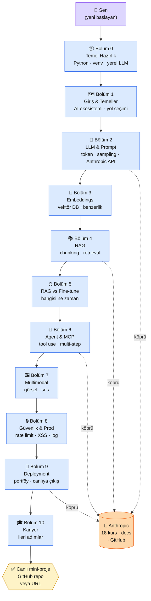

---
hide:
  - navigation
  - toc
---

# 🛠️ MühendisAl

👤 <strong>Kim için:</strong> Türkçe bilen, Python'a aşina veya almaya hevesli yetişkin. AI'yı merak ediyor ama "nereden başlarım, ne üretirim" sorusunda takılı.

⏱️ <strong>Süre:</strong> 3-4 ay (akşam ~30 dk/gün) veya yoğun tempoda 6-8 hafta.

📋 <strong>Önkoşul:</strong> Bilgisayar + internet + Türkçe okuma. Bölüm 0 Python kurulumunu sıfırdan anlatır.

🎯 <strong>Çıktı:</strong> Canlı, dağıtımı yapılmış bir Claude destekli mini-proje + LinkedIn paylaşımına hazır portföy. Bölüm 10 ayrıca kariyer ipuçları (mülakat, LinkedIn, maaş bantları) içerir.

## Neden bu platform?

AI üzerine Türkçe kaynak az değil ama çoğu iki uçta: ya "AI şudur" soyut anlatımı, ya "30 dakikada yapay zeka uzmanı ol" pazarlama vaadi. Arada boşluk var: **oturup bir şey üreten biri olmak**. MühendisAl bu boşluğu doldurmak için yazıldı.

Platform bir **ders kitabı değil, proje eşlikçisi.** 75+ sayfada AI Engineer'ın günlük işini öğretir; tek bir amaç var: platformu bitirdiğinde elinde çalışan, canlıda duran, başkalarının kullanabileceği bir Claude destekli mini-proje olsun. GitHub linki ya da URL paylaştığında arkadaşın tıklayıp deneyebilsin.

Üçüncü neden: Anthropic'in 18 resmi ücretsiz kursu, docs'u ve GitHub not defterleri İngilizce. Her sayfada o kaynaklardan birine **Türkçe köprü** kuruyoruz — o kaynağa gitmeden önce konuyu burada anlıyor, sonra ister oraya atlıyorsun ister devam ediyorsun. Yabancılık yok.

## Dürüst kapsam

**Bu platform seni 3-4 ay (akşam 30 dk) veya yoğun 6-8 hafta sonunda şu üçünden birini üretip dağıtmayı yapan biri yapar:**

- 🤖 **Chatbot:** Belirli bir konuda sohbet eden, Claude API'ye bağlı, basit kurallı
- 🔄 **İş otomasyonu:** PDF özetleme, e-posta yanıt taslağı, rapor çıkarma gibi tek-amaç tool
- ✍️ **Metin asistanı:** Blog/özet/çeviri/reklam yazısı üreten, prompt şablonlu bir araç

**Ne yapmaz:**

- Seni 4 haftada "Senior AI Engineer" pozisyonuna hazırlamaz — o ayrı, çok yıllık bir yol. Bu platform **junior/lateral mover** seviyesi başlangıcı verir.
- Transformer'ı sıfırdan yazdırmaz. Bölüm 5 ince ayara giriş seviyesinde QLoRA pratiği içerir; üretim seviyesi için Anthropic Academy'ye yönlendirir.
- Matematik bölümü yok — ileri kaynaklar bir kutuda başvuru olarak verilir, platformun akışı matematikten bağımsız ilerler.
- PhD seviyesi ML kuramı yok — bu platform "yapanlar için", araştıranlar için değil.

**Başarı ölçütün tek şeydir:** 3-4 ay sonunda GitHub'ında bir repo VEYA tarayıcıda açılan bir URL. O yoksa platform senin için başarısız sayılır — bunu başta yazıyoruz ki beklenti net olsun.

## Hangi yoldan başlıyorsun? — Persona seçimi

Üç farklı başlangıç noktası var. İçerik hepsi için aynı, ama her sayfada **sana uygun örnek** öne çıkıyor. Birini seç:

-   :material-leaf:{ .lg .middle } 🟢 **Başlangıç**

    ---

    **"Python'u biraz biliyorum ama AI'ya hiç değmedim."**

    Hedefin: İlk Claude çağrını atmak, prompt mühendisliğini anlamak, küçük bir sohbet botu yapmak.

    [:octicons-arrow-right-24: Bölüm 0'dan başla](bolum-0/index.md)

-   :material-briefcase:{ .lg .middle } 🔵 **İş**

    ---

    **"İşte tekrarlayan bir iş var, AI'yla otomasyon yapmak istiyorum."**

    Hedefin: PDF özetleme, rapor çıkarma, form doldurma gibi tek-amaç bir iş aracı kurmak.

    [:octicons-arrow-right-24: Bölüm 1'den başla](bolum-1/index.md)

-   :material-palette:{ .lg .middle } 🟣 **Kişisel**

    ---

    **"Kendim için bir araç istiyorum — yazma, öğrenme, not alma."**

    Hedefin: Blog yazım asistanı, ders notu özetleyici, dil pratik partneri gibi kişisel bir araç.

    [:octicons-arrow-right-24: Bölüm 1'den başla](bolum-1/index.md)

**Kararsızsan 🟢 Başlangıç'ı seç.** Kurulum tarafı en çok orada; sonrası hepsinde ortak.

## Platformun yol haritası

11 bölüm, sıralı akış. Her bölüm bir öncekinin üstüne kurar. Atlama yapabilirsin ama bir sonrakini çalıştırmak için gerekeni biliyor olman lazım.

### Aktör tablosu

| Düğüm | Nerede | Ne iş yapıyor |
|---|---|---|
| 👤 **Sen** | Bu platformu okuyor, pratikleri yapıyor | Her bölüm sonunda "Çıktı Kanıtı"nı üretiyorsun: repo/URL/screenshot |
| 📦 **Bölüm 0** | `/bolum-0/` | Python + venv + yerel Ollama + FastAPI. Anthropic'e geçmeden önce "zemin" |
| 🗺 **Bölüm 1** | `/bolum-1/` | AI Engineer vs ML Engineer, ekosistem haritası, yol seçimi |
| 💬 **Bölüm 2** | `/bolum-2/` | LLM nasıl çalışır + ilk Claude API çağrın. **İlk somut proje girdisi** |
| 🧮 **Bölüm 3** | `/bolum-3/` | Embedding nedir, vektör DB (Qdrant) nasıl kurulur |
| 📚 **Bölüm 4** | `/bolum-4/` | RAG — PDF'ten sorduğun soruya cevap alan sistem |
| ⚖️ **Bölüm 5** | `/bolum-5/` | Fine-tune ne zaman gerekli, ne zaman RAG yeter |
| 🤖 **Bölüm 6** | `/bolum-6/` | Claude'u araçlarla konuşturmak (tool use, MCP) |
| 🖼 **Bölüm 7** | `/bolum-7/` | Claude'un vision ve ses kabiliyeti |
| 🔒 **Bölüm 8** | `/bolum-8/` | Canlıya almadan önce güvenlik: rate limit, XSS, log |
| 🚀 **Bölüm 9** | `/bolum-9/` | Deploy + GitHub + portföy. **Projen canlıya çıkıyor** |
| 🎓 **Bölüm 10** | `/bolum-10/` | Sertifikalar, topluluklar, "sonraki 6 ay" yol haritası |
| 📖 **Anthropic** | `docs.claude.com`, `skilljar.com`, `github.com/anthropics` | Her kritik bölümde "Anthropic öz" bloğuyla köprü kurulur |
| ✅ **Çıktı** | Kendi GitHub'ın / Vercel / Netlify / CF Pages | Bitirince elinde duran canlı proje |

## Platformu bitirdiğinde elinde ne olacak

- **Canlı bir mini-proje:** GitHub repo + çalışan URL. Arkadaşına "şunu ben yaptım" diye link atabileceğin şey
- **Claude API refleksi:** Prompt yazarken ne token harcadığını, ne zaman sistem prompt kullanacağını, temperature'ın ne işe yaradığını biliyorsun
- **RAG iskeleti:** PDF/dokümandan soru cevaplayan bir yapı kurup anlamışsın (en popüler AI projesi bu)
- **Tool use bilinci:** Claude'u "sadece konuşan" değil "iş yapan" biri olarak kullanmanın kapısı açık
- **Deploy disiplini:** GitHub → Vercel/CF Pages zinciri, `.env` secret yönetimi, temel güvenlik kontrolleri
- **Anthropic ekosisteminde yön:** 18 kursun hangisinin ne işe yaradığını, hangi docs sayfasının ne için açılacağını biliyorsun
- **Türkçe teknik kelime dağarcığı:** "embedding", "chunking", "sampling", "tool use" — ama Türkçe karşılıklarıyla. Yabancı kaynaklara hızlı geçebiliyorsun

Bu liste **özetidir**, "uzman olacaksın" vaadi değil. 6 hafta sonunda "proje bitirdim + temel refleks kazandım" seviyesi — gerisi kendi yolunla devam edeceğin taban.

📖 Anthropic bu yolculukta seninle nasıl köprülenir — öz

MühendisAl, Anthropic'in kendi ekosistemiyle **paralel akar**. Anthropic her konu için ücretsiz kaynak sunmuş; biz o kaynağa Türkçe hazırlığı verip köprü kuruyoruz. Üç tür kaynak var:

**1. Anthropic Academy (skilljar.com) — 18 ücretsiz sertifikalı kurs.** Başlangıç için "Claude 101" + "AI Fluency: Framework & Foundations", developer için "Claude Code 101" + "Building with the Claude API", ileri için "Introduction to MCP" + "Introduction to Agent Skills". Platformdaki her temel bölüm, ilgili kurs linkiyle kapanır — önce burada hazırlanıp sonra kursa gitmen için.

**2. Dokümantasyon (docs.claude.com, platform.claude.com).** Prompt engineering overview, best practices, XML tags, tool use, sampling parametreleri. Anthropic'in "canonical" açıklamaları. Bölüm 2 ve 6'da yoğun köprü kurulur — biz konuyu senaryoyla öğretiyor, docs'a kanonik referans olarak işaret ediyoruz.

**3. GitHub (anthropics/courses) — 5 notebook.** Anthropic API fundamentals, prompt engineering tutorial, real world prompting, prompt evaluations, tool use. Colab'de açılır, elle çalıştırırsın. Platformun Bölüm 2 ve Bölüm 6 pratikleri buradan esinlenir — oradaki sterilizasyon seviyesinde değil, senin somut mini-projene yönlendirilmiş biçimde.

**Başlangıç noktası (platforma girmeden önce okumak istersen):** [Anthropic Academy — Claude 101](https://anthropic.skilljar.com/) (İngilizce, ~30 dk, sertifikalı). Bölüm 1 bitiminde zaten bu kursa yönlendireceğiz; şimdiden göz atmak istersen platformdan bağımsız açabilirsin.

## Kural dışı notlar (Tip B platform girişi)

Bu sayfa "Uygulama" bölümü içermiyor — uygulama 11 bölüm boyunca dağıtılmış. "Çıktı Kanıtı" tekil blok olarak da yok; her bölüm kendi kanıtını istiyor, platformun nihai kanıtı da yukarıdaki **bölüm sonu çıktısı** listesi. Bu sayfanın işi "kapı" olmak: persona seçtir, yol haritasını göstersin, dürüst scope çizsin.

---

**İlk adımın →** [Bölüm 0 — Temel Hazırlık](bolum-0/index.md) (Python + yerel LLM kurulumu, ~2 saat)

Kurulumun tamamsa: [Bölüm 1 — Giriş ve Temeller](bolum-1/index.md)

